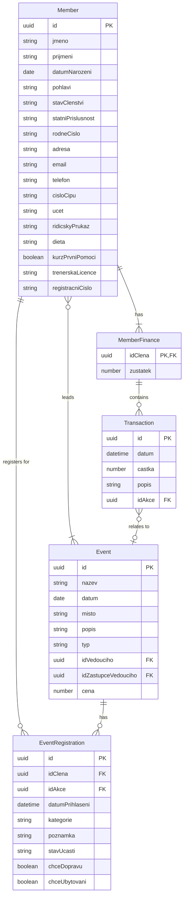
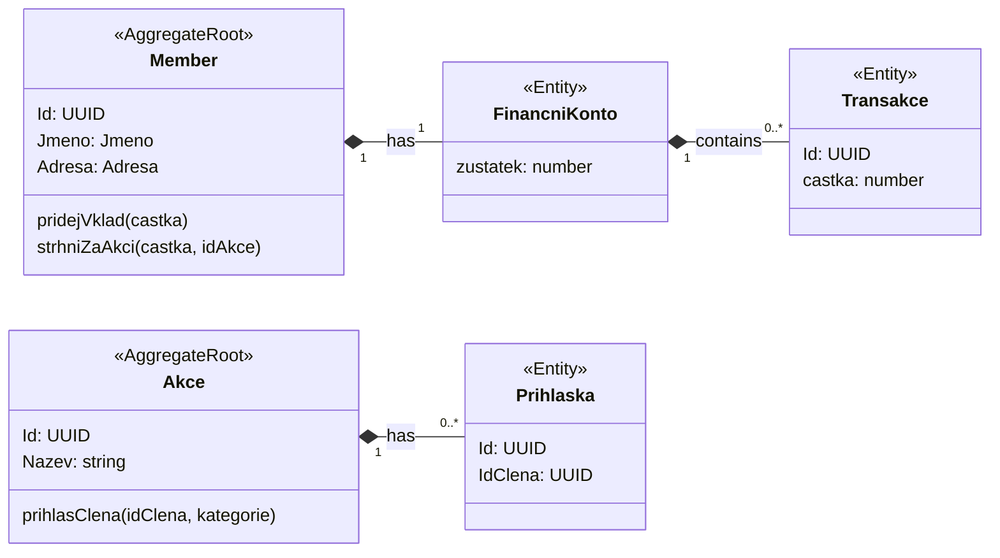
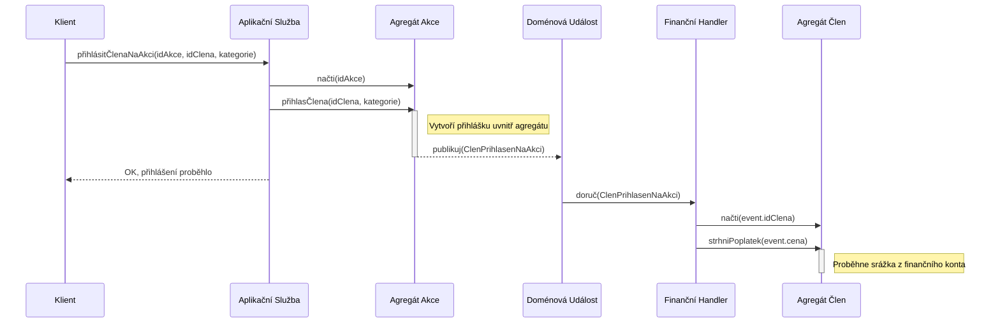

# Produktové požadavky (PRD): Členská sekce pro orientační klub

> Tento dokument definuje požadavky na novou aplikaci členské sekce pro orientační klub.

## 1. Úvod a cíl

* **Jaký je hlavní cíl nové členské sekce?**
  Hlavním cílem je nahradit stávající zastaralý systém. Nová aplikace poskytne centralizovanou a automatizovanou
  platformu pro správu členských dat, přihlášek na akce, koordinaci logistiky (doprava, ubytování) a správu financí
  členů.

* **Jaké problémy řešíme pro členy klubu a administrátory?**
  Současný systém je nepřehledný, vyžaduje manuální distribuci dat a je náchylný k chybám. Starý systém se navíc špatně
  používá na mobilních zařízeních. Cílem projektu je zjednodušit tyto procesy, snížit administrativní zátěž a poskytnout
  členům přehledné a snadno použitelné rozhraní pro přístup k informacím a přihlašování na akce, které bude snadno
  použitelné na počítači i na mobilu.

## 2. Cílová skupina

* **Kdo jsou hlavní uživatelé aplikace?**
    * **Členové klubu:** Přibližně 200 jednotlivců ve věku 10-70 let s různou úrovní technických dovedností.
    * **Administrátoři:** Tým 3-5 lidí zodpovědných za správu různých částí klubových dat (např. informace o členech,
      správa akcí, evidence plateb). Každý administrátor může mít specifickou roli a oprávnění pro data, která spravuje.

* **Jaké jsou jejich klíčové vlastnosti a potřeby?**
    * **Členové:** Potřebují jednoduchý způsob, jak si zobrazit své údaje, zkontrolovat stav plateb a přihlásit se na
      akce. Rozhraní musí být intuitivní i pro technicky méně zdatné uživatele. Aplikace se musi dobre pouzivat na
      mobilu i na pocitaci.
    * **Administrátoři:** Potřebují efektivní nástroje pro správu členů, evidenci plateb a dohled nad přihláškami na
      akce.

## 3. Klíčové funkce

*Tato sekce popisuje základní funkce pro první verzi.*

* **Správa členů a profilů:**
    * Vytváření, editace a pozastavení členství administrátorem.
    * Člen si může sám upravovat širokou škálu svých údajů.
    * Adresář členů s možností nastavení soukromí pro sdílení kontaktů.

* **Správa akcí a přihlášek:**
    * Vytváření a správa akcí (včetně ceny a vedoucích).
    * Komplexní přihlašování na akce členem (výběr kategorie, dopravy, ubytování).
    * Možnost přihlášení i "mimo soutěž".
    * Evidence a správa přihlášených administrátorem/vedoucím akce (i po termínu).
    * Evidence účasti na akcích.
    * Přehledné seznamy přihlášených na akci, dopravu a ubytování.

* **Správa financí:**
    * Každý člen má své virtuální finanční konto.
    * Administrátor (finančník) může spravovat konta (vklady/výběry).
    * Automatické strhávání plateb za akce.
    * Přehled o zaplacených členských příspěvcích.

* **Notifikace:**
    * Uživatel si může nastavit, které notifikace chce dostávat (např. emailem).
    * Automatická notifikace při záporném zůstatku na účtu.

* **Autentizace a autorizace:**
    * Bezpečné přihlášení a správa hesel.
    * Systém oprávnění (člen, administrátor, vedoucí akce, finančník). Přístup k jednotlivým aktivním operacím je řízen
      pomocí granulárních oprávnění (permissions), nikoliv pevných rolí. Každá aktivní operace bude mít vlastní
      oprávnění (např. MEMBERS:REGISTER). Role jako "Finančník" nebo "Vedoucí akce" jsou definovány jako sada
      specifických oprávnění.

## 4. Uživatelské příběhy (User Stories)

*Tato sekce popisuje, jak budou různí uživatelé interagovat se systémem a pomáhá tak ujasnit jednotlivé funkce.*

* **Jako člen klubu chci:**
    * se přihlásit do systému, abych viděl své údaje a stav financí.
    * upravit své kontaktní a další údaje (řidičák, dieta, ...), aby měl klub aktuální informace.
    * nastavit, které mé údaje (adresa, kontakt) mohou vidět ostatní členové.
    * vidět kontaktní údaje ostatních členů, kteří se sdílením souhlasili.
    * vidět přehled nadcházejících akcí.
    * filtrovat a vidět pouze akce, na které jsem přihlášen.
    * se při přihlášení na akci zapsat i na dopravu a ubytování.
    * se přihlásit i do kategorie 'mimo soutěž'.
    * se jedním klikem odhlásit z akce (před termínem).
    * si nastavit, jaké notifikace mi mají chodit.
    * dostat notifikaci, pokud mám záporný zůstatek na účtu.


* **Jako administrátor chci:**
    * spravovat členskou základnu: vytvářet nové členy, upravovat jejich údaje a pozastavovat členství.
        * Při vytváření nového člena vyplnit formulář, který po uložení zvaliduje data, vytvoří člena v databázi, odešle
          mu e-mail pro nastavení hesla a automaticky ho zařadí do tréninkové skupiny.
    * vytvářet a spravovat akce (určit vedoucího, nastavit cenu atd.).
    * mít přehled o všech akcích a vidět detailní seznamy přihlášených (včetně dopravy a ubytování).
    * jako "superuživatel" mít možnost přihlásit/odhlásit kteréhokoliv člena na jakoukoliv akci, a to i po termínu.

* **Jako vedoucí akce chci:**
    * pro akce, které vedu, vidět přehledný seznam přihlášených účastníků, včetně jejich požadavků na dopravu a
      ubytování.
    * pro své akce mít možnost přihlašovat či odhlašovat členy i po uplynutí termínu přihlášek (s poznámkou).
    * během nebo po akci evidovat skutečnou účast (přítomen, nepřítomen, omluven).

* **Jako finančník chci:**
    * spravovat finanční konta všech členů, tj. připisovat vklady a provádět srážky (např. za startovné na akcích).
    * jednou ročně hromadně strhnout z kont členů poplatek za členské příspěvky.
    * mít přístup k detailní historii transakcí a aktuálním zůstatkům všech členů.

## 5. Principy designu a UX

* **Jaký je požadovaný vzhled a dojem z aplikace?** moderni, cisty a pratelsky
* **Existují nějaké pokyny pro branding klubu (barvy, loga), které je třeba dodržet?** klubove barvy jsou cerna, cervena
  a bila
* **Klíčové principy:** Aplikace musí být navržena s přístupem **"mobile-first"**, což zajistí bezproblémové a
  intuitivní ovládání na počítači i na mobilních zařízeních. Zároveň musí být snadno navigovatelná a přístupná pro
  všechny uživatele.

## 6. Technické požadavky

* **Jaký je preferovaný technologický stack?** Projekt již využívá Javu/Spring Boot pro backend a React/TypeScript pro
  frontend. Tuto kombinaci zachováme.
* **Bude se jednat o webovou aplikaci, mobilní aplikaci, nebo obojí?** Půjde o webovou aplikaci navrženou tak, aby byla
  plně responzivní a optimalizovaná pro počítače i mobilní zařízení.
* **Existují nějaké preference pro hosting nebo nasazení?** Aplikace bude nasazena na docker (docker compose)

## 7. Nefunkční požadavky

* **Bezpečnost:** Jak budou chráněna data uživatelů? (např. soulad s GDPR)
* **Výkon:** Jak rychlá by měla být aplikace? (např. časy načítání stránek)
* **Přístupnost:** Aplikace by měla být použitelná i pro osoby se zdravotním postižením (standardy WCAG).

## 8. Metriky úspěšnosti

* **Jak poznáme, že je projekt úspěšný?**
  Vyrazna uspora casu administratoru pri sprave prihlasek a financi
  Clenove si sve zalezitosti resi sami v clenske sekci (eliminace zadosti o dohlaseni na zavod, upravu prihlasky, apod).

## 9. Budoucí rozšíření

* **Jaké funkce by mohly být přidány v budoucnu?**
    - Pokročilá organizace dopravy na akce (nabízení volných míst v autě, správa kapacit, rozdělení účastníků do aut).
    - Pokročilá správa ubytování (správa kapacit, rozdělení do pokojů).
    - Synchronizace událostí a přihlášek se systémem ORIS.
    - Synchronizace členské základny se systémem ČUS.
    - Definice uživatelských skupin členů (tréninkové skupiny, volné skupiny, apod).

---

## 10. Datové modely

*Tato sekce definuje klíčové datové entity pro backend.*



### Člen (Member)

```json
{
  "id": "uuid",
  "jmeno": "string",
  // Povinné
  "prijmeni": "string",
  // Povinné
  "datumNarozeni": "date",
  // Povinné
  "pohlavi": "MUZ"
  |
  "ZENA",
  // Povinné
  "stavClenstvi": "AKTIVNI"
  |
  "POZASTAVENO",
  // Enum, default 'AKTIVNI'
  "statniPrislusnost": "string",
  // Povinné, default 'CZE'
  "rodneCislo": "string",
  // Povinné, pokud je statniPrislusnost 'CZE'. Potřebné pro budoucí exporty (např. seznamy na ubytování).
  "adresa": "string",
  // Povinné
  "email": "string",
  // Povinné, unikátní
  "telefon": "string",
  // Povinné
  "kontaktNaZastupce": {
    // Povinné pro členy < 18 let
    "jmeno": "string",
    "prijmeni": "string",
    "email": "string",
    "telefon": "string"
  },
  "cisloCipu": "string",
  "ucet": "string",
  "ridicskyPrukaz": "string",
  "dieta": "string",
  "kurzPrvniPomoci": "boolean",
  "trenerskaLicence": "string",
  "opravneni": [
    "MEMBERS:CREATE",
    "MEMBERS:SUSPEND"
  ],
  // Detailní oprávnění
  "registracniCislo": "string",
  // Povinné, formát XXXYYDD
  "nastaveniSdíleni": {
    "sdiletAdresu": "boolean",
    // default false
    "sdiletKontakt": "boolean"
    // default false
  }
}
```

### Akce (Event)

```json
{
  "id": "uuid",
  "nazev": "string",
  "datum": "date",
  "misto": "string",
  "popis": "string",
  "typ": "ZAVOD"
  |
  "TRENINK"
  |
  "OSTATNI",
  // Enum
  "idVedouciho": "uuid",
  // Foreign key to Member
  "idZastupceVedouciho": "uuid",
  // Foreign key to Member
  "cena": "number"
  // Cena akce
}
```

### Přihláška na akci (EventRegistration)

```json
{
  "id": "uuid",
  "idClena": "uuid",
  // Foreign key to Member
  "idAkce": "uuid",
  // Foreign key to Event
  "datumPrihlaseni": "datetime",
  "kategorie": "string",
  // např. 'D18' nebo 'MIMO SOUTĚŽ'
  "poznamka": "string",
  "stavUcasti": "UCASTNIK"
  |
  "NEUCASTNIK"
  |
  "OMLUVEN",
  // Enum, default 'UCASTNIK'
  "chceDopravu": "boolean",
  "chceUbytovani": "boolean"
}
```

### Finance člena (MemberFinance)

```json
{
  "idClena": "uuid",
  // Foreign key to Member
  "zustatek": "number",
  "transakce": [
    {
      "id": "uuid",
      "datum": "datetime",
      "castka": "number",
      // Kladná pro vklad, záporná pro stržení
      "popis": "string",
      // např. 'Vklad na účet', 'Startovné na Přebor Prahy'
      "idAkce": "uuid"
      // Volitelné, pokud se transakce váže k akci
    }
  ]
}
```

---

## 11. Doménový model (DDD)

*Tato sekce popisuje klíčové koncepty domény v souladu s principy Domain-Driven Design.*



### Agregáty (Aggregates)

Identifikovali jsme dva hlavní agregáty, které tvoří hranice konzistence pro transakce.

#### Agregát `Člen` (Member Aggregate)

- **Popis:** Reprezentuje člena klubu a všechny informace, které jsou s ním neodděitelně spjaty. Zahrnuje osobní údaje,
  stav členství a finanční konto.
- **Kořen agregátu (Aggregate Root):** `Člen` (Entity) - Hlavní entita, přes kterou se přistupuje ke všem ostatním
  částem agregátu.
- **Entity uvnitř agregátu:**
    - `FinančníKonto`: Reprezentuje finanční účet člena. Obsahuje seznam transakcí a zodpovídá za výpočet aktuálního
      zůstatku.
    - `Transakce`: Představuje jednotlivý finanční pohyb na účtu.
- **Hodnotové objekty (Value Objects):** `Jméno`, `Adresa`, `KontaktNaZastupce`, `RegistracniCislo`, `Oprávnění`. Tyto
  objekty nemají vlastní identitu a popisují vlastnosti entit.
- **Hlavní zodpovědnosti:**
    - Udržuje konzistenci osobních údajů člena.
    - Zajišťuje, že finanční operace (vklad, stržení) jsou validní a správně se promítají do zůstatku.
    - Spravuje stav svého členství (Aktivní/Pozastaveno).

#### Agregát `Akce` (Event Aggregate)

- **Popis:** Reprezentuje klubovou akci a spravuje všechny přihlášky, které jsou na ni navázány.
- **Kořen agregátu (Aggregate Root):** `Akce` (Entity) - Hlavní entita, která kontroluje životní cyklus akce a pravidla
  pro přihlašování.
- **Entity uvnitř agregátu:**
    - `Přihláška`: Reprezentuje registraci konkrétního člena na danou akci. Každá přihláška má svůj vlastní stav (např.
      stav účasti).
- **Hodnotové objekty (Value Objects):** `Kategorie`, `StavUcasti`, `Cena`.
- **Hlavní zodpovědnosti:**
    - Spravuje životní cyklus akce (např. otevření pro přihlášky, uzávěrka, ukončení).
    - Vynucuje pravidla pro přihlašování a odhlašování (např. kontrola termínu).
    - Poskytuje konzistentní seznam přihlášených účastníků.

### Doménové služby (Domain Services)

Některé operace, zejména ty, které se týkají více agregátů a nemají jasného vlastníka, jsou zapouzdřeny v doménových
službách.

- **`FinančníSlužba` (FinanceService):** Zodpovídá za operace, které se týkají financí napříč více členy.
    - Například hromadné strhávání členských příspěvků na konci roku.

### Doménové události (Domain Events)

Pro oddělení (decoupling) jednotlivých doménových kontextů (např. registrace a finance) budeme využívat doménové
události. Místo přímého volání mezi agregáty bude jeden agregát publikovat událost a jiná část systému na ni bude
reagovat.

- **`ClenPrihlasenNaAkci` (MemberRegisteredForEvent):**
    - **Popis:** Tato událost je publikována agregátem `Akce` poté, co je člen úspěšně přihlášen.
    - **Data:** Obsahuje `idAkce`, `idClena`, `cena`.
    - **Chování:** Na tuto událost naslouchá například finanční modul. Po jejím přijetí spustí handler, který se postará
      o stržení poplatku z finančního konta příslušného člena. Tím je zajištěno, že modul pro správu akcí nemusí nic
      vědět o finančním modulu.

#### Příklad toku s doménovou událostí



---

## 12. API koncové body

*Základní přehled RESTful API pro komunikaci mezi frontendem a backendem.*

### Autentizace

- `POST /api/auth/login` - Přihlášení, vrací JWT token.
- `POST /api/auth/logout` - Odhlášení.

### Členové (Members) - *vyžaduje autorizaci*

- `GET /api/members` - (Admin) Získá seznam všech členů pro správu.
- `GET /api/directory` - (Člen) Získá seznam členů pro adresář (respektuje nastavení sdílení).
- `GET /api/members/me` - (Člen) Získá údaje přihlášeného uživatele.
- `GET /api/members/{id}` - (Admin) Získá detail jednoho člena.
- `POST /api/members` - (vyžaduje oprávnění `MEMBERS:CREATE`) Vytvoří nového člena. Tělo požadavku odpovídá datovému
  modelu `Člen`. Po úspěšném vytvoření spustí následující akce na pozadí: odeslání e-mailu pro nastavení hesla,
  přiřazení do tréninkové skupiny, notifikace trenéra.
- `PUT /api/members/{id}` - (vyžaduje oprávnění `MEMBERS:UPDATE`) Upraví údaje člena.
- `PUT /api/members/me` - (Člen - vlastník profilu) Upraví své vlastní údaje.
- `POST /api/members/{id}/suspend` - (vyžaduje oprávnění `MEMBERS:SUSPEND`) Pozastaví členství členovi.

### Akce (Events) - *vyžaduje autorizaci*

- `GET /api/events` - Získá seznam všech akcí (s možností filtrování např. `?registered=me` nebo podle časového období
  `?from=YYYY-MM-DD&to=YYYY-MM-DD`).
- `GET /api/events/{id}` - Získá detail jedné akce (včetně seznamu přihlášených).
- `POST /api/events` - (vyžaduje oprávnění `EVENTS:CREATE`) Vytvoří novou akci.
- `PUT /api/events/{id}` - (vyžaduje oprávnění `EVENTS:UPDATE`) Upraví akci.
- `DELETE /api/events/{id}` - (vyžaduje oprávnění `EVENTS:DELETE`) Smaže akci.

### Přihlášky (Registrations) - *vyžaduje autorizaci*

- `POST /api/events/{id}/register` - (vyžaduje oprávnění `EVENTS:REGISTER_SELF`) Přihlásí aktuálního člena na akci. V
  těle požadavku specifikuje kategorii, dopravu, ubytování.
- `DELETE /api/events/{id}/unregister` - (vyžaduje oprávnění `EVENTS:UNREGISTER_SELF`) Odhlásí aktuálního člena z akce.
- `POST /api/events/{eventId}/registrations/{registrationId}/set-attendance` - (vyžaduje oprávnění
  `EVENTS:MANAGE_ATTENDANCE`) Nastaví stav účasti pro přihlášku.
- `DELETE /api/events/{eventId}/registrations/{registrationId}` - (vyžaduje oprávnění `EVENTS:MANAGE_REGISTRATIONS`)
  Odhlásí člena z akce.

### Finance - *vyžaduje autorizaci*

- `GET /api/finances/me` - (Člen) Získá stav svého finančního konta a historii transakcí.
- `GET /api/finances/{memberId}` - (Finančník) Získá stav konta a historii transakcí pro daného člena.
- `POST /api/finances/{memberId}/transactions` - (vyžaduje oprávnění `FINANCES:MANAGE_TRANSACTIONS`) Přidá novou
  transakci (vklad/stržení) na účet člena.

### Notifikace - *vyžaduje autorizaci*

- `GET /api/notifications/settings` - Získá aktuální nastavení notifikací pro přihlášeného uživatele.
- `PUT /api/notifications/settings` - (Člen - vlastník nastavení) Upraví nastavení notifikací.

---

## 13. Rozdělení na frontendové komponenty

*Seznam základních React komponent pro vytvoření uživatelského rozhraní.*

- **Layout a stránky:**
    - `App.tsx`: Hlavní kontejner s routerem.
    - `RootLayout.tsx`: Základní layout (Header, postranní menu, patička).
    - `LoginPage.tsx`: Stránka pro přihlášení.
    - `DashboardPage.tsx`: Přehledová stránka po přihlášení (např. nadcházející akce, stav konta).
    - `EventsPage.tsx`: Stránka se seznamem všech akcí.
    - `EventDetailPage.tsx`: Stránka s detailem akce (bude obsahovat taby pro přihlášené, dopravu, ubytování).
    - `MembersPage.tsx`: (Admin) Stránka se seznamem členů pro administraci.
    - `DirectoryPage.tsx`: Stránka s veřejným adresářem členů.
    - `MemberEditPage.tsx`: (Admin) Stránka pro úpravu/vytvoření člena.
    - `ProfilePage.tsx`: Stránka pro zobrazení a úpravu vlastního profilu (rozdělená do sekcí: osobní, kontaktní,
      nastavení).
    - `FinancePage.tsx`: Stránka pro zobrazení stavu financí a historie transakcí.
    - `NotificationSettingsPage.tsx`: Stránka pro nastavení notifikací.

- **UI Komponenty:**
    - `Header.tsx`: Horní lišta s navigací a profilem uživatele.
    - `EventList.tsx` / `EventListItem.tsx`: Komponenty pro zobrazení seznamu akcí.
    - `EventRegistrationModal.tsx`: Modální okno/formulář pro přihlášení na akci (výběr kategorie, dopravy, ubytování).
    - `MemberList.tsx`: (Admin) Tabulka pro zobrazení seznamu členů s filtry a akcemi (edit, suspend).
    - `MemberCard.tsx`: Kartička člena pro zobrazení v adresáři.
    - `FinanceDashboard.tsx`: Komponenta pro zobrazení aktuálního zůstatku.
    - `TransactionList.tsx`: Komponenta pro zobrazení historie finančních transakcí.
    - `NotificationSettingsForm.tsx`: Formulář pro nastavení notifikací.
    - `DataTable.tsx`: Obecná znovupoužitelná komponenta pro tabulky.
    - `LoadingSpinner.tsx`, `ErrorDisplay.tsx`: Pomocné komponenty pro zobrazení stavů.

---

## 14. Hrubý plán implementace pro agenta

*Kroky pro automatizovanou implementaci aplikace.*

1. **Backend (Java/Spring Boot):**
    1. Inicializovat Spring Boot projekt s potřebnými závislostmi.
    2. Definovat JPA entity (`Member`, `Event`, `EventRegistration`, `FinancialTransaction`) podle datových modelů (
       sekce 10).
    3. Implementovat repozitáře (Spring Data JPA) pro všechny entity.
    4. Navrhnout a implementovat doménové objekty (agregáty, entity, VO) podle sekce 11.
    5. Nastavit Spring Security s JWT a detailními oprávněními (`Permission`).
    6. Implementovat REST Controllery (`AuthController`, `MemberController`, `EventController`, `FinanceController`,
       `NotificationController`) pro všechny API koncové body (sekce 12).
    7. Vytvořit aplikační a doménové služby (`RegistrationService`, `FinanceService`, ...) pro zapouzdření business
       logiky.
    8. Přidat unit a integrační testy pro klíčové funkce.

2. **Frontend (React/TypeScript):**
    1. Inicializovat React projekt (Vite + TS).
    2. Nainstalovat potřebné knihovny (`react-router-dom`, `axios`, `zod`, UI knihovna např. `shadcn/ui`).
    3. Nastavit strukturu složek (`components`, `pages`, `services`, `hooks`, `lib`, `contexts`).
    4. Implementovat routování aplikace podle stránek v sekci 13.
    5. Vytvořit `AuthContext` a servisní vrstvu (`AuthService`, `ApiClient`) pro autentizaci a komunikaci s API.
    6. Vytvořit jednotlivé stránky a znovupoužitelné UI komponenty (sekce 13).
    7. Pro každou hlavní funkci (finance, notifikace, členové, akce) vytvořit specifické custom hooks (např.
       `useMemberFinances`, `useEventList`) pro načítání a správu dat.
    8. Propojit komponenty s daty pomocí vytvořených hooks.
    9. Implementovat formuláře s validací (`zod`) pro editaci profilu, nastavení notifikací a přihlašování na akce.
    10. Aplikovat styling podle zvolené UI knihovny a principů z sekce 5.

3. **Propojení a nasazení:**
    1. Konfigurovat CORS na backendu.
    2. Vytvořit `Dockerfile` pro backend a `Dockerfile` pro frontend (např. s Nginx).
    3. Vytvořit `docker-compose.yml` pro spuštění celé aplikace (backend, frontend, databáze např. PostgreSQL).
