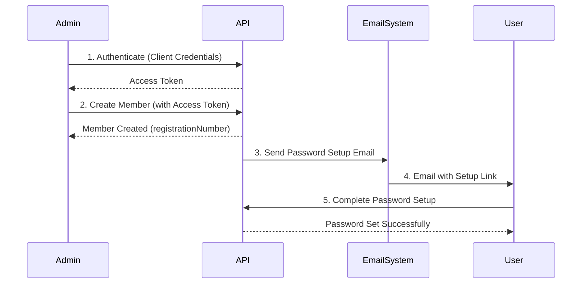

# Klabis Backend API Documentation

## Quick Start

**Need to test the API immediately?** Run this one-liner:

```bash
curl -k -X POST https://localhost:8443/oauth2/token \
  -H "Content-Type: application/x-www-form-urlencoded" \
  -u "klabis-web:test-secret-123" \
  -d "grant_type=client_credentials&scope=MEMBERS:CREATE" \
  | grep -o '"access_token":"[^"]*' | cut -d'"' -f4 \
  | { read TOKEN; curl -k -X POST https://localhost:8443/api/members \
    -H "Authorization: Bearer $TOKEN" \
    -H "Content-Type: application/json" \
    -d '{"firstName":"Jan","lastName":"Novak","gender":"MALE","nationality":"CZ","dateOfBirth":"1990-01-15","address":{"street":"Test 123","city":"Praha","zipCode":"11000","country":"CZ"},"contact":{"email":"jan@test.cz","phone":"+420123456789"}}'; }
```

**For complete authentication details**, see [Authentication](#authentication) below.

## Table of Contents

1. [Overview](#overview)
2. [Authentication](#authentication)
3. [API Endpoints](#api-endpoints)
4. [Rate Limiting](#rate-limiting)
5. [Error Handling](#error-handling)
6. [Webhooks](#webhooks)
7. [Complete Workflows](#complete-workflows)
8. [Code Examples](#code-examples)
9. [Best Practices](#best-practices)
10. [Changelog](#changelog)

### API Endpoints Sections

- [Member Management](#member-management) - CRUD operations for members
- [Password Setup Endpoints](#password-setup-endpoints) - User password setup flow
- [User Permission Management](#user-permission-management) - Manage user authorities
- [Calendar Management](#calendar-management) - Calendar items and event synchronization

## Overview

The Klabis Backend provides REST APIs for managing orienteering club members. The API follows REST principles with
HATEOAS (Hypermedia as the Engine of Application State) using HAL+JSON format.

### Base URL

```bash
https://localhost:8443/api
```

### API Version

Current version: v1 (no versioning in URL paths)

### Content Types

- Request: `application/json`
- Response: `application/json`, `application/hal+json`, `application/problem+json`

### Response Format

All successful responses follow HAL+JSON format with hypermedia links:

```json
{
  "_links": {
    "self": { "href": "/api/members/1" },
    "collection": { "href": "/api/members" }
  },
  "firstName": "Jan",
  "lastName": "Novák"
}
```

## Authentication

The API uses **OAuth2** with **JWT tokens** for authentication.

### Quick Start (One-Liner)

```bash
TOKEN=$(curl -s -k -X POST https://localhost:8443/oauth2/token \
  -H "Content-Type: application/x-www-form-urlencoded" \
  -u "klabis-web:test-secret-123" \
  -d "grant_type=client_credentials&scope=MEMBERS:CREATE" \
  | grep -o '"access_token":"[^"]*' | cut -d'"' -f4)
```

### Development Environment Setup

The backend automatically creates OAuth2 clients and bootstrap admin user on startup:

**Default OAuth2 Clients:**

- Client ID: `klabis-web` (for UI mockup testing)
    - Client Secret: `test-secret-123` (set via `OAUTH2_CLIENT_SECRET` env var)
- Client ID: `klabis-web` (for production use)
    - Client Secret: auto-generated on first startup

**Bootstrap Admin User:**

- Registration Number: `admin`
- Password: `admin123` (set via `BOOTSTRAP_ADMIN_PASSWORD` env var)
- Authorities: All permissions (MEMBERS:CREATE, MEMBERS:READ, MEMBERS:UPDATE, MEMBERS:DELETE, MEMBERS:PERMISSIONS)

> **⚠️ Important:** Always set environment variables for consistent development credentials:
> ```bash
> export BOOTSTRAP_ADMIN_PASSWORD='admin123'
> export OAUTH2_CLIENT_SECRET='test-secret-123'
> ```

**For detailed OAuth2 flows, JWT structure, and security implementation**,
see [SPRING_SECURITY_ARCHITECTURE.md](./SPRING_SECURITY_ARCHITECTURE.md)

### Authentication Methods

#### Method 1: Client Credentials (For Scripts/Automation)

Use this method for automated scripts, cron jobs, or server-to-server communication:

```bash
curl -k -X POST https://localhost:8443/oauth2/token \
  -H "Content-Type: application/x-www-form-urlencoded" \
  -u "klabis-web:test-secret-123" \
  -d "grant_type=client_credentials&scope=MEMBERS:CREATE,MEMBERS:READ"
```

**Response:**

```json
{
  "access_token": "eyJraWQiOiI5NzhmNTViNC01OGZm...",
  "scope": "MEMBERS:CREATE MEMBERS:READ",
  "token_type": "Bearer",
  "expires_in": 299
}
```

#### Method 2: Authorization Code (For Web Apps)

Used by web applications (like the UI mockup). Flow:

1. Redirect user to `/oauth2/authorize`
2. User logs in and grants authorization
3. Redirect to callback with authorization code
4. Exchange code for access token

**For complete OAuth2 flow documentation**, see [SPRING_SECURITY_ARCHITECTURE.md](./SPRING_SECURITY_ARCHITECTURE.md)

### Available Scopes

- `MEMBERS:CREATE` - Create new members
- `MEMBERS:READ` - View member information
- `MEMBERS:UPDATE` - Edit member information
- `MEMBERS:DELETE` - Delete members
- `MEMBERS:PERMISSIONS` - Manage user permissions

### Token Management

**Using Access Tokens:**

```bash
# Store token in variable for reuse
ACCESS_TOKEN="eyJraWQiOiI5NzhmNTViNC01OGZm..."

# Use token in API calls
curl -k -X GET https://localhost:8443/api/members \
  -H "Authorization: Bearer $ACCESS_TOKEN" \
  -H "Accept: application/hal+json"
```

**Token Expiration:**

- Access Token: 15 minutes (900 seconds)

### Troubleshooting Authentication

**Problem:** `401 Unauthorized` - "Bearer token is malformed"

- **Solution:** Ensure you're using the full access token (not truncated)
- **Solution:** Check for proper quotes around the token in shell scripts

**Problem:** `401 Unauthorized` - "Invalid client"

- **Solution:** Verify OAuth2 client ID and secret are correct
- **Solution:** Check if client exists in database (check logs on startup)

**For more OAuth2 and security troubleshooting**,
see [SPRING_SECURITY_ARCHITECTURE.md](./SPRING_SECURITY_ARCHITECTURE.md)

## API Endpoints

### Member Management

#### Create Member

Create a new member in the system.

```bash
POST /api/members
```

**Authorization:** Requires `MEMBERS:CREATE` authority

**Request Headers:**

```
Authorization: Bearer <access_token>
Content-Type: application/json
```

**Request Body:**

```json
{
  "firstName": "Jan",
  "lastName": "Novak",
  "gender": "MALE",
  "nationality": "CZ",
  "dateOfBirth": "1990-01-15",
  "address": {
    "street": "Testovaci 123",
    "city": "Praha",
    "postalCode": "11000",
    "country": "CZ"
  },
  "contact": {
    "email": "jan.novak@test.cz",
    "phone": "+420123456789"
  }
}
```

**Required Fields:**

- `firstName` (string) - First name
- `lastName` (string) - Last name
- `gender` (enum) - `MALE` or `FEMALE`
- `nationality` (string) - ISO 3166-1 alpha-2 country code (e.g., `CZ`, `SK`)
- `dateOfBirth` (string) - ISO 8601 date format (YYYY-MM-DD)
- `address` (object)
    - `street` (string) - Street address
    - `city` (string) - City
    - `postalCode` (string) - Postal code
    - `country` (string) - ISO 3166-1 alpha-2 country code
- `contact` (object)
    - `email` (string) - Email address
    - `phone` (string) - Phone number in E.164 format (e.g., `+420123456789`)

**Optional Fields:**

- `birthPlace` (string) - Place of birth
- `nationalIdNumber` (string) - Rodné číslo (Czech national ID number) - **encrypted in database**
- `notes` (string) - Additional notes

**Response:** 201 Created

```json
{
  "registrationNumber": "ZBM9001",
  "firstName": "Jan",
  "lastName": "Novak",
  "gender": "MALE",
  "nationality": "CZ",
  "dateOfBirth": "1990-01-15",
  "accountStatus": "PENDING_ACTIVATION",
  "_links": {
    "self": {
      "href": "https://localhost:8443/api/members/ZBM9001"
    },
    "update": {
      "href": "https://localhost:8443/api/members/ZBM9001",
      "type": "application/json"
    }
  }
}
```

> **Note:** The `registrationNumber` is auto-generated by the server. A user account with `PENDING_ACTIVATION` status is
> automatically created with the same ID as the member, and a password setup email is sent. The member ID and user ID are
> always identical (shared `UserId` value object).

**Error Response:** 400 Bad Request

```json
{
  "type": "https://klabis.com/problems/validation-error",
  "title": "Validation Error",
  "status": 400,
  "detail": "Validation failed for one or more fields",
  "errors": {
    "email": "Email is required",
    "phone": "Phone number is required"
  }
}
```

#### List Members

Retrieve a paginated list of members.

```bash
GET /api/members?page=0&size=10&sort=lastName,asc
```

**Authorization:** Requires `MEMBERS:READ` authority

**Query Parameters:**

- `page` (int, optional) - Page number (default: 0)
- `size` (int, optional) - Page size (default: 20, max: 100)
- `sort` (string, optional) - Sorting field and direction (e.g., `lastName,asc`, `registrationNumber,desc`)

**Response:** 200 OK

```json
{
  "_links": {
    "self": { "href": "/api/members?page=0&size=10" },
    "first": { "href": "/api/members?page=0&size=10" },
    "last": { "href": "/api/members?page=0&size=10" }
  },
  "_embedded": {
    "memberList": [
      {
        "registrationNumber": "ZBM9001",
        "firstName": "Jan",
        "lastName": "Novak",
        "gender": "MALE",
        "nationality": "CZ",
        "dateOfBirth": "1990-01-15",
        "accountStatus": "PENDING_ACTIVATION",
        "_links": {
          "self": { "href": "/api/members/ZBM9001" }
        }
      }
    ]
  },
  "page": {
    "size": 10,
    "totalElements": 1,
    "totalPages": 1,
    "number": 0
  }
}
```

#### Get Member

Retrieve a specific member by ID.

```bash
GET /api/members/{id}
```

**Authorization:** Requires `MEMBERS:READ` authority

**Path Parameters:**

- `id` (UUID, required) - Member's unique identifier (UUID)

**Response:** 200 OK

```json
{
  "id": "123e4567-e89b-12d3-a456-426614174000",
  "registrationNumber": "ZBM9001",
  "firstName": "Jan",
  "lastName": "Novak",
  "gender": "MALE",
  "nationality": "CZ",
  "dateOfBirth": "1990-01-15",
  "birthPlace": "Praha",
  "accountStatus": "ACTIVE",
  "address": {
    "street": "Testovaci 123",
    "city": "Praha",
    "postalCode": "11000",
    "country": "CZ"
  },
  "contact": {
    "email": "jan.novak@test.cz",
    "phone": "+420123456789"
  },
  "_links": {
    "self": { "href": "/api/members/123e4567-e89b-12d3-a456-426614174000" },
    "update": { "href": "/api/members/123e4567-e89b-12d3-a456-426614174000" }
  }
}
```

#### Update Member

Update an existing member's information.

```bash
PATCH /api/members/{id}
```

**Authorization:** Requires `MEMBERS:UPDATE` authority (or own profile for members)

**Path Parameters:**

- `id` (UUID, required) - Member's unique identifier (UUID)

**Request Body:** (partial update, only include fields to update)

```json
{
  "firstName": "Jan Pavel",
  "notes": "Updated information"
}
```

**Response:** 200 OK

### Password Setup Endpoints

These endpoints do not require authentication and are used for initial user password setup.

#### Request Password Setup Token

Request a password setup token for a user. The token will be sent to the user's email.

```bash
POST /api/auth/password-setup/request
-H "Content-Type: application/json"
-H "Accept: application/json"
```

```json
{
  "email": "user@example.com",
  "registrationNumber": "12345678"
}
```

**Response:** 200 OK

```json
{
  "message": "If your account is pending activation, you will receive an email with a new setup link."
}
```

#### Validate Token

Validate a password setup token.

```bash
GET /api/auth/password-setup/validate?token={token}
-H "Accept: application/json"
```

**Success Response:** 200 OK

```json
{
  "valid": true,
  "expiresAt": "2024-12-31T23:59:59Z"
}
```

**Error Response:** 400 Bad Request

```json
{
  "valid": false,
  "expiresAt": "2024-12-31T23:59:59Z"
}
```

#### Complete Password Setup

Set a new password using a valid token.

```bash
POST /api/auth/password-setup/complete
-H "Content-Type: application/json"
-H "Accept: application/json"
```

```json
{
  "token": "abc123def456",
  "password": "SecurePass123!",
  "passwordConfirmation": "SecurePass123!"
}
```

**Success Response:** 200 OK

```json
{
  "message": "Password set successfully",
  "registrationNumber": 12345678
}
```

**Error Response:** 400 Bad Request

```json
{
  "type": "https://klabis.com/problems/bad-request",
  "title": "Bad Request",
  "status": 400,
  "detail": "Passwords do not match"
}
```

### User Permission Management

#### Get User Permissions

Retrieve the permissions (authorities) assigned to a specific user.

```bash
GET /api/users/{id}/permissions
```

**Path Parameters:**

- `id` (UUID, required) - User ID

**Authorization:** Requires `MEMBERS:PERMISSIONS` authority

**Response:** 200 OK

```json
{
  "userId": "123e4567-e89b-12d3-a456-426614174000",
  "authorities": [
    "MEMBERS:CREATE",
    "MEMBERS:READ",
    "MEMBERS:UPDATE",
    "MEMBERS:DELETE",
    "MEMBERS:PERMISSIONS"
  ],
  "_links": {
    "self": {
      "href": "/api/users/123e4567-e89b-12d3-a456-426614174000/permissions",
      "type": "application/hal+json"
    },
    "permissions": {
      "href": "/api/users/123e4567-e89b-12d3-a456-426614174000/permissions",
      "templated": false
    }
  }
}
```

**Error Responses:**

- `401 Unauthorized` - Authentication required
- `403 Forbidden` - Missing `MEMBERS:PERMISSIONS` authority
- `404 Not Found` - User not found

#### Update User Permissions

Update the permissions (authorities) assigned to a specific user.

```bash
PUT /api/users/{id}/permissions
```

**Path Parameters:**

- `id` (UUID, required) - User ID

**Authorization:** Requires `MEMBERS:PERMISSIONS` authority

**Request Body:**

```json
{
  "authorities": [
    "MEMBERS:CREATE",
    "MEMBERS:READ",
    "MEMBERS:UPDATE",
    "MEMBERS:DELETE",
    "MEMBERS:PERMISSIONS"
  ]
}
```

**Response:** 200 OK

```json
{
  "userId": "123e4567-e89b-12d3-a456-426614174000",
  "authorities": [
    "MEMBERS:CREATE",
    "MEMBERS:READ",
    "MEMBERS:UPDATE",
    "MEMBERS:DELETE",
    "MEMBERS:PERMISSIONS"
  ],
  "_links": {
    "self": {
      "href": "/api/users/123e4567-e89b-12d3-a456-426614174000/permissions",
      "type": "application/hal+json"
    },
    "permissions": {
      "href": "/api/users/123e4567-e89b-12d3-a456-426614174000/permissions",
      "templated": false
    }
  }
}
```

**Error Responses:**

- `400 Bad Request` - Invalid authorities or empty authorities list
- `401 Unauthorized` - Authentication required
- `403 Forbidden` - Missing `MEMBERS:PERMISSIONS` authority
- `404 Not Found` - User not found
- `409 Conflict` - Attempting to remove `MEMBERS:PERMISSIONS` from last admin

**Valid Authorities:**

- `MEMBERS:CREATE` - Create new members
- `MEMBERS:READ` - View member information
- `MEMBERS:UPDATE` - Edit member information
- `MEMBERS:DELETE` - Delete members
- `MEMBERS:PERMISSIONS` - Manage user permissions

**Business Rules:**

- At least one authority must be assigned to each user
- Only predefined authorities are accepted
- The last user with `MEMBERS:PERMISSIONS` authority cannot have it removed (prevents lockout)
- All permission changes are logged in the audit trail

### Calendar Management

The Calendar API provides unified view of events and manual calendar items. Event-linked items are automatically created/updated/deleted when events change. Manual items can be created by users with `CALENDAR:MANAGE` authority.

#### List Calendar Items

Retrieve calendar items with optional date range filtering and pagination.

```bash
GET /api/calendar-items?startDate={date}&endDate={date}&page=0&size=20&sort=startDate,asc
```

**Query Parameters:**

- `startDate` (date, optional) - Start date for filtering (ISO 8601: YYYY-MM-DD). Requires `endDate`.
- `endDate` (date, optional) - End date for filtering (ISO 8601: YYYY-MM-DD). Requires `startDate`.
- `page` (integer, optional, default: 0) - Page number (zero-indexed)
- `size` (integer, optional, default: 20) - Page size (max: 100)
- `sort` (string, optional, default: startDate,asc) - Sort field and direction. Allowed fields: id, name, startDate, endDate

**Authorization:** Requires authentication (any authenticated user)

**Response:** 200 OK

```json
{
  "_embedded": {
    "calendarItemDtoList": [
      {
        "id": "123e4567-e89b-12d3-a456-426614174000",
        "name": "Spring Cup 2026",
        "description": "Forest Park - OOB\nhttps://example.com/spring-cup",
        "startDate": "2026-03-20",
        "endDate": "2026-03-20",
        "eventId": "456e7890-e89b-12d3-a456-426614174000",
        "_links": {
          "self": { "href": "/api/calendar-items/123e4567-e89b-12d3-a456-426614174000" },
          "event": { "href": "/api/events/456e7890-e89b-12d3-a456-426614174000" }
        }
      },
      {
        "id": "789e0123-e89b-12d3-a456-426614174000",
        "name": "Training Session",
        "description": "Monthly interval training",
        "startDate": "2026-03-15",
        "endDate": "2026-03-15",
        "eventId": null,
        "_links": {
          "self": { "href": "/api/calendar-items/789e0123-e89b-12d3-a456-426614174000" }
        }
      }
    ]
  },
  "_links": {
    "self": { "href": "/api/calendar-items?startDate=2026-03-01&endDate=2026-03-31&page=0&size=20" },
    "first": { "href": "/api/calendar-items?startDate=2026-03-01&endDate=2026-03-31&page=0&size=20" },
    "last": { "href": "/api/calendar-items?startDate=2026-03-01&endDate=2026-03-31&page=0&size=20" }
  },
  "page": {
    "size": 20,
    "totalElements": 2,
    "totalPages": 1,
    "number": 0
  }
}
```

**Error Responses:**

- `400 Bad Request` - Only one of startDate/endDate provided (both required)
- `400 Bad Request` - Invalid sort field
- `401 Unauthorized` - Authentication required

**Notes:**

- Date range filtering uses intersection logic: returns items where `(item.startDate <= endDate) AND (item.endDate >= startDate)`
- Event-linked items include `event` link for navigation
- Manual items (eventId = null) do not include `event` link

#### Get Calendar Item

Retrieve detailed calendar item information by ID.

```bash
GET /api/calendar-items/{id}
```

**Path Parameters:**

- `id` (UUID, required) - Calendar item ID

**Authorization:** Requires authentication (any authenticated user)

**Response:** 200 OK

```json
{
  "id": "123e4567-e89b-12d3-a456-426614174000",
  "name": "Spring Cup 2026",
  "description": "Forest Park - OOB\nhttps://example.com/spring-cup",
  "startDate": "2026-03-20",
  "endDate": "2026-03-20",
  "eventId": "456e7890-e89b-12d3-a456-426614174000",
  "_links": {
    "self": { "href": "/api/calendar-items/123e4567-e89b-12d3-a456-426614174000" },
    "event": { "href": "/api/events/456e7890-e89b-12d3-a456-426614174000" }
  }
}
```

**Error Responses:**

- `401 Unauthorized` - Authentication required
- `404 Not Found` - Calendar item not found

#### Create Calendar Item

Create a new manual calendar item. Only manual items can be created via API (event-linked items are created automatically).

```bash
POST /api/calendar-items
```

**Authorization:** Requires `CALENDAR:MANAGE` authority

**Request Body:**

```json
{
  "name": "Training Session",
  "description": "Monthly interval training",
  "startDate": "2026-03-15",
  "endDate": "2026-03-15"
}
```

**Validation Rules:**

- `name` - Required, max 255 characters
- `description` - Required, max 1000 characters
- `startDate` - Required, ISO 8601 date format (YYYY-MM-DD)
- `endDate` - Required, ISO 8601 date format (YYYY-MM-DD), must be >= startDate

**Response:** 201 Created

```json
{
  "id": "789e0123-e89b-12d3-a456-426614174000",
  "name": "Training Session",
  "description": "Monthly interval training",
  "startDate": "2026-03-15",
  "endDate": "2026-03-15",
  "eventId": null,
  "_links": {
    "self": { "href": "/api/calendar-items/789e0123-e89b-12d3-a456-426614174000" }
  }
}
```

**Error Responses:**

- `400 Bad Request` - Validation error (missing fields, invalid dates, endDate < startDate)
- `401 Unauthorized` - Authentication required
- `403 Forbidden` - Missing `CALENDAR:MANAGE` authority

#### Update Calendar Item

Update an existing manual calendar item. Event-linked items cannot be updated directly (managed via event lifecycle).

```bash
PUT /api/calendar-items/{id}
```

**Path Parameters:**

- `id` (UUID, required) - Calendar item ID

**Authorization:** Requires `CALENDAR:MANAGE` authority

**Request Body:**

```json
{
  "name": "Updated Training Session",
  "description": "Weekly interval training",
  "startDate": "2026-03-15",
  "endDate": "2026-03-16"
}
```

**Response:** 200 OK

```json
{
  "id": "789e0123-e89b-12d3-a456-426614174000",
  "name": "Updated Training Session",
  "description": "Weekly interval training",
  "startDate": "2026-03-15",
  "endDate": "2026-03-16",
  "eventId": null,
  "_links": {
    "self": { "href": "/api/calendar-items/789e0123-e89b-12d3-a456-426614174000" }
  }
}
```

**Error Responses:**

- `400 Bad Request` - Validation error
- `401 Unauthorized` - Authentication required
- `403 Forbidden` - Missing `CALENDAR:MANAGE` authority or attempting to update event-linked item
- `404 Not Found` - Calendar item not found

**Business Rules:**

- Only manual items (eventId = null) can be updated
- Attempting to update event-linked item returns 403 with `CalendarItemReadOnlyException`
- Event-linked items automatically update when source event changes

#### Delete Calendar Item

Delete a manual calendar item. Event-linked items cannot be deleted directly (deleted automatically when source event is cancelled).

```bash
DELETE /api/calendar-items/{id}
```

**Path Parameters:**

- `id` (UUID, required) - Calendar item ID

**Authorization:** Requires `CALENDAR:MANAGE` authority

**Response:** 204 No Content

**Error Responses:**

- `401 Unauthorized` - Authentication required
- `403 Forbidden` - Missing `CALENDAR:MANAGE` authority or attempting to delete event-linked item
- `404 Not Found` - Calendar item not found

**Business Rules:**

- Only manual items (eventId = null) can be deleted
- Attempting to delete event-linked item returns 403 with `CalendarItemReadOnlyException`
- Event-linked items automatically deleted when source event is cancelled

#### Calendar Item Types

**Event-linked Items:**

- Created automatically when event published (DRAFT → ACTIVE)
- Updated automatically when event details change
- Deleted automatically when event cancelled
- Read-only via API (cannot be updated/deleted directly)
- Identified by non-null `eventId` field
- Include `event` HATEOAS link for navigation
- Description format: `{location} - {organizer}[\n{websiteUrl}]`

**Manual Items:**

- Created explicitly via POST /api/calendar-items
- Fully editable via PUT /api/calendar-items/{id}
- Deletable via DELETE /api/calendar-items/{id}
- Identified by null `eventId` field
- No `event` link in HATEOAS response
- Description format: user-defined

## Rate Limiting

### Overview

The Klabis API implements rate limiting to prevent abuse and ensure fair usage of resources.

### Password Setup Rate Limiting

The password setup endpoints have specific rate limiting applied:

- **Scope**: Per registration number
- **Limit**: 3 requests per hour
- **Time Window**: 1 hour (3600 seconds)
- **HTTP Status Code**: 429 Too Many Requests

#### Configuration

Rate limiting is configured in `application.yml`:

```yaml
password-setup:
  rate-limit:
    requests: 3                    # Max requests per time window
    duration-seconds: 3600          # Time window: 1 hour
```

#### Rate Limit Headers

When rate limited, the API returns these headers:

- **Retry-After**: 3600 (seconds until the limit resets)

#### Rate Limit Response Example

**Response:** 429 Too Many Requests

```json
{
  "type": "https://klabis.com/problems/rate-limit-exceeded",
  "title": "Too Many Requests",
  "status": 429,
  "detail": "Too many requests. Please try again later."
}
```

With headers:

```
HTTP/1.1 429 Too Many Requests
Retry-After: 3600
Content-Type: application/problem+json
```

#### Client Recommendations

When receiving a 429 response:

1. **Respect the Retry-After header**: Wait the specified duration before retrying
2. **Implement exponential backoff**: Gradually increase retry intervals
3. **Cache responses**: Avoid duplicate requests for the same operation
4. **Monitor usage**: Track request patterns to stay within limits

> **See [Code Examples](#code-examples) below for JavaScript client implementation with retry logic**

## Error Handling

### Error Response Format

The API uses RFC 7807 Problem Details format for error responses:

```json
{
  "type": "https://klabis.com/problems/validation-error",
  "title": "Validation Error",
  "status": 400,
  "detail": "Password must be at least 8 characters long",
  "instance": "/api/auth/password-setup/complete"
}
```

### Common Error Codes

| Status Code | Error Type            | Description                |
|-------------|-----------------------|----------------------------|
| 400         | Bad Request           | Invalid request parameters |
| 401         | Unauthorized          | Authentication required    |
| 403         | Forbidden             | Insufficient permissions   |
| 404         | Not Found             | Resource not found         |
| 422         | Unprocessable Entity  | Semantic errors in request |
| 429         | Too Many Requests     | Rate limit exceeded        |
| 500         | Internal Server Error | Server error               |

### Rate Limit Specific Errors

**Type**: `https://klabis.com/problems/rate-limit-exceeded`

**Title**: "Too Many Requests"

**Detail**: "Too many requests. Please try again later."

**Retry-After Header**: Present with value in seconds

## Webhooks

### Overview

Webhooks allow real-time notifications about events in the system. Currently not implemented.

### Planned Events

- Member Created
- Password Reset Requested
- Password Updated
- Member Updated
- Member Deleted

### Webhook Format (Future)

```json
{
  "event": "member.created",
  "timestamp": "2026-01-11T10:00:00Z",
  "data": {
    "memberId": 1,
    "firstName": "Jan",
    "lastName": "Novák",
    "email": "jan.novak@example.com"
  }
}
```

## Complete Workflows

### Member Registration & Password Setup Flow

This workflow shows the complete lifecycle of creating a member and setting up their password.



**Implementation Steps:**

1. **Authenticate as Admin** → See [Authentication](#authentication) - Client Credentials
2. **Create Member** → See [Create Member](#create-member) endpoint
3. **Password Setup Email** → Sent automatically to member's email
4. **User Sets Password** → See [Password Setup Endpoints](#password-setup-endpoints)

**Minimal Example Script:**

```bash
# 1. Authenticate
TOKEN=$(curl -s -k -X POST https://localhost:8443/oauth2/token \
  -H "Content-Type: application/x-www-form-urlencoded" \
  -u "klabis-web:test-secret-123" \
  -d "grant_type=client_credentials&scope=MEMBERS:CREATE" \
  | grep -o '"access_token":"[^"]*' | cut -d'"' -f4)

# 2. Create member
curl -k -X POST https://localhost:8443/api/members \
  -H "Authorization: Bearer $TOKEN" \
  -H "Content-Type: application/json" \
  -d '{"firstName":"Jan","lastName":"Novak","gender":"MALE","nationality":"CZ","dateOfBirth":"1990-01-15","address":{"street":"Test 123","city":"Praha","zipCode":"11000","country":"CZ"},"contact":{"email":"jan@test.cz","phone":"+420123456789"}}'
```

For the complete script with all steps, see [examples/complete-workflow.sh](examples/complete-workflow.sh)

## Code Examples

### Bulk Member Import Script

Script to import multiple members from a JSON file.

**Location:** `examples/bulk-import.sh`

**Usage:**

```bash
./examples/bulk-import.sh examples/members.json
```

**Example members.json:**

```json
[
  {
    "firstName": "Jan",
    "lastName": "Novak",
    "gender": "MALE",
    "nationality": "CZ",
    "dateOfBirth": "1990-01-15",
    "address": {
      "street": "Vinohradska 123",
      "city": "Praha",
      "zipCode": "12000",
      "country": "CZ"
    },
    "contact": {
      "email": "jan.novak@example.com",
      "phone": "+420601123456"
    }
  }
]
```

### JavaScript Client with Rate Limit Handling

**Location:** `examples/rate-limit-client.js`

This example demonstrates:

- Handling 429 Too Many Requests responses
- Implementing exponential backoff
- Respecting Retry-After headers
- Robust error handling

```javascript
// See examples/rate-limit-client.js for complete implementation
async function requestPasswordSetupToken(email) {
  const maxRetries = 3;
  const baseDelay = 1000;

  for (let attempt = 1; attempt <= maxRetries; attempt++) {
    const response = await fetch('/api/auth/password-setup/request', {
      method: 'POST',
      headers: { 'Content-Type': 'application/json' },
      body: JSON.stringify({ email })
    });

    if (response.status === 429) {
      const retryAfter = parseInt(response.headers.get('retry-after')) || baseDelay;
      await new Promise(resolve => setTimeout(resolve, retryAfter * 1000));
      continue;
    }

    if (!response.ok) throw new Error(`HTTP error! status: ${response.status}`);
    return await response.json();
  }
}
```

### HTTP Test Scenarios

**Locations:**

- `examples/member-management.http` - Member CRUD operations
- `examples/password-setup.http` - Password setup flow
- `examples/user-permissions.http` - User permission management

Each file contains comprehensive test scenarios including:

- Happy path tests
- Validation error tests
- Edge cases and error scenarios

**Usage:**

- Open in IntelliJ IDEA with HTTP Client plugin
- Or use with VS Code REST Client extension
- Requires `http-client.env.json` configured in project root
- Uses `ClientCredentials` OAuth2 authentication (except password setup endpoints)

## Best Practices

### Security

1. **Always use HTTPS** in production
2. **Store tokens securely** and don't expose them in client-side code
3. **Use short-lived tokens** and refresh them when needed
4. **Validate all input** on both client and server sides

### Rate Limiting

1. **Implement client-side caching** to avoid duplicate requests
2. **Respect Retry-After headers** instead of immediate retries
3. **Monitor usage patterns** to detect potential issues
4. **Implement exponential backoff** for robust error handling

### Performance

1. **Use appropriate content types** (HAL+JSON for navigation, plain JSON for data)
2. **Batch operations** when possible
3. **Implement pagination** for large collections
4. **Cache frequently accessed data** on the client side

## Changelog

### v1.0.0 (2026-01-11)

- Initial API documentation
- Added rate limiting documentation for password setup endpoints
- Comprehensive error handling guide
- Authentication and authorization examples

### v1.1.0 (2026-01-18)

- Restructured and simplified documentation
- Consolidated authentication sections
- Added workflow diagrams with Mermaid
- Moved code examples to separate files in `examples/`
- Added cross-references between sections
