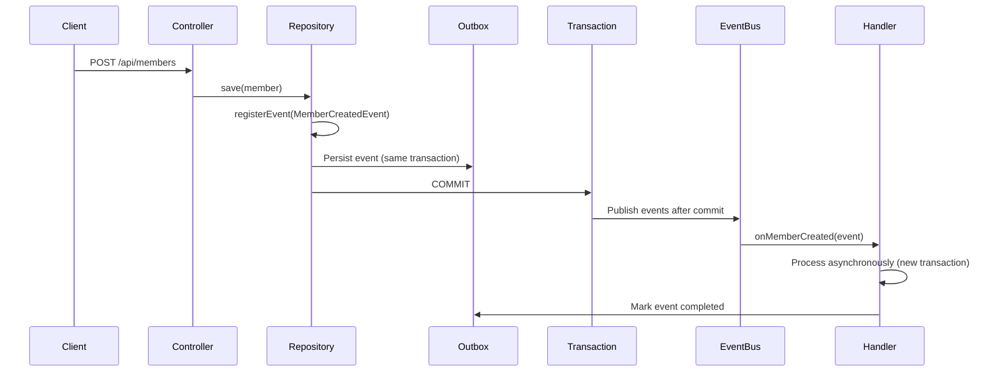

# Event-Driven Architecture with Spring Modulith

## Overview

The Klabis Backend uses **Spring Modulith** to implement event-driven communication between bounded contexts using the *
*transactional outbox pattern**. This enables reliable, asynchronous event delivery with guaranteed at-least-once
semantics.

## Why Event-Driven Architecture?

### The Dual-Write Problem

Without the outbox pattern, systems face the dual-write problem:

```
Without Outbox:
1. Write to database ✅
2. Publish event to message broker ❌ (fails)
   → Data saved but event lost!

Or:
1. Publish event to message broker ✅
2. Write to database ❌ (fails, transaction rolls back)
   → Event published but no data!
```

With the outbox pattern:

```
1. Write aggregate to database ✅
2. Write event to outbox table in SAME transaction ✅
3. Transaction commits (atomic)
4. Background process reads outbox and publishes events
5. Mark events as published
   → Guaranteed at-least-once delivery!
```

## Spring Modulith Modules

```
┌─────────────────────────────────────────────────────────────┐
│                    members (Module)                          │
│  Domain: Member registration, membership management         │
│  Events: MemberCreatedEvent                                 │
│  Dependencies: users, config                                │
└─────────────────────────────────────────────────────────────┘
                              │
                              │ MemberCreatedEvent
                              ▼
┌─────────────────────────────────────────────────────────────┐
│                    users (Module)                            │
│  Domain: User authentication, password management            │
│  Events: (none published)                                    │
│  Dependencies: config                                        │
└─────────────────────────────────────────────────────────────┘
```

## Event Publication Flow



### Event Flow Details

1. **Aggregate publishes event** during domain logic execution
2. **Event persisted to outbox** (`event_publication` table) in same transaction as aggregate
3. **Transaction commits** - both aggregate and event are atomically persisted
4. **Background thread** publishes events from outbox after commit
5. **Event handler executes** asynchronously in separate transaction
6. **Event marked completed** in outbox on successful handling
7. **Automatic retry** if handler fails

## Module Boundaries and Communication

### Module Communication Rules

- Modules communicate **via domain events only** (asynchronous, outbox pattern)
- **No direct method calls** across module boundaries
- Each module has its own package structure: `com.klabis.{module}.{layer}`
- Shared types (value objects) defined in `common` module
- Circular dependencies are prevented (verified by Spring Modulith tests)

### Current Event Flows

**Member Created → Password Setup Email**

- **Event:** `MemberCreatedEvent`
- **Published by:** `members` module (when Member aggregate saved)
- **Consumed by:** `members` module (`MemberCreatedEventHandler`)
- **Side Effect:** Sends password setup email via email service

### Module Dependencies

```
members → users (reads User for password setup)
members → config (configuration)
users → config (configuration)
common → shared by all modules
```

**Dependency Rules:**

- No circular dependencies
- Events are the only allowed cross-module communication
- Direct method calls only within same module

## Event Publication Configuration

### Application Configuration

```yaml
# application.yml
spring:
  modulith:
    events:
      # Enable event publication registry (outbox)
      enabled: true
      # Mark events as completed in database (vs. delete)
      completion-mode: UPDATE
      # Republish events that haven't completed after 5 minutes
      republish-incomplete-events-older-than: 5m
      # Delete completed events after 7 days
      delete-completed-events-older-than: 7d
```

### Database Schema

```sql
CREATE TABLE event_publication (
    id UUID PRIMARY KEY,
    event_type VARCHAR(512) NOT NULL,
    listener_id VARCHAR(512) NOT NULL,
    publication_date TIMESTAMP NOT NULL,
    serialized_event TEXT NOT NULL,
    completion_date TIMESTAMP
);

CREATE INDEX idx_event_publication_completion
ON event_publication(completion_date);
```

**Table Purpose:** Persists events atomically with business data, ensures no events are lost.

## Event Handler Implementation

### Basic Event Handler Pattern

```java
@Component
public class MemberCreatedEventHandler {

    private static final Logger log = LoggerFactory.getLogger(MemberCreatedEventHandler.class);

    @ApplicationModuleListener  // Spring Modulith annotation
    public void onMemberCreated(MemberCreatedEvent event) {
        // Executes asynchronously AFTER transaction commits
        // Separate transaction from aggregate persistence
        // Automatic retry on failure
        // Must be idempotent (may receive duplicate events)

        log.info("Processing MemberCreatedEvent for memberId: {}", event.getMemberId());

        // Business logic here (e.g., send email)
        sendPasswordSetupEmail(event.getMemberId());
    }
}
```

### Key Characteristics

- **Asynchronous:** Executes after transaction commits in separate thread
- **Separate Transaction:** Event handler failures don't roll back aggregate persistence
- **Automatic Retry:** Failed handlers are retried indefinitely
- **Idempotent Required:** Handlers may receive duplicate events (at-least-once delivery)

## Idempotent Event Handlers

### Why Idempotency Matters

With at-least-once delivery guarantees, event handlers may receive duplicate events. Idempotent handlers ensure:

- No duplicate side effects (e.g., no duplicate emails sent)
- System remains consistent regardless of delivery count
- Automatic retries don't cause data corruption

### Idempotency Patterns

#### 1. Check if Already Processed

```java
@Component
public class MemberCreatedEventHandler {

    @ApplicationModuleListener
    public void onMemberCreated(MemberCreatedEvent event) {
        UUID eventId = event.getEventId();

        // Check if already processed
        if (emailRepository.existsByEventId(eventId)) {
            log.info("Event {} already processed, skipping", eventId);
            return; // Idempotent: skip if already handled
        }

        // Process event
        sendWelcomeEmail(event.getMemberId());

        // Record that event was processed
        emailRepository.save(new EmailSentRecord(eventId, event.getMemberId()));
    }
}
```

#### 2. Use Unique Constraints

```sql
-- Ensure at most one welcome email per member
CREATE TABLE welcome_emails (
    id UUID PRIMARY KEY,
    member_id UUID NOT NULL UNIQUE,  -- Prevents duplicate emails
    event_id UUID NOT NULL UNIQUE,   -- Tracks which event sent it
    sent_at TIMESTAMP NOT NULL
);
```

#### 3. Idempotent Business Operations

```java
// Example: Set password (idempotent because it overwrites)
public void setPassword(UserId userId, String newPassword) {
    User user = user_repository.findById(userId);
    user.setPassword(newPassword);  // Overwrites existing password
    user_repository.save(user);     // Safe to call multiple times
}
```

### Testing Idempotency

```java
@Test
void testEventHandlerIsIdempotent() {
    MemberCreatedEvent event = new MemberCreatedEvent(memberId);

    // First processing
    handler.onMemberCreated(event);
    assertThat(emailRepository.count()).isEqualTo(1);

    // Duplicate event (same eventId)
    handler.onMemberCreated(event);
    assertThat(emailRepository.count()).isEqualTo(1); // Still 1, not 2!
}
```

## Event Publication Lifecycle

### Event States

1. **Created** - Event persisted to outbox, `completion_date = NULL`
2. **Published** - Event sent to listener (may retry if fails)
3. **Completed** - Handler succeeded, `completion_date` set to current timestamp
4. **Cleaned Up** - Event deleted after retention period (7 days)

### Republish Logic

```java
// Spring Modulith automatically republishes incomplete events
// Configuration in application.yml:
republish-incomplete-events-older-than: 5m  // Check every 5 minutes
```

**Republish Behavior:**

- Background job scans for events with `completion_date = NULL`
- Events older than 5 minutes are republished to listeners
- Continues retrying until successful or manually removed
- No maximum retry count (events persist indefinitely until processed)

### Cleanup Job

```java
// Spring Modulith automatically deletes completed events
// Configuration in application.yml:
delete-completed-events-older-than: 7d  // Delete after 7 days
```

**Cleanup Behavior:**

- Runs periodically (default: every minute)
- Deletes events where `completion_date < (now - 7 days)`
- Only deletes completed events (`completion_date IS NOT NULL`)
- Incomplete events are never deleted (preserved for retry)

## Event Publication Monitoring

### Actuator Endpoints

Spring Boot Actuator provides event publication metrics:

```bash
# Check event publication status
curl https://localhost:8443/actuator/modulith
```

**Response includes:**

- Total events published
- Count of incomplete events (`completion_date` is NULL)
- Count of events pending retry (older than republish threshold)

### Database Queries for Monitoring

#### Query Incomplete Events

```sql
-- Find events that haven't been processed
SELECT event_type, listener_id, publication_date
FROM event_publication
WHERE completion_date IS NULL
ORDER BY publication_date DESC;
```

#### Query Events Pending Retry

```sql
-- Find events that need retry (older than 5 minutes, incomplete)
SELECT event_type, listener_id, publication_date,
       TIMESTAMPDIFF(MINUTE, publication_date, CURRENT_TIMESTAMP) as minutes_pending
FROM event_publication
WHERE completion_date IS NULL
  AND publication_date < CURRENT_TIMESTAMP - INTERVAL '5 minutes'
ORDER BY publication_date;
```

#### Query Recent Completed Events

```sql
-- Find successfully processed events
SELECT event_type, listener_id, publication_date, completion_date
FROM event_publication
WHERE completion_date IS NOT NULL
  AND completion_date > CURRENT_TIMESTAMP - INTERVAL '7 days'
ORDER BY completion_date DESC;
```

#### Event Lifecycle Summary

```sql
-- Event lifecycle summary
SELECT
    CASE
        WHEN completion_date IS NULL THEN 'Pending'
        WHEN completion_date > CURRENT_TIMESTAMP - INTERVAL '1 hour' THEN 'Recent (1h)'
        WHEN completion_date > CURRENT_TIMESTAMP - INTERVAL '24 hours' THEN 'Recent (24h)'
        ELSE 'Old (will be cleaned)'
    END as status,
    COUNT(*) as count
FROM event_publication
GROUP BY status;
```

### Alerting Recommendations

- Alert if incomplete events > 100
- Alert if events pending retry > 10
- Alert if any event incomplete > 24 hours (may indicate handler failure)

## Email Sending with Events

The Klabis Backend uses event-driven email sending to ensure reliable email delivery:

- **Transactional Safety:** Email only sent if business operation succeeds
- **Async:** Doesn't block API response
- **Separate Transaction:** Email failures don't roll back business operations
- **Guaranteed Delivery:** Outbox pattern ensures no lost emails

**For complete email service implementation**, see [INTEGRATION-GUIDE.md](./INTEGRATION-GUIDE.md#email-service)

## References

- [Spring Modulith Documentation](https://spring.io/projects/spring-modulith)
- [Spring Modulith Event Publication](https://docs.spring.io/spring-modulith/reference/events.html)
- [Transactional Outbox Pattern](https://microservices.io/patterns/data/transactional-outbox.html)
- [Domain Events by Martin Fowler](https://martinfowler.com/eaaDev/DomainEvent.html)

---

**Related Documentation:**

- [ARCHITECTURE.md](./ARCHITECTURE.md) - Overall architecture overview
- [DOMAIN-MODEL.md](./DOMAIN-MODEL.md) - Bounded contexts and domain events
- [INTEGRATION-GUIDE.md](./INTEGRATION-GUIDE.md) - Email service implementation
- [OPERATIONS_RUNBOOK.md](./OPERATIONS_RUNBOOK.md) - Monitoring and troubleshooting

**Last Updated:** 2026-01-26
**Status:** ✅ IMPLEMENTED (Spring Modulith Integration)
