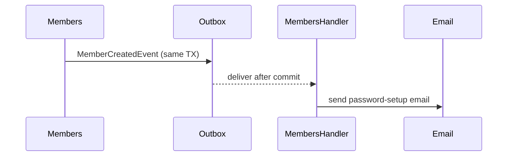

# Event-Driven Architecture (Klabis)

Klabis uses **Spring Modulith** with the transactional outbox pattern (`event_publication` table) for cross-module communication. This document captures only the Klabis-specific event flows and module-boundary rules — for the general theory (outbox pattern, dual-write problem, idempotency) refer to the Spring Modulith reference docs linked at the bottom.

## Module dependencies

```
members  → users   (reads User for password setup)
events   → users   (UserId reference)
calendar → events  (consumes domain events)
config   ← all     (configuration)
common   ← all     (shared kernel — value objects, security, utilities)
```

Cross-module communication uses **domain events only** — no direct calls across module boundaries. Value-object references (e.g., `EventId`, `UserId`) are allowed and do not create runtime dependencies. Spring Modulith tests verify the rules on every build.

## Event flows



| Event | Published by | Consumed by | Side effect |
|---|---|---|---|
| `MemberCreatedEvent` | `members` (on Member save) | `members.MemberCreatedEventHandler` | Send password-setup email |
| `MemberSuspendedEvent` | `members` | `members` listeners | Audit / downstream cleanup |
| `MemberResumedEvent` | `members` | `members` listeners | Audit |
| `BirthNumberAccessedEvent` | `members` (when admin reads sensitive field) | `members.BirthNumberAuditService` | GDPR audit log |
| `MemberAssignedToTrainingGroupEvent` | `members` (TrainingGroup aggregate) | `members` listeners | Cross-aggregate sync |
| `EventPublishedEvent` | `events` (when Event → ACTIVE) | `calendar.EventPublishedEventHandler` | Create CalendarItem (idempotent: skip if exists) |
| `EventUpdatedEvent` | `events` (on detail change) | `calendar.EventUpdatedEventHandler` | Update CalendarItem (warn-and-ignore if missing) |
| `EventCancelledEvent` | `events` (on cancel) | `calendar.EventCancelledEventHandler` | Delete CalendarItem (warn-and-ignore if missing) |

Authoritative event list lives in source — search `*Event.java` at module roots. Handlers live in `infrastructure/listeners/` (members) or dedicated `eventhandlers/` packages.

## Implementation conventions

- Listener method: `@ApplicationModuleListener` (Spring Modulith) — runs after commit in a separate transaction
- Idempotency is the **handler's responsibility**, not the framework's. Standard patterns: existence check before write, unique constraint on side-effect record, idempotent business operation (overwrite-style)
- Domain events declared at module root (e.g., `com.klabis.members.MemberCreatedEvent`) — these are part of the module's public API
- Tests use `@ApplicationModuleTest` with `Scenario` API for event-flow verification

## Configuration

Outbox config in `application.yml` (`spring.modulith.events.*`):
- `completion-mode: UPDATE` — mark completed (don't delete immediately)
- `republish-incomplete-events-older-than: 5m`
- `delete-completed-events-older-than: 7d`

## Monitoring

- Actuator: `GET /actuator/modulith` — module + event publication state
- Database: `event_publication` table (V003 migration). Query `WHERE completion_date IS NULL` for stuck events.

## References

- [Spring Modulith — Events](https://docs.spring.io/spring-modulith/reference/events.html)
- [Transactional Outbox Pattern (microservices.io)](https://microservices.io/patterns/data/transactional-outbox.html)
