# Spring Security Architecture

This document describes the Spring Security filter chain and OAuth2 configuration in the Klabis Backend application.

## Table of Contents

1. [Overview](#overview)
2. [Architecture Components](#architecture-components)
3. [Security Filter Chain](#security-filter-chain)
4. [OAuth2 Token Flow](#oauth2-token-flow)
5. [JWT Authentication Process](#jwt-authentication-process)
6. [Authorization Flow](#authorization-flow)
7. [Configuration Details](#configuration-details)

---

## Overview

The Klabis Backend uses **Spring Authorization Server** to provide OAuth2 authentication and **Spring Security Resource
Server** to protect API endpoints with JWT-based authentication.

### Key Features

- ✅ OAuth2 Authorization Server with JDBC-backed client repository
- ✅ JWT access tokens with custom claims (registrationNumber, authorities)
- ✅ Stateless session management
- ✅ Method-level security with `@PreAuthorize`
- ✅ Custom authentication/authorization exception handling
- ✅ User-centric authorization (roles → authorities mapping)

---

## Architecture Components

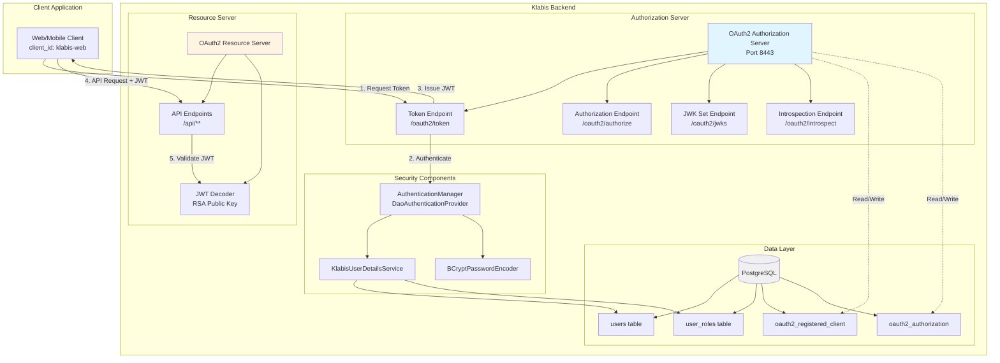

---

## Security Filter Chain

Spring Security uses two separate filter chains:

### 1. Authorization Server Filter Chain

Handles OAuth2 protocol endpoints.

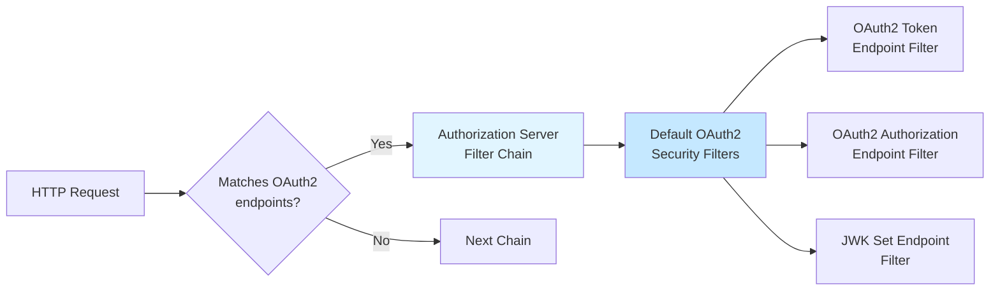

**Configuration**: `AuthorizationServerConfiguration.authorizationServerSecurityFilterChain()`

### 2. Resource Server Filter Chain

Protects API endpoints with JWT authentication.

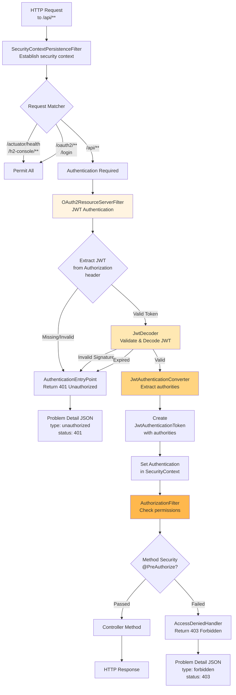

**Configuration**: `SecurityConfiguration.defaultSecurityFilterChain()`

**Filter Chain Details**:

```java
/api/**
├── SecurityContextPersistenceFilter
├── CsrfFilter (disabled)
├── OAuth2ResourceServerFilter
│   ├── BearerTokenAuthenticationFilter
│   │   ├── Extract JWT from "Authorization: Bearer <token>"
│   │   ├── JwtDecoder validates signature with RSA public key
│   │   └── JwtAuthenticationConverter converts to Authentication
│   └── Set Authentication in SecurityContext
├── AuthorizationFilter
│   ├── Check HttpSecurity authorize rules
│   └── @PreAuthorize method security
├── ExceptionTranslationFilter
│   ├── AuthenticationException → AuthenticationEntryPoint (401)
│   └── AccessDeniedException → AccessDeniedHandler (403)
└── FilterSecurityInterceptor
```

---

## OAuth2 Token Flow

### Client Credentials Flow

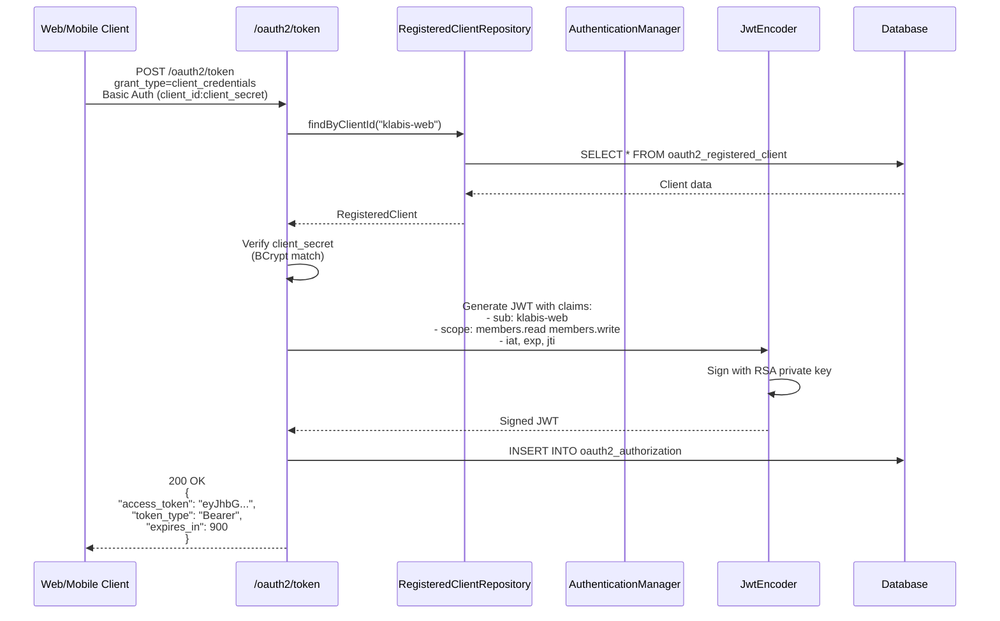

### Resource Owner Password Credentials Flow

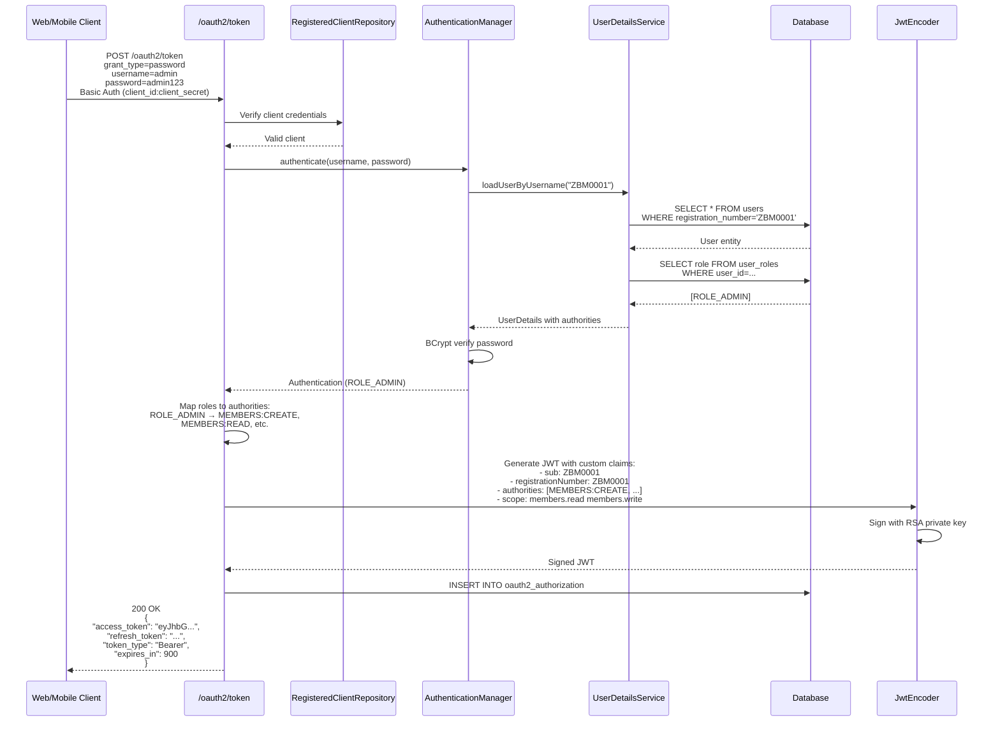

### Authorization Code Flow

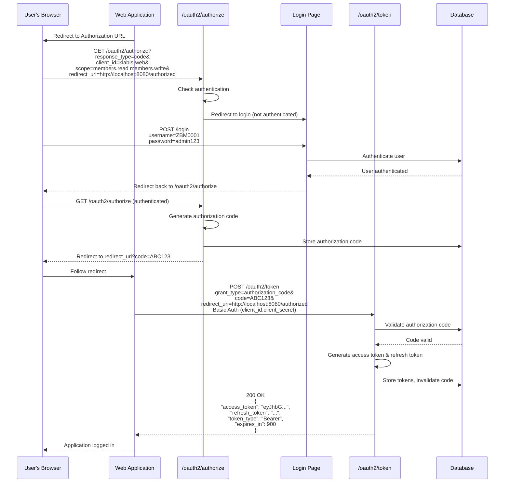

---

## JWT Authentication Process

### JWT Structure

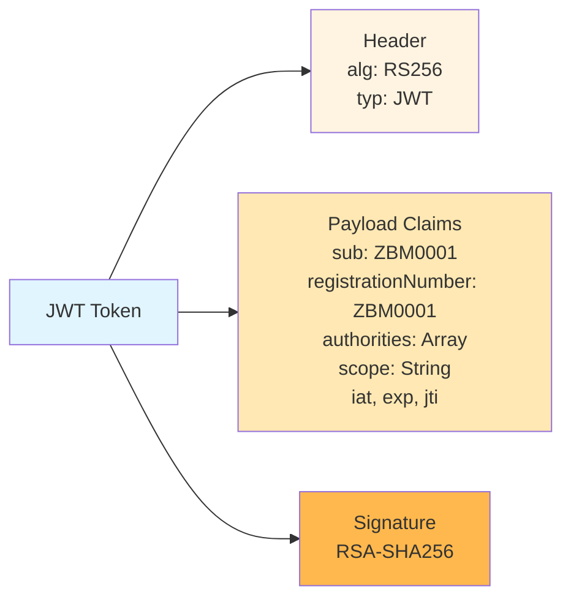

### JWT Token Customization

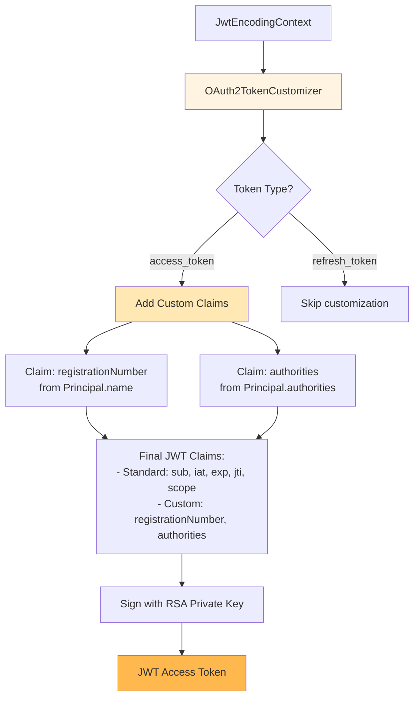

**Configuration**: `AuthorizationServerConfiguration.jwtCustomizer()`

### JWT Validation

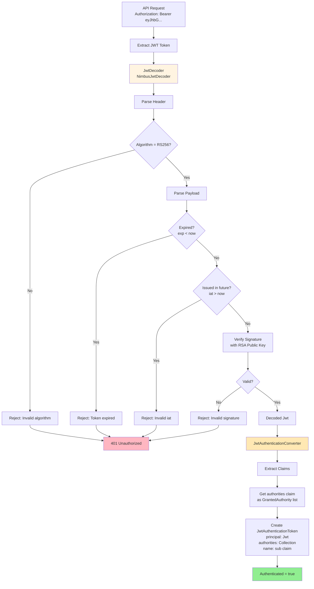

**Configuration**:

- `SecurityConfiguration.jwtDecoder()` - RSA public key validation
- `SecurityConfiguration.jwtAuthenticationConverter()` - Claims to authorities mapping

---

## Authorization Flow

### Roles to Authorities Mapping

```mermaid
graph LR
    subgraph "Database"
        UserRoles[(user_roles table<br/>user_id, role)]
    end

    subgraph "Application Layer"
        User[User Entity<br/>registrationNumber: ZBM0001]
        Roles[Roles Set<br/>ROLE_ADMIN]
    end

    subgraph "Security Layer"
        UDS[UserDetailsService]
        UD[UserDetails<br/>authorities: Collection]
        Auth[Authentication<br/>authorities]
    end

    subgraph "OAuth2 Token"
        JWT[JWT Claims<br/>authorities: Array<String>]
    end

    subgraph "Authorization"
        Check[@PreAuthorize<br/>hasAuthority]
        Decision{Granted?}
    end

    UserRoles -.->|Load| User
    UserRoles -.->|Load| Roles

    User --> UDS
    Roles --> UDS

    UDS -->|Create| UD
    UD -->|Map roles to authorities| Auth

    Auth -->|Include in token| JWT

    JWT -->|Extract on validation| Auth
    Auth --> Check
    Check --> Decision

    Decision -->|Yes| Allow[200 OK]
    Decision -->|No| Deny[403 Forbidden]

    style UDS fill:#e1f5ff
    style JWT fill:#fff4e1
    style Check fill:#ffe8b3
    style Allow fill:#90EE90
    style Deny fill:#FFB6C1
```

### Method Security Evaluation

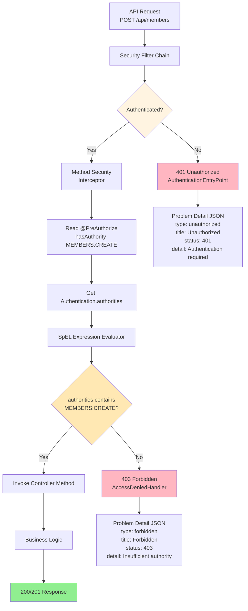

### Authority Hierarchy Example

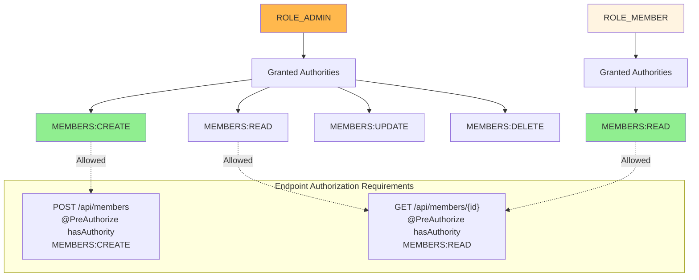

---

## Configuration Details

### Security Configuration Classes

```mermaid
graph TB
    subgraph "Configuration Classes"
        SEC[SecurityConfiguration<br/>@EnableWebSecurity<br/>@EnableMethodSecurity]
        AS[AuthorizationServerConfiguration<br/>OAuth2 Authorization Server]
        EH[SecurityExceptionHandler<br/>@RestControllerAdvice]
    end

    subgraph "Beans from SecurityConfiguration"
        PWD[PasswordEncoder<br/>BCryptPasswordEncoder]
        AUTH[AuthenticationManager<br/>DaoAuthenticationProvider]
        KEYPAIR[KeyPair<br/>RSA 2048-bit]
        JWK[JWKSource<br/>RSA Key Set]
        DEC[JwtDecoder<br/>RSA Public Key]
        ENC[JwtEncoder<br/>RSA Private Key]
        CONV[JwtAuthenticationConverter<br/>authorities claim mapper]
        ENTRY[AuthenticationEntryPoint<br/>401 handler]
        DENIED[AccessDeniedHandler<br/>403 handler]
        CHAIN1[SecurityFilterChain<br/>/api/** - Resource Server]
    end

    subgraph "Beans from AuthorizationServerConfiguration"
        REPO[RegisteredClientRepository<br/>JDBC-backed]
        AUTHSVC[OAuth2AuthorizationService<br/>JDBC-backed]
        CONSENT[OAuth2AuthorizationConsentService<br/>JDBC-backed]
        SETTINGS[AuthorizationServerSettings<br/>Endpoints configuration]
        CUSTOM[OAuth2TokenCustomizer<br/>JWT claims customizer]
        CHAIN2[SecurityFilterChain<br/>OAuth2 endpoints]
    end

    subgraph "Exception Handlers"
        EH1[handleAuthenticationException<br/>→ 401 Problem Detail]
        EH2[handleAccessDeniedException<br/>→ 403 Problem Detail]
    end

    SEC --> PWD
    SEC --> AUTH
    SEC --> KEYPAIR
    SEC --> JWK
    SEC --> DEC
    SEC --> ENC
    SEC --> CONV
    SEC --> ENTRY
    SEC --> DENIED
    SEC --> CHAIN1

    AS --> REPO
    AS --> AUTHSVC
    AS --> CONSENT
    AS --> SETTINGS
    AS --> CUSTOM
    AS --> CHAIN2

    EH --> EH1
    EH --> EH2

    AUTH -.uses.-> PWD
    JWK -.uses.-> KEYPAIR
    DEC -.uses.-> KEYPAIR
    ENC -.uses.-> JWK
    CHAIN1 -.uses.-> DEC
    CHAIN1 -.uses.-> CONV
    CHAIN1 -.uses.-> ENTRY
    CHAIN1 -.uses.-> DENIED

    AUTHSVC -.uses.-> REPO
    CONSENT -.uses.-> REPO
    CHAIN2 -.uses.-> SETTINGS

    style SEC fill:#e1f5ff
    style AS fill:#fff4e1
    style EH fill:#ffe8b3
```

### Key Configuration Parameters

| Component                       | Configuration                                    | Value              |
|---------------------------------|--------------------------------------------------|--------------------|
| **Session Management**          | `sessionCreationPolicy`                          | `STATELESS`        |
| **CSRF Protection**             | `csrf`                                           | `disabled`         |
| **JWT Algorithm**               | RSA Signature                                    | `RS256` (2048-bit) |
| **Access Token Lifetime**       | `settings.token.access-token-time-to-live`       | 900s (15 min)      |
| **Refresh Token Lifetime**      | `settings.token.refresh-token-time-to-live`      | 2592000s (30 days) |
| **Authorization Code Lifetime** | `settings.token.authorization-code-time-to-live` | 300s (5 min)       |
| **Authorities Claim Name**      | `jwtAuthenticationConverter`                     | `"authorities"`    |
| **Authority Prefix**            | `jwtAuthenticationConverter`                     | `""` (empty)       |
| **Password Encoding**           | BCrypt                                           | Strength 10        |

### Endpoint Security Matrix

| Endpoint                | Authentication       | Authorization       | Description                    |
|-------------------------|----------------------|---------------------|--------------------------------|
| `/actuator/health`      | ❌ Not required       | ✅ Permit All        | Health check                   |
| `/h2-console/**`        | ❌ Not required       | ✅ Permit All        | H2 database console (dev only) |
| `/oauth2/token`         | ✅ Client credentials | ✅ Permit All        | Token endpoint                 |
| `/oauth2/authorize`     | ✅ User credentials   | ✅ Permit All        | Authorization endpoint         |
| `/oauth2/jwks`          | ❌ Not required       | ✅ Permit All        | JWK Set endpoint               |
| `/oauth2/introspect`    | ✅ Client credentials | ✅ Permit All        | Token introspection            |
| `/oauth2/revoke`        | ✅ Client credentials | ✅ Permit All        | Token revocation               |
| `/login`                | ❌ Not required       | ✅ Permit All        | Login page                     |
| `POST /api/members`     | ✅ JWT required       | 🔐 `MEMBERS:CREATE` | Register member                |
| `GET /api/members/{id}` | ✅ JWT required       | 🔐 `MEMBERS:READ`   | Get member                     |

### Database Schema References

**Users & Roles**:

- `users` - User accounts (registration_number, password_hash, account_status)
- `user_roles` - User role assignments (user_id, role)

**OAuth2**:

- `oauth2_registered_client` - OAuth2 client registrations
- `oauth2_authorization` - Active authorizations (codes, tokens)
- `oauth2_authorization_consent` - User consent records

See: `V002__create_users_and_oauth2_tables.sql`

---

## Request Flow Example

### Complete Request Flow: Register Member

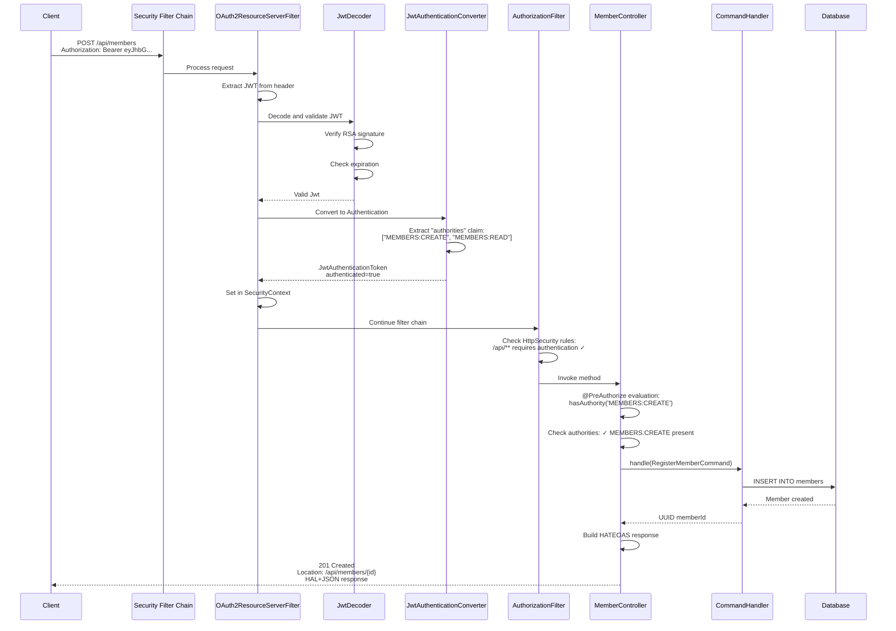

---

## OpenID Connect (OIDC) Support

OpenID Connect Core 1.0 support is enabled through Spring Authorization Server configuration, providing a standardized
identity layer on top of OAuth2.

### Key Features

✅ **Discovery Endpoint**: `/.well-known/openid-configuration` returns OIDC metadata
✅ **ID Tokens**: JWT tokens with identity claims (sub, auth_time, registrationNumber) when `openid` scope requested
✅ **UserInfo Endpoint**: `/oauth2/userinfo` returns user profile claims with scope-based filtering (profile/email scopes)
✅ **Scope-Based Claims**: `profile` scope for given_name/family_name, `email` scope for email claims
✅ **RP-Initiated Logout**: `/oauth2/logout` for single sign-out flows
✅ **Backward Compatible**: Existing OAuth2 clients work unchanged (OIDC is opt-in via scope)

### ID Token vs Access Token

| Aspect           | ID Token                                 | Access Token                        |
|------------------|------------------------------------------|-------------------------------------|
| **Purpose**      | User Authentication                      | API Authorization                   |
| **Claims**       | `sub`, `auth_time`, `registrationNumber` | `registrationNumber`, `authorities` |
| **Scope**        | Requested when `openid` scope included   | Always included                     |
| **Usage**        | Frontend sessions, user identification   | API authorization checks            |
| **Profile Data** | Not included (minimal claims)            | Not included                        |

### UserInfo Endpoint: Scope-Based Claims

The UserInfo endpoint (`/oauth2/userinfo`) implements OIDC-compliant scope-based access control:

| Scope      | Claims Returned                                                      | Condition                           |
|------------|----------------------------------------------------------------------|-------------------------------------|
| `openid`   | `sub` (subject identifier)                                           | Always (required)                   |
| `profile`  | `given_name`, `family_name`, `registrationNumber`, `updated_at`      | Member entity exists                |
| `email`    | `email`, `email_verified`                                            | Member entity exists AND email != null |

**Behavior:**
- Claims are **omitted** (not returned as `null`) when data is unavailable (OIDC best practice)
- Admin users without Member entity return only `sub` claim regardless of scopes
- Members without email address omit email claims even when `email` scope is requested
- `email_verified` always returns `false` until email verification feature is implemented

**Example Responses:**

```json
// openid scope only
{
  "sub": "ZBM0501"
}

// openid + profile scopes
{
  "sub": "ZBM0501",
  "given_name": "Jan",
  "family_name": "Novák",
  "registrationNumber": "ZBM0501",
  "updated_at": "2026-02-09T12:00:00Z"
}

// openid + profile + email scopes (full profile)
{
  "sub": "ZBM0501",
  "given_name": "Jan",
  "family_name": "Novák",
  "registrationNumber": "ZBM0501",
  "updated_at": "2026-02-09T12:00:00Z",
  "email": "jan.novak@example.com",
  "email_verified": false
}
```

### OIDC Flow: Authorization Code with ID Token

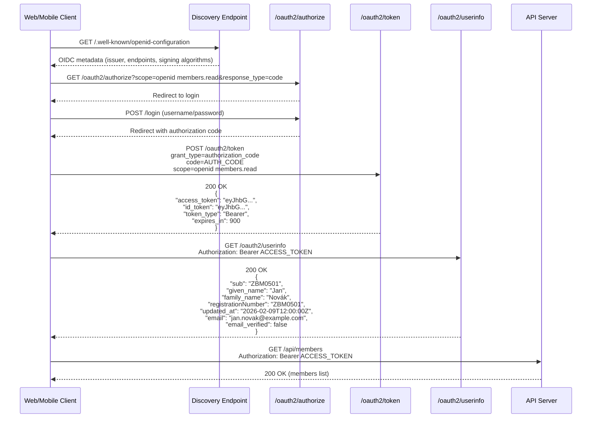

### ID Token Claims Structure

```json
{
  "iss": "https://localhost:8443",           // Issuer
  "sub": "user123",                          // Subject (user identifier)
  "aud": "klabis-web",                       // Audience (client_id)
  "exp": 1643547600,                         // Expiration time
  "iat": 1643544000,                         // Issued at
  "auth_time": 1643544000,                   // Authentication time (custom)
  "registrationNumber": "user123"            // Custom claim
}
```

### Configuration

**AuthorizationServerConfiguration.java**:

- `authorizationServerSettings()`: Sets issuer URL, enables OIDC
- `jwtCustomizer()`: Adds OIDC claims (`sub`, `auth_time`) for ID tokens
- Discovery endpoint automatically available when OIDC enabled

**BootstrapDataLoader.java**:

- `openid` scope added to default OAuth2 client

### Endpoints

| Endpoint                            | Method | Purpose                          | Requires Auth      |
|-------------------------------------|--------|----------------------------------|--------------------|
| `/.well-known/openid-configuration` | GET    | OIDC metadata                    | No                 |
| `/oauth2/authorize`                 | GET    | Start authorization flow         | No                 |
| `/oauth2/token`                     | POST   | Exchange code for tokens         | Client credentials |
| `/oauth2/userinfo`                  | GET    | Get user profile                 | Yes (access token) |
| `/oauth2/logout`                    | POST   | Logout / revoke tokens           | Yes                |
| `/oauth2/jwks`                      | GET    | JWK Set for signature validation | No                 |

---

## Security Best Practices Implemented

✅ **Stateless Authentication**: No server-side sessions, JWT in every request
✅ **Principle of Least Privilege**: Fine-grained authorities (MEMBERS:CREATE vs ROLE_ADMIN)
✅ **Defense in Depth**: Multiple layers (HTTP rules + method security)
✅ **Secure Password Storage**: BCrypt with salt
✅ **Asymmetric Cryptography**: RSA keys for JWT signing (private key never exposed)
✅ **Token Expiration**: Short-lived access tokens (15 min)
✅ **CSRF Protection**: Disabled for stateless API (not needed with JWT)
✅ **Standard Error Responses**: RFC 7807 Problem Detail format
✅ **Separation of Concerns**: Authorization Server ≠ Resource Server
✅ **JDBC-backed OAuth2**: Persistent storage of clients and authorizations

---

## References

- [Spring Security Reference](https://docs.spring.io/spring-security/reference/)
- [Spring Authorization Server Reference](https://docs.spring.io/spring-authorization-server/reference/)
- [OAuth 2.0 RFC 6749](https://tools.ietf.org/html/rfc6749)
- [JWT RFC 7519](https://tools.ietf.org/html/rfc7519)
- [RFC 7807 Problem Details](https://tools.ietf.org/html/rfc7807)

**Configuration Files**:

- `SecurityConfiguration.java` - Resource server and JWT configuration
- `AuthorizationServerConfiguration.java` - OAuth2 authorization server setup
- `KlabisUserDetailsService.java` - User authentication
- `V002__create_users_and_oauth2_tables.sql` - Database schema
