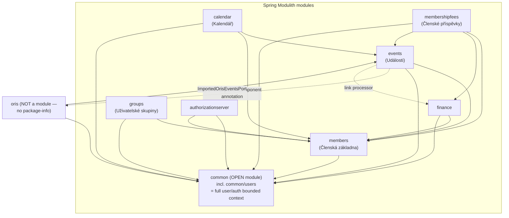
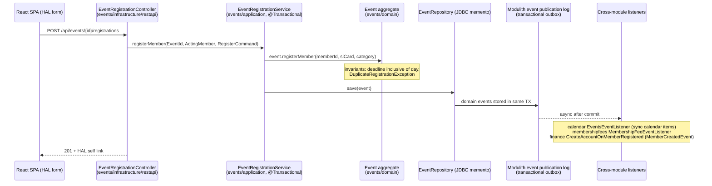

# Klabis Deep Review — July 2026

- **Review started:** 2026-07-06
- **Commit:** `74d736e19fdb324b4f84b7a0395adad873cafa00` (branch `main`)
- **Scope:** whole repository — Spring Boot backend (`backend/`, 643 main / 244 test Java files), React frontend (`frontend/`, 336 TS/TSX files), configuration, database migrations, build, and specifications workflow (`openspec/` reviewed only as a reference for expected behavior, not as review subject).
- **Out of scope:** generated code (`frontend/src/api/klabisApi.d.ts`, build outputs in `backend/src/main/resources/static/assets`), third-party `oris-client` internals, `pencil/` and `tools/` support directories (checked only for secrets/config issues in Phase 8).

## Review lenses

1. **Maintainability** — duplication, dead code, unclear ownership, tangled dependencies, missing tests around risky logic, growth pain points.
2. **Readability** — misleading names, oversized methods, non-obvious control flow, lying comments, inconsistent idioms between similar modules.
3. **Security** — authN/authZ gaps, injection, secrets in code/config, sensitive-data exposure in responses or logs, CSRF/session handling, unsafe deserialization, dependency risks.
4. **Data correctness** — critical invariants below: types for critical values, idempotency of retried writes, transaction boundaries, invariants in DB constraints vs. code only, migration safety and environment drift.

## Critical data invariants

1. **Money** — `Money` value objects (finance and events modules) wrap `BigDecimal` + currency; a member account's balance must equal the sum of its transactions; overdraft is bounded by `OverdraftPolicy`; transaction reversal must be idempotent.
2. **Event registrations** — at most one registration per member per event; registration deadlines are inclusive of the entire deadline day (fix `e75e267b`), and that semantic must hold at every deadline check.
3. **Registration numbers** — club registration numbers (ZBMxxxx) must be unique and collision-free under concurrent generation.
4. **GDPR-sensitive data** — birth certificate number (rodné číslo) is Jasypt-encrypted at rest and must never appear in API responses, logs, or error messages.
5. **Transactional outbox** — Spring Modulith JDBC event publication log carries cross-module consistency; domain events must be published in the same transaction as the aggregate write.
6. **Fee campaigns** — campaign lifecycle transitions are one-way; fee charges must not double-apply to member accounts on retry or re-run.
7. **Environment drift** — dev/test run H2 in-memory, production runs PostgreSQL; migrations are edited in place pre-release; H2/PostgreSQL dialect differences must not hide schema divergence.

## Phase log

### Phase 0 — Inventory & plan (2026-07-06)

**System shape.** Klabis is a modular monolith for orienteering club management. The backend is a single Gradle module (Spring Boot 4.0.5, Java 21, Spring Modulith 2.0.0) with jMolecules DDD/hexagonal annotations enforced via ByteBuddy weaving. Business modules under `com.klabis`: `members`, `events`, `calendar`, `finance`, `membershipfees`, `groups` (with `familygroup`/`freegroup`/`traininggroup` sub-features), `oris` (ORIS federation API integration via private `oris-client` dependency), `authorizationserver` (embedded Spring Authorization Server), and a large `common` module (156 files) providing HATEOAS/HAL-FORMS infrastructure, field-level authorization, patch support, JDBC memento helpers, rate limiting, email, encryption, and user identity.

**Persistence.** Spring Data JDBC with a memento pattern (`*Memento` classes in `infrastructure/jdbc`). Flyway migrations: V001 (domain schema, edited in place by convention), V002 (OAuth2 tables), V003 (Modulith event publication), V004 (Java migration adding the `unaccent` extension). H2 for dev/tests, PostgreSQL for production, Testcontainers for integration tests.

**API surface.** HAL+FORMS hypermedia REST API (Spring HATEOAS), OpenAPI spec exported to `docs/openapi/` and consumed by the frontend type generator. OAuth2/OIDC auth served by the embedded authorization server; Resilience4j rate limiting; Jasypt encryption for GDPR fields.

**Frontend.** React 19 + TypeScript + Vite SPA. oidc-client-ts for auth, TanStack Query + openapi-fetch/openapi-react-query for data, Formik + Yup forms, Tailwind. A HAL-navigation layer (`HalNavigator2`, `KlabisTable`, `hateoas.ts`) drives generic hypermedia UI. Production build is copied into `backend/src/main/resources/static` and committed.

**Testing.** 244 backend test files mirroring main packages plus `testdomain`/`config` helpers; Modulith and jMolecules ArchUnit tests present. Frontend uses Vitest + Testing Library; test files live beside sources.

**Plan.** Eleven further phases (architecture; two passes over `common`; one per business area; persistence/config/build; two frontend passes; synthesis) — see `review-state.md` for the checklist and the watch list carried between phases.

---

### Phase 1 — Architecture review (2026-07-06)

#### Module dependency map (verified from imports)

Solid arrows are compile-time dependencies confirmed by import analysis; dotted arrows are the two unusual edges discussed in the findings. `common` depends on nothing except one import of `KlabisApplication` (package-name filter in `CustomMetricsTrackingAspect` — benign).

#### Most important end-to-end flow: event registration (verified)

#### Cohesion & coupling per module

- **members** — the hub everyone depends on (events, groups, finance, membershipfees, calendar, authorizationserver). Clean layering (`domain`/`application`/`infrastructure`), public API at package root (`MemberId`, `Members`, `MemberDto`, domain events) plus two named interfaces (`members.application`, `members.rest`). Depends only on `common`. Healthy shape for the domain's core entity.
- **events** — largest business module (116 files); clean internal layering, exposes `events.application` + `events.domain` named interfaces. Two blemishes: the mutual dependency with `oris` and third-party ORIS client types inside the application layer (findings below).
- **calendar** — small, well-documented module; consumes events via domain events + `EventScheduleQuery` port + direct read access to the `events.domain` named interface. The direct aggregate read access is documented in `package-info.java` but is the widest named-interface exposure in the system → watch-list item for Phase 5.
- **finance / membershipfees** — good example of ADR-001 in practice: `membershipfees` consumes `finance.application.ChargePort` and `events.application` ports. Two soft spots: `membershipfees` imports `events.domain.EventType` (entity type crossing modules, not just port DTOs) and `events.infrastructure.bootstrap.EventTypeDataBootstrap` (infra→infra coupling for bootstrap constants) — carried to Phase 6.
- **groups** — three sub-features (family/free/training) each with own layering + shared `groups/common`; consumes members only via root API types (42× `MemberId`) and HATEOAS link building. Cohesive.
- **common** — 156 files, two distinct things under one roof: genuine shared infrastructure (hateoas, patch, jdbc, mvc, ratelimit, email, encryption…) *and* `common/users`, a complete user/permission bounded context (61 files with aggregates, application services, REST controllers, JDBC adapters, bootstrap). See finding A1.
- **oris** — 2 files, but structurally odd: it is simultaneously a primary adapter (REST controller for browsing ORIS events) and the owner of a profile-gating annotation used *by* the events module. Not a Modulith module at all. See finding A2.
- **authorizationserver** — small and focused; consumes `members.Members` (primary port) and `common.users` services per ADR-001, though it also imports `users.domain.User`/`UserPermissions` types directly — watch-list item for Phase 2.

#### Boundaries & dependency direction

Dependency direction is overwhelmingly correct and *verified by tests*: `ModuleStructureVerificationTest` (Modulith `verify()`), `LayerArchitectureTest` (ArchUnit: domain ⊄ application ⊄ infrastructure, no Jackson in domain/application), plus jMolecules ArchUnit tests. Transaction boundaries sit uniformly on application services (`@Transactional` on service methods, `readOnly` used for queries) — correct per Spring practice. Cross-module writes flow through primary ports; cross-module reactions flow through Modulith events with the JDBC publication log as outbox.

The two structural holes are both about *what the verifier cannot see*: the `oris` package (no `@ApplicationModule` → invisible to `verify()`, and it forms the system's only dependency cycle) and the OPEN `common` module (all its types are exposed, so `common/users`' repositories and domain internals are consumable by any module without any test failing).

#### API surface consistency

Consistent and above-average for a project this size: HAL+FORMS everywhere, DTOs + MapStruct mappers at every REST boundary (no aggregate ever serialized directly — verified in events, finance, members controllers), commands into application services, RFC-7807 `ProblemDetail`/`ErrorResponse` from a shared `MvcExceptionHandler` plus thin per-module `@RestControllerAdvice` handlers scoped by `basePackageClasses`. Cross-module HAL links are added via `RepresentationModelProcessor`s (e.g. finance decorating `MemberSummaryResponse`) — the standard Spring HATEOAS pattern; the resulting REST-DTO imports across modules are legitimized by the `members.rest` named interface and flow in the correct direction.

#### Persistence strategy

Spring Data JDBC + memento pattern per module (`infrastructure/jdbc/*Memento` + repository adapters), keeping aggregates persistence-free — consistent with the jMolecules/hexagonal setup. Flyway with the edit-in-place V001 convention and H2(dev)/PostgreSQL(prod) split is deferred to Phase 8.

#### Frontend architecture

Consistent single-idiom architecture: nearly all data access is HAL-driven (69 files use the HAL hooks/`HalNavigator2` machinery; only 2 use the typed `openapi-fetch` client directly). Routing is centralized in `App.tsx` with `GenericHalPage` as a hypermedia fallback; auth is isolated in `AuthContext2` + `klabisUserManager` (oidc-client-ts); server state lives in TanStack Query, client state in small purpose-built contexts (theme, admin mode, toast). This is coherent — the generic HAL layer is the project's biggest frontend asset and its main complexity concentration (Phase 9 will go deep). One leftover: a developer sandbox page routed in production (finding A5).

#### Dead/legacy code & stale docs

- `ModuleStructureVerificationTest` javadoc describes a module layout that no longer exists (`users`, `config` top-level modules, "Iteration 12" status, a "Known Violations" list referencing packages that are gone) — finding A4.
- `common/package-info.java` states "This is NOT a Spring Modulith module" directly above the `@ApplicationModule(type = OPEN)` annotation that makes it one — finding A4.
- `docs/design-decisions.md` contains only ADR-001 while the root CLAUDE.md advertises ADRs for auto-config layout, optional `myClubId`, cache-manager fallback, enum choices, and package structure — those decisions are currently undocumented or documented elsewhere; carried to Phase 8.
- Minified frontend bundles committed under `backend/src/main/resources/static/assets` — deliberate single-JAR deployment choice; costs noted in finding A6.

#### Findings

### [HIGH] A1 — The user/permission bounded context lives inside the OPEN `common` module, outside all boundary verification
- **Where:** `backend/src/main/java/com/klabis/common/users/**` (61 files: `domain/User.java`, `domain/UserPermissions.java`, `domain/UserRepository.java`, `application/`, `infrastructure/restapi/`, `infrastructure/jdbc/`…), `common/package-info.java`
- **Lens:** architecture
- **What:** `common/users` is a complete bounded context — aggregates (`User`, `UserPermissions`, `PasswordSetupToken`), application services, REST controllers, JDBC adapters, bootstrap — placed inside `common`, which is annotated `@ApplicationModule(type = OPEN)`. OPEN modules expose *all* their types and are excluded from Modulith's dependency checks, so `UserRepository` and every other secondary port of the users context can be injected from any module without `ModuleStructureVerificationTest` failing. The stale javadoc in that test shows the history: `users` used to be a top-level module with a `members ↔ users` cycle, and moving it under `common` is what made verification pass. ADR-001's stated consequence — "future modules cannot quietly depend on a foreign repository; the secondary-port/persistence layer of a module stays private" — does not hold for precisely the security-sensitive context where it matters most. Current discipline is good (only `authorizationserver` imports `users.domain` types), but it is enforced by convention only.
- **Why it matters:** the next developer (or agent) who needs a user lookup can inject `UserPermissionsRepository` directly from any module; no test fails, and the exact coupling ADR-001 was written to eliminate silently returns. As the codebase grows, the auth/permission context — the one with the highest blast radius — is the only business context without a verified boundary.
- **Fix:** promote `com.klabis.common.users` to a top-level `com.klabis.users` `@ApplicationModule`; expose the existing root-package API (`Authority`, `UserId`, `UserService`, `HasAuthority`) plus an `application` named interface per ADR-001; re-run `verify()` and resolve whatever surfaces (likely only the `members` link-processor import of `PermissionController`, solvable with a `users.rest` named interface mirroring `members.rest`). Size: **M**.
- **Fix prompt (Claude Code):**
  > The package `com.klabis.common.users` (backend) is a full bounded context (User/UserPermissions/PasswordSetupToken aggregates, application services, REST controllers, JDBC adapters) hidden inside the OPEN `common` Modulith module, so its boundaries are not verified. Extract it into a new top-level Spring Modulith module `com.klabis.users`: (1) move the whole `common/users` package tree to `com.klabis.users`, keeping the internal `domain`/`application`/`infrastructure` layout; (2) add `package-info.java` with `@ApplicationModule(displayName = "Uživatelé")`; (3) expose the root-package types (`Authority`, `UserId`, `UserService`, `HasAuthority`, `PasswordSetupTokenId`) as the module API and add `@NamedInterface("application")` on `users.application` per ADR-001 in docs/design-decisions.md, plus `@NamedInterface("users.rest")` on `users.infrastructure.restapi` if link processors in other modules need controller references; (4) update all imports across modules; (5) run `ModuleStructureVerificationTest` and fix any surfaced violations by consuming primary ports only — do not weaken the module to OPEN; (6) update the stale javadoc in `ModuleStructureVerificationTest` and the `common/package-info.java` comment. Use the backend-developer agent and run the full test suite (via test-runner) before committing.

### [MEDIUM] A2 — `events ↔ oris` dependency cycle, and `oris` escapes Modulith verification entirely
- **Where:** `backend/src/main/java/com/klabis/oris/` (no `package-info.java`), `oris/OrisIntegrationComponent.java`, `oris/OrisController.java:8`, `events/application/OrisEventImportService.java:14`, `events/application/OrisBulkSyncService.java:5`, `events/application/OrisEventBulkImportService.java:4`, `events/infrastructure/restapi/OrisEventController.java:12`
- **Lens:** architecture
- **What:** `com.klabis.oris` has no `@ApplicationModule` annotation, so under `detection-strategy: explicitly-annotated` Spring Modulith does not see it and `verify()` cannot check anything about it. It participates in the system's only dependency cycle: four `events` classes import `oris.OrisIntegrationComponent` (a meta-annotation bundling `@Profile("oris")` + `@Component`), while `oris.OrisController` imports `events.application.ImportedOrisEventsPort`. The cycle is "soft" (one direction is only an annotation), but it means the ORIS integration package can grow arbitrary dependencies in either direction with zero test coverage of its boundary.
- **Why it matters:** the whole architecture's safety net is Modulith `verify()`; a package invisible to it is where boundary erosion will accumulate. Concretely: someone adding a helper in `oris` that calls into `events.domain` (or vice versa) gets no failure today, and untangling a hardened events↔oris knot later is much more expensive than declaring the module now.
- **Fix:** make `oris` a proper `@ApplicationModule`; move `OrisIntegrationComponent` out of `oris` into `common` (it is cross-cutting profile plumbing, not ORIS domain logic) so the dependency becomes one-directional `oris → events.application`. Size: **S**.
- **Fix prompt (Claude Code):**
  > In the Klabis backend, the package `com.klabis.oris` is not a Spring Modulith module (missing `package-info.java` with `@ApplicationModule`) and forms a soft dependency cycle with `events`: `events` classes import the meta-annotation `com.klabis.oris.OrisIntegrationComponent`, while `oris.OrisController` imports `com.klabis.events.application.ImportedOrisEventsPort`. Fix: (1) move `OrisIntegrationComponent` from `com.klabis.oris` to `com.klabis.common` (e.g. `com.klabis.common.oris` or alongside other cross-cutting annotations) and update all imports in `events/application/OrisEventImportService`, `OrisBulkSyncService`, `OrisEventBulkImportService`, `events/infrastructure/restapi/OrisEventController`, and `oris/OrisController`; (2) add `package-info.java` to `com.klabis.oris` with `@org.springframework.modulith.ApplicationModule(displayName = "ORIS")`; (3) run `ModuleStructureVerificationTest` to confirm the module is detected and no violations exist. Use the backend-developer agent; run tests via test-runner before committing.

### [MEDIUM] A3 — events application layer depends directly on the third-party ORIS client and its wire DTOs
- **Where:** `backend/src/main/java/com/klabis/events/application/OrisEventImportService.java:3-7,39`, `events/application/OrisBulkSyncService.java`, `events/application/OrisEventBulkImportService.java`, `events/application/EventTypeManagementService.java`
- **Lens:** architecture
- **What:** application services inject `com.dpolach.api.orisclient.OrisApiClient` and work with its wire DTOs (`EventDetails`, `EventClass`, `Discipline`, `Level`) inline. Everywhere else the codebase enforces hexagonal direction with jMolecules annotations and ArchUnit (`LayerArchitectureTest` forbids application→infrastructure), but the ORIS client isn't in an `..infrastructure..` package, so the rule can't see that the application layer is bound to an external adapter's types. Mapping from ORIS wire format to domain (`Event`, `Money`, currency parsing) happens inside application services instead of behind a port.
- **Why it matters:** any change in the `oris-client` API (a snapshot dependency, so it *will* change) ripples directly into four application services; ORIS-format quirks (e.g. currency parsing with silent CZK fallback in `events.domain.Money.parseCurrency`) become embedded business logic that can't be tested without the client types. This may be a deliberate simplification — the client is first-party (`com.dpolach`) — but it contradicts the architecture the project itself enforces with tests.
- **Fix:** introduce a secondary port in `events` (e.g. `OrisEventCatalog` interface returning domain-shaped import data) implemented by an adapter in `events/infrastructure/oris` that owns the `OrisApiClient` dependency and DTO mapping; extend `LayerArchitectureTest` with a rule forbidding `..application..` → `com.dpolach..`. Size: **M**.
- **Fix prompt (Claude Code):**
  > In the Klabis backend events module, application services (`events/application/OrisEventImportService`, `OrisBulkSyncService`, `OrisEventBulkImportService`, `EventTypeManagementService`) directly inject `com.dpolach.api.orisclient.OrisApiClient` and map its wire DTOs (`EventDetails`, `EventClass`, `Discipline`, `Level`) inline, violating the hexagonal layering the project enforces elsewhere. Refactor: (1) define a secondary port interface in the events module (per backend-patterns skill conventions, e.g. `events/application/OrisEventCatalog` or in domain, annotated `@SecondaryPort`) whose methods return domain-shaped types (existing `Event` command/value objects, `Money`, etc.), covering event detail fetch, bulk listing, and web URL resolution; (2) implement it in a new `events/infrastructure/oris/` adapter that owns the `OrisApiClient`/`OrisWebUrls` dependencies and all DTO→domain mapping, keeping the `@OrisIntegrationComponent` profile gating on the adapter; (3) refactor the application services to consume the port; (4) add an ArchUnit rule to `LayerArchitectureTest` forbidding classes in `..application..` and `..domain..` from depending on `com.dpolach..`; (5) keep behavior identical — pay attention to the silent CZK fallback in `Money.parseCurrency` and preserve it for now (it is reviewed separately). Use the backend-developer agent, TDD, and run the full suite via test-runner before committing.

### [MEDIUM] A4 — Architecture documentation lies: stale Modulith test javadoc and a `package-info` that contradicts its own annotation
- **Where:** `backend/src/test/java/com/klabis/ModuleStructureVerificationTest.java:27-100` (javadoc), `backend/src/main/java/com/klabis/common/package-info.java:12-18`
- **Lens:** readability
- **What:** the javadoc on the module-verification test — the natural first read for anyone learning the module system — describes top-level `users` and `config` modules that no longer exist, an "Iteration 12" status, and a "Known Violations (Technical Debt)" list referencing packages that are gone (`users.domain`, `common.audit`, `members → users` dependencies). `common/package-info.java` asserts "This is NOT a Spring Modulith module… only packages with `@ApplicationModule` are detected as modules" three lines above its own `@ApplicationModule(type = OPEN)` annotation — `common` *is* a module, of OPEN type, which is a materially different mechanism (exposes everything, skips checks) than "not a module".
- **Why it matters:** a developer deciding where to put new shared code, or diagnosing a `verify()` failure, will act on this text and reach wrong conclusions (e.g. "adding `@ApplicationModule` to common would break things" or "there's a known members→users violation I can add to"). Documentation that misdescribes the enforcement mechanism actively undermines findings A1/A2.
- **Fix:** rewrite both docs to describe the current mechanism truthfully (explicitly-annotated strategy, OPEN common module and its trade-off, current module list); delete the historical violation list or move it to git history. Size: **S**.
- **Fix prompt (Claude Code):**
  > In the Klabis backend, fix two lying pieces of architecture documentation. (1) `backend/src/test/java/com/klabis/ModuleStructureVerificationTest.java`: the class/method javadoc describes obsolete modules (`users`, `config`), an "Iteration 12" status, and a "Known Violations (Technical Debt)" list referencing packages that no longer exist. Rewrite the javadoc concisely to describe the CURRENT module layout (members, events, calendar, finance, membershipfees, groups, authorizationserver, common as OPEN module; oris currently unannotated) and what `verify()` enforces under `detection-strategy: explicitly-annotated`. Drop the historical narrative. (2) `backend/src/main/java/com/klabis/common/package-info.java`: the comment claims common "is NOT a Spring Modulith module" but the package is annotated `@ApplicationModule(type = OPEN)`. Correct the comment: it IS a module of OPEN type, which exposes all types and excludes it from dependency verification — state the trade-off honestly and reference ADR-001. Verify the current module list by running the `printsModuleStructure` test before writing. Do not change any production code or annotations — documentation only.

### [LOW] A5 — Developer sandbox page (`/sandplace`) routed in the production SPA and linked from the home page
- **Where:** `frontend/src/App.tsx:16,97`, `frontend/src/pages/HalNavigatorPage.tsx:189-230`, `frontend/src/pages/HomePage.tsx:129`
- **Lens:** maintainability
- **What:** `SandplacePage` — a tabbed demo of "Example Automatic HAL Form" / "Example Customized HAL Form" — is registered at `/sandplace` in the production route table, and `HomePage.tsx` maps the dashboard card with `rel === 'admin'` to `/sandplace`, so the admin card visibly navigates users to a developer playground.
- **Why it matters:** club members with the admin card see a demo page with placeholder Czech error text ("Neco se pokazilo"); the demo forms exercise real HAL endpoints. It also ships dead demo weight in the production bundle.
- **Fix:** remove the route and the `rel === 'admin'` special-case (or gate both behind `import.meta.env.DEV`). Size: **S**.
- **Fix prompt (Claude Code):**
  > In the Klabis frontend, the developer sandbox `SandplacePage` (`frontend/src/pages/HalNavigatorPage.tsx`) is routed at `/sandplace` in `App.tsx` and `HomePage.tsx` line ~129 maps the dashboard card with `rel === 'admin'` to `/sandplace`. Fix: (1) find out what the `admin` card is actually supposed to link to (check the HAL root navigation rels the backend serves — see useRootNavigation hook — and the openspec specs for application-navigation) and point it there, or remove the special case so it uses the default `/${card.rel}`; (2) keep `/sandplace` available only during development by conditionally registering the route with `import.meta.env.DEV` (or delete the page if git history is considered enough); (3) run frontend lint and tests (`npm run lint`, `npm run test`) and verify the dashboard renders via the dev server on http://localhost:3000. Use the frontend-developer agent.

### [LOW] A6 — Compiled frontend bundles are committed into backend resources (deliberate, but has ongoing costs)
- **Where:** `backend/src/main/resources/static/assets/index-BD50ZAo1.js` (+ 17 sibling files), `frontend/package.json` (`publish-frontend-resources` script)
- **Lens:** maintainability
- **What:** the production SPA build (minified JS/CSS, PWA manifest, workbox) is generated by an npm script that copies `dist/` into `backend/src/main/resources/static` and `git add`s it. This is a deliberate single-JAR deployment choice, but the artifacts are only as fresh as the last time someone remembered to run the script — the repo root CLAUDE.md itself warns that port 8443 serves stale frontend until it is re-run.
- **Why it matters:** every frontend change produces a large binary-ish diff (or worse, doesn't — and prod silently ships the old UI); code review of those commits is meaningless; hash-named bundles accumulate merge conflicts between branches.
- **Fix:** build the frontend during the backend build instead — a Gradle task (e.g. `com.github.node-gradle.node` plugin) that runs `vite build` and copies `dist/` into `build/resources/main/static` at assemble time, then delete the committed artifacts and drop the npm publish scripts. Reasonable to defer while the team is tiny; flagging the cost, not demanding conformance. Size: **M**.
- **Fix prompt (Claude Code):**
  > The Klabis repo commits compiled frontend bundles into `backend/src/main/resources/static` via the npm script `publish-frontend-resources`. Replace this with a build-time integration: (1) add the `com.github.node-gradle.node` Gradle plugin to `backend/build.gradle.kts` (or a sibling Gradle module) with a task that runs `npm ci && npm run build` in `../frontend` and copies `frontend/dist/*` into the boot JAR's `static/` resources during `processResources`/`bootJar`, without polluting the source tree; (2) make the task cacheable and skippable for backend-only development (e.g. `-PskipFrontend` property), keeping `./runLocalEnvironment.sh` behavior unchanged; (3) delete the committed artifacts under `backend/src/main/resources/static/assets` plus the copied `index.html`/manifest/icons that originate from `frontend/public` (verify each file's origin before deleting — keep anything not produced by the frontend build, e.g. `static/docs`); (4) remove the `publish-frontend-resources`/`refresh-backend-server-resources` npm scripts and update root and backend CLAUDE.md accordingly; (5) verify: `./gradlew bootJar` must produce a JAR containing the built SPA, and CI must still pass without a checked-in bundle. Check `.github/workflows` for steps that assumed the committed artifacts.

