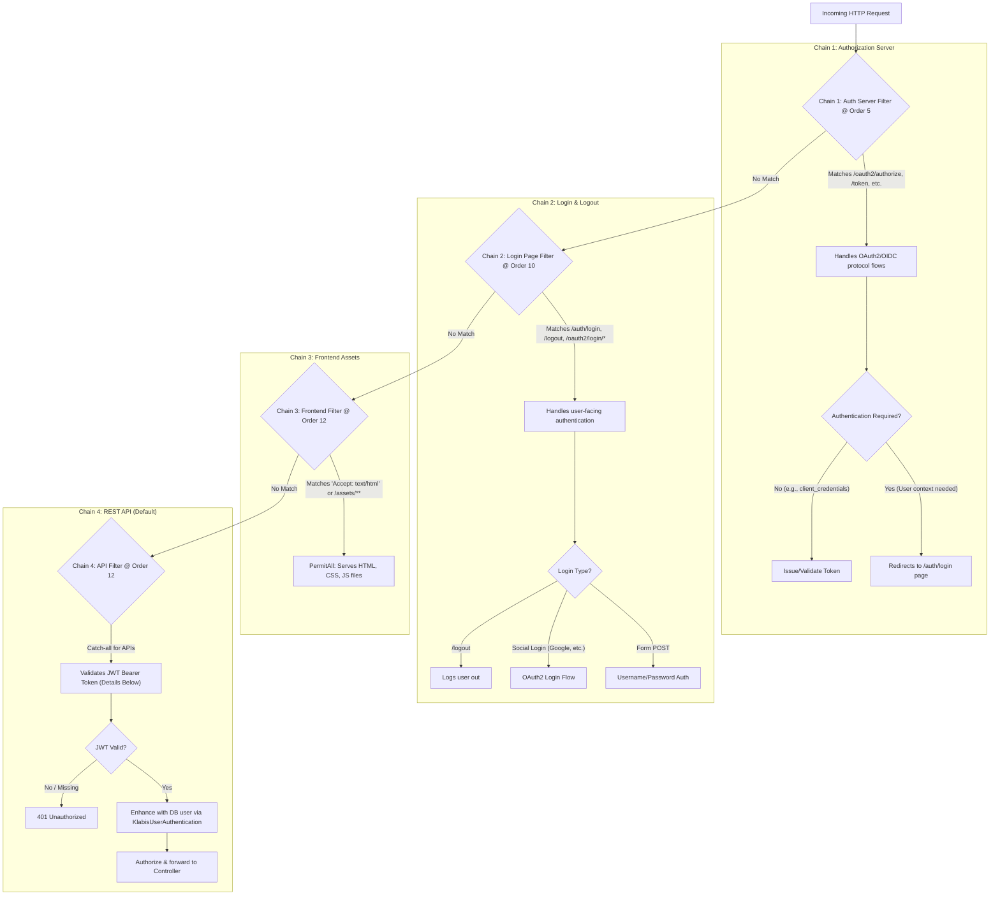

# Spring Security Filter Chains

This document describes the Spring Security filter chains for the Klabis backend, as configured across
`ApisConfiguration`, `AuthorizationServerConfiguration`, `LoginPageSecurityConfiguration`, and
`FrontendSecurityConfiguration`.

The backend uses a combination of security models:

* An **OAuth2 Authorization Server** for issuing tokens.
* A **stateless REST API** protected by JWTs (OAuth2 Resource Server).
* A traditional **session-based login form** for user authentication.
* An **unprotected path** for serving frontend assets.

The chains are executed in a specific order based on their `@Order` annotation. A request is handled by the *first*
chain that it matches.

## Security Chains Diagram

The following diagram illustrates how an incoming request is routed through the different security chains based on its
path and type.

## Chains Explanation

### Chain 1: `AuthorizationServerConfiguration` (Order: `HIGHEST_PRECEDENCE + 5`)

* **Purpose**: Handles the core OAuth2 and OIDC protocol endpoints.
* **Matcher**: Catches requests to `/oauth2/authorize`, `/oauth2/token`, `/userinfo`, `/.well-known/*`, etc.
* **Logic**: This chain is responsible for the machine-to-machine interactions of OAuth2. When a user's interactive
  login is required (e.g., for the authorization code flow), its exception handler redirects the browser to the custom
  login page (`/auth/login`), handing control over to the next filter chain.

### Chain 2: `LoginPageSecurityConfiguration` (Order: `HIGHEST_PRECEDENCE + 10`)

* **Purpose**: Manages the user-facing login and logout experience.
* **Matcher**: Catches requests for `/auth/login`, `/logout`, and social login callbacks like `/login/oauth2/code/*`.
* **Logic**: This chain enables two ways for users to authenticate:
    1. **`formLogin()`**: The standard username and password login form.
    2. **`oauth2Login()`**: Social logins (e.g., "Login with Google").
       It permits access to the login page itself and secures the other endpoints.

### Chain 3: `FrontendSecurityConfiguration` (Order: `HIGHEST_PRECEDENCE + 12`)

* **Purpose**: Serves the frontend single-page application (SPA).
* **Matcher**: Catches requests that are likely from a browser navigating the site, specifically those with an
  `Accept: text/html` header or requests for frontend assets like `/assets/**`.
* **Logic**: It simply permits all requests (`.anyRequest().permitAll()`), allowing the browser to download the HTML,
  CSS, and JavaScript that make up the application.

### Chain 4: `ApisConfiguration` (Order: `HIGHEST_PRECEDENCE + 12`)

* **Purpose**: The default chain that protects the backend REST API.
* **Matcher**: Acts as a catch-all. It does not have a specific matcher, so it handles any request not caught by the
  preceding, higher-priority chains.
* **Logic**: This is the stateless, token-based security model.
    1. **`BearerTokenAuthenticationFilter`**: Extracts and validates the JWT from the `Authorization` header.
    2. **`KlabisUserAuthentication Converter`**: After the JWT is validated, a custom converter fetches the application
       user from the database and populates the `SecurityContext` with a `KlabisUserAuthentication` object containing
       detailed grants.
    3. **`AuthorizationFilter`**: Ensures the request is authenticated.
    4. **Method Security**: Finer-grained access control is applied at the controller/service level using annotations
       like `@HasGrant`.
