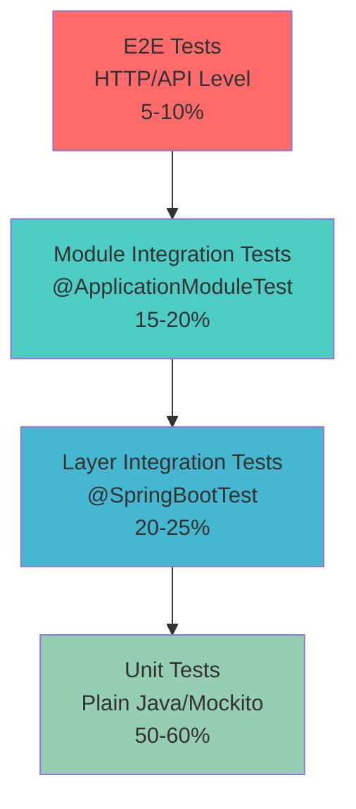
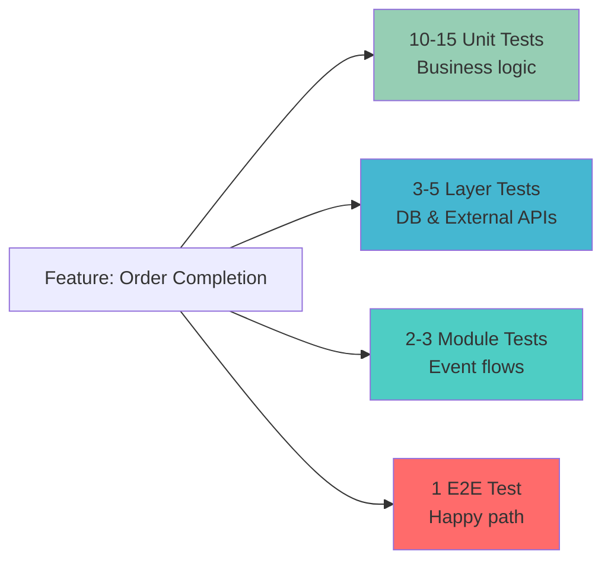
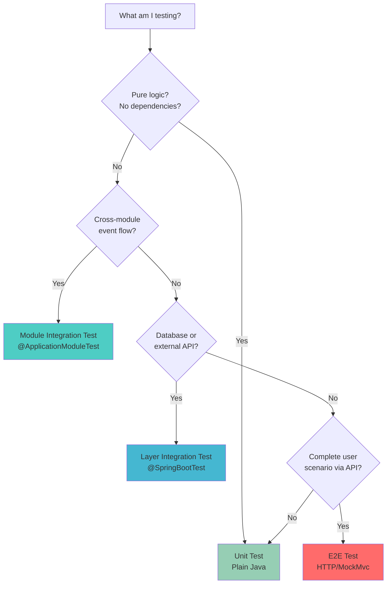

# Testing Pyramid for Spring Modulith Applications

This guide describes how to write maintainable tests following testing pyramid best practices in Spring Modulith applications. It integrates Spring Modulith's module testing capabilities with layer-based testing strategies.

## Testing Pyramid Overview



**Key Principle:** More tests at the bottom (fast, isolated), fewer at the top (slow, integrated).

## Test Types & When to Use

### 1. Unit Tests (50-60% of tests)
**Scope:** Single class, pure logic, no Spring context

**When to use:**
- Domain logic and business rules
- Value objects and entities
- Algorithms and calculations
- Validators and utilities
- Transformation logic

**Characteristics:**
- ✅ Milliseconds execution time
- ✅ No Spring context
- ✅ Mock all dependencies
- ✅ Test single responsibility

**Example:**
```java
// Domain logic unit test
class OrderTest {

    @Test
    void shouldCalculateTotalWithDiscount() {
        // given
        var order = new Order(OrderId.generate());
        order.addItem(new OrderItem("PROD-1", Money.of(100), 2));
        order.addItem(new OrderItem("PROD-2", Money.of(50), 1));

        // when
        order.applyDiscount(Discount.percentage(10));

        // then
        assertThat(order.total()).isEqualTo(Money.of(225)); // (200 + 50) * 0.9
    }

    @Test
    void shouldRejectNegativeDiscount() {
        // given
        var order = new Order(OrderId.generate());

        // when / then
        assertThatThrownBy(() -> order.applyDiscount(Discount.percentage(-10)))
            .isInstanceOf(IllegalArgumentException.class)
            .hasMessage("Discount percentage must be between 0 and 100");
    }
}
```

```java
// Service logic unit test (mocking dependencies)
class OrderManagementTest {

    OrderRepository orderRepository = mock(OrderRepository.class);
    ApplicationEventPublisher events = mock(ApplicationEventPublisher.class);

    OrderManagement orderManagement = new OrderManagement(orderRepository, events);

    @Test
    void shouldPublishEventWhenOrderCompleted() {
        // given
        var order = new Order(OrderId.of("ORD-123"));
        when(orderRepository.findById(order.getId())).thenReturn(Optional.of(order));

        // when
        orderManagement.complete(order.getId());

        // then
        verify(events).publishEvent(new OrderCompleted(order.getId()));
        verify(orderRepository).save(order);
        assertThat(order.status()).isEqualTo(OrderStatus.COMPLETED);
    }
}
```

**Best Practices:**
- No `@SpringBootTest` or `@ApplicationModuleTest`
- Use constructor injection for easy mocking
- Test behavior, not implementation
- One assertion theme per test
- Fast feedback (< 50ms per test)

---

### 2. Layer Integration Tests (20-25% of tests)
**Scope:** Test integration between architectural layers within a module

**When to use:**
- Database transactions and persistence
- Complex repository queries
- Security configurations
- External API integration (with WireMock)
- Cache behavior
- Transaction boundaries

**Characteristics:**
- ⚠️ Seconds execution time
- ⚠️ Full Spring context (`@SpringBootTest`)
- ⚠️ Real database (TestContainers)
- ⚠️ Mock only external systems

**Example:**
```java
// Repository integration test
@SpringBootTest
@Transactional
class OrderRepositoryIntegrationTest {

    @Autowired
    OrderRepository orderRepository;

    @Autowired
    EntityManager entityManager;

    @Test
    void shouldFindOrdersWithItemsInSingleQuery() {
        // given
        var order = new Order(OrderId.generate());
        order.addItem(new OrderItem("PROD-1", Money.of(100), 2));
        orderRepository.save(order);
        entityManager.flush();
        entityManager.clear(); // Clear persistence context

        // when
        var found = orderRepository.findByIdWithItems(order.getId());

        // then
        assertThat(found).isPresent();
        assertThat(found.get().items()).hasSize(1); // No N+1 query
    }

    @Test
    void shouldEnforceUniqueOrderNumber() {
        // given
        var order1 = new Order(OrderId.generate());
        order1.setOrderNumber("ORD-2024-001");
        orderRepository.save(order1);

        var order2 = new Order(OrderId.generate());
        order2.setOrderNumber("ORD-2024-001");

        // when / then
        assertThatThrownBy(() -> {
            orderRepository.save(order2);
            entityManager.flush();
        }).isInstanceOf(DataIntegrityViolationException.class);
    }
}
```

```java
// External API integration test (using Spring's MockRestServiceServer)
@SpringBootTest
class PaymentGatewayIntegrationTest {

    @Autowired
    PaymentGateway paymentGateway;

    @Autowired
    RestTemplate restTemplate;

    private MockRestServiceServer mockServer;

    @BeforeEach
    void setUp() {
        mockServer = MockRestServiceServer.bindTo(restTemplate).build();
    }

    @Test
    void shouldProcessPaymentSuccessfully() {
        // given
        mockServer.expect(requestTo("http://payment-api/payments"))
            .andExpect(method(POST))
            .andExpect(header("Content-Type", "application/json"))
            .andRespond(withSuccess(
                "{\"status\":\"SUCCESS\",\"transactionId\":\"TXN-123\"}",
                MediaType.APPLICATION_JSON
            ));

        // when
        var result = paymentGateway.charge(PaymentRequest.of(Money.of(100)));

        // then
        assertThat(result.isSuccess()).isTrue();
        assertThat(result.transactionId()).isEqualTo("TXN-123");
        mockServer.verify();
    }

    @Test
    void shouldHandlePaymentFailure() {
        // given
        mockServer.expect(requestTo("http://payment-api/payments"))
            .andExpect(method(POST))
            .andRespond(withServerError()
                .body("{\"error\":\"Service unavailable\"}")
                .contentType(MediaType.APPLICATION_JSON)
            );

        // when / then
        assertThatThrownBy(() -> paymentGateway.charge(PaymentRequest.of(Money.of(100))))
            .isInstanceOf(PaymentGatewayException.class)
            .hasMessageContaining("Payment processing failed");

        mockServer.verify();
    }
}
```

**Best Practices:**
- Use TestContainers for real database
- Use `@Transactional` for automatic rollback
- Mock only external systems (APIs, message brokers)
- Test database constraints and transactions
- Verify SQL query efficiency (N+1 problems)

---

### 3. Module Integration Tests (15-20% of tests)
**Scope:** Test module boundaries and inter-module communication

**When to use:**
- Event-driven communication between modules
- Module boundary verification
- Cross-module scenarios
- Event publication and consumption
- Module dependency validation

**Characteristics:**
- ⚡ Fast to moderate (subseconds)
- ⚡ Partial Spring context (`@ApplicationModuleTest`)
- ⚡ Bootstraps only tested module + dependencies
- ⚡ Real event infrastructure

**Example:**
```java
// Module isolation test
@ApplicationModuleTest(mode = BootstrapMode.STANDALONE)
class OrderModuleTest {

    @Autowired
    OrderManagement orderManagement;

    @MockitoBean
    PaymentGateway paymentGateway;  // External dependency

    @MockitoBean
    ApplicationEventPublisher events;  // Verify event publishing

    @Test
    void shouldPublishEventWhenOrderCompleted() {
        // given
        var order = createTestOrder();
        when(paymentGateway.charge(any())).thenReturn(PaymentResult.success());

        // when
        orderManagement.complete(order.getId());

        // then
        verify(events).publishEvent(argThat(event ->
            event instanceof OrderCompleted &&
            ((OrderCompleted) event).orderId().equals(order.getId())
        ));
    }
}
```

```java
// Event flow integration test
@ApplicationModuleTest
class OrderToInventoryEventFlowTest {

    @Autowired
    OrderManagement orderManagement;

    @Autowired
    InventoryRepository inventoryRepository;

    @Test
    void shouldReduceInventoryWhenOrderCompleted(Scenario scenario) {
        // given
        var productId = ProductId.of("PROD-1");
        var inventory = new Inventory(productId, 100);
        inventoryRepository.save(inventory);

        var order = createOrderWithProduct(productId, 10);

        // when
        scenario.publish(new OrderCompleted(order.getId()))
            .andWaitForEventOfType(InventoryReduced.class)
            .matching(event -> event.productId().equals(productId))
            .toArriveAndVerify(event -> {
                assertThat(event.quantity()).isEqualTo(10);
            });

        // then
        var updated = inventoryRepository.findById(productId).orElseThrow();
        assertThat(updated.quantity()).isEqualTo(90);
    }

    @Test
    void shouldHandleInventoryShortage(Scenario scenario) {
        // given
        var productId = ProductId.of("PROD-1");
        var inventory = new Inventory(productId, 5);
        inventoryRepository.save(inventory);

        var order = createOrderWithProduct(productId, 10);

        // when / then
        scenario.publish(new OrderCompleted(order.getId()))
            .andWaitForEventOfType(InventoryShortage.class)
            .matching(event -> event.productId().equals(productId))
            .toArriveAndVerify(event -> {
                assertThat(event.requested()).isEqualTo(10);
                assertThat(event.available()).isEqualTo(5);
            });
    }
}
```

```java
// Module verification test (mandatory!)
class ModuleStructureTest {

    ApplicationModules modules = ApplicationModules.of(Application.class);

    @Test
    void verifiesModuleStructure() {
        modules.verify();  // Fails if architectural violations found
    }

    @Test
    void documentModules() {
        modules.forEach(System.out::println);
    }
}
```

**Best Practices:**
- Always include module verification test
- Use `Scenario` API for event flow testing
- Test event handlers in isolation first (unit test)
- Use `BootstrapMode.STANDALONE` by default
- Mock only external (non-module) dependencies
- Test compensating transactions for failures

---

### 4. End-to-End Tests (5-10% of tests)
**Scope:** Complete user scenarios through HTTP API

**When to use:**
- Critical user journeys
- API contract validation
- Cross-cutting concerns (security, logging)
- Smoke tests for deployment
- User acceptance scenarios

**Characteristics:**
- ⏱️ Slowest (seconds per test)
- ⏱️ Full application context
- ⏱️ Real HTTP requests
- ⏱️ Minimal mocking

**Example (using IntelliJ HTTP files):**
```http
### Create Order E2E Test
POST {{baseUrl}}/api/orders
Content-Type: application/json
Authorization: Bearer {{userToken}}

{
  "customerId": "{{customerId}}",
  "items": [
    {
      "productId": "PROD-1",
      "quantity": 2
    }
  ]
}

> 

### Complete Order
POST {{baseUrl}}/api/orders/{{orderId}}/complete
Authorization: Bearer {{userToken}}

> 

### Verify Inventory Reduced
GET {{baseUrl}}/api/inventory/PROD-1
Authorization: Bearer {{adminToken}}

> 
```

**Example (using Spring MockMvc):**
```java
@SpringBootTest
@AutoConfigureMockMvc
class OrderApiE2ETest {

    @Autowired
    MockMvc mockMvc;

    @Autowired
    ObjectMapper objectMapper;

    @Autowired
    OrderRepository orderRepository;

    @Autowired
    InventoryRepository inventoryRepository;

    @Test
    @Transactional
    void shouldCompleteOrderAndUpdateInventory() throws Exception {
        // given - setup inventory
        var productId = "PROD-1";
        inventoryRepository.save(new Inventory(ProductId.of(productId), 100));

        // when - create order
        var createRequest = """
            {
              "customerId": "CUST-1",
              "items": [
                {
                  "productId": "%s",
                  "quantity": 10
                }
              ]
            }
            """.formatted(productId);

        var createResponse = mockMvc.perform(post("/api/orders")
                .contentType(MediaType.APPLICATION_JSON)
                .content(createRequest))
            .andExpect(status().isCreated())
            .andReturn();

        var orderId = JsonPath.read(
            createResponse.getResponse().getContentAsString(),
            "$.orderId"
        );

        // when - complete order
        mockMvc.perform(post("/api/orders/{orderId}/complete", orderId))
            .andExpect(status().isOk());

        // then - verify order status
        var order = orderRepository.findById(OrderId.of(orderId)).orElseThrow();
        assertThat(order.status()).isEqualTo(OrderStatus.COMPLETED);

        // then - verify inventory reduced (eventually)
        await().atMost(Duration.ofSeconds(5))
            .untilAsserted(() -> {
                var inventory = inventoryRepository.findById(ProductId.of(productId)).orElseThrow();
                assertThat(inventory.quantity()).isEqualTo(90);
            });
    }
}
```

**Best Practices:**
- Focus on critical user paths only
- Use `.http` files for user acceptance scenarios
- Use MockMvc for API contract testing
- Handle async operations with `await()`
- Keep E2E tests < 10% of total suite
- Run E2E tests in separate CI stage

---

## Test Distribution Strategy

### Recommended Distribution

| Test Type | Percentage | Count (for 1000 tests) | Execution Time |
|-----------|------------|------------------------|----------------|
| Unit Tests | 50-60% | 500-600 | < 30 seconds |
| Layer Integration | 20-25% | 200-250 | 1-2 minutes |
| Module Integration | 15-20% | 150-200 | 30-60 seconds |
| E2E Tests | 5-10% | 50-100 | 2-5 minutes |

**Total execution time target:** < 5 minutes for full suite

### Feature Coverage Strategy

For each feature, aim for this test distribution:



**Example breakdown for "Order Completion" feature:**

1. **Unit Tests (10-15 tests):**
    - Order state transitions
    - Discount calculations
    - Validation rules
    - Business rule enforcement
    - Edge cases and error conditions

2. **Layer Integration Tests (3-5 tests):**
    - Order persistence with items
    - Transaction rollback on payment failure
    - Payment gateway integration
    - Repository query optimization

3. **Module Integration Tests (2-3 tests):**
    - OrderCompleted event published
    - Inventory module receives and processes event
    - Event publication registry records event
    - Compensating transaction on inventory shortage

4. **E2E Test (1 test):**
    - Complete order flow from API to inventory update

---

## Maintainability Best Practices

### 1. Test Data Builders

**Problem:** Repetitive test data creation clutters tests.

**Solution:** Use test data builders.

```java
// Test data builder
class OrderTestBuilder {
    private OrderId id = OrderId.generate();
    private CustomerId customerId = CustomerId.of("CUST-1");
    private List<OrderItem> items = new ArrayList<>();
    private OrderStatus status = OrderStatus.PENDING;

    public static OrderTestBuilder anOrder() {
        return new OrderTestBuilder();
    }

    public OrderTestBuilder withId(OrderId id) {
        this.id = id;
        return this;
    }

    public OrderTestBuilder withCustomer(CustomerId customerId) {
        this.customerId = customerId;
        return this;
    }

    public OrderTestBuilder withItem(String productId, int quantity) {
        this.items.add(new OrderItem(productId, Money.of(100), quantity));
        return this;
    }

    public OrderTestBuilder completed() {
        this.status = OrderStatus.COMPLETED;
        return this;
    }

    public Order build() {
        var order = new Order(id, customerId);
        items.forEach(order::addItem);
        if (status == OrderStatus.COMPLETED) {
            order.complete();
        }
        return order;
    }
}

// Usage in tests
@Test
void shouldCalculateShipping() {
    var order = anOrder()
        .withCustomer(CustomerId.of("CUST-1"))
        .withItem("PROD-1", 2)
        .withItem("PROD-2", 1)
        .build();

    var shipping = shippingCalculator.calculate(order);

    assertThat(shipping).isEqualTo(Money.of(15));
}
```

### 2. Test Fixtures (for Integration Tests)

**Problem:** Integration tests need complex database state setup.

**Solution:** Use fixture classes with clear lifecycle.

```java
@Component
@TestComponent  // Spring 6.1+
class OrderFixtures {

    @Autowired
    OrderRepository orderRepository;

    @Autowired
    EntityManager entityManager;

    public Order createCompletedOrder(CustomerId customerId, String... productIds) {
        var order = new Order(OrderId.generate(), customerId);
        for (String productId : productIds) {
            order.addItem(new OrderItem(productId, Money.of(100), 1));
        }
        order.complete();

        var saved = orderRepository.save(order);
        entityManager.flush();
        return saved;
    }

    public void clearAll() {
        orderRepository.deleteAll();
        entityManager.flush();
    }
}

// Usage
@SpringBootTest
@Transactional
class OrderReportIntegrationTest {

    @Autowired
    OrderFixtures fixtures;

    @Autowired
    OrderReportService reportService;

    @Test
    void shouldGenerateMonthlyReport() {
        // given
        var customerId = CustomerId.of("CUST-1");
        fixtures.createCompletedOrder(customerId, "PROD-1", "PROD-2");
        fixtures.createCompletedOrder(customerId, "PROD-3");

        // when
        var report = reportService.generateMonthly(customerId, YearMonth.now());

        // then
        assertThat(report.totalOrders()).isEqualTo(2);
        assertThat(report.totalItems()).isEqualTo(3);
    }
}
```

### 3. Custom Assertions

**Problem:** Complex domain objects require verbose assertions.

**Solution:** Create custom AssertJ assertions.

```java
// Custom assertion
public class OrderAssert extends AbstractAssert<OrderAssert, Order> {

    private OrderAssert(Order order) {
        super(order, OrderAssert.class);
    }

    public static OrderAssert assertThat(Order actual) {
        return new OrderAssert(actual);
    }

    public OrderAssert isCompleted() {
        isNotNull();
        if (actual.status() != OrderStatus.COMPLETED) {
            failWithMessage("Expected order to be completed but was <%s>", actual.status());
        }
        return this;
    }

    public OrderAssert hasItems(int count) {
        isNotNull();
        if (actual.items().size() != count) {
            failWithMessage("Expected <%d> items but found <%d>", count, actual.items().size());
        }
        return this;
    }

    public OrderAssert hasTotal(Money expectedTotal) {
        isNotNull();
        if (!actual.total().equals(expectedTotal)) {
            failWithMessage("Expected total <%s> but was <%s>", expectedTotal, actual.total());
        }
        return this;
    }
}

// Usage
@Test
void shouldCompleteOrderWithCorrectTotal() {
    var order = orderManagement.complete(orderId);

    OrderAssert.assertThat(order)
        .isCompleted()
        .hasItems(3)
        .hasTotal(Money.of(350));
}
```

### 4. Parameterized Tests

**Problem:** Similar test scenarios with different inputs cause duplication.

**Solution:** Use `@ParameterizedTest`.

```java
@ParameterizedTest
@CsvSource({
    "0,     100,  100",
    "10,    100,  90",
    "50,    100,  50",
    "100,   100,  0"
})
void shouldApplyDiscountCorrectly(int discountPercent, int originalPrice, int expectedPrice) {
    var order = anOrder()
        .withItem("PROD-1", 1)
        .build();

    order.applyDiscount(Discount.percentage(discountPercent));

    assertThat(order.total()).isEqualTo(Money.of(expectedPrice));
}

@ParameterizedTest
@EnumSource(value = OrderStatus.class, names = {"PENDING", "PROCESSING"})
void shouldAllowCompletionOnlyFromValidStatuses(OrderStatus status) {
    var order = anOrder().withStatus(status).build();

    assertThatCode(() -> order.complete()).doesNotThrowAnyException();
}

@ParameterizedTest
@EnumSource(value = OrderStatus.class, names = {"COMPLETED", "CANCELLED", "REFUNDED"})
void shouldRejectCompletionFromFinalStatuses(OrderStatus status) {
    var order = anOrder().withStatus(status).build();

    assertThatThrownBy(() -> order.complete())
        .isInstanceOf(IllegalStateException.class)
        .hasMessageContaining("Cannot complete order in status " + status);
}
```

### 5. Test Naming Conventions

**Use consistent, descriptive names:**

```java
// ✅ GOOD: Describes what's being tested and expected outcome
@Test
void shouldPublishOrderCompletedEventWhenPaymentSucceeds() { }

@Test
void shouldThrowExceptionWhenDiscountExceeds100Percent() { }

@Test
void shouldReduceInventoryByOrderQuantity() { }

// ❌ BAD: Vague or implementation-focused
@Test
void testOrder() { }

@Test
void test1() { }

@Test
void whenCompleteMethodCalledThenEventPublished() { }  // Too verbose
```

**Pattern:** `should[ExpectedBehavior]When[Condition]`

### 6. Test Organization

**Group related tests using nested classes:**

```java
class OrderManagementTest {

    @Nested
    class OrderCreation {
        @Test
        void shouldCreateOrderWithItems() { }

        @Test
        void shouldRejectEmptyOrder() { }

        @Test
        void shouldRejectNegativeQuantity() { }
    }

    @Nested
    class OrderCompletion {
        @Test
        void shouldPublishEventWhenCompleted() { }

        @Test
        void shouldRejectCompletionWhenAlreadyCompleted() { }

        @Test
        void shouldRollbackOnPaymentFailure() { }
    }

    @Nested
    class DiscountApplication {
        @Test
        void shouldApplyPercentageDiscount() { }

        @Test
        void shouldApplyFixedAmountDiscount() { }

        @Test
        void shouldRejectNegativeDiscount() { }
    }
}
```

### 7. Avoid Test Interdependence

**Problem:** Tests fail when run in different order.

```java
// ❌ BAD: Tests share mutable state
class BadOrderTest {
    private static Order sharedOrder = new Order();  // Shared state!

    @Test
    void test1() {
        sharedOrder.addItem(...);
        assertThat(sharedOrder.items()).hasSize(1);
    }

    @Test
    void test2() {
        // Fails if test1 runs first!
        assertThat(sharedOrder.items()).isEmpty();
    }
}
```

```java
// ✅ GOOD: Each test is independent
class GoodOrderTest {

    @Test
    void shouldAddItemToNewOrder() {
        var order = new Order();  // Fresh instance

        order.addItem(...);

        assertThat(order.items()).hasSize(1);
    }

    @Test
    void shouldStartWithEmptyItems() {
        var order = new Order();  // Fresh instance

        assertThat(order.items()).isEmpty();
    }
}
```

### 8. Clear Test Phases (Given-When-Then)

**Use clear structure:**

```java
@Test
void shouldCalculateDiscountedTotal() {
    // given - setup test data
    var order = anOrder()
        .withItem("PROD-1", 2)
        .withItem("PROD-2", 1)
        .build();
    var discount = Discount.percentage(10);

    // when - execute the behavior
    order.applyDiscount(discount);

    // then - verify outcomes
    assertThat(order.total()).isEqualTo(Money.of(225));
    assertThat(order.discountApplied()).isTrue();
}
```

---

## Integration with Existing Skills

### Spring Modulith + Backend Tests Structure

Both skills complement each other:

| Aspect | Spring Modulith Skill | Backend Tests Structure Skill |
|--------|----------------------|------------------------------|
| **Focus** | Module boundaries & events | Layer integration within modules |
| **Scope** | Inter-module communication | Intra-module layer testing |
| **Test Type** | Module integration tests | Layer integration tests |
| **Context** | Partial (`@ApplicationModuleTest`) | Full (`@SpringBootTest`) |
| **When to Use** | Testing event flows between modules | Testing DB, security, external APIs |

**Combined approach example:**

```java
// Layer integration test (backend-tests-structure)
@SpringBootTest
@Transactional
class OrderPersistenceTest {
    @Autowired OrderRepository orderRepository;

    @Test
    void shouldPersistOrderWithItems() {
        // Test database layer
    }
}

// Module integration test (spring-modulith)
@ApplicationModuleTest
class OrderToInventoryFlowTest {
    @Test
    void shouldUpdateInventoryWhenOrderCompleted(Scenario scenario) {
        // Test cross-module event flow
    }
}

// Unit test (both skills agree)
class OrderTest {
    @Test
    void shouldCalculateTotal() {
        // Test domain logic
    }
}
```

---

## Testing Anti-Patterns to Avoid

### ❌ 1. Testing Implementation Details

```java
// ❌ BAD: Tests internal implementation
@Test
void shouldCallRepositorySaveMethod() {
    orderManagement.complete(orderId);

    verify(orderRepository).save(any());  // Testing how, not what
}

// ✅ GOOD: Tests observable behavior
@Test
void shouldPersistCompletedOrder() {
    orderManagement.complete(orderId);

    var order = orderRepository.findById(orderId).orElseThrow();
    assertThat(order.status()).isEqualTo(OrderStatus.COMPLETED);
}
```

### ❌ 2. Excessive Mocking

```java
// ❌ BAD: Mocking everything (not an integration test anymore)
@SpringBootTest
class OrderServiceTest {
    @MockBean OrderRepository orderRepository;
    @MockBean PaymentGateway paymentGateway;
    @MockBean InventoryService inventoryService;
    @MockBean NotificationService notificationService;
    // ... if everything is mocked, what are you testing?
}

// ✅ GOOD: Mock only external dependencies
@ApplicationModuleTest
class OrderServiceTest {
    @Autowired OrderRepository orderRepository;  // Real
    @MockBean PaymentGateway paymentGateway;     // External
    @Autowired InventoryService inventoryService; // Real (same module)
}
```

### ❌ 3. Ignoring Async Event Timing

```java
// ❌ BAD: Assumes immediate event processing
@Test
void shouldUpdateInventory() {
    orderManagement.complete(orderId);

    // Fails! Event processed asynchronously
    var inventory = inventoryRepository.findById(productId).orElseThrow();
    assertThat(inventory.quantity()).isEqualTo(90);
}

// ✅ GOOD: Use Scenario API or await()
@Test
void shouldUpdateInventory(Scenario scenario) {
    scenario.publish(new OrderCompleted(orderId))
        .andWaitForStateChange(() -> inventoryRepository.findById(productId))
        .andVerify(inventory -> {
            assertThat(inventory.quantity()).isEqualTo(90);
        });
}
```

### ❌ 4. Giant Setup Methods

```java
// ❌ BAD: Shared setup creates unnecessary dependencies
@BeforeEach
void setup() {
    // 50 lines of setup
    // Not all tests need all this data
}

// ✅ GOOD: Setup only what each test needs
@Test
void shouldApplyDiscount() {
    var order = anOrder().withItem("PROD-1", 1).build();  // Minimal setup

    order.applyDiscount(Discount.percentage(10));

    assertThat(order.total()).isEqualTo(Money.of(90));
}
```

### ❌ 5. Testing Multiple Concerns

```java
// ❌ BAD: One test doing too much
@Test
void shouldCompleteOrderAndUpdateInventoryAndSendEmailAndLogEvent() {
    // Tests 4 different concerns - hard to debug when fails
}

// ✅ GOOD: One concern per test
@Test
void shouldCompleteOrder() { /* ... */ }

@Test
void shouldUpdateInventoryWhenOrderCompleted() { /* ... */ }

@Test
void shouldSendConfirmationEmailWhenOrderCompleted() { /* ... */ }

@Test
void shouldLogEventWhenOrderCompleted() { /* ... */ }
```

---

## Quick Decision Tree



---

## Summary Checklist

### For Every Feature:
- ✅ 10-15 unit tests for business logic
- ✅ 3-5 layer integration tests for DB/APIs
- ✅ 2-3 module integration tests for events
- ✅ 1 E2E test for critical path
- ✅ Module verification test (if new module)

### For Maintainability:
- ✅ Use test data builders
- ✅ Create custom assertions for domain objects
- ✅ Follow consistent naming convention
- ✅ Keep tests independent (no shared state)
- ✅ Use parameterized tests for similar scenarios
- ✅ Clear given-when-then structure
- ✅ One assertion theme per test

### Performance Targets:
- ✅ Unit tests: < 50ms each
- ✅ Module integration: < 500ms each
- ✅ Layer integration: < 2s each
- ✅ E2E tests: < 5s each
- ✅ Full suite: < 5 minutes

---

## Further Reading

- **Testing Pyramid:** Martin Fowler's article on test distribution
- **Spring Modulith Testing:** Official documentation on `@ApplicationModuleTest`
- **Backend Tests Structure Skill:** Layer-based testing strategy
- **AssertJ Custom Assertions:** Creating fluent assertions
- **Test Containers:** Integration testing with real dependencies
