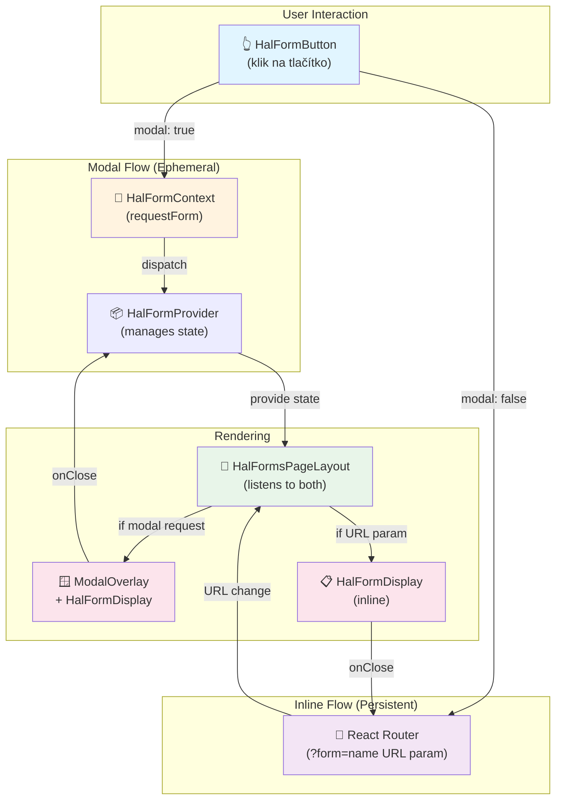

# HalNavigator2 - Komponenty pro customizované stránky

Tento dokument popisuje komponenty z `HalNavigator2` adresáře, které jsou určeny pro frontend vývojáře, kteří
implementují **customizované stránky bez GenericHalPage**.

## Obsah

1. [Architektura](#architektura)
2. [Úvod](#úvod)
3. [useHalRoute hook](#usehalroute-hook)
4. [Komponenty pro formuláře](#komponenty-pro-formuláře)
    - [HalFormButton](#1-halformbutton)
    - [HalFormsSection](#2-halformssection)
    - [HalFormsPageLayout](#3-halformspageLayout)
    - [HalFormContext + useHalForm](#4-halformcontext--usehalform-hook)
    - [HalFormDisplay](#5-halformdisplay)
    - [HalFormTemplateButton](#6-halformtemplatebutton)
5. [Komponenty pro navigaci](#komponenty-pro-navigaci)
6. [Komponenty pro tabulky](#komponenty-pro-tabulky)
7. [Praktické příklady](#praktické-příklady)
8. [Best practices](#best-practices)

---

## Architektura

HalNavigator2 používá **Context API + URL hybrid** přístup pro správu formulářů:

### Diagram - Tok formulářů



### Jak funguje

**1. Modal formuláře** (ephemeral, bez URL):

- `HalFormButton` s `modal={true}` volá `requestForm()` přes `HalFormContext`
- `HalFormProvider` udržuje stav `currentFormRequest`
- `HalFormsPageLayout` naslouchá kontextu a renderuje `ModalOverlay`
- Po zavření → stav se vymaže → žádný trace v URL

**2. Inline formuláře** (persistent, s URL):

- `HalFormButton` s `modal={false}` naviguje na `?form=templateName` (React Router)
- `HalFormsPageLayout` detekuje URL parametr
- Zobrazí `HalFormDisplay` inline místo `children`
- Po zavření → URL parametr se smaže → vrátí se k `children`

**3. Priorita** (když existují obě):

- Modal formulář se renderuje na top (má vyšší prioritu)
- Inline formulář je skrytý dokud se modal nezavře

---

## Úvod

HalNavigator2 poskytuje **nízkoúrovňové komponenty** pro práci s HAL (Hypertext Application Language) formuláři a linky
na **customizovaných stránkách**.

Na rozdíl od `GenericHalPage`, která automaticky generuje stránku z HAL metadat, customizované stránky mají svůj vlastní
layout a potřebují vybraným komponentám říci, která data zobrazit.

### Klíčová architektura

```
HalRouteProvider (v App.tsx)
  ↓
useHalRoute() - poskytuje resourceData
  ↓
HalFormButton, HalFormsSection, HalLinksSection - komponenty
```

---

## useHalRoute hook

Hook, který poskytuje aktuální HAL resource data a související metadata.

### Signatura

```typescript
const useHalRoute = (): HalRouteContextValue => { ...
}
```

### HalRouteContextValue interface

```typescript
interface HalRouteContextValue {
    /** Fetched HAL resource data from /api + pathname */
    resourceData: HalResponse | null;

    /** Loading state while fetching from API */
    isLoading: boolean;

    /** Error state if fetch failed */
    error: Error | null;

    /** Manual refetch function for updating data after form submissions */
    refetch: () => Promise<void>;

    /** Current pathname being displayed */
    pathname: string;

    /** React Query query state */
    queryState: 'idle' | 'pending' | 'success' | 'error';
}
```

### Použití

```typescript
import {useHalRoute} from '../contexts/HalRouteContext';

export const MyPage = () => {
    const {resourceData, isLoading, error, pathname, refetch} = useHalRoute();

    if (isLoading) return <Spinner / >;
    if (error) return <Alert severity = "error" > {error.message} < /Alert>;

    return (
        <div>
            {/* Tvůj obsah */}
        < /div>
    );
};
```

### Kdy volat `refetch()`

`refetch()` se automaticky volá v `HalFormDisplay` po úspěšném odeslání formuláře. **Ruční volání je potřeba, když:**

- Chceš načíst data z API po nějaké akcí (např. po kliknutí na tlačítko mimo formulář)
- Aktualizuješ data v rámci customizované logiky

```typescript
const handleManualRefresh = async () => {
    await refetch();
    // resourceData jsou nyní aktualizovaná
};
```

---

## Komponenty pro formuláře

### 1. HalFormButton

Tlačítko, které **deleguje zobrazení formuláře** na `HalFormsPageLayout`. Komponenta sama formulář nerendruje - jen
komunikuje s `HalFormsPageLayout` přes URL nebo Context API.

#### Props

```typescript
interface HalFormButtonProps {
    /** Název HAL Forms šablony (musí existovat v resourceData._templates) */
    name: string;

    /** Pokud true, otevře formulář v modálním okně. Pokud false, zobrazí formulář inline */
    modal?: boolean;

    /** Volitelné vlastní rozložení formuláře - ReactNode nebo callback (pouze v modal režimu) */
   customLayout?: ReactNode | RenderFormCallback;
}

type RenderFormCallback = (renderField: (fieldName: string) => ReactElement) => ReactElement;
```

#### Chování

- Automaticky zkontroluje, zda šablona existuje v `resourceData._templates[name]`
- Pokud neexistuje, komponenta vrátí `null` (tlačítko se nezobrazí)
- **Modal mode** (`modal={true}`):
    - Volá `requestForm()` z `HalFormContext`
    - Formulář se renderuje v `ModalOverlay` v `HalFormsPageLayout`
    - URL zůstává nezměněna (ephemeral state)
    - Při zavření → stav se vymaže
- **Non-modal mode** (`modal={false}`):
    - Naviguje na `?form=name` (React Router)
    - Formulář se renderuje inline v `HalFormsPageLayout`
    - URL je změněna pro persistenci (shareable, browser history compatible)
    - Při zavření → URL parametr se smaže

#### Architektura - Jak funguje

```
User clicks HalFormButton
    ↓
modal=true?
├─ YES → requestForm() via HalFormContext
│        ↓
│        HalFormProvider updates currentFormRequest
│        ↓
│        HalFormsPageLayout listens to context
│        ↓
│        Renders ModalOverlay + HalFormDisplay
│
└─ NO → navigate(`${pathname}?form=${name}`) via React Router
         ↓
         URL changes to include ?form parameter
         ↓
         HalFormsPageLayout detects URL change
         ↓
         Renders HalFormDisplay inline instead of children
```

**Důležité:** HalFormButton **sám nerendruje** Modal ani formulář. Jen komunikuje s `HalFormsPageLayout`!

#### Příklad

```typescript
import {HalFormButton} from '../components/HalNavigator2/HalFormButton';

export const MemberDetailsPage = () => {
    const {resourceData} = useHalRoute();

    return (
        <div>
            <h1>Detail
    člena < /h1>

    {/* Tlačítko se zobrazí POUZE pokud v _templates existuje "editMember" */
    }
    <HalFormButton name = "editMember"
    modal = {true}
    />

    {/* Formulář se zobrazí inline s query param ?form=updateAddress */
    }
    <HalFormButton name = "updateAddress"
    modal = {false}
    />
    < /div>
)
    ;
};
```

#### Jak funguje inline režim?

Když je `modal={false}` a uživatel klikne na tlačítko:

1. Komponenta přidá query parameter: `/members/123?form=editMember`
2. URL se změní, ale stránka se nezavírá
3. Formulář se musí zpracovat v `HalFormsPageLayout` nebo manuální logikou

Viz [HalFormsPageLayout](#halformspageLayout) pro automatické zpracování.

#### Vlastní rozložení formuláře (Custom Layout)

> ⚠️ Vlastní rozložení (`customLayout`) funguje **POUZE v modal režimu** (`modal={true}`).

Pokud chceš přizpůsobit rozložení formuláře, můžeš předat `customLayout` prop.
Existují dva způsoby:

##### 1. Children Pattern - struktura s `<HalFormsFormField>`

```tsx
import {HalFormButton} from '../components/HalNavigator2/HalFormButton';
import {HalFormsFormField} from '../components/HalFormsForm/HalFormsForm';

export const MemberDetailsPage = () => {
   return (
           <div>
              {/* Vlastní rozložení s strukturou */}
              <HalFormButton
                      name="editMember"
                      modal={true}
                      customLayout={
                         <div className="grid grid-cols-2 gap-4">
                            <div>
                               <h3>Osobní údaje</h3>
                               <HalFormsFormField fieldName="firstName"/>
                               <HalFormsFormField fieldName="lastName"/>
                            </div>
                            <div>
                               <h3>Kontakt</h3>
                               <HalFormsFormField fieldName="email"/>
                               <HalFormsFormField fieldName="phone"/>
                            </div>
                            <div className="col-span-2 flex gap-2 mt-4">
                               <HalFormsFormField fieldName="submit"/>
                               <HalFormsFormField fieldName="cancel"/>
                            </div>
                         </div>
                      }
              />
           </div>
   );
};
```

##### 2. Callback Pattern - s `renderField` funkcí

```tsx
<HalFormButton
        name="editMember"
        modal={true}
        customLayout={(renderField) => (
                <div className="space-y-4">
                   <section>
                      <h3 className="font-semibold mb-2">Osobní údaje</h3>
                      {renderField('firstName')}
                      {renderField('lastName')}
                   </section>
                   <section>
                      <h3 className="font-semibold mb-2">Kontakt</h3>
                      {renderField('email')}
                      {renderField('phone')}
                   </section>
                   <div className="flex gap-2 mt-6">
                      {renderField('submit')}
                      {renderField('cancel')}
                   </div>
                </div>
        )}
/>
```

**Poznámka:** Vlastní rozložení na `HalFormButton` fungují pouze v modal režimu (`modal={true}`). Pro inline formuláře (
`modal={false}`) použij místo toho `HalFormsPageLayout` s `customLayouts` prop (viz
sekce [HalFormsPageLayout](#halformspageLayout)).

**Performance tip:** Pokud předáváš `customLayout` jako inline funkci nebo JSX, může to způsobit zbytečné re-rendery
kvůli
změně reference. Pro optimální výkon definuj layout mimo render funkci:

```tsx
// ❌ Může způsobit zbytečné re-rendery
<HalFormButton
        name="edit"
        customLayout={(renderField) => <div>{renderField('name')}</div>}
/>

// ✅ Lepší - stabilní reference
const customLayout = (renderField) => <div>{renderField('name')}</div>;
<HalFormButton name="edit" customLayout={customLayout}/>

// ✅ Nebo použij useMemo pro složitější layouty
const customLayout = useMemo(
        () => (renderField) => <div>{renderField('name')}</div>,
        []
);
<HalFormButton name="edit" customLayout={customLayout}/>
```

---

### 2. HalFormsSection

Komponenta, která zobrazuje **všechny dostupné formuláře** jako tlačítka.
Automaticky čte z `resourceData._templates` když se `templates` neposkytnou.

#### Props

```typescript
interface HalFormsSectionProps {
    /** Objekt šablon z HAL resource data. Pokud se neposkytne, použije se resourceData._templates */
    templates?: Record<string, HalFormsTemplate>;

    /** Zda otevřít formuláře v modálním okně (default: true) nebo inline */
    modal?: boolean;

   /** Volitelná vlastní rozložení pro jednotlivé šablony */
   customLayouts?: Record<string, ReactNode | RenderFormCallback>;
}
```

#### Chování

- Automaticky používá `resourceData._templates` pokud se `templates` neposkytnou
- Filtruje `_templates` objekt a pro každou šablonu vytvoří `HalFormButton`
- Vrátí `null`, pokud nejsou žádné šablony k dispozici
- Ideální pro stránky, kde chceš zobrazit "všechny dostupné akce"

#### Příklady

**Příklad 1: Automatické - bez props (doporučeno)**

```typescript
import { HalFormsSection } from '../components/HalNavigator2/HalFormsSection';

export const CalendarPage = () => {
  return (
    <div>
      <h1>Kalendář</h1>
      {/* Automaticky čte z resourceData._templates a otevře v modálech */}
      <HalFormsSection />
    </div>
  );
};
```

**Příklad 2: Manuální - s custom šablonami a inline režimem**

```typescript
import { HalFormsSection } from '../components/HalNavigator2/HalFormsSection';

export const CustomPage = () => {
  const customTemplates = {
    create: { /* HAL Forms template */ },
    edit: { /* HAL Forms template */ },
  };

  return (
    <div>
      <h1>Custom formuláře</h1>
      {/* Zobrazí inline - bez modálů */}
      <HalFormsSection templates={customTemplates} modal={false} />
    </div>
  );
};
```

---

### 3. HalFormsPageLayout

Centrální wrapper komponenta pro stránky, která **orchestruje zobrazení formulářů** z obou zdrojů:

- **Modal formuláře** z `HalFormContext` (ephemeral)
- **Inline formuláře** z URL query parametrů (persistent)

#### Props

```typescript
interface HalFormsPageLayoutProps {
    children: ReactNode;

    /** Volitelná vlastní rozložení pro inline formuláře */
    customLayouts?: Record<string, ReactNode | RenderFormCallback>;
}
```

#### Chování

**Monitoruje tři věci:**

1. **URL query parametr** `?form=templateName`:
    - Pokud existuje a šablona je dostupná → zobrazí `HalFormDisplay` inline
    - Pokud neexistuje → zobrazí `children`

2. **HalFormContext** (modal request):
    - Pokud je `currentFormRequest` v kontextu → zobrazí `ModalOverlay` + `HalFormDisplay`
    - Renderuje se na top (vyšší priorita než inline formulář)

3. **Priorita** (když existují obě):
    - Modal formulář se renderuje v `ModalOverlay`
    - Inline formulář je skrytý
    - Když se modal zavře → inline formulář se opět zobrazí

**Post-submission:**

- Inline formuláře: Query parametr se automaticky smaže
- Modal formuláře: `closeForm()` se volá automaticky
- Zobrazí se `children` zpět

#### Příklad

```typescript
import {HalFormsPageLayout} from '../components/HalNavigator2/HalFormsPageLayout';
import {HalFormButton} from '../components/HalNavigator2/HalFormButton';

export const EventDetailsPage = () => {
    const {resourceData} = useHalRoute();

    return (
        <HalFormsPageLayout>
            <div>
                <h1>Detail
    akce < /h1>
    < p > Název
:
    {
        resourceData?.name
    }
    </p>

    {/* Tlačítko v non-modal režimu */
    }
    <HalFormButton name = "editEvent"
    modal = {false}
    />
    < /div>
    < /HalFormsPageLayout>
)
    ;
};
```

#### Co se stane?

1. Uživatel vidi detail event s tlačítkem "Upravit"
2. Klikne na `HalFormButton` s `modal={false}`
3. URL se změní na `/events/123?form=editEvent`
4. `HalFormsPageLayout` zjistí query parametr
5. Místo `children` se zobrazí `HalFormDisplay` s formulářem
6. Po odeslání → query parametr se smaže → zobrazí se `children` znovu

---

### 4. HalFormContext (+ useHalForm hook)

Context pro komunikaci mezi `HalFormButton` a `HalFormsPageLayout`. Spravuje stav **modal** formulářových požadavků.

#### Setup

Musíš zabalit tvou aplikaci do `HalFormProvider` (obvykle v `Layout.tsx` nebo `App.tsx`):

```typescript
import {HalFormProvider} from '../contexts/HalFormContext';

export const App = () => {
    return (
        <HalRouteProvider>
            <HalFormProvider>
                <HalFormsPageLayout>
                    <Routes>
                        {/* tvoje routes */}
        < /Routes>
        < /HalFormsPageLayout>
        < /HalFormProvider>
        < /HalRouteProvider>
    );
};
```

#### Hook - useHalForm()

```typescript
interface HalFormRequest {
    templateName: string;
    modal: boolean;
    customLayout?: ReactNode | RenderFormCallback;
}

interface HalFormContextValue {
    currentFormRequest: HalFormRequest | null;
    requestForm: (request: HalFormRequest) => void;
    closeForm: () => void;
}

const {currentFormRequest, requestForm, closeForm} = useHalForm();
```

#### Chování

- `currentFormRequest`: Aktuální požadavek na zobrazení modal formuláře (nebo `null`)
- `requestForm(request)`: Nastaví nový formulář k zobrazení
- `closeForm()`: Vymaže aktuální požadavek (zavře modal)

#### Příklad - Custom integration

Pokud chceš integrovat vlastní komponenty s modal formuláři:

```typescript
import {useHalForm} from '../contexts/HalFormContext';

export const MyCustomButton = ({templateName}) => {
    const {requestForm} = useHalForm();

    const handleClick = () => {
        requestForm({
            templateName,
            modal: true,
            customLayout: <MyCustomLayout / >
        });
    };

    return <button onClick = {handleClick} > Open
    Form < /button>;
};
```

> **Poznámka:** Normálně nebudeš potřebovat volat `useHalForm()` přímo - `HalFormButton` to dělá za tebe.

---

### 5. HalFormDisplay

Komponenta, která **skutečně vykresluje HAL Forms formulář**.

#### Props

```typescript
interface HalFormDisplayProps {
    /** HAL Forms šablona k zobrazení */
    template: HalFormsTemplate;

    /** Název šablony (fallback pro title) */
    templateName: string;

    /** Aktuální resource data */
    resourceData: Record<string, unknown>;

    /** Aktuální pathname */
    pathname: string;

    /** Callback když se má formulář zavřít */
    onClose: () => void;

    /** Optional callback po úspěšném odeslání */
    onSubmitSuccess?: () => void;

    /** Zobrazit tlačítko zavření (default: true) */
    showCloseButton?: boolean;
}
```

#### Chování

- Načítá form data z `template.target` URL (pokud existuje)
- Zobrazuje loading state během načítání
- Zobrazuje chyby, pokud se nepodaří načíst data
- Po odeslání automaticky volá `refetch()` aby se aktualizovala `resourceData`
- Volá `onClose()` po úspěšném odeslání

#### Kdy ji používat

Obvykle ji **nemusíš používat přímo** - je používaná v `HalFormButton` a `HalFormsPageLayout`.

Ale můžeš ji použít, pokud potřebuješ **zcela customizovaný formulářový workflow**:

```typescript
import {HalFormDisplay} from '../components/HalNavigator2/HalFormDisplay';

export const CustomFormWorkflow = () => {
    const {resourceData, pathname, refetch} = useHalRoute();
    const [showForm, setShowForm] = useState(false);

    if (!resourceData || !resourceData._templates?.customForm) {
        return null;
    }

    return (
        <>
            <button onClick = {()
=>
    setShowForm(true)
}>
    Zobrazit
    custom
    formulář
    < /button>

    {
        showForm && (
            <HalFormDisplay
                template = {resourceData._templates.customForm}
        templateName = "customForm"
        resourceData = {resourceData}
        pathname = {pathname}
        onClose = {()
    =>
        setShowForm(false)
    }
        onSubmitSuccess = {()
    =>
        {
            setShowForm(false);
            // Další custom logika
        }
    }
        showCloseButton = {true}
        />
    )
    }
    </>
)
    ;
};
```

---

### 6. HalFormTemplateButton

Čistě presentační komponenta - **tlačítko pro šablonu**.

#### Kdy ji používat

Téměř nikdy přímo. Je používaná interně v `HalFormButton` a `HalFormsSection`.

Tuto komponentu používej, pokud máš vlastní workflow a chceš:

```typescript
import {HalFormTemplateButton} from '../components/HalNavigator2/HalFormTemplateButton';

export const CustomFormsUI = () => {
    const {resourceData} = useHalRoute();

    return (
        <div className = "custom-layout" >
            {resourceData?._templates &&
            Object.entries(resourceData._templates).map(([name, template]) => (
                <HalFormTemplateButton
                    key = {name}
    template = {template}
    templateName = {name}
    onClick = {()
=>
    handleFormClick(name)
}
    className = "my-custom-class"
        / >
))
}
    </div>
)
    ;
};
```

---

## Komponenty pro navigaci

### 1. HalLinksSection

Komponenta, která zobrazuje **dostupné HAL linky** (akce, přechody).
Automaticky čte z `resourceData._links` když se `links` neposkytnou.
Automaticky naviguje přes React Router když se `onNavigate` neposkytne.

#### Props

```typescript
interface HalLinksSectionProps {
    /** Objekt linků z HAL resource data. Pokud se neposkytne, použije se resourceData._links */
    links?: Record<string, any>;

    /** Callback při kliknutí na link. Pokud se neposkytne, použije se useNavigate() */
    onNavigate?: (href: string) => void;
}
```

#### Chování

- Filtruje `self` linky (nezobrazuje je)
- Pro každý link vytvoří tlačítko
- Pokud je link pole, vytvoří tlačítko pro každý prvek
- Automaticky používá `resourceData._links` pokud se `links` neposkytnou
- Automaticky naviguje přes React Router pokud se `onNavigate` neposkytne
- Manuálně volá `onNavigate` s `href` když se poskytne a uživatel klikne

#### Příklady

**Příklad 1: Automatické - bez props (doporučeno)**

```typescript
import {HalLinksSection} from '../components/HalNavigator2/HalLinksSection';

export const MemberDetailsPage = () => {
   return (
           <div>
                   <h1>Detail
   člena < /h1>
   {/* Automaticky čte z resourceData._links a naviguje přes React Router */
   }
   <HalLinksSection / >
   </div>
)
   ;
};
```

**Příklad 2: Manuální - s custom linky a handlerem**

```typescript
import {HalLinksSection} from '../components/HalNavigator2/HalLinksSection';
import {extractNavigationPath} from '../utils/navigationPath';
import {useNavigate} from 'react-router-dom';

export const CustomPage = () => {
   const navigate = useNavigate();

   const customLinks = {
      edit: {href: '/edit', title: 'Upravit'},
      delete: {href: '/delete'},
   };

   const handleNavigate = (href: string) => {
      const path = extractNavigationPath(href);
      navigate(path);
   };

   return (
           <div>
                   <h1>Custom
   stránka < /h1>
   < HalLinksSection
   links = {customLinks}
   onNavigate = {handleNavigate}
   />
   < /div>
)
   ;
};
```

#### Co se zobrazí?

Pokud má resource tyto linky:

```json
{
  "_links": {
    "edit": {
      "href": "/members/123/edit",
      "title": "Edit Member"
    },
    "delete": {
      "href": "/members/123/delete"
    },
    "self": {
      "href": "/members/123"
    }
  }
}
```

`HalLinksSection` vytvoří dvě tlačítka:

- "Edit Member" (z `title`)
- "delete" (název linku)

---

## Komponenty pro tabulky

### 1. HalEmbeddedTable

Komponenta pro zobrazení HAL `_embedded` kolekce v tabulkovém formátu s automatickou paginací a řazením.

#### Props

```typescript
interface HalEmbeddedTableProps<T = any> {
  /** Jméno kolekce v _embedded objektu */
  collectionName: string;

  /** Callback když uživatel klikne na řádek */
  onRowClick?: (item: T) => void;

  /** Sloupec pro default řazení */
  defaultOrderBy?: string;

  /** Směr řazení (asc/desc) */
  defaultOrderDirection?: SortDirection;

  /** Zpráva když nejsou data */
  emptyMessage?: string;

  /** Definice sloupců (TableCell komponenty) */
  children: React.ReactNode;
}
```

#### Chování

- Automaticky načítá data z self linku aktuálního HAL resource
- Používá `useAuthorizedQuery` pro data fetching s React Query caching
- Zobrazuje páginaci s automatickými query parametry (`page`, `size`)
- Podporuje řazení sloupců (prostřednictvím `sort` query parametru)
- Volá `onRowClick` callback když uživatel klikne na řádek
- Zobrazuje custom zprávu když nejsou data
- Automaticky extrahuje data z `_embedded[collectionName]`

#### Architektura

`HalEmbeddedTable` používá `KlabisTableWithQuery` (data loading wrapper) a `KlabisTable` (pure UI component):

```
HalEmbeddedTable
├─ Extrahuje self link z resourceData
└─ Renderuje KlabisTableWithQuery
   ├─ Fetch data z API (useAuthorizedQuery)
   ├─ Manages pagination/sort state
   └─ Renderuje KlabisTable (pure UI)
      ├─ Displays table rows
      ├─ Handles user interactions
      └─ Shows loading/error states
```

#### Příklad

```typescript
import {HalEmbeddedTable} from '../components/HalNavigator2/HalEmbeddedTable';
import {TableCell} from '../components/KlabisTable';
import {useNavigate} from 'react-router-dom';

interface Member {
   id: number;
   firstName: string;
   lastName: string;
   registrationNumber: string;
}

export const MembersPage = () => {
   const navigate = useNavigate();

   const handleRowClick = (member: Member) => {
      navigate(`/members/${member.id}`);
   };

   return (
           <div>
                   <h1>Adresář
   členů < /h1>

   < HalEmbeddedTable<Member>
   collectionName = "membersApiResponseList"
   defaultOrderBy = "lastName"
   defaultOrderDirection = "asc"
   onRowClick = {handleRowClick}
   >
   <TableCell column = "firstName"
   sortable > Jméno < /TableCell>
   < TableCell
   column = "lastName"
   sortable > Příjmení < /TableCell>
   < TableCell
   column = "registrationNumber" > Reg.číslo < /TableCell>
           < /HalEmbeddedTable>
           < /div>
)
   ;
};
```

#### Jak funguje

1. Hook `useHalRoute()` si vezme aktuální `resourceData`
2. `HalEmbeddedTable` extrahuje `self` link z `resourceData._links`
3. Předá link do `KlabisTableWithQuery` s `collectionName`
4. `KlabisTableWithQuery` si vezme starosti o:
   - Data fetching z API (useAuthorizedQuery)
   - Pagination state management
   - Sort state management
   - Query parameter building (`page`, `size`, `sort`)
5. `KlabisTable` (pure UI) renderuje tabulku s daty

#### Kdy ji používat

- Potřebuješ zobrazit libovolnou `_embedded` kolekci
- Chceš páginaci a řazení
- Máš custom layout (ne `GenericHalPage`)

Příklady:

- `membersApiResponseList` → seznam členů
- `calendarItems` → seznam kalendářních položek
- `eventList` → seznam akcí
- `anyOtherCollection` → jakákoli jiná kolekce

#### Poznámka: Pure UI Component

Pokud potřebuješ tabulku bez automatického data fetchingu, můžeš použít `KlabisTable` přímo:

```typescript
import {KlabisTable} from '../components/KlabisTable';

// Spravuješ data a state sám
<KlabisTable
   data={myData}
   page={pageInfo}
   error={error}
   onSortChange={(col, dir) => handleSort(col, dir)}
   onPageChange={(newPage) => handlePageChange(newPage)}
/>
```

---

## Praktické příklady

### Příklad 1: Customizovaná stránka s detail view + formuláře

```typescript
import {useHalRoute} from '../contexts/HalRouteContext';
import {HalFormsSection} from '../components/HalNavigator2/HalFormsSection';
import {HalLinksSection} from '../components/HalNavigator2/HalLinksSection';
import {useNavigate} from 'react-router-dom';
import {extractNavigationPath} from '../utils/navigationPath';

export const CalendarEventPage = () => {
    const {resourceData, isLoading, error} = useHalRoute();
    const navigate = useNavigate();

    if (isLoading) return <Spinner / >;
    if (error) return <Alert severity = "error" > {error.message} < /Alert>;
    if (!resourceData) return <Alert severity = "warning" > Žádná
    data < /Alert>;

    const event = resourceData as any;

    return (
        <div className = "space-y-6" >
            {/* Hlavní obsah */}
            < div >
            <h1>{event.title} < /h1>
            < p > Datum
:
    {
        event.startDate
    }
    </p>
    < p > Popis
:
    {
        event.description
    }
    </p>
    < /div>

    {/* Formuláře */
    }
    <HalFormsSection templates = {resourceData._templates}
    modal = {true}
    />

    {/* Navigační linky */
    }
    <HalLinksSection
        links = {resourceData._links}
    onNavigate = {(href)
=>
    navigate(extractNavigationPath(href))
}
    />
    < /div>
)
    ;
};
```

---

### Příklad 2: Inline formulář v customize stránce

```typescript
import {HalFormsPageLayout} from '../components/HalNavigator2/HalFormsPageLayout';
import {HalFormButton} from '../components/HalNavigator2/HalFormButton';
import {useHalRoute} from '../contexts/HalRouteContext';

export const EventEditablePage = () => {
    const {resourceData} = useHalRoute();
    const event = resourceData as any;

    return (
        <HalFormsPageLayout>
            <div className = "space-y-4" >
            <div>
                <h1>{event.title} < /h1>
            < p > {event.description} < /p>
            < /div>

    {/* Inline formulář - Query param se přidá sem */
    }
    <HalFormButton name = "updateEvent"
    modal = {false}
    />
    < /div>
    < /HalFormsPageLayout>
)
    ;
};
```

Co se stane:

1. Uživatel vidí detail + tlačítko "Upravit"
2. Klikne na tlačítko
3. URL se změní na `?form=updateEvent`
4. `HalFormsPageLayout` zobrazí formulář místo `children`
5. Po odeslání → formulář zmizí → vrátí se k detail view

---

### Příklad 3: Kombinace - Inline + Modal formuláře

```typescript
import {HalFormsPageLayout} from '../components/HalNavigator2/HalFormsPageLayout';
import {HalFormButton} from '../components/HalNavigator2/HalFormButton';
import {HalFormsSection} from '../components/HalNavigator2/HalFormsSection';
import {useHalRoute} from '../contexts/HalRouteContext';

export const MemberDetailPage = () => {
    const {resourceData} = useHalRoute();

    return (
        <HalFormsPageLayout>
            <div className = "space-y-6" >
            <div>
                <h1>{resourceData?.firstName
}
    {
        resourceData?.lastName
    }
    </h1>
    < p > ID
:
    {
        resourceData?.id
    }
    </p>
    < /div>

    {/* Jen "Edit" v inline režimu */
    }
    <HalFormButton name = "editProfile"
    modal = {false}
    />

    {/* Ostatní formuláře v modálech */
    }
    <HalFormsSection
        templates = {resourceData?._templates
}
    modal = {true}
    />
    < /div>
    < /HalFormsPageLayout>
)
    ;
};
```

---

## Best practices

### ✅ DO - Dělej takhle

1. **Vždy zkontroluj `isLoading` a `error`**
   ```typescript
   const { resourceData, isLoading, error } = useHalRoute();

   if (isLoading) return <Spinner />;
   if (error) return <Alert severity="error">{error.message}</Alert>;
   ```

2. **Používej `HalFormsPageLayout` pro inline formuláře**
    - Automaticky zpracovává query parametry
    - Clean UI transitions

3. **Kombinuj `HalFormsSection` + `HalLinksSection` pro komplexní stránky**
   ```typescript
   <HalFormsSection templates={_templates} modal={true} />
   <HalLinksSection links={_links} onNavigate={handleNav} />
   ```

4. **Volej `refetch()` když potřebuješ ručně aktualizovat data**
   ```typescript
   await refetch();
   ```

5. **Používej `useNavigate` + `extractNavigationPath` pro HAL linky**
   ```typescript
   const navigate = useNavigate();
   const handleLink = (href: string) => {
     navigate(extractNavigationPath(href));
   };
   ```

---

### ❌ DON'T - Nedělej takhle

1. **Nepoužívaj `HalFormDisplay` přímo** - pokud to není nutné
    - Použij `HalFormButton` nebo `HalFormsPageLayout`

2. **Nezapomeň na `HalRouteProvider` v App.tsx**
    - Bez něj `useHalRoute()` vrátí error!

3. **Neobjevuj query parametry ručně**
    - Nech `HalFormsPageLayout` aby je řídil

4. **Nepreskakuj error handling**
   ```typescript
   // ❌ BAD
   const { resourceData } = useHalRoute();
   return <div>{resourceData.field}</div>; // Crash!

   // ✅ GOOD
   const { resourceData, isLoading, error } = useHalRoute();
   if (isLoading) return <Spinner />;
   if (error) return <Alert />;
   return <div>{resourceData?.field}</div>;
   ```

5. **Nepoužívaj hardcoded HAL linky**
    - Vždy jdi přes `resourceData._links`

---

## Shrnutí komponent

| Komponenta           | Účel                                      | Použití                      |
|----------------------|-------------------------------------------|------------------------------|
| `useHalRoute`        | Přístup k HAL datům a metadata            | Vždy v komponentách          |
| `useHalForm`         | Komunikace s modal formuláři (context)    | V HalFormButton + PageLayout |
| `HalFormButton`      | Tlačítko - deleguje do HalFormsPageLayout | Modal nebo inline            |
| `HalFormsSection`    | Všechny dostupné formuláře jako tlačítka  | Modal (všechny najednou)     |
| `HalFormsPageLayout` | Orchestrace modal + inline formulářů      | Wrapper kolem children       |
| `HalFormDisplay`     | Renderování formuláře                     | Custom workflow (vzácně)     |
| `HalLinksSection`    | Zobrazení dostupných akcí (HAL linky)     | Navigační akce               |
| `HalEmbeddedTable`   | Tabulka z `_embedded` kolekce             | Páginace + řazení            |

---

## Viz také

**Projekty:**

- `/frontend-2/src/contexts/HalRouteContext.tsx` - HalRoute context pro HAL data
- `/frontend-2/src/contexts/HalFormContext.tsx` - HalForm context pro modal formuláře
- `/frontend-2/src/components/HalNavigator2/` - Všechny komponenty
- `/frontend-2/src/pages/MemberDetailsPage.tsx` - Real-world example
- `/frontend-2/src/pages/CalendarPage.tsx` - Real-world example

**Specifikace:**

- [HAL specification](https://tools.ietf.org/html/draft-kelly-json-hal)
- [HAL Forms specification](http://mamund.com/hal-forms/)
