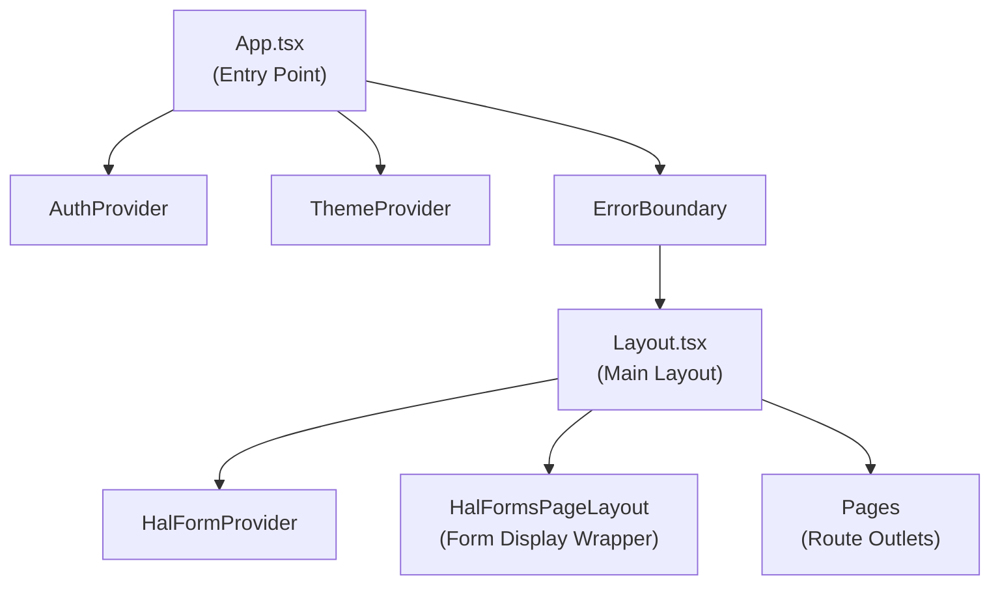
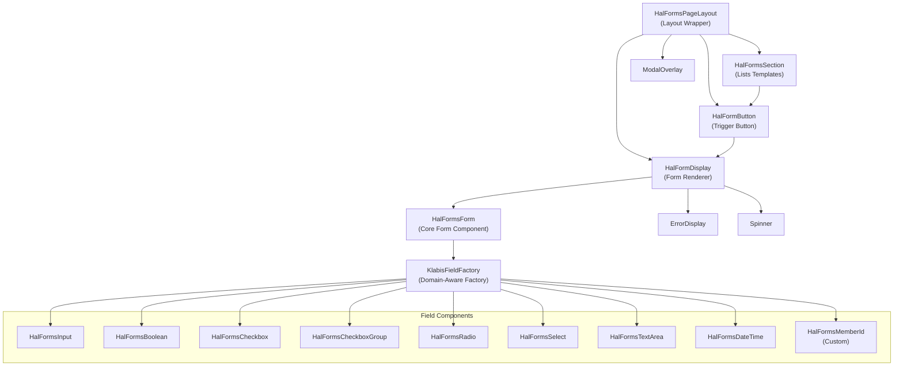
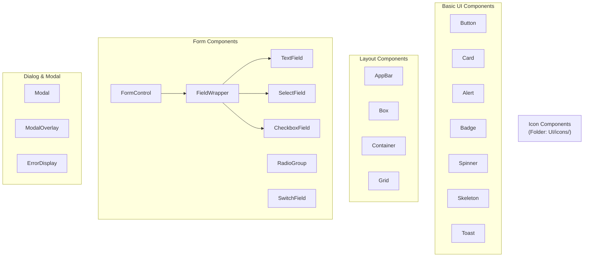
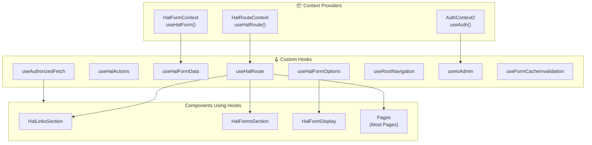
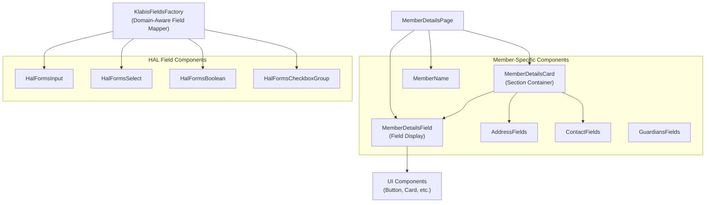
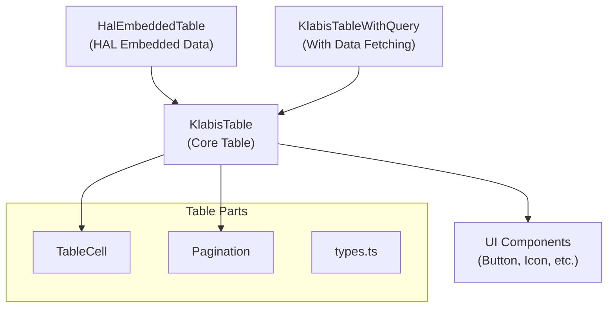
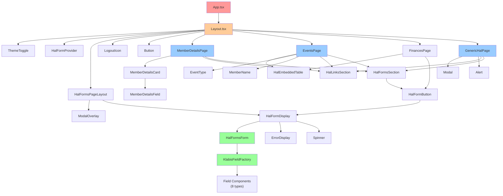
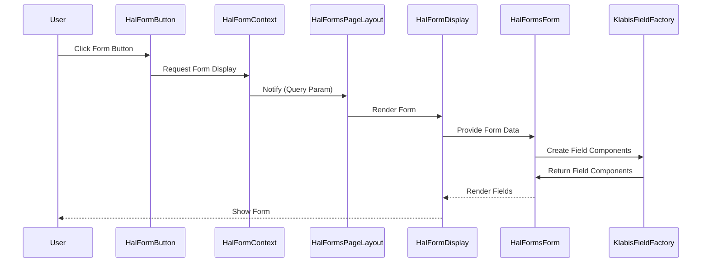
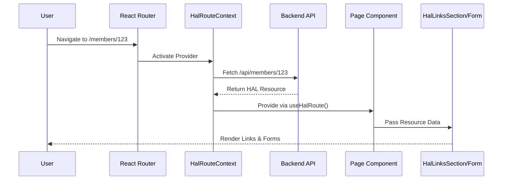

# Frontend Component Dependency Graph

This document visualizes the dependency relationships between pages and UI components in the frontend application.

---

## 1. High-Level Application Structure



---

## 2. Pages and Their Direct Component Dependencies

```mermaid
graph TD
    subgraph Pages["📄 Pages"]
        HomePage["HomePage"]
        MemberDetails["MemberDetailsPage"]
        MembersPage["MembersPage"]
        CalendarPage["CalendarPage"]
        EventsPage["EventsPage"]
        FinancesPage["FinancesPage"]
        GenericHal["GenericHalPage"]
        SandPlace["HalNavigatorPage"]
        NotFound["NotFoundPage"]
    end

    subgraph HALComponents["🔄 HAL Navigator Components"]
        HalFormDisplay["HalFormDisplay"]
        HalFormsSection["HalFormsSection"]
        HalLinksSection["HalLinksSection"]
        HalEmbeddedTable["HalEmbeddedTable"]
        HalFormButton["HalFormButton"]
    end

    subgraph UIComponents["🎨 UI Components"]
        Button["Button"]
        Card["Card"]
        Alert["Alert"]
        Modal["Modal"]
        Spinner["Spinner"]
        Badge["Badge"]
        ErrorDisplay["ErrorDisplay"]
    end

    subgraph DomainComponents["🏛️ Domain Components"]
        MemberDetailsCard["MemberDetailsCard"]
        MemberDetailsField["MemberDetailsField"]
        MemberName["MemberName"]
        EventType["EventType"]
        AddressFields["AddressFields"]
        ContactFields["ContactFields"]
    end

    MemberDetails --> MemberDetailsCard
    MemberDetails --> MemberDetailsField
    MemberDetails --> HalLinksSection
    MemberDetails --> HalFormsSection
    EventsPage --> HalEmbeddedTable
    EventsPage --> EventType
    EventsPage --> MemberName
    EventsPage --> HalLinksSection
    EventsPage --> HalFormsSection
    FinancesPage --> HalEmbeddedTable
    FinancesPage --> HalFormButton
    FinancesPage --> Spinner
    CalendarPage --> HalLinksSection
    CalendarPage --> HalFormsSection
    GenericHal --> HalLinksSection
    GenericHal --> HalFormsSection
    GenericHal --> Modal
    GenericHal --> Alert
    GenericHal --> Spinner
    SandPlace --> HalFormDisplay
```



---

## 3. HAL Forms Component Hierarchy



---

## 4. UI Component Library Dependencies



---

## 5. Context & State Management Dependencies



---

## 6. Member Domain Components Hierarchy



---

## 7. Table Components Hierarchy



---

## 8. Complete Component Dependency Tree (Flattened)



---

## 9. Data Flow: How Forms Work



---

## 10. Data Flow: Route Navigation



---

## 11. Component Reusability Matrix

| Component             | Used In                                                 | Times | Reusability |
|-----------------------|---------------------------------------------------------|-------|-------------|
| **HalFormsSection**   | MemberDetails, CalendarPage, EventsPage, GenericHalPage | 4+    | ⭐⭐⭐⭐⭐       |
| **HalLinksSection**   | MemberDetails, CalendarPage, EventsPage, GenericHalPage | 4+    | ⭐⭐⭐⭐⭐       |
| **HalEmbeddedTable**  | EventsPage, FinancesPage                                | 2+    | ⭐⭐⭐⭐        |
| **HalFormDisplay**    | HalFormsPageLayout, HalNavigatorPage                    | 2+    | ⭐⭐⭐⭐        |
| **Button**            | Layout, Pages, Forms, Tables                            | 10+   | ⭐⭐⭐⭐⭐       |
| **Spinner**           | HalFormDisplay, Multiple Pages                          | 5+    | ⭐⭐⭐⭐⭐       |
| **Modal**             | GenericHalPage, HalFormsPageLayout                      | 2+    | ⭐⭐⭐⭐        |
| **Card**              | MemberDetailsCard, Pages                                | 3+    | ⭐⭐⭐⭐        |
| **MemberDetailsCard** | MemberDetailsPage                                       | 1     | ⭐⭐          |
| **EventType**         | EventsPage                                              | 1     | ⭐⭐          |

---

## 12. Import Dependency Statistics

### UI Component Library

- **21+ UI components** in `/src/components/UI/`
- **8+ Icon components** in `/src/components/UI/icons/`
- **20+ Form field components** in UI and HAL Forms

### HAL Navigator Components

- **9 core HAL components** (display, forms, sections)
- **8 field type components** (input, select, boolean, etc.)
- **2 utility files** (types, utils)

### Domain-Specific Components

- **6 member components** (details, fields, name)
- **5 table components** (core, query, cell, pagination)
- **1 event component** (event type)

### Contexts & Hooks

- **3 context providers**
- **8 custom hooks**

### Pages

- **9 main pages**
- **1 layout wrapper** (applies to all pages)

---

## 13. Code Organization Best Practices

### Current Structure ✅

```
frontend/src/
├── components/
│   ├── HalNavigator2/          # HAL protocol implementation
│   │   ├── halforms/           # Form components & fields
│   │   └── *.tsx               # Display components
│   ├── UI/                      # Reusable UI library
│   │   ├── forms/              # Form input components
│   │   ├── layout/             # Layout components
│   │   ├── icons/              # Icon components
│   │   └── *.tsx               # Basic components
│   ├── members/                # Domain: Member
│   ├── events/                 # Domain: Events
│   ├── KlabisTable/            # Domain: Tables
│   ├── ThemeToggle/            # Theme toggle
│   ├── KlabisFieldsFactory.tsx # Domain field mapper
│   ├── JsonPreview.tsx         # Dev utility
│   └── ErrorFallback.tsx       # Error boundary
├── contexts/                    # State management
├── hooks/                       # Custom hooks
├── pages/                       # Page routes
└── styles/                      # Global styles
```

### Key Insights 💡

1. **Separation of Concerns**: UI, HAL, and Domain components are clearly separated
2. **Reusable Patterns**: HalLinksSection and HalFormsSection used across multiple pages
3. **Factory Pattern**: KlabisFieldsFactory extends HAL Forms with domain knowledge
4. **Context-Driven**: Most pages use useHalRoute() for automatic data fetching
5. **Composability**: Small, focused components compose into larger features

---

## 14. Dependency Summary

### Most Connected Components (Hub Nodes)

1. **HalFormsPageLayout** - Used by all pages for form display
2. **HalLinksSection** - Used by 4+ pages for link display
3. **HalFormsSection** - Used by 4+ pages for form listings
4. **Button** - Used by 10+ components
5. **Spinner** - Used by 5+ components

### Deepest Dependency Chains

- **Layout → HalFormsPageLayout → HalFormDisplay → HalFormsForm → KlabisFieldFactory → 8 Field Types** (6 levels)
- **MemberDetailsPage → MemberDetailsCard → MemberDetailsField → UI Components** (4 levels)
- **EventsPage → HalEmbeddedTable → KlabisTable → TableCell → UI Components** (5 levels)

### Most Isolated Components

- **JsonPreview** - Dev/debug only
- **NotFoundPage** - Standalone page
- **ThemeToggle** - Single purpose

---

## 15. Future Optimization Opportunities

### Completed Refactoring ✅

1. **`useHalPageData` hook** - Implemented in `src/hooks/useHalPageData.ts`. Consolidates route + actions + admin checks
   into a single hook API with helper methods. Used by GenericHalPage.

### Potential Refactoring 🔧

1. Extract common page patterns into a `usePageLayout` hook
2. Consolidate form/link/table display into a `HalResource` display component
3. Create reusable "detail card" pattern for other domains (Events, Finance, etc.)

### Performance Monitoring 📊

1. Monitor re-renders of HalFormsPageLayout (high-traffic component)
2. Optimize field factory to memoize field components
3. Consider virtualization for large HalEmbeddedTable instances
4. Cache HAL resource responses at context level

---

**Generated on 2025-12-31**
**For questions about architecture, see the [Developers Guide](../developers.md)**
