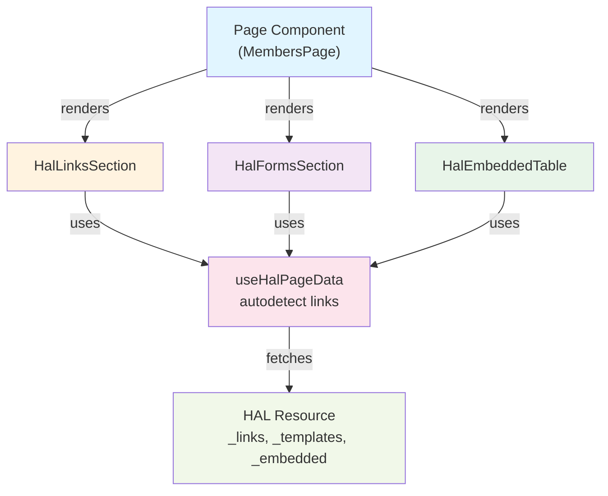
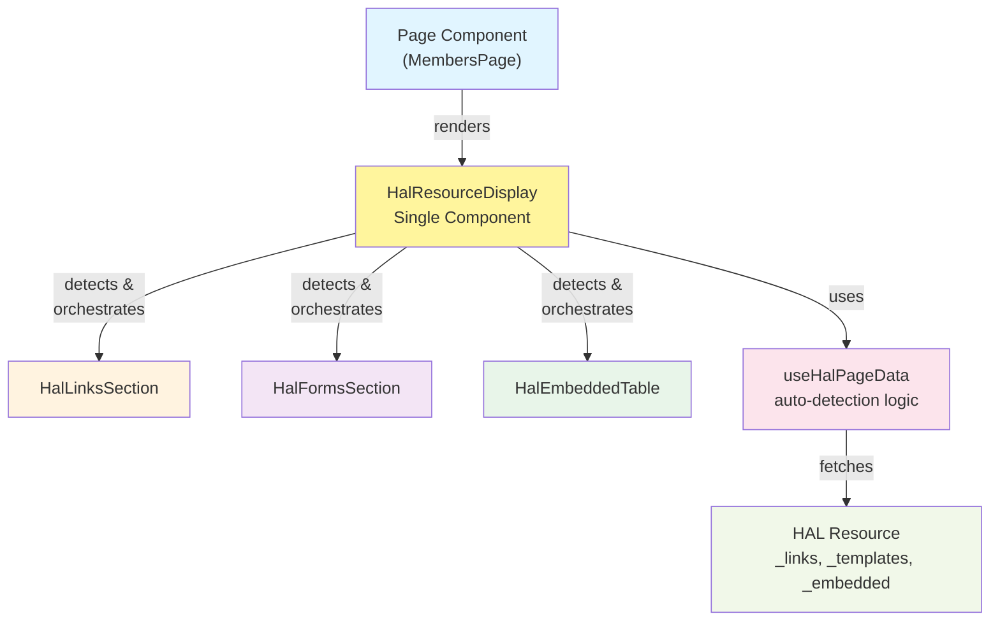
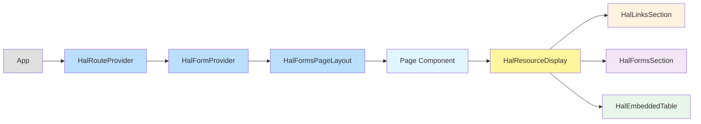
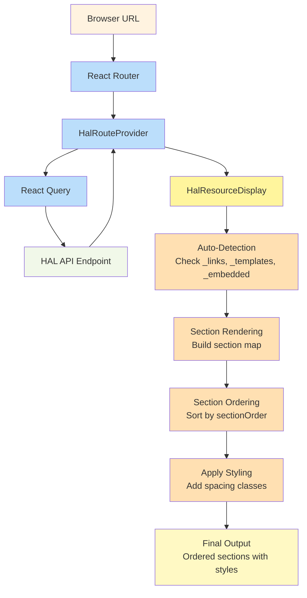
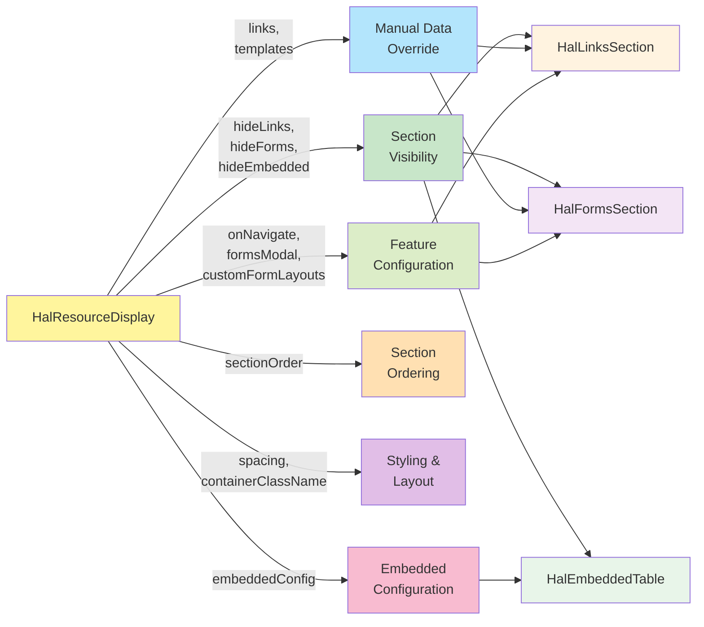
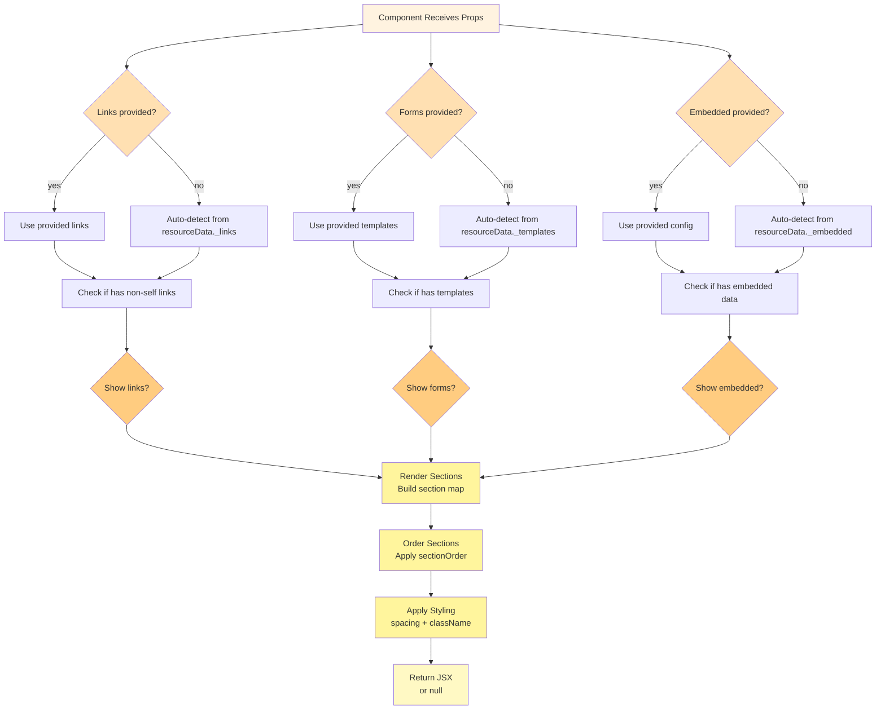
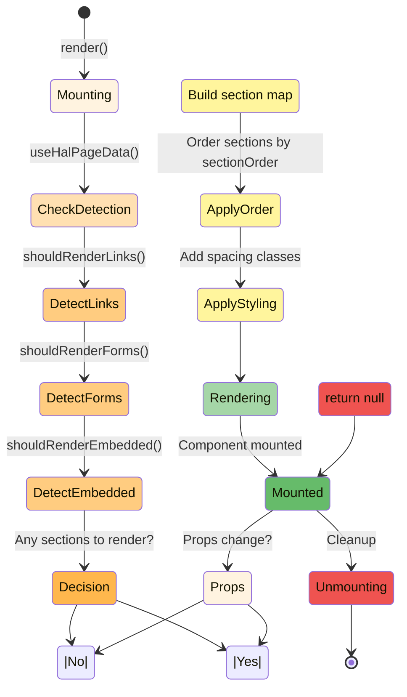

# HalResourceDisplay Component Refactoring Specification

## Executive Summary

This document provides detailed specifications for refactoring HAL resource display logic into a unified
`HalResourceDisplay` component. The component will consolidate the functionality of `HalLinksSection`,
`HalFormsSection`, and `HalEmbeddedTable` into a single, intelligent component that automatically detects and renders
HAL metadata.

## Project Goals

1. **Simplify page component code** - Reduce boilerplate by auto-detecting available HAL sections
2. **Consistent styling/layout** - Unified spacing and visual hierarchy across all pages
3. **Better resource detection** - Automatically render appropriate UI based on HAL metadata
4. **Reduce code duplication** - Extract common patterns into single reusable component
5. **Maintain backward compatibility** - Existing components remain available and unchanged

## Architecture Overview

### Current Architecture (Before Refactoring)



### New Architecture (After Refactoring)



### Component Hierarchy



### Data Flow



### Props Flow



## Component Design

### API Interface

```typescript
interface EmbeddedTableConfig<T = any> {
    collectionName: string;
    columns: ReactNode;           // TableCell components
    onRowClick?: (item: T) => void;
    defaultOrderBy?: string;
    defaultOrderDirection?: SortDirection;
    emptyMessage?: string;
}

interface HalResourceDisplayProps {
    // Section visibility
    hideLinks?: boolean;
    hideForms?: boolean;
    hideEmbedded?: boolean;

    // Manual overrides (optional - auto-detects if not provided)
    links?: Record<string, any>;
    templates?: Record<string, HalFormsTemplate>;

    // Embedded table configuration
    embeddedConfig?: EmbeddedTableConfig | EmbeddedTableConfig[];

    // Customization
    onNavigate?: (href: string) => void;
    formsModal?: boolean;
    customFormLayouts?: Record<string, ReactNode | RenderFormCallback>;
    sectionOrder?: Array<'links' | 'forms' | 'embedded'>;
    spacing?: 'compact' | 'normal' | 'relaxed';
    containerClassName?: string;
}
```

### Usage Examples

**Fully Automatic:**

```tsx
// Auto-detects and renders all available sections
<HalResourceDisplay
    embeddedConfig={{
        collectionName: "membersApiResponseList",
        columns: (
            <>
                <TableCell sortable column="firstName">Jméno</TableCell>
                <TableCell sortable column="lastName">Příjmení</TableCell>
            </>
        )
    }}
/>
```

**Custom Visibility:**

```tsx
// Show only links and forms, hide embedded
<HalResourceDisplay hideEmbedded/>
```

**Custom Order:**

```tsx
// Render forms first, then embedded, then links
<HalResourceDisplay
    sectionOrder={['forms', 'embedded', 'links']}
    spacing="relaxed"
/>
```

## Implementation Approach

### Detection Logic

The component will use `useHalPageData()` to auto-detect available HAL metadata:

1. **Links Detection**: Check for `resourceData._links` with non-self links
2. **Forms Detection**: Check for `resourceData._templates`
3. **Embedded Detection**: Check for `embeddedConfig` prop or `resourceData._embedded`

### Section Ordering

**Default order:** `['embedded', 'links', 'forms']`

Rationale:

- Tables (embedded) are primary content - appear first
- Links provide navigation context after data
- Forms are actions - appear last

### Styling & Layout

- **Spacing**: Use Tailwind classes `space-y-{2,4,8}` for compact/normal/relaxed
- **Design tokens**: Reuse existing `linkSectionStyles`, `formsSectionStyles`, `containerStyles`
- **Sections**: Delegate to existing components (HalLinksSection, HalFormsSection, HalEmbeddedTable)

### Implementation Pattern

```tsx
export function HalResourceDisplay({
                                       hideLinks = false,
                                       hideForms = false,
                                       hideEmbedded = false,
                                       links: propsLinks,
                                       templates: propsTemplates,
                                       embeddedConfig,
                                       onNavigate,
                                       formsModal = true,
                                       customFormLayouts,
                                       sectionOrder = ['embedded', 'links', 'forms'],
                                       spacing = 'normal',
                                       containerClassName = ''
                                   }: HalResourceDisplayProps): ReactElement | null {

    const {resourceData} = useHalPageData();

    // Auto-detect or use provided data
    const links = propsLinks || resourceData?._links;
    const templates = propsTemplates || resourceData?._templates;

    // Build section map
    const sections = {
        links: !hideLinks && shouldRenderLinks(links)
            ? <HalLinksSection links={links} onNavigate={onNavigate}/>
            : null,
        forms: !hideForms && shouldRenderForms(templates)
            ? <HalFormsSection templates={templates} modal={formsModal} customLayouts={customFormLayouts}/>
            : null,
        embedded: !hideEmbedded && shouldRenderEmbedded(embeddedConfig, resourceData)
            ? renderEmbeddedSections(embeddedConfig)
            : null
    };

    // Order and filter sections
    const orderedSections = sectionOrder
        .map(key => sections[key])
        .filter(Boolean);

    if (orderedSections.length === 0) return null;

    const spacingClasses = {
        compact: 'space-y-2',
        normal: 'space-y-4',
        relaxed: 'space-y-8'
    };

    return (
        <div className={`${spacingClasses[spacing]} ${containerClassName}`}>
            {orderedSections}
        </div>
    );
}
```

### Auto-Detection Logic Flow



### Component Lifecycle



### Test Coverage Map

```mermaid
graph TB
    TESTS["HalResourceDisplay Tests<br/>Comprehensive Coverage"]
    AUTO["Auto-Detection Tests<br/>5 tests"]
    AUTO1["✓ All sections present"]
    AUTO2["✓ No metadata"]
    AUTO3["✓ Only links"]
    AUTO4["✓ Only forms"]
    AUTO5["✓ Only self link"]
    VIS["Visibility Tests<br/>4 tests"]
    VIS1["✓ hideLinks prop"]
    VIS2["✓ hideForms prop"]
    VIS3["✓ hideEmbedded prop"]
    VIS4["✓ All hidden = null"]
    ORD["Ordering Tests<br/>3 tests"]
    ORD1["✓ Default order"]
    ORD2["✓ Custom order"]
    ORD3["✓ Partial ordering"]
    SPA["Spacing Tests<br/>4 tests"]
    SPA1["✓ Compact spacing"]
    SPA2["✓ Normal spacing"]
    SPA3["✓ Relaxed spacing"]
    SPA4["✓ Custom class"]
    PROP["Props Propagation<br/>5 tests"]
    PROP1["✓ links prop"]
    PROP2["✓ templates prop"]
    PROP3["✓ formsModal prop"]
    PROP4["✓ embeddedConfig prop"]
    PROP5["✓ Navigation callback"]
    TESTS --> AUTO
    TESTS --> VIS
    TESTS --> ORD
    TESTS --> SPA
    TESTS --> PROP
    AUTO --> AUTO1
    AUTO --> AUTO2
    AUTO --> AUTO3
    AUTO --> AUTO4
    AUTO --> AUTO5
    VIS --> VIS1
    VIS --> VIS2
    VIS --> VIS3
    VIS --> VIS4
    ORD --> ORD1
    ORD --> ORD2
    ORD --> ORD3
    SPA --> SPA1
    SPA --> SPA2
    SPA --> SPA3
    SPA --> SPA4
    PROP --> PROP1
    PROP --> PROP2
    PROP --> PROP3
    PROP --> PROP4
    PROP --> PROP5
    style TESTS fill: #fff59d
    style AUTO fill: #c8e6c9
    style VIS fill: #c8e6c9
    style ORD fill: #c8e6c9
    style SPA fill: #c8e6c9
    style PROP fill: #c8e6c9
    style AUTO1 fill: #a5d6a7
    style AUTO2 fill: #a5d6a7
    style AUTO3 fill: #a5d6a7
    style AUTO4 fill: #a5d6a7
    style AUTO5 fill: #a5d6a7
    style VIS1 fill: #a5d6a7
    style VIS2 fill: #a5d6a7
    style VIS3 fill: #a5d6a7
    style VIS4 fill: #a5d6a7
    style ORD1 fill: #a5d6a7
    style ORD2 fill: #a5d6a7
    style ORD3 fill: #a5d6a7
    style SPA1 fill: #a5d6a7
    style SPA2 fill: #a5d6a7
    style SPA3 fill: #a5d6a7
    style SPA4 fill: #a5d6a7
    style PROP1 fill: #a5d6a7
    style PROP2 fill: #a5d6a7
    style PROP3 fill: #a5d6a7
    style PROP4 fill: #a5d6a7
    style PROP5 fill: #a5d6a7
```



### Implementation Workflow

```mermaid
graph LR
    S1["Step 1<br/>Test Structure"]
    S2["Step 2<br/>Auto-Detection<br/>Tests"]
    S3["Step 3<br/>Visibility<br/>Tests"]
    S4["Step 4<br/>Ordering<br/>Tests"]
    S5["Step 5<br/>Spacing<br/>Tests"]
    S6["Step 6<br/>Props Tests"]
    S7["Step 7<br/>Interfaces"]
    S8["Step 8<br/>Auto-Detection<br/>Logic"]
    S9["Step 9<br/>Section<br/>Rendering"]
    S10["Step 10<br/>Ordering &<br/>Styling"]
    S11["Step 11<br/>Run Tests"]
    S12["Step 12<br/>Update<br/>Exports"]
    S13["Step 13<br/>Full<br/>Suite"]
    S14["Step 14<br/>Examples"]
    S1 -->|30min| S2
    S2 -->|45min| S3
    S3 -->|30min| S4
    S4 -->|30min| S5
    S5 -->|20min| S6
    S6 -->|30min| S7
    S7 -->|30min| S8
    S8 -->|45min| S9
    S9 -->|30min| S10
    S10 -->|30min| S11
    S11 -->|10min| S12
    S12 -->|15min| S13
    S13 -->|30min| S14
    S14 -->|DONE| FINISH["Implementation<br/>Complete"]
    style S1 fill: #e1f5ff
    style S2 fill: #e1f5ff
    style S3 fill: #e1f5ff
    style S4 fill: #e1f5ff
    style S5 fill: #e1f5ff
    style S6 fill: #e1f5ff
    style S7 fill: #fff3e0
    style S8 fill: #fff3e0
    style S9 fill: #fff3e0
    style S10 fill: #fff3e0
    style S11 fill: #f3e5f5
    style S12 fill: #f3e5f5
    style S13 fill: #f3e5f5
    style S14 fill: #f3e5f5
    style FINISH fill: #c8e6c9
```



---

## Implementation Steps

### STEP 1: Create Test File Structure

**Objective:** Set up the test file with proper imports, mocks, and test utilities

**File:** `/home/davca/Documents/Devel/klabis/frontend/src/components/HalNavigator2/HalResourceDisplay.test.tsx`

**Duration:** 30 minutes

**Specification:**

1.1. **Import dependencies:**

```typescript
import {render, screen} from '@testing-library/react';
import {BrowserRouter} from 'react-router-dom';
import {vi} from 'vitest';
import {HalResourceDisplay} from './HalResourceDisplay';
import {useHalPageData} from '../../hooks/useHalPageData';
```

1.2. **Set up mocks:**

```typescript
// Mock useHalPageData hook
vi.mock('../../hooks/useHalPageData', () => ({
    useHalPageData: vi.fn(),
}));

// Mock child components for unit testing
vi.mock('./HalLinksSection', () => ({
    HalLinksSection: ({links}: any) =>
        links ? <div data - testid = "hal-links-section" > Links < /div> : null
}));

vi.mock('./HalFormsSection', () => ({
    HalFormsSection: ({templates}: any) =>
        templates ? <div data - testid = "hal-forms-section" > Forms < /div> : null
}));

vi.mock('./HalEmbeddedTable', () => ({
        HalEmbeddedTable: ({collectionName, children}: any) => (
            <div data - testid = "hal-embedded-table" data-collection = {collectionName} >
            {children}
            < /div>
)
}))
;
```

1.3. **Create test utilities:**

```typescript
const TestWrapper = ({children}: { children: React.ReactNode }) => (
    <BrowserRouter>{children} < /BrowserRouter>
);

const createMockPageData = (overrides: any = {}) => ({
    resourceData: null,
    isLoading: false,
    error: null,
    isAdmin: false,
    route: {
        pathname: '/test',
        navigateToResource: vi.fn(),
        refetch: async () => {
        },
        queryState: 'success',
        getResourceLink: vi.fn(),
    },
    actions: {
        handleNavigateToItem: vi.fn(),
    },
    getLinks: vi.fn(() => undefined),
    getTemplates: vi.fn(() => undefined),
    hasEmbedded: vi.fn(() => false),
    getEmbeddedItems: vi.fn(() => []),
    isCollection: vi.fn(() => false),
    hasLink: vi.fn(() => false),
    hasTemplate: vi.fn(() => false),
    hasForms: vi.fn(() => false),
    getPageMetadata: vi.fn(() => undefined),
    ...overrides,
});
```

1.4. **Set up test suite structure:**

```typescript
describe('HalResourceDisplay', () => {
    beforeEach(() => {
        vi.mocked(useHalPageData).mockReturnValue(createMockPageData());
    });

    describe('Auto-detection', () => {
        // Tests will be added in next steps
    });

    describe('Section visibility', () => {
        // Tests will be added in next steps
    });

    describe('Section ordering', () => {
        // Tests will be added in next steps
    });

    describe('Embedded configuration', () => {
        // Tests will be added in next steps
    });

    describe('Spacing', () => {
        // Tests will be added in next steps
    });

    describe('Props propagation', () => {
        // Tests will be added in next steps
    });
});
```

**Acceptance Criteria:**

- Test file exists at correct path
- All imports are correct
- Mocks are properly configured
- Test utilities are defined
- Test suite structure is in place
- File compiles without TypeScript errors

**Verification Command:**

```bash
npm run typecheck
```

---

### STEP 2: Write Auto-Detection Tests

**Objective:** Create tests that verify the component correctly detects and renders HAL metadata

**File:** `/home/davca/Documents/Devel/klabis/frontend/src/components/HalNavigator2/HalResourceDisplay.test.tsx`

**Duration:** 45 minutes

**Specification:**

2.1. **Test: Renders all sections when all metadata present**

```typescript
it('should render all sections when all metadata present', () => {
    vi.mocked(useHalPageData).mockReturnValue(createMockPageData({
        resourceData: {
            _links: {
                self: {href: '/api/test'},
                next: {href: '/api/test?page=2'}
            },
            _templates: {
                create: {title: 'Create', method: 'POST'}
            },
            _embedded: {
                items: [{id: 1}]
            }
        },
        hasForms: vi.fn(() => true),
        hasEmbedded: vi.fn(() => true)
    }));

    render(
        <HalResourceDisplay
            embeddedConfig = {
    {
        collectionName: 'items',
            columns
    :
        <div>Columns < /div>
    }
}
    />,
    {
        wrapper: TestWrapper
    }
)
    ;

    expect(screen.getByTestId('hal-links-section')).toBeInTheDocument();
    expect(screen.getByTestId('hal-forms-section')).toBeInTheDocument();
    expect(screen.getByTestId('hal-embedded-table')).toBeInTheDocument();
});
```

2.2. **Test: Returns null when no HAL metadata present**

```typescript
it('should return null when no HAL metadata present', () => {
    const {container} = render(<HalResourceDisplay / >, {wrapper: TestWrapper});
    expect(container.firstChild).toBeNull();
});
```

2.3. **Test: Renders only links when only links present**

```typescript
it('should render only links when only links present', () => {
    vi.mocked(useHalPageData).mockReturnValue(createMockPageData({
        resourceData: {
            _links: {next: {href: '/api/test?page=2'}}
        }
    }));

    render(<HalResourceDisplay / >, {wrapper: TestWrapper});

    expect(screen.getByTestId('hal-links-section')).toBeInTheDocument();
    expect(screen.queryByTestId('hal-forms-section')).not.toBeInTheDocument();
    expect(screen.queryByTestId('hal-embedded-table')).not.toBeInTheDocument();
});
```

2.4. **Test: Renders only forms when only forms present**

```typescript
it('should render only forms when only forms present', () => {
    vi.mocked(useHalPageData).mockReturnValue(createMockPageData({
        resourceData: {
            _templates: {create: {title: 'Create', method: 'POST'}}
        },
        hasForms: vi.fn(() => true)
    }));

    render(<HalResourceDisplay / >, {wrapper: TestWrapper});

    expect(screen.queryByTestId('hal-links-section')).not.toBeInTheDocument();
    expect(screen.getByTestId('hal-forms-section')).toBeInTheDocument();
    expect(screen.queryByTestId('hal-embedded-table')).not.toBeInTheDocument();
});
```

2.5. **Test: Does not render links when only self link present**

```typescript
it('should not render links section when only self link present', () => {
    vi.mocked(useHalPageData).mockReturnValue(createMockPageData({
        resourceData: {
            _links: {self: {href: '/api/test'}}
        }
    }));

    const {container} = render(<HalResourceDisplay / >, {wrapper: TestWrapper});
    expect(container.firstChild).toBeNull();
});
```

**Acceptance Criteria:**

- All 5 tests are written
- Tests compile without errors
- Tests currently fail (component not yet implemented)

**Verification Command:**

```bash
npm test -- --run src/components/HalNavigator2/HalResourceDisplay.test.tsx
# Expected: Tests fail because component doesn't exist yet
```

---

### STEP 3: Write Section Visibility Tests

**Objective:** Create tests that verify the hide* props work correctly

**File:** `/home/davca/Documents/Devel/klabis/frontend/src/components/HalNavigator2/HalResourceDisplay.test.tsx`

**Duration:** 30 minutes

**Specification:**

3.1. **Test: Hides links when hideLinks is true**

```typescript
it('should hide links when hideLinks is true', () => {
    vi.mocked(useHalPageData).mockReturnValue(createMockPageData({
        resourceData: {
            _links: {next: {href: '/api/test?page=2'}},
            _templates: {create: {title: 'Create'}}
        },
        hasForms: vi.fn(() => true)
    }));

    render(<HalResourceDisplay hideLinks / >, {wrapper: TestWrapper});

    expect(screen.queryByTestId('hal-links-section')).not.toBeInTheDocument();
    expect(screen.getByTestId('hal-forms-section')).toBeInTheDocument();
});
```

3.2. **Test: Hides forms when hideForms is true**

```typescript
it('should hide forms when hideForms is true', () => {
    vi.mocked(useHalPageData).mockReturnValue(createMockPageData({
        resourceData: {
            _links: {next: {href: '/api/test?page=2'}},
            _templates: {create: {title: 'Create'}}
        },
        hasForms: vi.fn(() => true)
    }));

    render(<HalResourceDisplay hideForms / >, {wrapper: TestWrapper});

    expect(screen.getByTestId('hal-links-section')).toBeInTheDocument();
    expect(screen.queryByTestId('hal-forms-section')).not.toBeInTheDocument();
});
```

3.3. **Test: Hides embedded when hideEmbedded is true**

```typescript
it('should hide embedded when hideEmbedded is true', () => {
    vi.mocked(useHalPageData).mockReturnValue(createMockPageData({
        resourceData: {
            _links: {next: {href: '/api/test?page=2'}},
            _embedded: {items: [{id: 1}]}
        },
        hasEmbedded: vi.fn(() => true)
    }));

    render(
        <HalResourceDisplay
            hideEmbedded
    embeddedConfig = {
    {
        collectionName: 'items', columns
    :
        <div / >
    }
}
    />,
    {
        wrapper: TestWrapper
    }
)
    ;

    expect(screen.getByTestId('hal-links-section')).toBeInTheDocument();
    expect(screen.queryByTestId('hal-embedded-table')).not.toBeInTheDocument();
});
```

3.4. **Test: Can hide all sections (returns null)**

```typescript
it('should return null when all sections are hidden', () => {
    vi.mocked(useHalPageData).mockReturnValue(createMockPageData({
        resourceData: {
            _links: {next: {href: '/api/test?page=2'}},
            _templates: {create: {title: 'Create'}},
            _embedded: {items: [{id: 1}]}
        }
    }));

    const {container} = render(
        <HalResourceDisplay hideLinks
    hideForms
    hideEmbedded / >,
        {wrapper: TestWrapper}
)
    ;

    expect(container.firstChild).toBeNull();
});
```

**Acceptance Criteria:**

- All 4 tests are written
- Tests compile without errors
- Tests currently fail (component not yet implemented)

---

### STEP 4: Write Section Ordering Tests

**Objective:** Create tests that verify section ordering works correctly

**File:** `/home/davca/Documents/Devel/klabis/frontend/src/components/HalNavigator2/HalResourceDisplay.test.tsx`

**Duration:** 30 minutes

**Specification:**

4.1. **Test: Renders sections in default order (embedded, links, forms)**

```typescript
it('should render sections in default order: embedded, links, forms', () => {
    vi.mocked(useHalPageData).mockReturnValue(createMockPageData({
        resourceData: {
            _links: {next: {href: '/api/test?page=2'}},
            _templates: {create: {title: 'Create'}},
            _embedded: {items: [{id: 1}]}
        },
        hasForms: vi.fn(() => true),
        hasEmbedded: vi.fn(() => true)
    }));

    const {container} = render(
        <HalResourceDisplay
            embeddedConfig = {
    {
        collectionName: 'items', columns
    :
        <div / >
    }
}
    />,
    {
        wrapper: TestWrapper
    }
)
    ;

    const sections = container.querySelectorAll('[data-testid]');
    expect(sections[0]).toHaveAttribute('data-testid', 'hal-embedded-table');
    expect(sections[1]).toHaveAttribute('data-testid', 'hal-links-section');
    expect(sections[2]).toHaveAttribute('data-testid', 'hal-forms-section');
});
```

4.2. **Test: Renders sections in custom order**

```typescript
it('should render sections in custom order', () => {
    vi.mocked(useHalPageData).mockReturnValue(createMockPageData({
        resourceData: {
            _links: {next: {href: '/api/test?page=2'}},
            _templates: {create: {title: 'Create'}},
            _embedded: {items: [{id: 1}]}
        },
        hasForms: vi.fn(() => true),
        hasEmbedded: vi.fn(() => true)
    }));

    const {container} = render(
        <HalResourceDisplay
            sectionOrder = {['forms', 'links', 'embedded'
]
}
    embeddedConfig = {
    {
        collectionName: 'items', columns
    :
        <div / >
    }
}
    />,
    {
        wrapper: TestWrapper
    }
)
    ;

    const sections = container.querySelectorAll('[data-testid]');
    expect(sections[0]).toHaveAttribute('data-testid', 'hal-forms-section');
    expect(sections[1]).toHaveAttribute('data-testid', 'hal-links-section');
    expect(sections[2]).toHaveAttribute('data-testid', 'hal-embedded-table');
});
```

4.3. **Test: Partial section ordering (only some sections present)**

```typescript
it('should handle partial section ordering correctly', () => {
    vi.mocked(useHalPageData).mockReturnValue(createMockPageData({
        resourceData: {
            _links: {next: {href: '/api/test?page=2'}},
            _templates: {create: {title: 'Create'}}
        },
        hasForms: vi.fn(() => true)
    }));

    const {container} = render(
        <HalResourceDisplay sectionOrder = {['embedded', 'forms', 'links'
]
}
    />,
    {
        wrapper: TestWrapper
    }
)
    ;

    const sections = container.querySelectorAll('[data-testid]');
    // Only forms and links are present (no embedded), but should respect order
    expect(sections[0]).toHaveAttribute('data-testid', 'hal-forms-section');
    expect(sections[1]).toHaveAttribute('data-testid', 'hal-links-section');
});
```

**Acceptance Criteria:**

- All 3 tests are written
- Tests compile without errors
- Tests currently fail (component not yet implemented)

---

### STEP 5: Write Spacing Tests

**Objective:** Create tests that verify spacing prop applies correct CSS classes

**File:** `/home/davca/Documents/Devel/klabis/frontend/src/components/HalNavigator2/HalResourceDisplay.test.tsx`

**Duration:** 20 minutes

**Specification:**

5.1. **Test: Applies compact spacing**

```typescript
it('should apply compact spacing', () => {
    vi.mocked(useHalPageData).mockReturnValue(createMockPageData({
        resourceData: {_links: {next: {href: '/api/test?page=2'}}}
    }));

    const {container} = render(
        <HalResourceDisplay spacing = "compact" / >,
        {wrapper: TestWrapper}
    );

    expect(container.firstChild).toHaveClass('space-y-2');
});
```

5.2. **Test: Applies normal spacing (default)**

```typescript
it('should apply normal spacing by default', () => {
    vi.mocked(useHalPageData).mockReturnValue(createMockPageData({
        resourceData: {_links: {next: {href: '/api/test?page=2'}}}
    }));

    const {container} = render(
        <HalResourceDisplay / >,
        {wrapper: TestWrapper}
    );

    expect(container.firstChild).toHaveClass('space-y-4');
});
```

5.3. **Test: Applies relaxed spacing**

```typescript
it('should apply relaxed spacing', () => {
    vi.mocked(useHalPageData).mockReturnValue(createMockPageData({
        resourceData: {_links: {next: {href: '/api/test?page=2'}}}
    }));

    const {container} = render(
        <HalResourceDisplay spacing = "relaxed" / >,
        {wrapper: TestWrapper}
    );

    expect(container.firstChild).toHaveClass('space-y-8');
});
```

5.4. **Test: Applies custom container class**

```typescript
it('should apply custom container class', () => {
    vi.mocked(useHalPageData).mockReturnValue(createMockPageData({
        resourceData: {_links: {next: {href: '/api/test?page=2'}}}
    }));

    const {container} = render(
        <HalResourceDisplay containerClassName = "custom-class" / >,
        {wrapper: TestWrapper}
    );

    expect(container.firstChild).toHaveClass('custom-class');
});
```

**Acceptance Criteria:**

- All 4 tests are written
- Tests compile without errors
- Tests currently fail (component not yet implemented)

---

### STEP 6: Write Props Propagation Tests

**Objective:** Create tests that verify props are correctly passed to child components

**File:** `/home/davca/Documents/Devel/klabis/frontend/src/components/HalNavigator2/HalResourceDisplay.test.tsx`

**Duration:** 30 minutes

**Specification:**

6.1. **Update mocks to capture props:**

```typescript
const mockHalLinksSection = vi.fn(({links}) =>
    links ? <div data - testid = "hal-links-section" > Links < /div> : null
);
const mockHalFormsSection = vi.fn(({templates, modal}) =>
    templates ? <div data - testid = "hal-forms-section" > Forms < /div> : null
);
const mockHalEmbeddedTable = vi.fn(({collectionName, children, onRowClick}) => (
    <div data - testid = "hal-embedded-table"
data - collection = {collectionName} >
    {children}
    < /div>
))
;

vi.mock('./HalLinksSection', () => ({
    HalLinksSection: mockHalLinksSection
}));
vi.mock('./HalFormsSection', () => ({
    HalFormsSection: mockHalFormsSection
}));
vi.mock('./HalEmbeddedTable', () => ({
    HalEmbeddedTable: mockHalEmbeddedTable
}));
```

6.2. **Test: Passes links to HalLinksSection**

```typescript
it('should pass links prop to HalLinksSection', () => {
    const customLinks = {next: {href: '/api/test?page=2'}};

    render(<HalResourceDisplay links = {customLinks}
    />, {wrapper: TestWrapper});

    expect(mockHalLinksSection).toHaveBeenCalledWith(
        expect.objectContaining({links: customLinks}),
        expect.anything()
    );
});
```

6.3. **Test: Passes templates to HalFormsSection**

```typescript
it('should pass templates prop to HalFormsSection', () => {
    const customTemplates = {create: {title: 'Create', method: 'POST'}};

    render(<HalResourceDisplay templates = {customTemplates}
    />, {wrapper: TestWrapper});

    expect(mockHalFormsSection).toHaveBeenCalledWith(
        expect.objectContaining({templates: customTemplates}),
        expect.anything()
    );
});
```

6.4. **Test: Passes formsModal prop to HalFormsSection**

```typescript
it('should pass formsModal prop to HalFormsSection', () => {
    vi.mocked(useHalPageData).mockReturnValue(createMockPageData({
        resourceData: {_templates: {create: {title: 'Create'}}},
        hasForms: vi.fn(() => true)
    }));

    render(<HalResourceDisplay formsModal = {false}
    />, {wrapper: TestWrapper});

    expect(mockHalFormsSection).toHaveBeenCalledWith(
        expect.objectContaining({modal: false}),
        expect.anything()
    );
});
```

6.5. **Test: Passes embeddedConfig to HalEmbeddedTable**

```typescript
it('should pass embeddedConfig to HalEmbeddedTable', () => {
    vi.mocked(useHalPageData).mockReturnValue(createMockPageData({
        resourceData: {_embedded: {items: [{id: 1}]}},
        hasEmbedded: vi.fn(() => true)
    }));

    const config = {
        collectionName: 'items',
        columns: <div>Columns < /div>,
        onRowClick: vi.fn()
    };

    render(<HalResourceDisplay embeddedConfig = {config}
    />, {wrapper: TestWrapper});

    expect(mockHalEmbeddedTable).toHaveBeenCalledWith(
        expect.objectContaining({
            collectionName: 'items',
            onRowClick: config.onRowClick
        }),
        expect.anything()
    );
});
```

**Acceptance Criteria:**

- All 5 tests are written
- Mocks are updated to capture props
- Tests compile without errors
- Tests currently fail (component not yet implemented)

**Verification Command:**

```bash
npm test -- --run src/components/HalNavigator2/HalResourceDisplay.test.tsx
# Expected: All tests fail because component doesn't exist yet
```

---

### STEP 7: Create Component TypeScript Interfaces

**Objective:** Define TypeScript types and interfaces for the component

**File:** `/home/davca/Documents/Devel/klabis/frontend/src/components/HalNavigator2/HalResourceDisplay.tsx`

**Duration:** 30 minutes

**Specification:**

7.1. **Create EmbeddedTableConfig interface:**

```typescript
import {type ReactElement, type ReactNode} from 'react';
import type {HalFormsTemplate, SortDirection} from '../../api';
import type {RenderFormCallback} from './halforms';

/**
 * Configuration for rendering an embedded table
 */
export interface EmbeddedTableConfig<T = any> {
    /** Name of the collection in _embedded object */
    collectionName: string;

    /** Column definitions as TableCell components */
    columns: ReactNode;

    /** Callback when a row is clicked */
    onRowClick?: (item: T) => void;

    /** Default column to sort by */
    defaultOrderBy?: string;

    /** Default sort direction */
    defaultOrderDirection?: SortDirection;

    /** Message to display when no data */
    emptyMessage?: string;
}
```

7.2. **Create HalResourceDisplayProps interface:**

```typescript
/**
 * Props for HalResourceDisplay component
 */
export interface HalResourceDisplayProps {
    // Section visibility controls
    /** Hide the links section */
    hideLinks?: boolean;

    /** Hide the forms section */
    hideForms?: boolean;

    /** Hide the embedded table section */
    hideEmbedded?: boolean;

    // Manual data overrides (optional - auto-detects if not provided)
    /** Links object from HAL resource. If not provided, uses resourceData._links */
    links?: Record<string, any>;

    /** Templates object from HAL resource. If not provided, uses resourceData._templates */
    templates?: Record<string, HalFormsTemplate>;

    // Embedded table configuration
    /** Configuration for embedded table(s) */
    embeddedConfig?: EmbeddedTableConfig | EmbeddedTableConfig[];

    // Navigation callback (optional - uses React Router if not provided)
    /** Callback when a link is clicked. If not provided, uses useNavigate from React Router */
    onNavigate?: (href: string) => void;

    // Forms configuration
    /** Whether to open forms in modal (default: true). If false, displays inline */
    formsModal?: boolean;

    /** Optional custom layouts per template name */
    customFormLayouts?: Record<string, ReactNode | RenderFormCallback>;

    // Section ordering
    /** Order in which sections should appear. Default: ['embedded', 'links', 'forms'] */
    sectionOrder?: Array<'links' | 'forms' | 'embedded'>;

    // Layout customization
    /** Spacing between sections. Default: 'normal' */
    spacing?: 'compact' | 'normal' | 'relaxed';

    /** Additional CSS class for container */
    containerClassName?: string;
}
```

7.3. **Add component skeleton:**

```typescript
/**
 * Unified component for displaying HAL resource metadata
 *
 * Automatically detects and renders:
 * - Links section (from _links)
 * - Forms section (from _templates)
 * - Embedded tables (from _embedded)
 *
 * @example
 * // Fully automatic - detects all sections
 * <HalResourceDisplay
 *   embeddedConfig={{
 *     collectionName: "items",
 *     columns: <TableCell column="name">Name</TableCell>
 *   }}
 * />
 *
 * @example
 * // Custom visibility and ordering
 * <HalResourceDisplay
 *   hideLinks
 *   sectionOrder={['forms', 'embedded']}
 *   spacing="relaxed"
 * />
 */
export function HalResourceDisplay({
                                       hideLinks = false,
                                       hideForms = false,
                                       hideEmbedded = false,
                                       links: propsLinks,
                                       templates: propsTemplates,
                                       embeddedConfig,
                                       onNavigate,
                                       formsModal = true,
                                       customFormLayouts,
                                       sectionOrder = ['embedded', 'links', 'forms'],
                                       spacing = 'normal',
                                       containerClassName = ''
                                   }: HalResourceDisplayProps): ReactElement | null {
    // Implementation will be added in next steps
    return null;
}
```

**Acceptance Criteria:**

- File exists at correct path
- Both interfaces are fully defined with JSDoc comments
- Component skeleton is created with proper JSDoc examples
- File compiles without TypeScript errors
- All props have correct types

**Verification Command:**

```bash
npm run typecheck
```

---

### STEP 8: Implement Auto-Detection Logic

**Objective:** Implement logic to detect available HAL metadata

**File:** `/home/davca/Documents/Devel/klabis/frontend/src/components/HalNavigator2/HalResourceDisplay.tsx`

**Duration:** 30 minutes

**Specification:**

8.1. **Add necessary imports:**

```typescript
import {useHalPageData} from '../../hooks/useHalPageData';
import {HAL_LINK_RELS} from '../../constants/hal';
```

8.2. **Add detection helper functions (before component):**

```typescript
/**
 * Check if links should be rendered
 * Returns false if no links, only self link, or empty object
 */
function shouldRenderLinks(links: Record<string, any> | undefined): boolean {
    if (!links || Object.keys(links).length === 0) {
        return false;
    }

    // Filter out self links
    const displayLinks = Object.keys(links).filter(rel => rel !== HAL_LINK_RELS.SELF);
    return displayLinks.length > 0;
}

/**
 * Check if forms should be rendered
 * Returns false if no templates or empty object
 */
function shouldRenderForms(templates: Record<string, HalFormsTemplate> | undefined): boolean {
    return Boolean(templates && Object.keys(templates).length > 0);
}

/**
 * Check if embedded section should be rendered
 * Returns false if no config provided and no embedded data
 */
function shouldRenderEmbedded(
    embeddedConfig: EmbeddedTableConfig | EmbeddedTableConfig[] | undefined,
    resourceData: any
): boolean {
    // If config provided, try to render
    if (embeddedConfig) {
        return true;
    }

    // If no config, check if embedded data exists
    return Boolean(resourceData?._embedded && Object.keys(resourceData._embedded).length > 0);
}
```

8.3. **Implement auto-detection in component:**

```typescript
export function HalResourceDisplay({
                                       hideLinks = false,
                                       hideForms = false,
                                       hideEmbedded = false,
                                       links: propsLinks,
                                       templates: propsTemplates,
                                       embeddedConfig,
                                       onNavigate,
                                       formsModal = true,
                                       customFormLayouts,
                                       sectionOrder = ['embedded', 'links', 'forms'],
                                       spacing = 'normal',
                                       containerClassName = ''
                                   }: HalResourceDisplayProps): ReactElement | null {

    const {resourceData} = useHalPageData();

    // Auto-detect or use provided data
    const links = propsLinks || resourceData?._links;
    const templates = propsTemplates || resourceData?._templates;

    // Determine what sections to render
    const showLinks = !hideLinks && shouldRenderLinks(links);
    const showForms = !hideForms && shouldRenderForms(templates);
    const showEmbedded = !hideEmbedded && shouldRenderEmbedded(embeddedConfig, resourceData);

    // If nothing to render, return null
    if (!showLinks && !showForms && !showEmbedded) {
        return null;
    }

    // TODO: Render sections (next step)
    return null;
}
```

**Acceptance Criteria:**

- Helper functions are implemented and documented
- Auto-detection logic correctly uses props or falls back to resourceData
- Component returns null when no sections to render
- TypeScript compiles without errors
- Some tests now pass (null detection tests)

**Verification Command:**

```bash
npm test -- --run src/components/HalNavigator2/HalResourceDisplay.test.tsx
# Expected: Some tests pass (null handling), rendering tests still fail
```

---

### STEP 9: Implement Section Rendering Logic

**Objective:** Implement logic to render sections using child components

**File:** `/home/davca/Documents/Devel/klabis/frontend/src/components/HalNavigator2/HalResourceDisplay.tsx`

**Duration:** 45 minutes

**Specification:**

9.1. **Add imports for child components:**

```typescript
import {HalLinksSection} from './HalLinksSection';
import {HalFormsSection} from './HalFormsSection';
import {HalEmbeddedTable} from './HalEmbeddedTable';
```

9.2. **Add helper function for rendering embedded sections:**

```typescript
/**
 * Render embedded table section(s)
 */
function renderEmbeddedSections(
    embeddedConfig: EmbeddedTableConfig | EmbeddedTableConfig[] | undefined
): ReactNode {
    if (!embeddedConfig) {
        return null;
    }

    // Handle array of configs (multiple tables)
    if (Array.isArray(embeddedConfig)) {
        return (
            <>
                {
                    embeddedConfig.map((config, index) => (
                        <HalEmbeddedTable
                            key = {config.collectionName || index}
                    collectionName = {config.collectionName}
                    onRowClick = {config.onRowClick}
                    defaultOrderBy = {config.defaultOrderBy}
                    defaultOrderDirection = {config.defaultOrderDirection}
                    emptyMessage = {config.emptyMessage}
                        >
                        {config.columns}
                        < /HalEmbeddedTable>
        )
    )
    }
        </>
    )
        ;
    }

    // Handle single config
    return (
        <HalEmbeddedTable
            collectionName = {embeddedConfig.collectionName}
    onRowClick = {embeddedConfig.onRowClick}
    defaultOrderBy = {embeddedConfig.defaultOrderBy}
    defaultOrderDirection = {embeddedConfig.defaultOrderDirection}
    emptyMessage = {embeddedConfig.emptyMessage}
        >
        {embeddedConfig.columns}
        < /HalEmbeddedTable>
)
    ;
}
```

9.3. **Implement section rendering in component:**

```typescript
export function HalResourceDisplay({
                                       // ... props destructuring ...
                                   }: HalResourceDisplayProps): ReactElement | null {

    const {resourceData} = useHalPageData();

    // Auto-detect or use provided data
    const links = propsLinks || resourceData?._links;
    const templates = propsTemplates || resourceData?._templates;

    // Determine what sections to render
    const showLinks = !hideLinks && shouldRenderLinks(links);
    const showForms = !hideForms && shouldRenderForms(templates);
    const showEmbedded = !hideEmbedded && shouldRenderEmbedded(embeddedConfig, resourceData);

    // Build section map
    const sections: Record<string, ReactNode> = {
        links: showLinks ? (
                <HalLinksSection
                    links = {links}
            onNavigate = {onNavigate}
    />
) :
    null,

        forms
:
    showForms ? (
            <HalFormsSection
                templates = {templates}
        modal = {formsModal}
    customLayouts = {customFormLayouts}
    />
) :
    null,

        embedded
:
    showEmbedded ? (
        renderEmbeddedSections(embeddedConfig)
    ) : null
}
    ;

    // TODO: Order sections and apply styling (next step)
    return null;
}
```

**Acceptance Criteria:**

- Child components are imported
- Helper function for embedded sections is implemented
- Section map is built with proper props
- TypeScript compiles without errors
- More tests pass (section rendering tests)

**Verification Command:**

```bash
npm test -- --run src/components/HalNavigator2/HalResourceDisplay.test.tsx
# Expected: More tests pass (rendering, visibility)
```

---

### STEP 10: Implement Section Ordering and Styling

**Objective:** Implement section ordering and apply spacing styles

**File:** `/home/davca/Documents/Devel/klabis/frontend/src/components/HalNavigator2/HalResourceDisplay.tsx`

**Duration:** 30 minutes

**Specification:**

10.1. **Define spacing classes:**

```typescript
const SPACING_CLASSES = {
    compact: 'space-y-2',
    normal: 'space-y-4',
    relaxed: 'space-y-8'
} as const;
```

10.2. **Complete component implementation:**

```typescript
export function HalResourceDisplay({
                                       hideLinks = false,
                                       hideForms = false,
                                       hideEmbedded = false,
                                       links: propsLinks,
                                       templates: propsTemplates,
                                       embeddedConfig,
                                       onNavigate,
                                       formsModal = true,
                                       customFormLayouts,
                                       sectionOrder = ['embedded', 'links', 'forms'],
                                       spacing = 'normal',
                                       containerClassName = ''
                                   }: HalResourceDisplayProps): ReactElement | null {

    const {resourceData} = useHalPageData();

    // Auto-detect or use provided data
    const links = propsLinks || resourceData?._links;
    const templates = propsTemplates || resourceData?._templates;

    // Determine what sections to render
    const showLinks = !hideLinks && shouldRenderLinks(links);
    const showForms = !hideForms && shouldRenderForms(templates);
    const showEmbedded = !hideEmbedded && shouldRenderEmbedded(embeddedConfig, resourceData);

    // Build section map
    const sections: Record<string, ReactNode> = {
        links: showLinks ? (
                <HalLinksSection
                    links = {links}
            onNavigate = {onNavigate}
    />
) :
    null,

        forms
:
    showForms ? (
            <HalFormsSection
                templates = {templates}
        modal = {formsModal}
    customLayouts = {customFormLayouts}
    />
) :
    null,

        embedded
:
    showEmbedded ? (
        renderEmbeddedSections(embeddedConfig)
    ) : null
}
    ;

    // Order sections according to sectionOrder prop
    const orderedSections = sectionOrder
        .map(key => sections[key])
        .filter(Boolean); // Remove null sections

    // If no sections to render, return null
    if (orderedSections.length === 0) {
        return null;
    }

    // Apply spacing and container classes
    const spacingClass = SPACING_CLASSES[spacing];
    const className = `${spacingClass} ${containerClassName}`.trim();

    return (
        <div className = {className} >
            {orderedSections}
            < /div>
    );
}
```

**Acceptance Criteria:**

- Spacing classes are defined as constant
- Section ordering logic is implemented
- Null sections are filtered out
- Spacing and custom classes are applied
- Component returns properly styled div
- TypeScript compiles without errors

**Verification Command:**

```bash
npm run typecheck
```

---

### STEP 11: Run All Tests

**Objective:** Verify all tests pass with the implemented component

**Duration:** 30 minutes

**Specification:**

11.1. **Run tests:**

```bash
npm test -- --run src/components/HalNavigator2/HalResourceDisplay.test.tsx
```

11.2. **Expected results:**

- All auto-detection tests pass
- All section visibility tests pass
- All section ordering tests pass
- All spacing tests pass
- All props propagation tests pass

11.3. **If tests fail:**

- Review error messages
- Fix implementation issues
- Re-run tests
- Repeat until all pass

**Acceptance Criteria:**

- All tests pass
- Test coverage is 100% for the new component
- No console errors or warnings

**Verification Command:**

```bash
npm test -- --run src/components/HalNavigator2/HalResourceDisplay.test.tsx --coverage
```

---

### STEP 12: Update Module Exports

**Objective:** Export the new component and types from the module index

**File:** `/home/davca/Documents/Devel/klabis/frontend/src/components/HalNavigator2/index.ts`

**Duration:** 10 minutes

**Specification:**

12.1. **Check if index.ts exists:**

```bash
ls frontend/src/components/HalNavigator2/index.ts
```

12.2. **If file exists, add exports:**

```typescript
export {HalResourceDisplay} from './HalResourceDisplay';
export type {HalResourceDisplayProps, EmbeddedTableConfig} from './HalResourceDisplay';
```

12.3. **If file doesn't exist, create it with all exports:**

```typescript
// HAL Navigator 2 Components
export {HalLinksSection} from './HalLinksSection';
export {HalFormsSection} from './HalFormsSection';
export {HalEmbeddedTable} from './HalEmbeddedTable';
export {HalResourceDisplay} from './HalResourceDisplay';
export {HalFormButton} from './HalFormButton';
export {HalFormDisplay} from './HalFormDisplay';
export {HalFormsPageLayout} from './HalFormsPageLayout';

// Types
export type {HalLinksSectionProps} from './HalLinksSection';
export type {HalFormsSectionProps} from './HalFormsSection';
export type {HalEmbeddedTableProps} from './HalEmbeddedTable';
export type {HalResourceDisplayProps, EmbeddedTableConfig} from './HalResourceDisplay';
```

**Acceptance Criteria:**

- Exports are added to index.ts
- TypeScript compiles without errors
- Imports work from index: `import {HalResourceDisplay} from '../components/HalNavigator2'`

**Verification Command:**

```bash
npm run typecheck
```

---

### STEP 13: Run Full Test Suite

**Objective:** Ensure no regressions in existing tests

**Duration:** 15 minutes

**Specification:**

13.1. **Run all HAL Navigator tests:**

```bash
npm test -- --run src/components/HalNavigator2/
```

13.2. **Verify:**

- All existing tests still pass
- No new errors or warnings
- New component tests pass

13.3. **Run full build:**

```bash
npm run build
```

13.4. **Verify:**

- Build succeeds without errors
- No TypeScript errors
- No bundling errors

**Acceptance Criteria:**

- All existing tests pass
- New tests pass
- Build succeeds
- No regressions

**Verification Commands:**

```bash
npm test -- --run src/components/HalNavigator2/
npm run build
```

---

### STEP 14: Create Integration Example (Optional)

**Objective:** Demonstrate usage by creating an example page component

**Duration:** 30 minutes

**Specification:**

14.1. **Create example file:**

```typescript
// /home/davca/Documents/Devel/klabis/frontend/src/examples/HalResourceDisplayExample.tsx

import {type ReactElement} from 'react';
import {HalResourceDisplay} from '../components/HalNavigator2';
import {TableCell} from '../components/KlabisTable';

/**
 * Example page demonstrating HalResourceDisplay usage
 */
export const HalResourceDisplayExample = (): ReactElement => {
    return (
        <div className = "flex flex-col gap-8 p-8" >
        <h1 className = "text-3xl font-bold" > HalResourceDisplay
    Examples < /h1>

    < section >
    <h2 className = "text-2xl font-semibold mb-4" > Example
    1
:
    Fully
    Automatic < /h2>
    < p
    className = "mb-4 text-gray-600" >
        Auto - detects
    all
    available
    HAL
    sections
    from
    resourceData
    < /p>
    < HalResourceDisplay
    embeddedConfig = {
    {
        collectionName: "items",
            columns
    :
        (
            <>
                <TableCell sortable
        column = "name" > Name < /TableCell>
            < TableCell
        sortable
        column = "date" > Date < /TableCell>
            < />
    )
    }
}
    />
    < /section>

    < section >
    <h2 className = "text-2xl font-semibold mb-4" > Example
    2
:
    Custom
    Visibility < /h2>
    < p
    className = "mb-4 text-gray-600" >
        Hide
    embedded
    section, show
    only
    links
    and
    forms
    < /p>
    < HalResourceDisplay
    hideEmbedded / >
    </section>

    < section >
    <h2 className = "text-2xl font-semibold mb-4" > Example
    3
:
    Custom
    Order & Spacing < /h2>
    < p
    className = "mb-4 text-gray-600" >
        Forms
    first, then
    links,
    with relaxed spacing
    < /p>
    < HalResourceDisplay
    sectionOrder = {['forms', 'links', 'embedded'
]
}
    spacing = "relaxed"
        / >
        </section>
        < /div>
)
    ;
};
```

14.2. **Document usage patterns in comments:**
Add comprehensive JSDoc examples to the component showing different usage patterns.

**Acceptance Criteria:**

- Example file is created (optional)
- Component JSDoc includes multiple usage examples
- Examples demonstrate key features

---

## Summary of Deliverables

### New Files Created

1. `/home/davca/Documents/Devel/klabis/frontend/src/components/HalNavigator2/HalResourceDisplay.test.tsx` -
   Comprehensive test suite
2. `/home/davca/Documents/Devel/klabis/frontend/src/components/HalNavigator2/HalResourceDisplay.tsx` - Component
   implementation

### Modified Files

1. `/home/davca/Documents/Devel/klabis/frontend/src/components/HalNavigator2/index.ts` - Added exports (if exists)

### Unchanged Files (Backward Compatible)

1. `/home/davca/Documents/Devel/klabis/frontend/src/components/HalNavigator2/HalLinksSection.tsx`
2. `/home/davca/Documents/Devel/klabis/frontend/src/components/HalNavigator2/HalFormsSection.tsx`
3. `/home/davca/Documents/Devel/klabis/frontend/src/components/HalNavigator2/HalEmbeddedTable.tsx`
4. All existing page components

## Backward Compatibility

### Preserved Components

All existing components remain **unchanged** and **available**:

- `HalLinksSection.tsx` - No modifications
- `HalFormsSection.tsx` - No modifications
- `HalEmbeddedTable.tsx` - No modifications

### Migration Path

**Existing pages continue to work:**

```tsx
// MembersPage.tsx - continues to work unchanged
<HalEmbeddedTable collectionName="membersApiResponseList">
    <TableCell column="firstName">Name</TableCell>
</HalEmbeddedTable>
<HalLinksSection/>
<HalFormsSection/>
```

**New pages can use unified component:**

```tsx
// NewPage.tsx - simplified with HalResourceDisplay
<HalResourceDisplay
    embeddedConfig={{
        collectionName: "membersApiResponseList",
        columns: <TableCell column="firstName">Name</TableCell>
    }}
/>
```

## Before/After Comparison

### Before (Current Pattern)

```tsx
export const MembersPage = (): ReactElement => {
    const {route} = useHalPageData();

    return (
        <div className="flex flex-col gap-8">
            <h1>Adresář</h1>

            <HalEmbeddedTable
                collectionName="membersApiResponseList"
                defaultOrderBy="lastName"
                onRowClick={route.navigateToResource}
            >
                <TableCell sortable column="firstName">Jméno</TableCell>
                <TableCell sortable column="lastName">Příjmení</TableCell>
            </HalEmbeddedTable>

            <HalLinksSection/>
            <HalFormsSection/>
        </div>
    );
};
```

### After (With HalResourceDisplay)

```tsx
export const MembersPage = (): ReactElement => {
    const {route} = useHalPageData();

    return (
        <div className="flex flex-col gap-8">
            <h1>Adresář</h1>

            <HalResourceDisplay
                embeddedConfig={{
                    collectionName: "membersApiResponseList",
                    defaultOrderBy: "lastName",
                    onRowClick: route.navigateToResource,
                    columns: (
                        <>
                            <TableCell sortable column="firstName">Jméno</TableCell>
                            <TableCell sortable column="lastName">Příjmení</TableCell>
                        </>
                    )
                }}
                spacing="relaxed"
            />
        </div>
    );
};
```

**Benefits:**

- Reduces from 3 separate components to 1
- Auto-detects available links/forms
- Consistent spacing with `spacing` prop
- Clearer intent (display all HAL resource metadata)

## Critical Files

### New Files

- `/home/davca/Documents/Devel/klabis/frontend/src/components/HalNavigator2/HalResourceDisplay.test.tsx` - Tests (
  TDD - write first)
- `/home/davca/Documents/Devel/klabis/frontend/src/components/HalNavigator2/HalResourceDisplay.tsx` - Implementation

### Modified Files

- `/home/davca/Documents/Devel/klabis/frontend/src/components/HalNavigator2/index.ts` - Add exports (if exists)

### Reference Files (Unchanged)

- `/home/davca/Documents/Devel/klabis/frontend/src/components/HalNavigator2/HalLinksSection.tsx`
- `/home/davca/Documents/Devel/klabis/frontend/src/components/HalNavigator2/HalFormsSection.tsx`
- `/home/davca/Documents/Devel/klabis/frontend/src/components/HalNavigator2/HalEmbeddedTable.tsx`
- `/home/davca/Documents/Devel/klabis/frontend/src/hooks/useHalPageData.ts`
- `/home/davca/Documents/Devel/klabis/docs/frontend/testing_patterns.md`

## Testing Strategy

Following patterns from `testing_patterns.md`:

1. **Mock child components** - Mock HalLinksSection, HalFormsSection, HalEmbeddedTable
2. **Mock useHalPageData hook** - Control resourceData for test scenarios
3. **Test with BrowserRouter wrapper** - Required for React Router integration
4. **Use data-testid** - For mocked components to verify rendering
5. **Test all edge cases** - Null data, empty sections, various combinations

## Success Criteria

1. ✅ All tests pass with 100% coverage for new component
2. ✅ Existing components remain unchanged
3. ✅ Existing pages continue to work
4. ✅ Build succeeds without errors
5. ✅ Component supports all three usage modes (auto, partial, manual)
6. ✅ Proper TypeScript types and documentation

## Estimated Time

- **Step 1-6 (Tests):** 3 hours
- **Step 7-10 (Implementation):** 3 hours
- **Step 11-13 (Testing/Build):** 1 hour
- **Step 14 (Examples):** 30 minutes (optional)

**Total:** 6.5-7 hours
