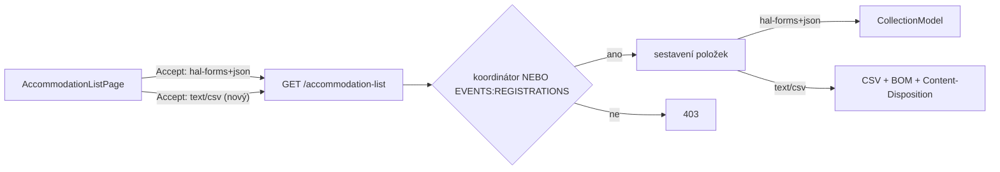

## Context

Seznam pro ubytování (Accommodation List) je dnes dostupný jako HAL+FORMS zdroj na
`GET /api/events/{eventId}/accommodation-list`, který vrací kolekci položek (jméno,
příjmení, číslo OP, platnost OP, datum narození, adresa rozložená na ulici/město/PSČ/zemi).
Frontend (`AccommodationListPage`) si tento zdroj načte a vykreslí jako tiskovou tabulku;
chybějící hodnoty nahradí textem "neuvedeno" a tisk řeší přes `window.print()`.

Přístup je řízen programově v controlleru: položku vidí pouze **koordinátor akce** nebo
uživatel s autoritou **`EVENTS:REGISTRATIONS`** (`EventAffordanceSupport.isCoordinatorOrHasRegistrationsAuthority`).
HAL link `accommodation-list` je do detailu akce přidán podmíněně stejnou kontrolou
v `EventDetailsPostprocessor`.

Koordinátoři potřebují seznam předávat ubytovatelům elektronicky (e-mailem, jako vstup do
jejich systému), k čemuž je vhodnější strukturovaný CSV soubor než tisková HTML stránka.

## Goals / Non-Goals

**Goals:**
- Umožnit stažení seznamu pro ubytování jako CSV soubor přímo z existující stránky.
- CSV otevíratelné bez úprav v české lokalizaci MS Excel (UTF-8 BOM, středník jako oddělovač).
- Znovupoužít existující logiku sestavení seznamu i autorizaci — žádná duplicita pravidel.
- Identický rozsah dat jako stávající tabulka (žádné nové údaje, žádná změna domény).

**Non-Goals:**
- XLS / XLSX export (potenciální budoucí rozšíření, lze přidat samostatně).
- Vlastní výběr sloupců nebo custom layout exportu.
- Změna autorizačního modelu seznamu.
- Změna nebo rozšíření tiskové HTML verze stránky.
- Generování CSV na straně klienta z již načtených dat.

## Decisions

### D1: Content negotiation na stávajícím endpointu (ne samostatné URL)

CSV se vystaví na **stejném URL** `GET /api/events/{eventId}/accommodation-list`,
rozlišené hlavičkou `Accept`:
- `Accept: application/prs.hal-forms+json` → stávající HAL kolekce (beze změny),
- `Accept: text/csv` → CSV soubor s `Content-Disposition: attachment`.

**Proč:** Minimální API povrch, žádný nový HAL rel, žádná duplicita autorizační a link
logiky v `EventDetailsPostprocessor`. Sestavení položek se sdílí, liší se jen serializace
odpovědi podle media type. Odpovídá REST principu „jeden zdroj, více reprezentací".

**Alternativa (zamítnuto):** Samostatný endpoint `/accommodation-list/csv` + nový HAL rel
`accommodation-list-csv`. Explicitnější, ale duplikuje link a autorizační kontrolu a rozšiřuje
detail akce o další affordance, kterou frontend stejně nevyužije přes `<a href>` (download
vyžaduje autorizovaný fetch — viz D5).

### D2: CSV generuje backend přes Apache Commons CSV

CSV sestaví backend pomocí knihovny **`org.apache.commons:commons-csv`** s konfigurací:
oddělovač `;`, hlavička s českými názvy sloupců, RFC 4180 escaping.

**Proč:** Sloučená adresa (viz D4) obsahuje čárky a může obsahovat uvozovky/nové řádky —
knihovna řeší escaping korektně (zdvojení uvozovek, obalení buněk). Vyhneme se chybám
v ručním escapingu. Knihovna je malá a osvědčená.

**Alternativa (zamítnuto):** Vlastní util třída pro escaping. Žádná nová závislost, ale
více kódu a testů na edge-cases (uvozovky v adrese, nové řádky), které knihovna pokrývá out-of-box.

### D3: Hlavička s českými názvy sloupců

První řádek CSV obsahuje české názvy sloupců:
`Jméno;Příjmení;Číslo OP;Platnost OP;Datum narození;Adresa`.

**Proč:** Soubor je určený k předání ubytovateli e-mailem — člověk i Excel hned poznají
význam sloupců. Standard pro lidsky čitelný export.

### D4: Adresa jako jeden sloučený sloupec

Adresa se v CSV vyskytuje jako **jeden sloupec „Adresa"**, složený stejně jako v tiskové
verzi (ulice, PSČ město, země), nikoli rozložená na 4 samostatné sloupce.

**Proč:** CSV má zrcadlit tabulku z tiskové verze (proposal: „stejné sloupce jako existující
tabulka"). Skládání adresy se přesune na backend tak, aby odpovídalo frontend tiskové verzi.

**Trade-off:** Hůře strojově zpracovatelné než 4 sloupce, ale konzistentní se zadáním
a s tiskovou verzí.

### D5: Chybějící hodnoty → prázdná buňka (ne "neuvedeno")

Pro chybějící údaje (např. číslo OP) zůstává v CSV **prázdná buňka**. Tisková verze HTML
nadále zobrazuje „neuvedeno" — ta se nemění.

**Proč:** Strukturovaný formát se lépe strojově zpracuje na straně ubytovatele; prázdná
buňka je v CSV přirozenější než textový placeholder. Text „neuvedeno" dnes vzniká pouze
na frontendu (`labels.ui.notProvided`), backend vrací `null` — pro CSV by se musel
placeholder duplikovat na backend, čemuž se tímto vyhneme.

**Poznámka:** Vědomá odchylka od původního znění proposalu; proposal byl odpovídajícím
způsobem upraven.

### D6: Frontend stahuje přes autorizovaný fetch + Blob

Tlačítko „Stáhnout CSV" zavolá autorizovaný `fetch` (Bearer token, `Accept: text/csv`),
z odpovědi vytvoří `Blob`, `URL.createObjectURL` a programově klikne na dočasný
`<a download>`. Název souboru se přebírá z `Content-Disposition`.

**Proč:** Prostý `<a href download>` nepřidá `Authorization` ani `Accept` hlavičku, takže
content negotiation (D1) a autorizace by nefungovaly. Fetch+Blob je zavedený pattern pro
autorizovaný download.

### D7: Název souboru `ubytovani-{slug názvu akce}.csv`

`Content-Disposition: attachment; filename="ubytovani-{slug}.csv"`, kde slug je slugifikovaný
název akce (diakritika a mezery na pomlčky), např. `ubytovani-zimni-soustredeni-2026.csv`.

**Proč:** Lidsky čitelný název — koordinátor hned pozná, ke které akci soubor patří.

## Risks / Trade-offs

- **[Sloučená adresa zhoršuje strojové zpracování]** → Záměrná volba pro konzistenci
  s tiskovou verzí; 4-sloupcová varianta zůstává možným budoucím rozšířením bez konfliktu.

- **[Nová závislost commons-csv]** → Malá, stabilní, široce používaná knihovna; riziko
  minimální. Alternativou je vlastní util, pokud by tým chtěl nulové závislosti.

- **[Excel a UTF-8 BOM]** → Bez BOM otevírá český Excel UTF-8 CSV s rozbitou diakritikou.
  Mitigace: do těla odpovědi se před CSV vloží UTF-8 BOM (``). Ověřit ručně v Excelu.

- **[Velikost odpovědi u velkých akcí]** → Seznam se sestavuje celý v paměti (jako dnes
  pro HAL). Pro očekávané počty účastníků (desítky až nízké stovky) bez problému; streaming
  není potřeba.

- **[Konzistence „neuvedeno" mezi tiskem a CSV]** → CSV má prázdné buňky, tisk „neuvedeno".
  Vědomá nekonzistence (D5), zdokumentovaná v proposalu.

## Open Questions

Žádné otevřené otázky — všechna designová rozhodnutí byla vyřešena (D1–D7).
