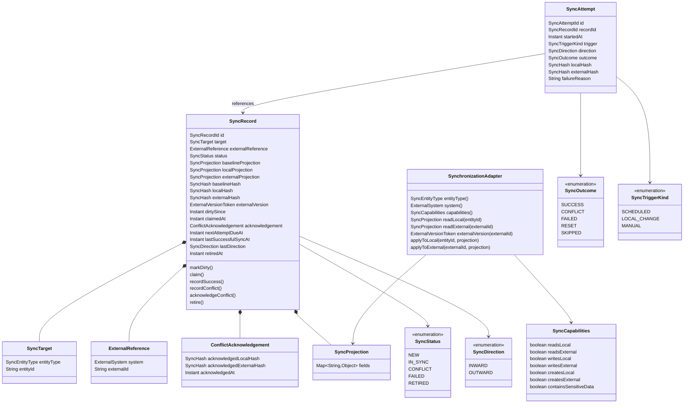
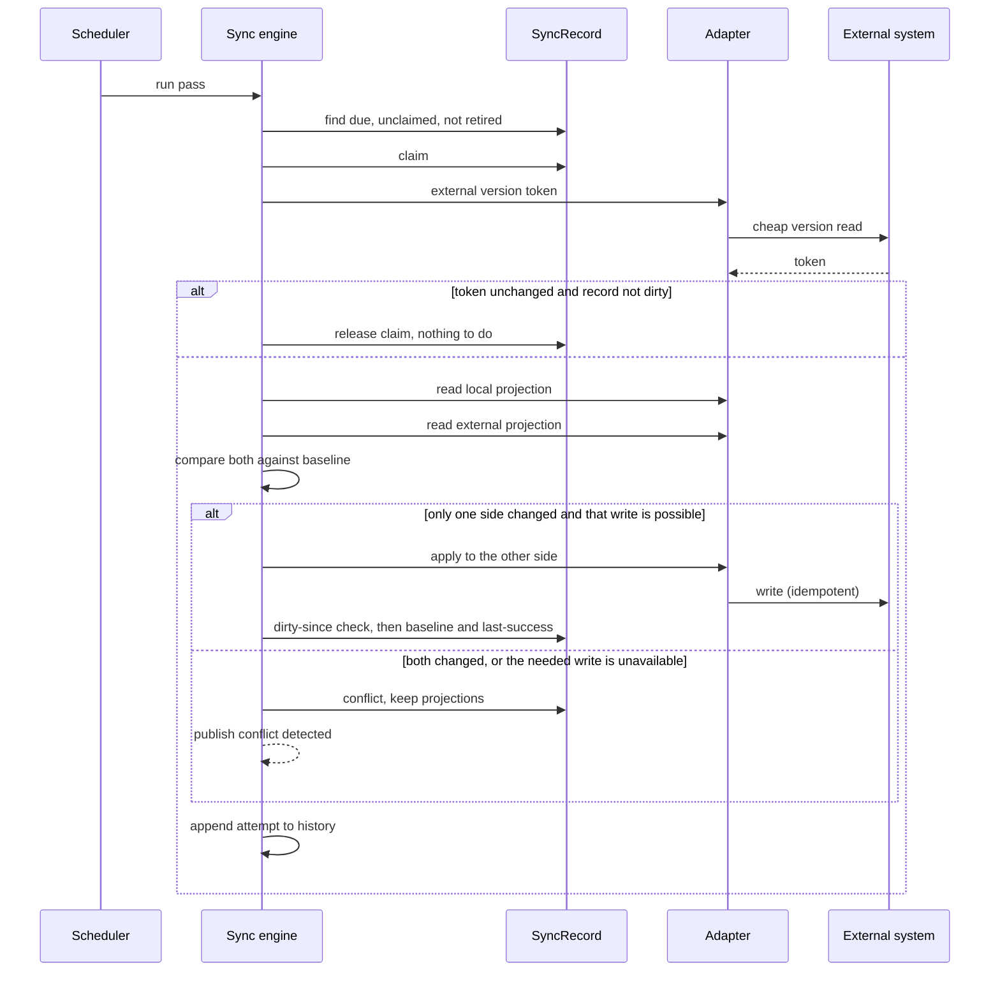

## Context

Synchronisation with ORIS exists today as one concrete pull path inside the events module. `OrisEventImportService.syncEventFromOris` fetches the upstream event and overwrites every ORIS-owned field on the local aggregate. Two protections exist, both by field ownership rather than by change detection: categories added manually in Klabis (`orisId == null`) survive because ORIS does not own them, and `applyAutoMappedEventType` only fills an event type that is still empty. Everything ORIS does own is replaced without asking, and a manager's correction to it disappears.

The external side constrains what is even possible. The ORIS API offers no way to write an event back — there is no `updateEvent` — so events are structurally pull-only. Persons and club memberships do have write operations (`createPerson`, `editPerson`, `createClubUser`, `editClubUser`), and entries have a full create/update/delete set, so those are genuinely two-way. A synchronisation engine therefore cannot assume symmetry; it must let each integration declare what it can do, and behave correctly when a change appears on a side that cannot be written.

The engine is the deliverable of this change. Event synchronisation is migrated onto it to prove the whole loop against real data; member synchronisation is a later change and only shapes the contract here.

## Goals / Non-Goals

**Goals**

- One mechanism for change detection, conflict handling, retry and audit, usable by any entity and any external system.
- No silent data loss: a change that cannot be propagated safely stops the record and asks a human.
- The direction of a synchronisation is derived from what actually changed, and can be overridden explicitly.
- Persistent synchronisation state that answers "when was this last in agreement, and what happened since".
- The existing ORIS event synchronisation keeps its endpoints, affordances and frontend.

**Non-Goals**

- Implementing member synchronisation. The contract must accommodate it; this change does not build the adapter.
- Automatic conflict resolution or merging of any kind, including merging disjoint field changes.
- A user interface for synchronisation state or conflict resolution.
- Bulk/batch external calls. The engine is record-oriented for now.
- A global cross-entity conflict overview.
- Creating entities in either direction. The contract permits an integration to declare the capability; no integration uses it here.

## Decisions

### D1: A new top-level `sync` module, unaware of any external system

The engine lives in `com.klabis.sync` with `application`, `domain` and `infrastructure` packages, following the module layout every other module uses, and exposes its primary port through `@NamedInterface("application")` per ADR-001. A synchronisation record carries an external-system discriminator, and no type in the module names ORIS.

*Rejected:* placing the engine inside the existing `oris` module. It would inherit the `oris` profile gating for free, but welds a generic mechanism to the one integration that exists today, and a second integration would force the move anyway. *Rejected:* placing it in `common`. `common` holds infrastructure primitives (encryption, rate limiting, HATEOAS helpers); a persisted aggregate with business rules is a different kind of thing.

### D2: Adapters live in the integration's own module; the mapping between the two identities lives only in the synchronisation record

The ORIS event adapter lives in `com.klabis.oris.sync`, implements the adapter contract published by the `sync` module, and reaches domain data through `events.application` — the direction `OrisController` already takes. The `events` and `members` modules therefore gain no knowledge of ORIS, and `Event` and `Member` gain no external identifier fields: the pairing between a Klabis entity and its external counterpart is held by the synchronisation record alone.

This matters most for members, where ORIS has two identifiers per person (`userid` for the person, `clubuser` for the club membership) that would otherwise both have to be modelled on the aggregate.

*Consequence:* `OrisEventImportService` currently sits in `events.application` and imports the ORIS client directly. Its synchronisation path moves out to the adapter; its first-time import path stays where it is for now, so this change does not turn into a rewrite of the import flow.

### D3: The adapter declares its capabilities and yields a canonical projection per side

An adapter states what it can do — read the local side, read the external side, write the local side, write the external side, create on either side — and the engine resolves direction only among the operations that exist. A pull-only integration is a first-class, declared fact rather than a method that throws.

The adapter maps both sides into a **canonical projection**: one field set, the same shape for the local entity and the external payload. The engine hashes and compares that projection and never looks at the entities themselves. This gives three properties:

- Fields Klabis owns exclusively — a category fee override, a manually added category, the event type — are simply absent from the projection, so editing them is not a change as far as synchronisation is concerned. The field-ownership protection that exists today is preserved by construction rather than by special-casing.
- Because both sides share one shape, a divergence can be reported per field.
- An adapter may additionally offer a cheap **external version token** (ORIS `getEventListVersions` returns id and version only). When the token is unchanged since the last check, the engine skips fetching the external payload entirely. Adapters without one fall back to a full read.

*Rejected:* per-side raw snapshots in each side's natural shape. Simpler adapters, but diffing two different shapes is meaningless, so conflict reporting would degrade to "something differs". *Rejected:* deriving the projection reflectively from the aggregate. Least adapter code, but it drags integration-shaped mapping concerns into domain classes and copes badly with value objects such as `Money` or `RegistrationDeadlines`.

### D4: Three-way comparison — hashes decide, snapshots explain

Two current hashes can only say *that* the sides differ. To say *who moved*, the record keeps the baseline captured at the last successful synchronisation, and compares both current hashes against it:

| local vs baseline | external vs baseline | resolution |
|---|---|---|
| unchanged | unchanged | nothing to do |
| changed | unchanged | write outward (or conflict — see D6) |
| unchanged | changed | write inward |
| changed | changed | conflict |

The record stores the baseline, local and external **projections**, not only their hashes, so that a conflict can name the fields that diverged by comparing the three in memory.

### D5: The first encounter adopts the external side

A newly enrolled record has no baseline. The first pass reads the external side, writes it inward, and sets the baseline to the result. This matches what ORIS-imported events do today and gets every record into a known-good state.

*Rejected:* treating an initial divergence as a conflict. Stricter, but it would mean enrolment produces conflicts for entities nobody has touched. *Rejected:* blessing the current state as the baseline without reconciling, which permanently hides a divergence that exists at enrolment time.

### D6: A local change that cannot be written outward is a conflict, not an overwrite

When direction resolution says "write outward" but the adapter declares no outward write — the Event case, since ORIS has no `updateEvent` — the engine does not fall back to pulling. It raises a conflict. Either the local edit is legitimate and must survive, or it was a mistake and a manager discards it by forcing a pull; the engine does not decide which.

**This is the behaviour change of this proposal.** Today that edit is silently overwritten. It is also the only way to satisfy the losslessness requirement for pull-only entities.

*Rejected:* pulling and writing the discarded local projection into the audit history. It keeps today's workflow and makes the lost edit recoverable, but it still destroys the edit in the live entity by default.

### D7: Conflicts are re-evaluated every pass, and an acknowledgement is bound to what it acknowledged

A conflicted record is recomputed on each pass. If a side has reverted and the divergence is gone, the conflict clears and normal synchronisation resumes. Nothing is written in either direction while the conflict stands.

Because a conflict can clear itself, resolution is two steps and the first is bound to the state it was made against: a manager **acknowledges** a conflict, and the acknowledgement records the local and external hash pair that was current at that moment. A forced direction is accepted only while the record still shows that pair. If either side moved in the meantime the acknowledgement is stale, the call is rejected, and the manager re-reads the record. Without this binding, an acknowledgement made against one collision could be used to force a write against a different one.

### D8: Resolution over REST, no interface, no global conflict list

The workflow is: read the record, acknowledge the conflict, force a direction. Originally this was to be done by editing the record's JSON in the database directly; over REST it is authenticated, permission-checked, and available to a UI later without engine changes.

There is deliberately no cross-entity conflict overview. Synchronisation resources are nested under their entity (D14), so a stuck record is discovered through the conflict-detected domain event, which nothing consumes yet.

*Accepted consequence:* until something consumes that event, a conflicted record is invisible unless someone looks at that specific entity. Recorded in Risks.

### D9: Three triggers, and a dirty marker that closes the mid-pass race

A pass is started by the scheduler, by a local domain event, or by an explicit call. The domain-event trigger marks the record dirty rather than synchronising inline, so a burst of local edits collapses into one pass.

That same marker solves the concurrency hazard. A pass reads the local projection, then calls the external system, then writes the baseline; a local edit landing between the read and the baseline write would otherwise be recorded as synchronised and never propagate — a silent lost update. The record therefore carries **dirty-since**: set when a local change is observed, checked before the baseline is written. If the entity became dirty after the projection was read, the baseline is not written and the record stays due for the next pass.

This reuses the dirty marking that the domain-event trigger requires anyway, and needs neither an aggregate version check nor a second local read.

*Note:* the members module publishes created, suspended and resumed events but has no member-updated event, so an ordinary profile edit is silent today. A member adapter will need one; it is listed in the proposal's impact.

### D10: Retry — Resilience4j inside an attempt, a due date across passes, the count derived from history

Two different failure durations need two different mechanisms:

- **Within one attempt**, a Resilience4j retry absorbs transient transport blips. Configured as a named instance in `application.yml`, alongside the existing rate limiter configuration.
- **Across passes**, the record carries a **next-attempt-due** timestamp. The scan only picks up records that are due, and the delay grows with the number of failures since the last success. Without it a persistently failing record would hit the external system on every single pass until it terminated.

The failure count is **derived from the attempt history** rather than denormalised onto the record: "attempts since the most recent success or reset". One source of truth, no drift, at the cost of a query that happens in the transaction that is already writing an attempt row. It requires an index on the history by record and time.

This has a direct consequence: **a manual reset must itself be recorded as an attempt** with a `RESET` outcome. There is no counter column to zero, so without a reset row the derived count never drops and the record would terminate again on its next failure.

The engine classifies failures by exception type — transport and server-side errors are retryable, everything else is terminal on the spot. When the retryable attempts since the last success exceed the configured limit, the record becomes terminally failed: skipped by the scheduler, emitting an event, waiting for a manager to reset it.

### D11: An outage of the external system ends the pass

A circuit breaker around the external client opens after repeated failures and the remaining records in the pass are left untouched, rather than each one attempting, failing and consuming its retry budget. Records already attempted during the outage keep the failures they recorded; the pass simply stops early.

### D12: No in-flight state; outward writes must be idempotent; a claim prevents overlap

An external write followed by a process death before the record is updated leaves the record looking unsynchronised, and the next pass writes again. This is accepted rather than guarded by a pre-commit in-flight marker: the adapter contract requires an outward write to be idempotent — a full-state update, which is what the ORIS write operations are — and repeating one is harmless.

External calls are made outside any database transaction: read and snapshot in one short transaction, call the external system with no transaction open, persist the outcome in a second short transaction. Holding a connection across an HTTP call is what exhausts the pool.

Overlap between a scheduled pass and a manual trigger is prevented per record: a record is **claimed** with a timestamp before work starts, and a second attempt skips a record whose claim is still fresh. A lease timeout releases a claim orphaned by a crash. A per-record claim, rather than a single global pass lock, keeps a manual synchronisation of one entity working while the scheduler processes others.

### D13: Snapshots are encrypted; hashes cover the whole projection only

A member projection contains personal data, including the birth number — which can legitimately be corrected upstream and therefore must be part of what is reconciled, not excluded from it. The three snapshot columns are consequently encrypted at rest, reusing `EncryptedString` and the converters already registered globally in `JdbcConfiguration`, so encryption is transparent to the aggregate. The columns are `TEXT`, not the `VARCHAR(255)` that suffices for a birth number.

Two properties follow and must not be lost later:

- **Hashes are computed over the whole projection and stored in plaintext.** A hash of a complete projection is not a lookup oracle. A *per-field* hash of a birth number would be — the keyspace is small enough to brute-force in seconds, and an encrypted column standing next to a crackable hash of the same value protects nothing. Field-level divergence is therefore computed by decrypting the projections and comparing in memory, never by storing per-field hashes.
- **Snapshots are derived data.** Unlike the birth number on the member aggregate, a snapshot can be rebuilt by re-reading both sides. If the encryption key rotates or a snapshot fails to decrypt, the recovery is to clear snapshots and let the next pass rebuild them — no re-encryption migration is needed.

The encryption is randomly salted per call, so re-saving an identical projection produces different ciphertext. Nothing may treat the stored column as a change signal; comparison lives entirely in the hash columns.

The attempt history stores hashes and never snapshots, keeping personal data in exactly one table. This is deliberate and should stay that way.

### D14: `SYNC:MANAGE` authority, plus an access event for sensitive snapshots

A new global `SYNC:MANAGE` authority gates the synchronisation operations.

Because a member snapshot contains data the members API protects field by field, and reading it through the synchronisation API would bypass both that check and the birth-number audit log, the engine emits a **sensitive-snapshot-accessed** event when serving a snapshot whose adapter declares it contains sensitive fields. The `members` module listens and writes its existing audit log, exactly as it does for reads through its own API.

*Accepted consequence:* a `SYNC:MANAGE` holder can read member contact data without holding `MEMBERS:READ`. Requiring the entity's own authority in addition would close this; it was considered and not taken. Recorded in Risks.

### D15: Attempt history as the audit trail; domain events only for what strands work

Every attempt appends a row: when, what triggered it, direction, outcome, the two hashes, and a failure reason. The record itself carries the last successful synchronisation time and direction, which is the audit requirement in its narrow form.

Domain events are published only for **conflict detected** and **terminal failure** — the two states where work stops and nobody is told. Successful synchronisations are not published: they are the high-volume case and the history table already records them. Event payloads carry identifiers, direction, outcome and hashes only, never projections, so that no personal data reaches the retained `event_publication` table (`completion-mode: UPDATE` keeps completed publications).

The trigger kind is recorded; the acting user is not.

*Accepted consequence:* a forced directional synchronisation — the one operation that deliberately discards data — is recorded without naming who performed it. Recorded in Risks.

### D16: Record-oriented contract; batching deferred

The engine drives one record at a time and the adapter only ever handles a single entity. A batch read (one ORIS call for many events instead of one per event) is a natural extension of the contract and is deliberately postponed until an adapter feels the rate-limit pressure. The external version token (D3) removes much of the pressure in the meantime.

### D17: Integrations enrol explicitly; retired records are kept

An integration enrols an entity when it becomes synchronisable — an event when it is imported from ORIS, a member when it is linked to an ORIS person. The engine never enumerates entities on its own and needs no way to do so.

When the entity reaches the end of its life — an event finished or cancelled, a member deactivated — the record is **retired**: no longer scanned, but kept with its history and last-synchronisation information intact.

No backfill is needed. The database is in-memory and starts empty on every run, and there is no deployed environment.

### D18: Existing ORIS endpoints keep their paths, with the engine behind them

`POST /api/events/{id}/sync-from-oris`, `POST /api/events/sync-from-oris/all-upcoming` and the `syncEventFromOris` affordance keep their operation identifiers and URLs; they delegate to the engine. The frontend needs no change for the unchanged-data path. The new behaviour — a conflict blocking a synchronisation — surfaces as a new error response on the existing endpoint plus the new nested resources.

## Target Domain Model



| Element | Kind | Change | Description |
|---|---|---|---|
| `SyncRecord` | Aggregate root | Added | The synchronisation state of one entity against one external system. Owns direction resolution inputs, conflict state, retry scheduling and last-success information. |
| `SyncAttempt` | Aggregate root (append-only) | Added | One recorded attempt. Separate from `SyncRecord` because the history is unbounded and must not be loaded with the record. Queried to derive the failure count. |
| `SyncTarget` | Value object | Added | Which Klabis entity a record belongs to: entity type plus its identifier as an opaque string, so the engine depends on no module's identifier type. |
| `ExternalReference` | Value object | Added | The counterpart identity in the external system. Holds the whole external identity, including composite cases such as the ORIS person and club-membership identifiers. |
| `SyncProjection` | Value object | Added | The canonical field set of one side, in a shape shared by both sides. Hashed for comparison and diffed for conflict reporting. |
| `SyncHash` | Value object | Added | The digest of a whole projection. Never a per-field digest (D13). |
| `ExternalVersionToken` | Value object | Added | An opaque cheap change indicator from the external system, when it offers one. |
| `ConflictAcknowledgement` | Value object | Added | The hash pair a manager acknowledged, and when. Makes a forced direction valid only against the collision it was granted for. |
| `SyncCapabilities` | Value object | Added | What an integration can do for an entity type, including whether its projections contain sensitive data. |
| `SynchronizationAdapter` | Secondary port | Added | The contract an integration implements. Published by the `sync` module, implemented in the integration's module. |
| `SyncStatus`, `SyncDirection`, `SyncOutcome`, `SyncTriggerKind`, `SyncEntityType`, `ExternalSystem` | Enumerations | Added | Record state, resolved direction, attempt result, what started a pass, and the two discriminators. |
| `SyncConflictDetected`, `SyncTerminallyFailed`, `SensitiveSnapshotAccessed` | Domain events | Added | Published by the engine. The first two carry identifiers, direction and hashes; the third names the entity whose sensitive snapshot was served. |
| `SynchronizationPort` | Primary port | Added | Enrol, synchronise now, read state, acknowledge a conflict, force a direction, reset a failed record, retire. |
| `MemberUpdatedEvent` | Domain event | Added | In `members`. Does not exist today; needed so a local member change can mark a record dirty. |
| `Event.syncFromOris` | Aggregate command | Changed | Becomes the inward write invoked by the adapter rather than the whole synchronisation. Its field-ownership merge behaviour for categories is unchanged. |
| `Authority.SYNC_MANAGE` | Enumeration constant | Added | Global authority gating synchronisation operations. |

### How a pass runs



## REST API

New resources are nested under the entity, per D14. The events module hosts the event-facing ones; a later member adapter adds the equivalent under `/api/members/{id}`.

All new operations require the `SYNC:MANAGE` authority. Specifications are hand-written in `docs/openapi/spec/events.yaml` following the spec-first workflow.

### Read synchronisation state

`GET /api/events/{id}/sync` → `200 OK`

```json
{
  "status": "CONFLICT",
  "externalSystem": "ORIS",
  "externalId": "8123",
  "lastSuccessfulSyncAt": "2026-08-24T02:00:11Z",
  "lastDirection": "INWARD",
  "nextAttemptDueAt": null,
  "failedAttemptsSinceLastSuccess": 0,
  "divergedFields": ["name", "registrationDeadlines.first"],
  "local": { "name": "Krajský žebříček – sprint", "...": "..." },
  "external": { "name": "Krajský žebříček Morava – sprint", "...": "..." },
  "acknowledgement": null,
  "_links": { "self": {...}, "event": {...} }
}
```

`local` and `external` are the decrypted projections; serving them on a record whose adapter declares sensitive data emits the access event (D13, D14). `divergedFields` is present only in `CONFLICT`.

Affordances on `self`, rendered per state:

| Affordance | Shown when | Operation |
|---|---|---|
| `synchronizeNow` | status `IN_SYNC` or `NEW` | `syncEventFromOris` (existing operation) |
| `acknowledgeSyncConflict` | status `CONFLICT`, not yet acknowledged | `acknowledgeSyncConflict` |
| `resolveSyncConflict` | status `CONFLICT`, acknowledged and still current | `resolveSyncConflict` |
| `resetSyncRecord` | status `FAILED` | `resetSyncRecord` |

### Acknowledge a conflict

`POST /api/events/{id}/sync/acknowledgement` — operation `acknowledgeSyncConflict`

Request body: none. The server binds the acknowledgement to the record's current hash pair.

- `200 OK` — acknowledgement recorded, `resolveSyncConflict` affordance now present.
- `409 Conflict` — the record is not in `CONFLICT`.

### Force a direction

`POST /api/events/{id}/sync/resolution` — operation `resolveSyncConflict`

```json
{ "direction": "INWARD" }
```

- `200 OK` — the chosen side was written, the baseline reset, the conflict cleared.
- `409 Conflict` — no acknowledgement, or the acknowledged hash pair is no longer current (either side moved), or the requested direction is not supported by the integration. The response names which.

For an event, `OUTWARD` is always rejected: the ORIS integration declares no outward write for events.

### Reset a terminally failed record

`POST /api/events/{id}/sync/reset` — operation `resetSyncRecord`

Request body: none. Appends a `RESET` attempt so the derived failure count restarts (D10), clears the due date, and returns the record to `IN_SYNC`.

- `200 OK`
- `409 Conflict` — the record is not in `FAILED`.

### Existing operations

`POST /api/events/{id}/sync-from-oris` and `POST /api/events/sync-from-oris/all-upcoming` keep their paths, operation identifiers and the `syncEventFromOris` affordance. New failure mode: `409 Conflict` when the record is in `CONFLICT` or `FAILED`, with a problem detail pointing at the sync sub-resource.

`GET /api/events/{id}` gains a `sync` link when the event is enrolled, so a client reaches the state resource by navigation.

## Persistence

Two tables in `V001` (the project adds no new migration scripts).

`sync_record` — one row per entity per external system, unique on `(entity_type, entity_id, external_system)` and on `(external_system, external_id, entity_type)`. Projection columns are `TEXT` and encrypted; hash columns are plaintext. Carries the claim timestamp, dirty-since, acknowledgement hash pair, next-attempt-due, last-success information, retired-at, and a version column for optimistic locking as every other memento has.

`sync_attempt` — append-only, indexed on `(sync_record_id, started_at DESC)` for the "attempts since last success or reset" query. Holds no projections.

## Frontend

No frontend work in this change. The existing "Synchronizovat" action keeps working; when the backend answers `409` the existing error handling surfaces the problem detail. A conflict-resolution interface is a later change, and the API above is shaped so it needs no engine change.

## Glossary

| Term | Meaning |
|---|---|
| **Synchronisation record** | The persistent state of one Klabis entity paired with its counterpart in one external system. |
| **Canonical projection** | The field set exchanged for one entity, in one shape shared by both sides. The unit of comparison; fields outside it are invisible to synchronisation. |
| **Baseline** | The projection and hash captured at the last successful synchronisation. The reference point that makes "which side changed" answerable. |
| **Direction** | Inward (external system → Klabis) or outward (Klabis → external system). |
| **Conflict** | Both sides changed since the baseline, or the local side changed and the integration cannot write outward. Never resolved by the system. |
| **Acknowledgement** | A manager's confirmation that they have seen a specific collision, bound to the hash pair current at that moment. |
| **Claim** | A short-lived hold on a record that stops two passes from working on it at once. |
| **Dirty-since** | When the local entity was last observed to change. Marks a record due, and prevents a baseline being written over an edit that landed mid-pass. |
| **Retired record** | A record whose entity has reached the end of its life. Kept for its history, never scanned again. |
| **Terminal failure** | Retryable attempts since the last success exceeded the limit. The record stops attempting and waits for a manual reset. |
| **External version token** | An opaque value from the external system that changes when the entity changes, letting the engine skip a full read. |
| **Synchronisation adapter** | An integration's implementation for one entity type and one external system: declared capabilities, projections for both sides, and the writes it supports. |

## Risks / Trade-offs

| Risk | Trade-off taken |
|---|---|
| A conflicted record is invisible until someone opens that entity — no cross-entity overview, and nothing consumes the conflict event yet. | Accepted (D8). The event exists so a consumer, or a `syncStatus` filter on entity lists, can be added without touching the engine. |
| A `SYNC:MANAGE` holder reads member contact data without `MEMBERS:READ`, bypassing field-level authorisation. | Accepted (D14). The access event preserves the audit trail; requiring the entity's authority in addition remains available. |
| A forced directional synchronisation discards data and is recorded without naming who did it. | Accepted (D15). Adding the acting user is additive to the attempt history. |
| An interrupted pass can repeat an outward write. | Accepted (D12) by requiring outward writes to be idempotent, which the ORIS write operations are. An adapter with a non-idempotent write cannot be added without revisiting this. |
| The behaviour change surprises managers: an edit that used to vanish now blocks synchronisation. | Intended (D6). The spec change makes it explicit, and the affordances put the resolution where the manager already is. |
| Encrypted projections are decrypted on every comparison, three per record per pass. | Acceptable at club scale (hundreds of records, one pass a night). Worth measuring before any batch mode is added. |
| Personal data now lives in `sync_record` as well as `members`. | Contained by keeping projections out of the attempt history and out of event payloads, and by encrypting the columns. Recorded in the non-functional spec. |

## Migration Plan

1. Build the `sync` module with a test-only adapter exercising every path — inward, outward, conflict, unavailable-write conflict, retry, terminal failure, reset, retirement — with no ORIS involvement.
2. Add `SYNC:MANAGE` and the persistence, including the encrypted projection columns.
3. Write the ORIS event adapter in `oris.sync`, reusing the mapping already in `OrisEventImportService`, declaring inward-only capabilities and the `getEventListVersions` token.
4. Enrol events on ORIS import; retire on finish and cancel.
5. Move `syncEventFromOris` behind the engine, keeping the endpoint. Replace the `OrisBulkSyncService` loop with a scheduled pass over due records.
6. Add the nested sync resources and affordances.

No data migration: the database starts empty on every run, and there is no deployed environment. Steps 1–2 are independently committable and change no existing behaviour; the observable change lands at step 5.

## Open Questions

1. **Retry limits.** The number of retryable attempts before terminal failure, the growth of the due-date delay, and the circuit-breaker thresholds are configuration; sensible defaults need choosing (proposal assumes a nightly pass).
2. **Claim lease duration.** Long enough to outlast a slow external call, short enough that a crashed pass does not strand a record until the next day.
3. **Attempt history retention.** Append-only with no pruning is fine for now; a retention rule belongs in the non-functional spec before any long-lived deployment.
4. **Member projection contents.** The exact field set, and how the two ORIS identifiers are represented in one external reference, are settled when the member adapter is designed — not here.
