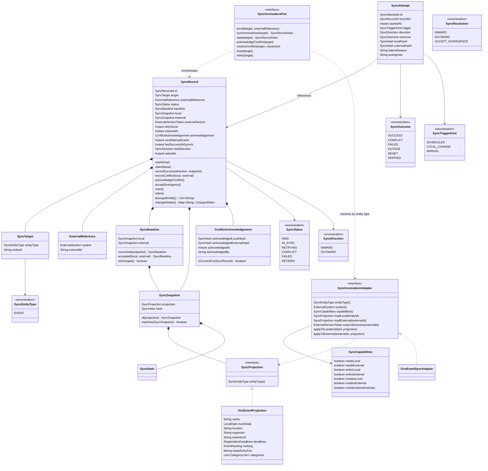
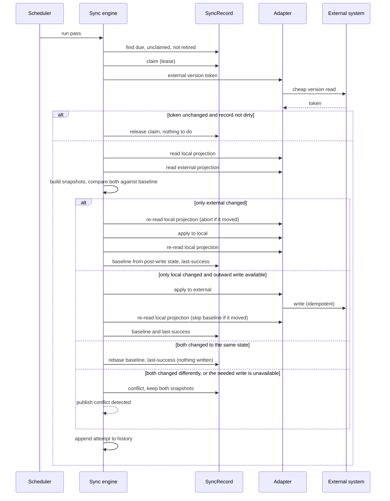

## Context

Synchronisation with ORIS exists today as one concrete pull path inside the events module. `OrisEventImportService.syncEventFromOris` fetches the upstream event and overwrites every ORIS-owned field on the local aggregate. Two protections exist, both by field ownership rather than by change detection: categories added manually in Klabis (`orisId == null`) survive because ORIS does not own them, and `applyAutoMappedEventType` only fills an event type that is still empty. Everything ORIS does own is replaced without asking, and a manager's correction to it disappears.

The external side constrains what is even possible. The ORIS API offers no way to write an event back — there is no `updateEvent` — so events are structurally pull-only. Persons and club memberships do have write operations, and entries have a full create/update/delete set, so those would be genuinely two-way. A synchronisation engine therefore cannot assume symmetry; it must let each integration declare what it can do, and behave correctly when a change appears on a side that cannot be written.

The engine is the deliverable of this change. Event synchronisation is migrated onto it to prove the whole loop against real data. Member synchronisation is out of scope — no adapter, no `members` module changes — and appears here only as the case the contract must be able to accommodate later.

## Goals / Non-Goals

**Goals**

- One mechanism for change detection, conflict handling, retry and audit, usable by any entity and any external system.
- No silent data loss: a change that cannot be propagated safely stops the record and asks a human.
- The direction of a synchronisation is derived from what actually changed, and can be overridden explicitly.
- Persistent synchronisation state that answers "when was this last in agreement, and what happened since".
- The existing ORIS event synchronisation keeps its endpoints, affordances and frontend.

**Non-Goals**

- Member synchronisation, in any form. No member adapter, no member projection, no changes to the `members` module — no new domain event and no listener there.
- Automatic conflict resolution or merging of any kind, including merging disjoint field changes.
- A user interface for synchronisation state or conflict resolution.
- Bulk/batch external calls. The engine is record-oriented for now.
- A global cross-entity conflict overview.
- Creating entities in either direction. The contract permits an integration to declare the capability; no integration uses it here.

## Decisions

### D1: A new top-level `sync` module, unaware of any external system

The engine lives in `com.klabis.sync` with `application`, `domain` and `infrastructure` packages, following the module layout every other module uses, and exposes its primary port through `@NamedInterface("application")` per ADR-001. A synchronisation record carries an external-system discriminator, and no type in the module names ORIS.

*Rejected:* placing the engine inside the existing `oris` module. It would inherit the `oris` profile gating for free, but welds a generic mechanism to the one integration that exists today, and a second integration would force the move anyway. *Rejected:* placing it in `common`. `common` holds infrastructure primitives (encryption, rate limiting, HATEOAS helpers); a persisted aggregate with business rules is a different kind of thing.

### D2: Adapters live in the integration's own module; the mapping between the two identities lives only in the synchronisation record

The ORIS event adapter lives in `com.klabis.oris.eventsync`, implements the adapter contract published by the `sync` module, and reaches domain data through `events.application` — the direction `OrisController` already takes. The `events` module therefore gains no knowledge of ORIS internals it does not already have, and `Event` gains no external identifier fields beyond the `orisId` it already carries: the pairing between a Klabis entity and its external counterpart is held by the synchronisation record.

This matters most for entities whose external identity is composite — an ORIS person has both a person identifier and a club-membership identifier — which the record can hold without forcing either onto the aggregate.

*Consequence:* `OrisEventImportService` currently sits in `events.application` and imports the ORIS client directly. Its synchronisation path moves out to the adapter; its first-time import path stays where it is for now, so this change does not turn into a rewrite of the import flow.

### D3: The adapter declares its capabilities and yields a canonical projection per side

An adapter states what it can do — read the local side, read the external side, write the local side, write the external side, create on either side — and the engine resolves direction only among the operations that exist. A pull-only integration is a first-class, declared fact rather than a method that throws.

The adapter maps both sides into a **canonical projection**: one field set, the same shape for the local entity and the external payload. The engine hashes and compares that projection and never looks at the entities themselves. This gives three properties:

- Fields Klabis owns exclusively — a category fee override, a manually added category, the event type — are simply absent from the projection, so editing them is not a change as far as synchronisation is concerned. The field-ownership protection that exists today is preserved by construction rather than by special-casing.
- Because both sides share one shape, a divergence can be reported per field.
- An adapter may additionally offer a cheap **external version token**. When the token is unchanged since the last check, the engine skips fetching the external payload entirely. Adapters without one fall back to a full read — the ORIS event adapter is one: `oris-client` offers no cheap per-event or per-list version signal (`getEventList` returns no version field, and `EventDetails.version()` is only reachable after the full read the token would exist to avoid), so it returns no token and every pass falls back to a full read.

**`SyncProjection` is an interface, implemented per entity type.** The engine handles projections only through that interface — serialise, deserialise, compare field by field — and never knows the concrete shape. Each integration contributes a concrete projection that is a plain data carrier with no behaviour, so that:

- it serialises to and from JSON directly, with no bespoke mapping layer;
- its hash is computed from that serialisation, over a canonicalised form (stable field order, normalised null and numeric representation) so that two equal projections always hash equally. Numeric normalisation is the trap to name explicitly: `Money`/`BigDecimal` must canonicalise scale (`100` and `100.00` are the same amount and must hash identically), and the two sides must parse into the same numeric type before hashing — otherwise every pass reports a phantom change on amount fields;
- a divergence report is produced by comparing the deserialised field sets, without the engine knowing what the fields mean.

The ORIS event projection is the only implementation in this change.

*Rejected:* a single generic map-based projection type. It would spare integrations a type, but loses compile-time shape, makes the "same shape both sides" property unenforceable, and turns every field access into an untyped lookup. *Rejected:* per-side raw snapshots in each side's natural shape — diffing two different shapes is meaningless, so conflict reporting would degrade to "something differs". *Rejected:* deriving the projection reflectively from the aggregate; it drags integration-shaped mapping concerns into domain classes and copes badly with value objects such as `Money` or `RegistrationDeadlines`.

### D4: Three-way comparison — hashes decide, projections explain

Two current hashes can only say *that* the sides differ. To say *who moved*, the record keeps a **baseline pair** — the local and the external snapshot captured at the last reconciliation — and compares each side's current hash against its own baseline. After an ordinary synchronisation the two baselines are identical; they differ only while an **accepted divergence** stands (see below).

| local vs baselineLocal | external vs baselineExternal | resolution |
|---|---|---|
| unchanged | unchanged | nothing to do |
| changed | unchanged | write outward (or conflict — see D6) |
| unchanged | changed | write inward — but only while the baselines are equal; with a standing accepted divergence this is a conflict |
| changed | changed, both current hashes equal | converged — rebase both baselines onto the shared state, write nothing |
| changed | changed, current hashes differ | conflict |

The convergence row is not a corner case to be polite about: it is the normal state of a record one pass after an inward write (D9 explains why), and it also covers two sides receiving the same correction independently. Treating it as a conflict would raise conflicts nobody can act on — both sides already agree.

The guard on the inward row is what makes an accepted divergence safe: a manager who has decided that the local value deliberately differs from the external one (D6) must never have that decision silently undone by the next external change. While the baselines differ, any further external movement stops and asks again.

**A projection and its hash always travel together, as one value object: `SyncSnapshot`.** The record holds the baseline pair (as a `SyncBaseline` value object) plus the current local and external snapshot — rather than eight loosely related fields. A hash that does not belong to its projection is the one inconsistency that would silently corrupt every decision the engine makes, so the domain makes it unrepresentable: a snapshot is built from a projection, computes its own hash, and neither half can be replaced independently.

Keeping the projections (not just their hashes) is what allows a conflict to name the fields that diverged, by comparing the three snapshots in memory.

### D5: The first encounter adopts the external side

A newly enrolled record has no baseline. The first pass reads the external side, writes it inward, and sets the baseline from the post-write re-read of the local side (D9). This matches what ORIS-imported events do today and gets every record into a known-good state.

*Rejected:* treating an initial divergence as a conflict. Stricter, but it would mean enrolment produces conflicts for entities nobody has touched. *Rejected:* blessing the current state as the baseline without reconciling, which permanently hides a divergence that exists at enrolment time.

### D6: A local change that cannot be written outward is a conflict, not an overwrite

When direction resolution says "write outward" but the adapter declares no outward write — the Event case, since ORIS has no `updateEvent` — the engine does not fall back to pulling. It raises a conflict. Either the local edit is legitimate and must survive, or it was a mistake and a manager discards it by forcing a pull; the engine does not decide which.

**This is the behaviour change of this proposal.** Today that edit is silently overwritten. It is also the only way to satisfy the losslessness requirement for pull-only entities.

A conflict on a pull-only entity therefore has three exits, all of them a human decision:

1. **Force `INWARD`** — the edit was a mistake; discard it and pull.
2. **Correct the external system** — the edit was right and the manager can write there (their own event in ORIS). The next pass finds both sides equal, lands on the convergence row of D4, and the conflict clears itself (D7). No engine operation is involved.
3. **`ACCEPT_DIVERGENCE`** — the edit was right and the manager *cannot* write there (a foreign event in ORIS, which is most of the calendar). The resolution sets the baseline pair to the current local and external snapshots, writes nothing in either direction, and clears the conflict. The local value now deliberately differs from the external one; the inward guard in D4 guarantees that any later external change raises a new conflict instead of silently overwriting the accepted value, so the manager re-decides against the new external state.

Without the third exit, a legitimate edit to a foreign event would leave the record in conflict forever, blocking every future inward update — losslessness would be deferred, not achieved. `ACCEPT_DIVERGENCE` is deliberately symmetric (it accepts the current *pair*, not one side), so it serves the mirrored case on a future push-only integration unchanged.

*Rejected:* pulling and writing the discarded local projection into the audit history — whether automatically or on a forced `INWARD` resolution. It would make the lost edit recoverable, but it breaks the invariant that payload data lives in exactly one table (D13), and the two explicit confirmations (acknowledge, then resolve) already stand between a manager and the mistake it would insure against. *Rejected:* excluding the diverged fields from the projection per record (field-level ownership override). It would avoid the recurring re-confirmation, but it is field-level merging by another name, contradicts the non-goal, and makes the projection's meaning record-dependent.

### D7: Conflicts are re-evaluated every pass, and an acknowledgement is bound to what it acknowledged

A conflicted record is recomputed on each pass. If a side has reverted and the divergence is gone, the conflict clears and normal synchronisation resumes. Nothing is written in either direction while the conflict stands.

Because a conflict can clear itself, resolution is two steps and the first is bound to the state it was made against: a manager **acknowledges** a conflict, and the acknowledgement records the local and external hash pair that was current at that moment. Without this binding, an acknowledgement made against one collision could be used to force a write against a different one.

**A resolution never trusts the stored snapshots.** The record's external snapshot is only as fresh as the last pass — the external side may have moved since without the record knowing — so validating the acknowledgement against stored state would let a manager unknowingly approve writing data they never saw. A resolution therefore begins by re-reading both sides through the adapter and proceeds only if the fresh hash pair still equals the acknowledged one; the fresh projections are also what the resolution then writes or adopts. If the pair differs, the call is rejected, the record's snapshots are refreshed from the fresh reads, and the manager re-reads and decides against the new collision.

A residual window remains between the fresh re-read and the write, and it is accepted: it shrinks the exposure from "since the last pass" (potentially days) to seconds, an inward write is additionally guarded by the aggregate's optimistic lock, and outward writes are idempotent full-state updates (D12).

### D8: Resolution over REST, no interface, no global conflict list

The workflow is: read the record, acknowledge the conflict, force a direction. Originally this was to be done by editing the record's JSON in the database directly; over REST it is authenticated, permission-checked, and available to a UI later without engine changes.

There is deliberately no cross-entity conflict overview. Synchronisation resources are addressed per entity (D14), so a stuck record is discovered through the conflict-detected domain event, which nothing consumes yet.

*Accepted consequence:* until something consumes that event, a conflicted record is invisible unless someone looks at that specific entity. Recorded in Risks.

### D9: Three triggers, and a dirty marker that closes the mid-pass race

A pass is started by one of the two scheduled cadences (D10), by a local domain event, or by an explicit call. The domain-event trigger marks the record dirty rather than synchronising inline, so a burst of local edits collapses into one pass. For events this needs nothing new: `EventUpdatedEvent` already exists and is published by `Event.syncFromOris` and every other mutating command.

**Dirty-since is scheduling, never correctness.** Module events are delivered asynchronously after commit, so the order between "edit committed" and "dirty flag set" on one side, and the pass's reads and writes on the other, is not knowable. Any rule of the form "check the dirty flag before writing the baseline" has a window in which the edit is committed but the flag is not yet set — exactly the silent lost update it was meant to prevent. The flag therefore only marks a record due (and collapses bursts); it is never consulted to decide whether a write is safe.

**Correctness comes from re-reading the local projection at the decision points**, which no delivery order can invalidate. A pass reads the local projection, calls the external system, and then — depending on direction:

- **Inward**: immediately before `applyToLocal`, the local projection is re-read; if its hash differs from the one the direction decision was based on, the attempt aborts before anything is overwritten and the record stays due. After the write, the local projection is re-read again and that post-write state becomes both the local snapshot and the baseline. An edit committing concurrently with the write itself is excluded by the aggregate's optimistic lock. The same rule applies to every inward write the engine performs, including a forced `INWARD` conflict resolution.
- **Outward**: immediately before the baseline is written, the local projection is re-read; if it no longer matches what was pushed, the baseline is not written and the record stays due for the next pass.

**An inward write is itself a local change.** `Event.syncFromOris` publishes `EventUpdatedEvent` exactly like every other mutating command, so an inward pass marks its own record dirty — the engine must never read the flag as "someone edited the entity". The flag the write raises is deliberately left standing: the next pass finds the record due, compares, lands on "nothing to do" or the convergence row of D4, and clears it. The cost of this whole scheme is one or two cheap local reads per attempt and one no-op pass after each inward write.

*Note for future integrations:* an entity whose module publishes no event on ordinary edits cannot use this trigger until one is added. That work belongs to the change that adds the integration, not here.

### D10: Retry — Resilience4j inside an attempt, a due date across passes, the count derived from history

Two different failure durations need two different mechanisms:

- **Within one attempt**, a Resilience4j retry absorbs transient transport blips. Configured as a named instance in `application.yml`, alongside the existing rate limiter configuration.
- **Across passes**, the record carries a **next-attempt-due** timestamp. The scan only picks up records that are due, and the delay grows with the number of failures since the last success. Without it a persistently failing record would hit the external system on every single pass until it terminated.

**Two scheduled cadences make the delays real.** A nightly **full pass** (`scan-cron`) re-compares every active record — the only way an external change that announces itself nowhere gets noticed. A frequent, cheap **due scan** (`due-scan-interval`, default 15 minutes) runs one indexed query for records that are dirty or whose next-attempt-due has passed, and processes only those. A retry delay of 15 minutes and a local edit's dirty marker thus take effect within minutes instead of waiting for 2:00; a due scan with nothing due costs one query and no external call.

The failure count is **derived from the attempt history** rather than denormalised onto the record: "attempts since the most recent success or reset". One source of truth, no drift, at the cost of a query that happens in the transaction that is already writing an attempt row. It requires an index on the history by record and time.

This has a direct consequence: **a manual reset must itself be recorded as an attempt** with a `RESET` outcome. There is no counter column to zero, so without a reset row the derived count never drops and the record would terminate again on its next failure.

The engine classifies failures by exception type — outage-shaped failures (breaker open, connection failures, timeouts) count for nothing (D11), other transport and server-side errors are retryable, everything else is terminal on the spot. When the retryable attempts since the last success reach the configured limit (D19), the record becomes terminally failed: skipped by the scheduler, emitting an event, waiting for a manager to reset it.

**A failing record is visible as failing.** A retryable failure moves the record to `RETRYING` — from `NEW` and `IN_SYNC` alike — where it stays until an attempt succeeds (back to `IN_SYNC`), a comparison finds a conflict (`CONFLICT`), or the limit is reached (`FAILED`). `IN_SYNC` therefore always means the most recent attempt ended in agreement; a manager never reads `IN_SYNC` on a record that has been failing for days. `RETRYING` is bookkeeping, not a lock: the record keeps being compared and synchronised on every due pass exactly as `IN_SYNC` is.

### D11: An outage of the external system ends the pass

A circuit breaker around the external client opens after repeated failures and the remaining records in the pass are left untouched, rather than each one attempting, failing and consuming its retry budget.

**Outage failures do not count toward termination.** `max-attempts` exists to catch a record that persistently fails *on its own* — bad data, a rejected write — not one that had the bad luck of being scanned while the external system was down. Failures classified as outage-shaped — the breaker refusing the call, connection failures, timeouts — are recorded in the history with a distinct `OUTAGE` outcome that the derived failure count ignores; both the count and the backoff delay grow only from record-specific failures. An outage still reschedules the record (at the initial retry delay, not the grown one), so which records were attempted during the outage stops mattering: a multi-day outage terminates nobody.

### D12: No in-flight state; outward writes must be idempotent; a claim prevents overlap

An external write followed by a process death before the record is updated leaves the record looking unsynchronised, and the next pass writes again. This is accepted rather than guarded by a pre-commit in-flight marker: the adapter contract requires an outward write to be idempotent — a full-state update, which is what the ORIS write operations are — and repeating one is harmless.

External calls are made outside any database transaction: read and snapshot in one short transaction, call the external system with no transaction open, persist the outcome in a second short transaction. Holding a connection across an HTTP call is what exhausts the pool.

Overlap between a scheduled pass and a manual trigger is prevented per record: a record is **claimed** with a timestamp before work starts, and a second attempt skips a record whose claim is still fresh. A lease timeout (D19) releases a claim orphaned by a crash. A per-record claim, rather than a single global pass lock, keeps a manual synchronisation of one entity working while the scheduler processes others.

### D13: Projections are encrypted at rest; hashes cover the whole projection only

Projections will carry personal data as soon as an entity such as a member is synchronised, and adding encryption to a column that already holds data is materially harder than starting with it. The three projection columns are therefore encrypted from the outset, reusing `EncryptedString` and the converters already registered globally in `JdbcConfiguration`, so encryption is transparent to the aggregate. The columns are `TEXT`, not the `VARCHAR(255)` that suffices for a birth number.

Two properties follow and must not be lost later:

- **Hashes are computed over the whole projection and stored in plaintext.** A hash of a complete projection is not a lookup oracle. A *per-field* hash of a value from a small keyspace — a birth number is the obvious example — would be brute-forceable in seconds, and an encrypted column standing next to a crackable hash of the same value protects nothing. Field-level divergence is therefore computed by decrypting the projections and comparing in memory, never by storing per-field hashes.
- **Projections are derived data.** Unlike an authoritative field on an aggregate, a stored projection can be rebuilt by re-reading both sides. If the encryption key rotates or a projection fails to decrypt, the recovery is to clear the stored snapshots and let the next pass rebuild them — no re-encryption migration is needed.

The encryption is randomly salted per call, so re-saving an identical projection produces different ciphertext. Nothing may treat the stored column as a change signal; comparison lives entirely in the hash columns.

The attempt history stores hashes and never projections, keeping payload data in exactly one table. This is deliberate and should stay that way.

### D14: The `sync` module owns the REST resources, addressed uniformly per entity type

Synchronisation state is reached at `/api/{entityType}/{id}/sync…`, where `{entityType}` is a path parameter whose permitted values are the synchronisable entity types. One controller in the `sync` module serves every entity type; a new integration becomes reachable by adding an enum value and its adapter, with no new endpoints and no per-module duplication of the same four operations.

Each `SyncEntityType` value carries its path segment explicitly (`EVENT` → `"events"`, matching the entity's own resource root) — the mapping is declared on the enum, not derived by naming convention. The controller binds `{entityType}` through a converter that rejects unknown segments with `404` before any handler runs, which also keeps the wildcard from shadowing unrelated `/api/...` routes: the pattern only matches when the first segment is a declared entity type. The OpenAPI specification enumerates the permitted values rather than describing a free-form string.

A new global `SYNC:MANAGE` authority gates them.

*Rejected:* endpoints owned by each entity's module (`events` serving its own sync sub-resource). Discoverable from where the resource already lives, but it duplicates the identical four operations per module and puts synchronisation semantics in modules that should not know them. *Rejected:* a flat generic collection such as `/api/sync/records`. It would invite the cross-entity overview that D8 deliberately excludes.

*Deferred:* sensitive-data handling on these endpoints. No adapter in this change declares sensitive data, so the engine emits no access event and no module listens for one. The adapter contract carries a `containsSensitiveData` flag so the obligation is visible; the change that adds the first sensitive adapter must add the corresponding access audit at the same time. Recorded in Risks.

### D15: Attempt history as the audit trail; domain events only for what strands work

Every attempt appends a row: when, what triggered it, direction, outcome, the two hashes, and a failure reason. The record itself carries the last successful synchronisation time and direction, which is the audit requirement in its narrow form.

Domain events are published only for **conflict detected** and **terminal failure** — the two states where work stops and nobody is told. Successful synchronisations are not published: they are the high-volume case and the history table already records them. Event payloads carry identifiers, direction, outcome and hashes only, never projections, so that no payload data reaches the retained `event_publication` table (`completion-mode: UPDATE` keeps completed publications).

The trigger kind is recorded, and for manually triggered work — an explicit synchronisation, a forced resolution, an accepted divergence, a reset — so is the acting user, as an opaque identifier taken from the authenticated principal (the engine depends on no module's identifier type, mirroring `SyncTarget`). Scheduled and event-triggered attempts carry none. The acknowledgement likewise records who made it: a forced resolution is the one operation that deliberately discards data, and "who decided" is the first question its audit trail must answer.

### D16: Record-oriented contract; batching deferred

The engine drives one record at a time and the adapter only ever handles a single entity. A batch read (one ORIS call for many events instead of one per event) is a natural extension of the contract and is deliberately postponed until an adapter feels the rate-limit pressure. The external version token (D3) removes much of the pressure in the meantime.

### D17: Integrations enrol explicitly; retired records are kept

An integration enrols an entity when it becomes synchronisable — an event when it is imported from ORIS. The engine never enumerates entities on its own and needs no way to do so.

When the entity reaches the end of its life — an event finished or cancelled — the record is **retired**: no longer scanned, but kept with its history and last-synchronisation information intact.

No backfill is needed. The database is in-memory and starts empty on every run, and there is no deployed environment.

### D18: Existing ORIS endpoints keep their paths, with the engine behind them

`POST /api/events/{id}/sync-from-oris`, `POST /api/events/sync-from-oris/all-upcoming` and the `syncEventFromOris` affordance keep their operation identifiers and URLs; they delegate to the engine. The frontend needs no change for the unchanged-data path. The new behaviour — a conflict blocking a synchronisation — surfaces as a new error response on the existing endpoint plus the new synchronisation resources.

### D19: Operational limits are configuration with defaults, not constants

| Property | Default | Meaning |
|---|---|---|
| `klabis.sync.max-attempts` | `5` | Retryable attempts since the last success or reset before the record becomes terminally failed. |
| `klabis.sync.claim-lease` | `5m` | How long a claim holds a record before another pass may take it. Must comfortably exceed a slow external call. |
| `klabis.sync.history-retention` | `30d` | How long attempt rows are kept. A scheduled cleanup removes older rows, in the style of the existing `TokenCleanupJob`. |
| `klabis.sync.retry-delay.initial` | `15m` | Delay before the first retry of a failed record. |
| `klabis.sync.retry-delay.multiplier` | `2` | Growth factor per consecutive failure. |
| `klabis.sync.retry-delay.max` | `24h` | Ceiling for the delay. |
| `klabis.sync.scan-cron` | `0 0 2 * * *` | When the nightly full pass re-compares every active record, matching the existing nightly jobs. |
| `klabis.sync.due-scan-interval` | `15m` | How often the due scan looks for dirty or retry-due records (D10). Costs one query when nothing is due. |

Retention deletes history rows only; it never deletes a synchronisation record, so the last successful synchronisation of a long-lived record stays visible after its attempts have been pruned. A record whose history is pruned while it is failing keeps its derived count only for the retained window — acceptable, because a record failing for longer than the retention period has long since terminated.

Resilience4j retry and circuit-breaker instances are configured under the existing `resilience4j` block.

## Target Domain Model



| Element | Kind | Change | Description |
|---|---|---|---|
| `SynchronizationPort` | Primary port | Added | The engine's entry point: enrol, synchronise now, read state, acknowledge a conflict, resolve it (a direction or an accepted divergence), reset a failed record, retire. Consumed by the REST layer, the scheduler and integrations. |
| `SyncRecord` | Aggregate root | Added | The synchronisation state of one entity against one external system. Owns direction resolution inputs, conflict state, retry scheduling and last-success information. |
| `SyncSnapshot` | Value object | Added | A projection together with its hash, as one indivisible value. The record holds the baseline pair plus the current local and external snapshot. Prevents a hash from ever belonging to a different projection than the one stored beside it. |
| `SyncBaseline` | Value object | Added | The reference pair for change detection: the local and external snapshot at the last reconciliation. Identical halves after an ordinary synchronisation; diverged halves record an accepted divergence (D6) and block silent inward writes (D4). |
| `SyncProjection` | Interface | Added | The canonical field set of one side. The engine handles projections only through this interface; concrete implementations are plain data carriers, serialised to JSON for storage and canonicalised for hashing. |
| `OrisEventProjection` | Value object | Added | The only implementation in this change: the ORIS-owned fields of an event, in the shape shared by both sides. |
| `SyncHash` | Value object | Added | The digest of a whole projection. Never a per-field digest (D13). |
| `SyncAttempt` | Aggregate root (append-only) | Added | One recorded attempt. Separate from `SyncRecord` because the history is unbounded and must not be loaded with the record. Queried to derive the failure count; pruned by retention. |
| `SyncTarget` | Value object | Added | Which Klabis entity a record belongs to: entity type plus its identifier as an opaque string, so the engine depends on no module's identifier type. |
| `ExternalReference` | Value object | Added | The counterpart identity in the external system, including composite identities. |
| `ExternalVersionToken` | Value object | Added | An opaque cheap change indicator from the external system, when it offers one. |
| `ConflictAcknowledgement` | Value object | Added | The hash pair a manager acknowledged, and when. Makes a forced direction valid only against the collision it was granted for. |
| `SyncCapabilities` | Value object | Added | What an integration can do for an entity type, including whether its projections contain sensitive data. |
| `SynchronizationAdapter` | Secondary port | Added | The contract an integration implements. Published by the `sync` module, implemented in the integration's module. |
| `OrisEventSyncAdapter` | Secondary adapter | Added | In `com.klabis.oris.eventsync`. Declares inward-only capabilities, offers no external version token — `oris-client` has no cheap version signal for events, so every pass falls back to a full read — and reuses the mapping in `OrisEventImportService`. |
| `SyncStatus`, `SyncDirection`, `SyncResolution`, `SyncOutcome`, `SyncTriggerKind`, `SyncEntityType`, `ExternalSystem`, `ChangedSide` | Enumerations | Added | Record state, resolved direction, a manager's conflict resolution (a direction or `ACCEPT_DIVERGENCE`), attempt result, what started a pass, the two discriminators, and per-field conflict attribution (`LOCAL`, `EXTERNAL`, `BOTH`). `SyncEntityType` has one value (`EVENT`) in this change and doubles as the REST path parameter (D14). |
| `SyncConflictDetected`, `SyncTerminallyFailed` | Domain events | Added | Published by the engine, carrying identifiers, direction and hashes only. |
| `Event.syncFromOris` | Aggregate command | Changed | Becomes the inward write invoked by the adapter rather than the whole synchronisation. Its field-ownership merge behaviour for categories is unchanged. |
| `Authority.SYNC_MANAGE` | Enumeration constant | Added | Global authority gating synchronisation operations. |

### How a pass runs



## REST API

All resources below are owned by the `sync` module and served by one controller. `{entityType}` is a path parameter constrained to the `SyncEntityType` values — `events` in this change — so a new integration is reachable without new endpoints. All operations require `SYNC:MANAGE`. Specifications are hand-written in a new `docs/openapi/spec/sync.yaml`, with a matching `sync` springdoc group.

### Read synchronisation state

`GET /api/{entityType}/{id}/sync` — operation `getSyncState` → `200 OK`

```json
{
  "entityType": "events",
  "status": "CONFLICT",
  "externalSystem": "ORIS",
  "externalId": "8123",
  "lastSuccessfulSyncAt": "2026-08-24T02:00:11Z",
  "lastDirection": "INWARD",
  "nextAttemptDueAt": null,
  "failedAttemptsSinceLastSuccess": 0,
  "divergedFields": ["name", "deadlines.first"],
  "changedSides": { "name": "BOTH", "deadlines.first": "EXTERNAL" },
  "acceptedDivergence": false,
  "local": { "name": "Krajský žebříček – sprint", "...": "..." },
  "external": { "name": "Krajský žebříček Morava – sprint", "...": "..." },
  "baseline": { "name": "Krajský žebříček", "...": "..." },
  "acknowledgement": null,
  "_links": { "self": {...}, "entity": {...} }
}
```

`local` and `external` are the decrypted projections, serialised as the concrete projection type defines them. `baseline` is the local half of the baseline pair; while an accepted divergence stands the pair differs and a `baselineExternal` field appears beside it. `acceptedDivergence` is `true` while the baseline pair is diverged (D6) — visible in any status, since an accepted divergence persists into `IN_SYNC`.

`divergedFields` and `changedSides` are present only in `CONFLICT`. A two-way diff of `local` against `external` cannot tell a manager who to believe; the baseline is what turns it into attribution. `changedSides` names, per diverged field, which side moved away from the baseline (`LOCAL`, `EXTERNAL`, `BOTH`) — "ORIS corrected the name" and "a colleague broke the name" call for opposite resolutions, and without this field they look identical. Computed by the record from its three snapshots (`divergedFields` generalises to it), returned alongside the projections so a client need not re-derive it.

Affordances on `self`, rendered per state:

| Affordance | Shown when | Operation |
|---|---|---|
| `synchronizeNow` | status `NEW`, `IN_SYNC` or `RETRYING` | `synchronizeNow` |
| `acknowledgeSyncConflict` | status `CONFLICT`, not yet acknowledged | `acknowledgeSyncConflict` |
| `resolveSyncConflict` | status `CONFLICT`, acknowledged and still current | `resolveSyncConflict` |
| `resetSyncRecord` | status `FAILED` | `resetSyncRecord` |

### Synchronise now

`POST /api/{entityType}/{id}/sync` — operation `synchronizeNow`

Request body: none. Runs one pass for this record immediately.

- `200 OK` — returns the resulting state resource.
- `409 Conflict` — the record is in `CONFLICT` or `FAILED` and needs resolution or a reset first.
- `404 Not Found` — the entity is not enrolled.

### Acknowledge a conflict

`POST /api/{entityType}/{id}/sync/acknowledgement` — operation `acknowledgeSyncConflict`

Request body: none. The server binds the acknowledgement to the record's current hash pair.

- `200 OK` — acknowledgement recorded, `resolveSyncConflict` affordance now present.
- `409 Conflict` — the record is not in `CONFLICT`.

### Resolve a conflict

`POST /api/{entityType}/{id}/sync/resolution` — operation `resolveSyncConflict`

```json
{ "resolution": "INWARD" }
```

`resolution` is one of `INWARD`, `OUTWARD`, `ACCEPT_DIVERGENCE`.

The resolution re-reads both sides through the adapter first and proceeds only if the fresh hash pair equals the acknowledged one (D7).

- `200 OK` — for a direction, the freshly read chosen side was written and the baseline pair reset (for `INWARD` via the post-write re-read rule of D9); for `ACCEPT_DIVERGENCE`, nothing was written and the baseline pair was set to the freshly read snapshots (D6). The conflict is cleared either way.
- `409 Conflict` — no acknowledgement, or the fresh re-read no longer matches the acknowledged hash pair (either side moved; the record's snapshots are refreshed so a subsequent `GET` shows the new collision), or the requested direction is not supported by the integration. The response names which.

For an event, `OUTWARD` is always rejected: the ORIS integration declares no outward write for events. `ACCEPT_DIVERGENCE` is available on every integration — it needs no write capability.

### Reset a terminally failed record

`POST /api/{entityType}/{id}/sync/reset` — operation `resetSyncRecord`

Request body: none. Appends a `RESET` attempt so the derived failure count restarts (D10), clears the due date, and returns the record to `IN_SYNC`.

- `200 OK`
- `409 Conflict` — the record is not in `FAILED`.

### Existing operations, unchanged in shape

`POST /api/events/{id}/sync-from-oris` and `POST /api/events/sync-from-oris/all-upcoming` keep their paths, operation identifiers and the `syncEventFromOris` affordance, delegating to the engine. New failure mode on the single-event endpoint: `409 Conflict` when the record is in `CONFLICT` or `FAILED`, with a problem detail pointing at the sync resource.

`all-upcoming` keeps its meaning of "synchronise everything now": it runs a manual pass over **all active records** — ignoring next-attempt-due and the dirty flag, since the manager is explicitly asking for freshness — while still honouring claims, the circuit breaker, and the `CONFLICT`/`FAILED` skip (those records are counted and reported, not attempted). Only the scheduled cadences filter by due-ness (D10).

`GET /api/events/{id}` gains a `sync` link when the event is enrolled, so a client reaches the state resource by navigation. The `events` module obtains it from `SynchronizationPort`, a primary port, per ADR-001.

## Persistence

Two tables in `V001` (the project adds no new migration scripts).

`sync_record` — one row per entity per external system, unique on `(entity_type, entity_id, external_system)` and on `(external_system, external_id, entity_type)`. Each `SyncSnapshot` flattens to a projection column and a hash column: `baseline_local_projection` / `baseline_local_hash`, `baseline_external_projection` / `baseline_external_hash`, `local_projection` / `local_hash`, `external_projection` / `external_hash`. The `baseline_external_*` columns are null while the baseline halves are identical — they are populated only for a standing accepted divergence, so the common case costs no extra encrypted payload. Projection columns are `TEXT` and encrypted; hash columns are plaintext. The row also carries the claim timestamp, dirty-since, the acknowledgement hash pair, next-attempt-due, last-success information, retired-at, and a version column for optimistic locking as every other memento has.

`sync_attempt` — append-only, indexed on `(sync_record_id, started_at DESC)` for the "attempts since last success or reset" query and for retention pruning. Holds no projections; carries the acting user for manually triggered rows (D15).

## Frontend

No frontend work in this change. The existing "Synchronizovat" action keeps working; when the backend answers `409` the existing error handling surfaces the problem detail. A conflict-resolution interface is a later change, and the API above is shaped so it needs no engine change.

## Glossary

| Term | Meaning |
|---|---|
| **Synchronisation record** | The persistent state of one Klabis entity paired with its counterpart in one external system. |
| **Canonical projection** | The field set exchanged for one entity, in one shape shared by both sides. The unit of comparison; fields outside it are invisible to synchronisation. |
| **Snapshot** | A projection together with its hash, held as a single value. A record has three: baseline, local, external. |
| **Baseline** | The pair of snapshots — one per side — captured at the last reconciliation. The reference point that makes "which side changed" answerable. Identical halves normally; diverged halves record an accepted divergence. |
| **Accepted divergence** | A manager's resolution stating that the current local and external states deliberately differ. Nothing is written; the baseline pair is set to both current snapshots, and any later external change raises a new conflict instead of overwriting the accepted local value. |
| **Direction** | Inward (external system → Klabis) or outward (Klabis → external system). |
| **Conflict** | Both sides changed to different states since the baseline, the local side changed and the integration cannot write outward, or the external side changed while an accepted divergence stands. Never resolved by the system. |
| **Acknowledgement** | A manager's confirmation that they have seen a specific collision, bound to the hash pair current at that moment and verified against a fresh read of both sides at resolution time. |
| **Claim** | A short-lived hold on a record that stops two passes from working on it at once. |
| **Dirty-since** | When the local entity was last observed to change. Purely a scheduling signal: marks a record due and collapses bursts of edits. Never consulted for write safety — that comes from re-reads at the decision points (D9). |
| **Retrying record** | A record whose most recent attempt failed retryably. Still compared and synchronised on every due pass; distinct from `IN_SYNC` only so the state reads honestly. |
| **Retired record** | A record whose entity has reached the end of its life. Kept for its history, never scanned again. |
| **Terminal failure** | Retryable attempts since the last success reached the configured limit. The record stops attempting and waits for a manual reset. |
| **External version token** | An opaque value from the external system that changes when the entity changes, letting the engine skip a full read. |
| **Synchronisation adapter** | An integration's implementation for one entity type and one external system: declared capabilities, projections for both sides, and the writes it supports. |

## Risks / Trade-offs

| Risk | Trade-off taken |
|---|---|
| A conflicted record is invisible until someone opens that entity — no cross-entity overview, and nothing consumes the conflict event yet. | Accepted (D8). The event exists so a consumer, or a `syncStatus` filter on entity lists, can be added without touching the engine. |
| No access audit exists for projections containing personal data. | Deferred (D14). No adapter in this change declares sensitive data. The `containsSensitiveData` flag keeps the obligation visible, and the change adding the first sensitive adapter must add the audit with it — reading such a projection through `SYNC:MANAGE` would otherwise bypass the owning module's field-level authorisation. |
| An interrupted pass can repeat an outward write. | Accepted (D12) by requiring outward writes to be idempotent, which the ORIS write operations are. An adapter with a non-idempotent write cannot be added without revisiting this. |
| The behaviour change surprises managers: an edit that used to vanish now blocks synchronisation. | Intended (D6). The spec change makes it explicit, and the affordances put the resolution where the manager already is. |
| A record with an accepted divergence re-conflicts on every later external change, however unrelated to the accepted field. | Accepted (D6). The re-confirmation is the price of losslessness without field-level merging; per-field acceptance was rejected as merging by another name. |
| The external side can still move between a resolution's fresh re-read and its write. | Accepted (D7). The re-read shrinks the exposure from days to seconds; the inward write is guarded by the optimistic lock and outward writes are idempotent. |
| Encrypted projections are decrypted on every comparison, three per record per pass. | Acceptable at club scale (hundreds of records, one pass a night). Worth measuring before any batch mode is added. |
| History retention prunes the evidence behind a derived failure count. | Accepted (D19). A record failing longer than the retention window has terminated long before, and the record itself keeps its last-success information regardless. |

## Migration Plan

1. Build the `sync` module with a test-only adapter and test projection exercising every path — inward, outward, convergence, conflict, unavailable-write conflict, accepted divergence (including the re-conflict on a later external change), retry, terminal failure, reset, retirement — with no ORIS involvement.
2. Add `SYNC:MANAGE` and the persistence, including the encrypted projection columns.
3. Write the ORIS event adapter and projection in `oris.eventsync`, reusing the mapping already in `OrisEventImportService`, declaring inward-only capabilities and no external version token — `oris-client` offers no cheap version signal for events, so the adapter falls back to a full read on every pass.
4. Enrol events on ORIS import; retire on finish and cancel; mark dirty on `EventUpdatedEvent`.
5. Move `syncEventFromOris` behind the engine, keeping the endpoint. Replace the `OrisBulkSyncService` loop with the nightly full pass and the due scan (D10), and add the history retention job.
6. Add the synchronisation REST resources and affordances, and the `sync` link on the event resource.

No data migration: the database starts empty on every run, and there is no deployed environment. Steps 1–2 are independently committable and change no existing behaviour; the observable change lands at step 5.

## Open Questions

None blocking. Two items to revisit with operational experience rather than before implementation:

1. **Retry delay curve.** The defaults in D19 (15 minutes, doubling, capped at 24 hours) have not been validated against real ORIS behaviour, nor has the due-scan interval against real edit patterns.
2. **Batch reads.** D16 defers them; the external version token may make them unnecessary, which is only observable once the adapter runs against the real calendar.
