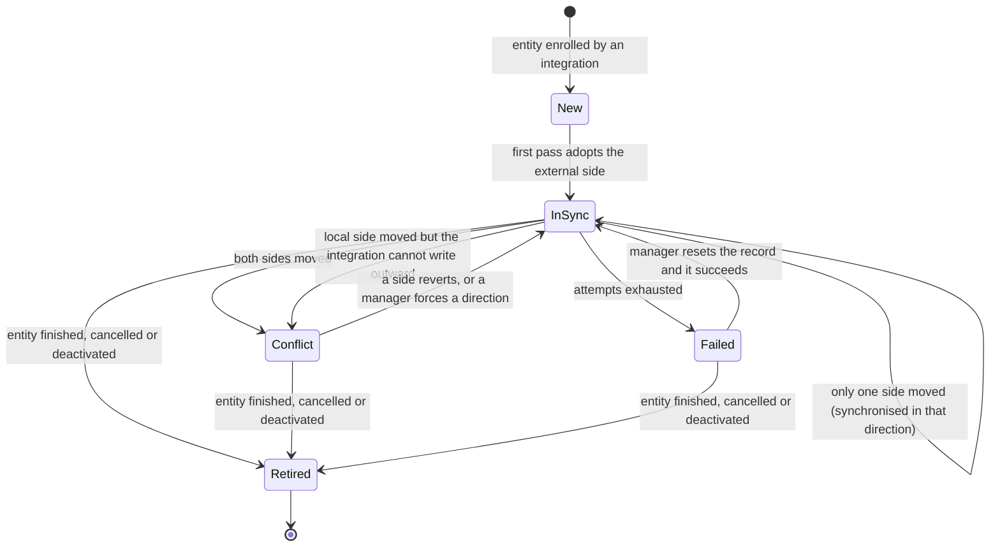

## Why

Klabis synchronises data with ORIS today in exactly one shape: a single event is pulled from ORIS and every ORIS-owned field on the local event is overwritten. `OrisEventImportService.syncEventFromOris` re-reads the upstream event and assigns `name`, `eventDate`, `location`, `organizer`, `websiteUrl`, `registrationDeadlines`, `ranking` and `baseEntryFee` unconditionally; `OrisBulkSyncService` loops that call over all upcoming ORIS events and counts successes.

That mechanism has four gaps that block every further integration:

1. **Silent data loss.** A manager who corrects an ORIS-owned field in Klabis loses that edit on the next synchronisation, with no record that it ever existed. The only protection today is field ownership — categories added manually (`orisId == null`), `feeOverride` and an already-set `eventType` are preserved — which protects fields ORIS does not own, not edits to fields it does.
2. **No memory of what was synchronised.** Nothing persists what the two sides looked like at the last successful synchronisation, so the system cannot tell which side changed, cannot detect that both changed, and cannot report when a record was last in agreement.
3. **No failure handling.** A failure is caught, logged and counted for one bulk run. There is no retry, no backoff, no record of a persistently failing entity, and no signal that a given event has been failing for a week.
4. **Not reusable.** The logic is written against the Event aggregate and the ORIS event API. Synchronising members, or any second external system, means writing all of it again — including the parts that are genuinely hard (change detection, conflict handling, retry).

This change introduces a generic, bidirectional synchronisation engine that owns those four concerns once, for any entity and any external system, and migrates the existing ORIS event synchronisation onto it as the first adapter.

## What Changes

**A new `sync` module** owning synchronisation state and orchestration, independent of both the entities being synchronised and the external system involved. Integrations plug in through a declared adapter contract; the engine never names ORIS.

**Change detection through three-way comparison.** Each synchronised entity gets a synchronisation record holding the canonical projection of both sides plus the baseline captured at the last successful synchronisation. Comparing current hashes against the baseline determines what happened:

**Conflicts are never resolved automatically.** When both sides moved, the record stops synchronising and reports which fields diverged. A manager acknowledges the conflict and then explicitly forces a direction; nothing is written until they do. The same applies when only the local side moved but the external system offers no way to write that entity back — the situation that silently destroys a manager's edit today.

**Retry with backoff and a terminal state.** A failed synchronisation is retried on a growing delay; once the attempts since the last success exceed the limit, the record is marked terminally failed, stops consuming external calls, and waits for a manager to reset it. An outage of the external system trips a circuit breaker that ends the pass instead of burning every record's retry budget.

**Audit trail.** Every attempt is appended to a synchronisation history: when, what triggered it, which direction, the outcome, and the failure reason. The record itself carries the time and direction of the last successful synchronisation.

**Existing ORIS event synchronisation moves onto the engine.** The endpoints, HAL affordances and frontend stay as they are; the behaviour behind them gains change detection, conflict handling, retry and audit. The visible change is that a local edit to an ORIS-owned field now raises a conflict instead of being silently overwritten.

## Capabilities

### New Capabilities

- `data-synchronization`: how synchronisation between Klabis and an external system behaves from a manager's point of view — when a record synchronises on its own, when it stops and asks for a decision, what a manager sees about a conflict, how they resolve it, what happens to a repeatedly failing record, and what the system reports about the last successful synchronisation.

### Modified Capabilities

- `events`: ORIS synchronisation of an event changes observable behaviour. A local edit to an ORIS-owned field no longer disappears on the next synchronisation — it blocks that event's synchronisation until a manager resolves it. The event exposes its synchronisation state and the actions to resolve a conflict or reset a failed record. The existing "Synchronizovat" action and the bulk synchronisation keep working unchanged for the case where nothing has diverged.

## Impact

**Affected specs**
- `openspec/specs/data-synchronization/spec.md` — new.
- `openspec/specs/events/spec.md` — ORIS synchronisation requirements gain conflict, resolution and failure scenarios; the row-level "Synchronizovat" action requirement is extended with the conflicted and failed cases.
- `openspec/specs/non-functional-requirements/spec.md` — retention and protection of synchronisation snapshots holding personal data.

**Affected code — new `sync` module**
- Synchronisation record and attempt history aggregates, their repositories and persistence.
- Direction resolution, conflict detection, claiming, retry scheduling and circuit breaking.
- The adapter contract integrations implement, including declared capabilities and the canonical projection.
- Primary port for enrolment, synchronisation, conflict acknowledgement, forced direction and reset.
- Domain events for conflict detected, terminal failure and sensitive-snapshot access.

**Affected code — ORIS integration**
- A new `oris.sync` package holding the ORIS event adapter, built from the existing import/sync mapping logic.
- `OrisEventImportService` keeps first-time import; its synchronisation path moves behind the engine.
- `OrisBulkSyncService` becomes a scheduled pass over due records instead of a loop over events.

**Affected code — events and members modules**
- `events` enrols an event with the engine when it is imported from ORIS, and retires the record when the event finishes or is cancelled.
- `members` publishes a member-updated domain event, which does not exist today, so that local changes to a member can mark a synchronisation record as dirty.
- `members` listens for sensitive-snapshot access and writes its existing birth-number audit log.

**APIs (REST)** — additive, nested under the entity: read synchronisation state, acknowledge a conflict, force a direction, reset a failed record. Existing ORIS synchronisation endpoints keep their paths and operation identifiers. A new `SYNC:MANAGE` authority gates the new operations.

**Data** — new `sync_record` and `sync_attempt` tables in `V001`. Snapshot columns are encrypted at rest, because a member projection contains personal data including the birth number.

**Dependencies** — Resilience4j (already a dependency, currently used only for rate limiting) gains retry and circuit-breaker configuration. Scheduling already exists.

**Related work** — `gh-113-oris-auto-sync` asks, in its open question 4, what happens when an ORIS change meets a manually edited field. This change answers that question and provides the mechanism; the scheduled bulk import, group tagging and deadline offset that `gh-113` proposes remain separate.
