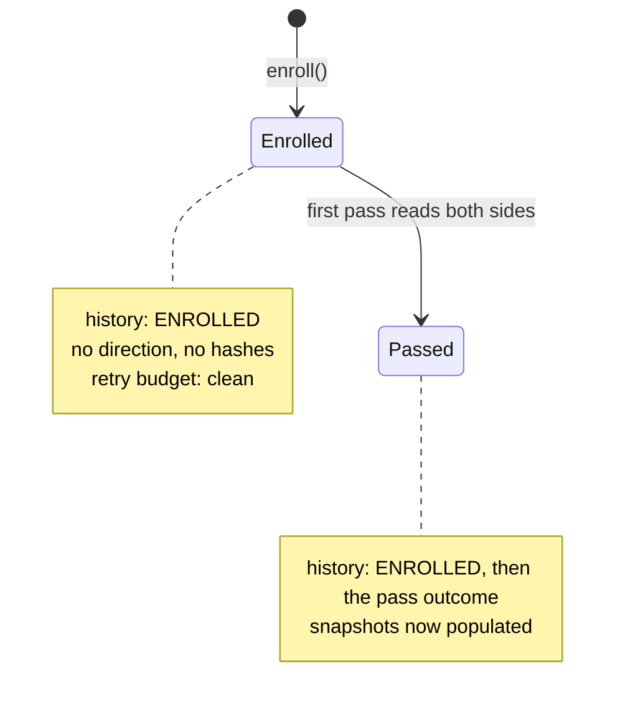

## Context

`SynchronizationService#enroll` (line 66) creates a `SyncRecord` and saves it. Nothing is
appended to the attempt history, so a record's history begins at its first pass rather
than at the moment the link was created.

Three facts from the existing code shape every decision below.

**The history is derived state, not just a log.** `RetryScheduler#failedAttemptsSince`
(lines 35–47) walks the history newest-first and counts entries until it meets a
terminating outcome:

```java
if (attempt.getOutcome() == SyncOutcome.SUCCESS || attempt.getOutcome() == SyncOutcome.RESET) {
    break;
}
if (attempt.getOutcome() == SyncOutcome.OUTAGE) {
    continue;   // an outage is not the record's fault
}
count++;        // everything else counts against the retry budget
```

The `count++` is the default branch. Any outcome not named above is charged as a failure.
This is the single most consequential detail in this change.

**Two writers already exist, and the richer one does not fit.** `SyncOutcomeWriter#persist`
calls `record.releaseClaim()` and wraps the write in a `REQUIRES_NEW` transaction with an
optimistic-lock retry, because a pass writes the local entity and races the asynchronous
`markDirty` self-listener. `SynchronizationService#acknowledgeConflict` (line 193) instead
calls `syncAttemptRepository.save(...)` directly, because it holds no claim and races
nothing.

**`enroll` has no acting user.** Its two callers reach it from `OrisEventImportService`
(single import) and `OrisEventBulkImportService` (which loops over the single import).
Both originate from `OrisEventController`, a user-facing endpoint. The sync module's own
controller derives the acting user as `currentUser.userId().uuid().toString()`; the events
module's import path never captures one.

## Goals / Non-Goals

**Goals:**

- A linked entity's history starts at enrolment, so an empty history unambiguously means
  "pruned by retention", never "never recorded".
- Enrolment does not consume any part of the retry budget.
- The entry is honest about what enrolment did: it read neither side, so it claims no
  direction and no hashes.

**Non-Goals:**

- Reading either side at enrolment to populate the initial snapshots. This stays as
  designed (`2026-09-04-add-bidirectional-sync-engine` design.md D5) — enrolment is
  deliberately cheap and does not call the adapter. This change records that enrolment
  happened, not a synchronisation that did not.
- Exposing attempt history through the API. No endpoint returns it today and none is added.
- Recording retirement, the symmetric end-of-life event. It is a separate question with a
  separate requirement ("Finished Entities Stop Being Synchronised") and no evidence of a
  gap; bundling it here would widen the change past what was asked.

## Decisions

### D1 — A new `SyncOutcome.ENROLLED` rather than reusing `SUCCESS`

`SUCCESS` would terminate the retry walk correctly and require no enum change. It is
rejected because it is false: it would claim a synchronisation succeeded when none ran,
and `lastSuccessfulSyncAt` semantics elsewhere in the module rest on `SUCCESS` meaning the
two sides were actually compared. A manager reading a history that opens with "success,
no direction, no hashes" learns something untrue.

`ENROLLED` is a distinct fact and is modelled as one.

*Alternative considered:* a boolean `enrolment` flag on `SyncAttempt` alongside a `SUCCESS`
outcome. Rejected — two fields encoding one concept, and every reader of `getOutcome()`
would need to consult the flag to interpret it.

### D2 — `ENROLLED` terminates the retry walk, alongside `SUCCESS` and `RESET`

`RetryScheduler#failedAttemptsSince` gains `ENROLLED` in its `break` condition. Without
this the default `count++` branch charges every newly enrolled record one failed attempt
before it has done anything, permanently shifting its first backoff and bringing terminal
failure one attempt closer.

`break` is correct rather than `continue` (the `OUTAGE` treatment): enrolment is not a
neutral event to be skipped over, it is the beginning of the record's history. Nothing
before it can exist, so the walk has nowhere further to go. `continue` would give the same
answer today by accident — the walk would simply run off the end of the list — and would
diverge the moment anything is ever recorded before enrolment.

This is the decision most likely to be silently reverted, because omitting it breaks no
compilation and no existing test. The specs delta pins it as observable behaviour and the
tasks require a test that fails without it.

### D3 — Write through `syncAttemptRepository` directly, not `SyncOutcomeWriter`

`SyncOutcomeWriter#persist` releases the record's claim and carries an optimistic-lock
retry for the `markDirty` race. Enrolment holds no claim (the record is new and unclaimed)
and races nothing (no entity write, no listener). Routing it through `persist` would call
`releaseClaim()` on a record that never had one and add a `REQUIRES_NEW` transaction
around a write that is already inside `enroll`'s `@Transactional`.

Enrolment follows `acknowledgeConflict`'s shape instead: save the record, then
`syncAttemptRepository.save(SyncAttempt.record(...))`, both inside the existing
transaction. Atomicity — the D15 requirement that no attempt is lost — is satisfied by
that single enclosing transaction.

### D4 — `enroll` takes a nullable acting user

`SynchronizationPort#enroll` gains a `String actingUser` parameter, nullable, matching the
convention `synchronizeNow` already documents ("`null` for a caller with no authenticated
user").

Nullable rather than required because enrolment is not inherently user-initiated. Today
both paths are (ORIS import via `OrisEventController`), but the port is the sync module's
generic entry point, and a future automated enrolment — a discovery job pairing entities
without a user present — must not be forced to invent a principal. Requiring the argument
would push callers toward passing `"system"` or an empty string, which is worse than an
explicit null.

The trigger is `MANUAL`. This matters mechanically, not just descriptively:
`SyncOutcomeWriter#appendAttempt` records the acting user only when the trigger is
`MANUAL`, and enrolment must preserve that same rule so a null-triggered enrolment cannot
smuggle a user onto a non-manual entry.

*Alternative considered:* leaving the signature alone and recording no acting user.
Rejected — it would make enrolment the only user-initiated action in the module whose
history cannot say who performed it, contradicting the requirement's existing promise that
user actions record their author.

**Follow-on cost, accepted:** `OrisEventImportPort#importEventFromOris` and
`OrisEventBulkImportPort#importEventsFromOris` must carry the acting user down from
`OrisEventController`, which does not capture one today. This is the one place the change
reaches outside the `sync` module.

### D5 — Snapshots stay empty

Restated here because it is the decision most likely to be re-opened during
implementation: enrolment does not call the adapter. An `ENROLLED` entry with null hashes
is the accurate record of a record whose sides have never been read. The first pass
populates the snapshots and records its own entry.



## Risks / Trade-offs

**[The `RetryScheduler` change is omitted or later reverted]** → Every new record silently
starts one failed attempt down. Nothing fails to compile and no existing test notices.
Mitigation: a test that enrols a record, fails it exactly once, and asserts the failure
count is 1 — it must fail if the `break` condition loses `ENROLLED`. Task-level
instruction requires verifying this by actually removing the condition and watching the
test go red, per the project's negative-test rule.

**[`ENROLLED` reaches a reader that does not expect it]** → Every `switch` or comparison
over `SyncOutcome` must be reviewed, not assumed exhaustive. `SyncAttemptMemento` stores
the outcome via `valueOf`/`name()`, so persistence needs no migration; `RetryScheduler` is
the only behavioural reader. Mitigation: enumerate all `SyncOutcome` references during
implementation rather than trusting this list.

**[The acting-user parameter spreads further than expected]** → Threading it through the
import ports touches the `events` module and its tests. Contained: two port methods, one
controller, one service. If it proves wider, the fallback is D4's rejected alternative
(record no acting user), which is a strictly smaller change and leaves the rest intact.

**[Retention prunes the enrolment entry]** → After the retention period, a long-lived
record's history loses its `ENROLLED` entry, and the "empty history is unambiguous"
property weakens back to what it is today. Accepted: retention already promises this for
all entries, and the record's own `lastSuccessfulSyncAt` survives. Making enrolment exempt
would be a change to the retention requirement, not this one.

## Migration Plan

No data migration. `sync_attempt` stores the outcome as a string, and the column already
permits null direction and null hashes.

Existing records enrolled before this change keep their history as it stands — no
backfill. A synthetic `ENROLLED` entry stamped at an invented time would be a fabricated
audit record, which is worse than the gap it fills. The property that "an empty history
means pruned, not unrecorded" therefore holds for records enrolled from this change
onward.

Rollback is removing the enum constant and the two call sites; no persisted data becomes
unreadable while rows containing `ENROLLED` remain, so a rollback must either keep the
constant or accept `valueOf` failures on those rows. Given no release boundary is involved
here, the practical rollback is a revert before merge.

## Open Questions

None blocking. One deliberate deferral: recording retirement symmetrically (Non-Goals) is
left for a separate change if a gap is ever observed.
