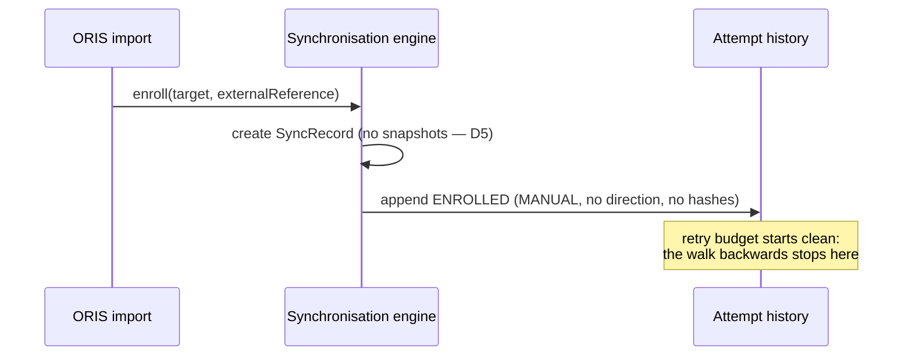

## Why

Enrolling an entity is the moment a link to an external system comes into existence, but
it leaves no trace in that record's history. An ORIS-imported event gets a `SyncRecord`
and the entity's data, and the history stays empty until the first scheduled pass runs —
so the record's own beginning is the one event its audit trail cannot account for.

That gap is visible in practice. A manager reading the history of a freshly imported
event sees nothing at all, which is indistinguishable from a record whose history has
been pruned by retention, or one whose scheduled passes never ran. The requirement
"Every Synchronisation Attempt Is Recorded" already promises a history of what the system
did for each linked entity; enrolment is something the system did, and it is missing.

Leaving the initial snapshots empty stays deliberate (design.md D5) — enrolment
intentionally does not read either side. This change records *that enrolment happened*,
not a synchronisation that did not occur.

## What Changes

- Add `ENROLLED` to the recorded outcomes. Enrolling an entity appends one history entry
  with trigger `MANUAL`, no direction and no hashes — enrolment reads neither side, so
  there is nothing to hash, and the absent direction is the honest record of that.
- The entry carries the acting user when enrolment came from a user-initiated action
  (the ORIS import path), matching how the existing user-decision entries are recorded.
- Enrolment does **not** count against the retry budget. The failure count is derived by
  walking history backwards until a terminating outcome is found; `ENROLLED` terminates
  that walk exactly as a success does. Without this, a newly enrolled record would start
  life already holding a failed attempt against it.

Not breaking. `SyncOutcome` is internal to the engine — it is not part of any API
response (the sync state endpoint exposes `SyncStatus`, and no endpoint exposes attempt
history), so no consumer can observe the new value today.

## Capabilities

**New Capabilities:** none.

**Modified Capabilities:**

- `data-synchronization` — the requirement "Every Synchronisation Attempt Is Recorded"
  covers attempts that ran (scheduled, change-triggered, user decisions). It gains
  enrolment as a recorded event, so a linked entity's history starts at the moment the
  link was created rather than at its first pass.

## Impact

- **Code:** `SyncOutcome` gains a constant. `SynchronizationService#enroll` appends the
  entry. `RetryScheduler#failedAttemptsSince` must terminate its backward walk on
  `ENROLLED` — the loop currently counts every outcome that is not `SUCCESS`, `RESET` or
  `OUTAGE`, so omitting this silently charges each new record one failed attempt.
- **Acting user:** `SynchronizationPort#enroll` takes no acting-user argument today,
  unlike the operations that record one. Carrying the user through is the one signature
  change this needs; design.md settles whether that argument is required or nullable.
- **API:** none. No endpoint exposes `SyncOutcome` or attempt history.
- **Persistence:** none. `SyncAttempt` already stores the outcome as a string and permits
  null direction and null hashes.
- **Tests:** enrolment appends exactly one entry with the expected shape; a record
  enrolled and then failing once reports one failed attempt, not two — that assertion is
  what pins the `RetryScheduler` behaviour, and it must fail if the change to the walk is
  reverted.
