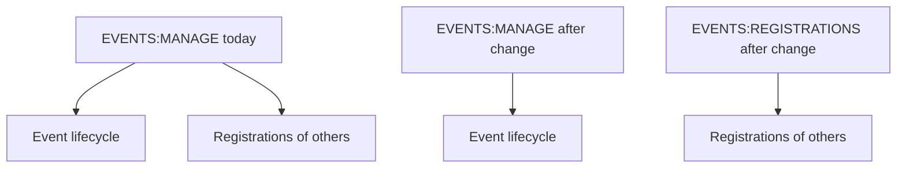

## Context

The `EVENTS:MANAGE` authority currently guards two unrelated concerns:

1. **Event lifecycle administration** — create/update/publish/cancel events, manage category presets, view DRAFT events, see the internal status column in the events list.
2. **Registrations of other members** — view a specific member's registration (including their SI card number) and edit their registration.

Bundling these behind the same authority means we cannot have a dedicated "registration officer" role — a club member who helps others with their registrations (corrects SI card numbers, swaps categories) without being trusted to create or cancel events.

The backend already has all the mechanics to split this cleanly:

- `@HasAuthority` + `@OwnerVisible` combine as OR semantics on a single method (authorization passes when either check passes).
- `klabisAfford` in `HalFormsSupport` reads both annotations from the target method and filters affordances per-user automatically, so a list can offer an "edit" affordance on every row and the framework will only serialize it to clients entitled to use it.

## Goals / Non-Goals

**Goals:**

- Introduce `EVENTS:REGISTRATIONS` as a distinct, separately-grantable authority for managing other members' registrations.
- Keep `EVENTS:MANAGE` focused on event lifecycle and category presets only.
- Preserve existing self-service behaviour: a member can always view and edit their own registration without any extra authority.
- Use the existing affordance framework (no hand-rolled per-row "is owner" checks in controllers).
- Drop the unused client-side redirect after creating a registration; keep the backend `Location` header on `POST /api/events/{eventId}/registrations` unchanged.

**Non-Goals:**

- No changes to event lifecycle endpoints (`EventController`), category presets (`CategoryPresetController`), or the events-list status column (`EventSummaryDto`) — `EVENTS:MANAGE` stays there.
- No migration script. Authorities are stored as strings; existing users are unaffected unless an admin decides to grant the new authority.
- No new "Registration Officer" UI role or bulk assignment tool. Granting happens through the existing permissions dialog.
- Granting `EVENTS:REGISTRATIONS` through user groups is not implemented now, but the authority is declared `CONTEXT_SPECIFIC` so that future group-based assignment remains possible without another breaking change.

## Decisions

### Decision: Scope of `EVENTS:REGISTRATIONS` is CONTEXT_SPECIFIC

**Rationale:** Conceptually, "managing registrations" is naturally context-scoped — a trainer could be allowed to manage registrations for their group's members, a deputy coordinator for a specific event, etc. Even though the current implementation does not yet honour group-based grants for this authority, declaring it `CONTEXT_SPECIFIC` avoids another breaking change later. Consistent with other context-specific authorities (`MEMBERS:MANAGE`, `CALENDAR:MANAGE`).

**Alternatives considered:**
- `GLOBAL` scope — rejected; excludes future group-based assignment.

### Decision: Scope of `EVENTS:MANAGE` becomes GLOBAL

**Rationale:** Creating/publishing/cancelling events and editing category presets are club-admin activities, not activities that make sense scoped to a subgroup. There is no credible scenario where someone manages one event but not another through a group grant. Making it `GLOBAL` signals this and aligns with the `Scope` enum's documented meaning ("GLOBAL: cannot be granted via groups (admin-level permissions)").

**Alternatives considered:**
- Leave as `CONTEXT_SPECIFIC` — rejected; it invites future confusion about whether group-scoped grants are possible, which we do not plan to support.

### Decision: `EVENTS:REGISTRATIONS` is NOT in `getStandardUserAuthorities()`

**Rationale:** Standard authorities (`MEMBERS:READ`, `EVENTS:READ`) are things every authenticated member gets for free. `EVENTS:REGISTRATIONS` is an elevated permission — a regular member only manages their OWN registration (via `@OwnerVisible`). Making it standard would defeat the purpose.

### Decision: Authorization uses `@HasAuthority` OR `@OwnerVisible` on controller methods

**Rationale:** `HalFormsSupport.isMethodAuthorized` evaluates these with OR semantics (pass if either matches). This is exactly the behaviour we need on `editRegistration` and `getRegistration`: "owner of the registration OR holder of EVENTS:REGISTRATIONS". Adding `@HasAuthority(EVENTS_REGISTRATIONS)` alongside the existing `@OwnerVisible` yields that behaviour with zero custom code and — critically — makes affordance filtering in `klabisAfford` automatic.

**Alternatives considered:**
- Custom SpEL in `@PreAuthorize` — rejected; duplicates logic, breaks affordance filtering, loses type safety of `Authority` enum.
- Manual per-row checks in controller (today's `actingMember.equals(registration.memberId())` in `buildRegistrationItems`) — rejected; does not scale with the new "registration officer sees edit on every row" requirement.

### Decision: Affordance `editRegistration` is added to every row in the registrations list when registrations are open

**Rationale:** The framework filters per-user. By always attempting to add the affordance, the server delegates the "should this user see it here?" decision to the same annotation-based mechanism used everywhere else. Eliminates the ad-hoc "equals owner" branch in `buildRegistrationItems`.

**Consequence:** A member with `EVENTS:REGISTRATIONS` will see an "Upravit" affordance on every row; a regular member only on their own row.

### Decision: No self-link is emitted for rows the acting member does not own

**Rationale:** Currently `buildRegistrationItems` only emits a self-link for the acting member's own row (it uses `klabisLinkTo(...getRegistration(...))` which is filtered by the same `@OwnerVisible` + `@HasAuthority` mechanism). After the change, holders of `EVENTS:REGISTRATIONS` will also get a self-link on every row pointing at `GET /api/events/{eventId}/registrations/{memberId}`, which they can use to load the full registration (with SI card) into the edit form. Members without the authority still only see the self-link on their own row. This is the natural consequence of the annotation change and matches the edit-form data-flow requirement.

### Decision: Frontend drops redirect after `registerForEvent`; backend `Location` header stays

**Rationale:** There is no "registration detail" page in the frontend. Following the `Location` header would dead-end at an endpoint that only returns HAL+FORMS JSON. Instead, after a successful `POST`, the frontend invalidates the event-detail and registration-list queries and stays on the event page, which re-renders with the member's new registration. The backend keeps emitting `Location: /api/events/{eventId}/registrations/{memberId}` because that is the correct REST semantics and remains useful for API consumers and tests.

**Alternatives considered:**
- Remove `Location` header entirely — rejected; breaks REST expectations and hurts API consumers outside the frontend.
- Change `Location` to point at the event detail — rejected; the new resource is the registration, not the event.

## Risks / Trade-offs

- **Risk:** Existing club admins who had `EVENTS:MANAGE` and used it to manage others' registrations will stop being able to do so after deployment.
  → **Mitigation:** Project is pre-production. Update `BootstrapDataLoader` admin user to include `EVENTS:REGISTRATIONS`. Communicate the breaking change; grant `EVENTS:REGISTRATIONS` in the permissions dialog for anyone who needs it.

- **Risk:** Affordance framework exposes `editRegistration` on every row in the list response body, even though per-user filtering hides it from unauthorized clients. The HTML response size grows proportionally with registration count for privileged users.
  → **Mitigation:** Acceptable at current scale (10+ concurrent users, events typically <200 registrations). Revisit if payload size becomes a concern.

- **Trade-off:** Extra self-link appears on every row for holders of `EVENTS:REGISTRATIONS`. Slightly more data on the wire in exchange for zero-custom-code authorization and consistency with the rest of the API.

- **Risk:** Frontend test that currently asserts redirect after register may fail.
  → **Mitigation:** Update `EventDetailPage.test.tsx` to assert query invalidation and staying on the event page instead.
