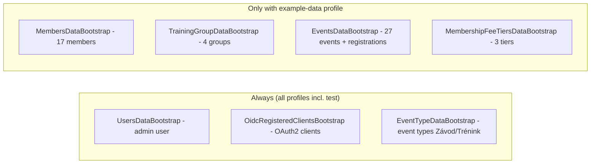

# Proposal: add-example-data-profile

## Why

`BootstrapDataLoader` runs every `BootstrapDataInitializer` on every non-test startup with no distinction between necessary and demo data. Tests that need only the admin user or OAuth2 clients must activate `test-bootstrap` and preload the entire demo dataset (17 members, 27 events, 4 training groups, 3 fee tiers). ORIS synchronization workflows want a clean database containing only real club data, but an empty database currently gets fully seeded with demo data on startup.

## What Changes

- Introduce a Spring profile `example-data` gating the demo-data initializers.
- Bootstrap data split:

- `BootstrapDataLoader` loses its `@Profile({"!test", "test-bootstrap"})` guard — necessary initializers run in every profile, including `test` (previously bootstrap was fully disabled under `test` unless `test-bootstrap` was added).
- The 4 demo initializers get `@Profile("example-data")`.
- Profile group `test-bootstrap: example-data` in `application.yml` — tests activating `test-bootstrap` keep getting the full dataset (unchanged behavior).
- Default active profiles become `h2,ssl,debug,metrics,oris,example-data`; `runLocalEnvironment.sh` adds `example-data` explicitly (its env var replaces yml defaults). Local dev keeps demo data; dropping `example-data` yields a clean database (ORIS scenario). Production profile lists must not include `example-data`.

## No Behavior Change Justification

**Specs reviewed:**
- `openspec/specs/users/spec.md` — "Bootstrap Admin User" requirement unaffected: the admin user is still provisioned on initialization in every profile, including `test`.
- `openspec/specs/users-authentication/spec.md` — OIDC discovery/client behavior unrelated to data seeding; registered clients still bootstrapped in every profile.
- `openspec/specs/non-functional-requirements/spec.md` — only mentions bootstrap for the local-dev warning scenario; unchanged.
- No spec in `openspec/specs/` describes example/demo members, events, training groups, or membership fee tiers seeding.

**Why no spec update is needed:**
Demo seed data is deployment/environment state, not a user-observable capability described by any spec. The change alters which environments receive seed data, not what the application does with data. All functional requirements (admin bootstrap, authentication, member/event/group/fee management) behave identically.

## Impact

- **Code**: `common/bootstrap/BootstrapDataLoader.java` (remove profile guard); `members`, `groups/traininggroup`, `events`, `membershipfees` bootstrap classes (add `@Profile("example-data")`).
- **Configuration**: `backend/src/main/resources/application.yml` (default profiles + profile group), `runLocalEnvironment.sh`.
- **Developer workflow**: tests no longer need `test-bootstrap` for necessary data; clean-DB local runs via `SPRING_PROFILES_ACTIVE=h2,ssl,debug,metrics,oris`.
- **Docs**: `backend/CLAUDE.md`, `backend/README.md`, root `CLAUDE.md`, `backend/.env.example`.
