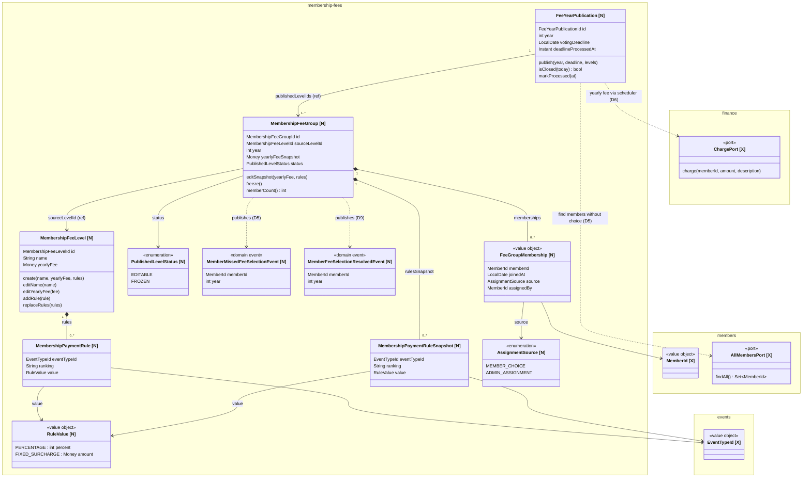

## Domain Model — membership-fees

**Legenda:**
- `[N]` — nový prvek zaváděný tímto changem (`membership-fees`)
- `[X]` — externí reference z jiných modulů (`finance`, `members`, `events`)

### Poznámky k modelu

| Prvek | Modul | Poznámka |
|---|---|---|
| `MembershipFeeLevel` | `membership-fees` | Aggregate root — katalog šablon, editovatelný kdykoli |
| `MembershipPaymentRule` | `membership-fees` | Value object uvnitř šablony; klíč `(EventTypeId, ranking)` musí být unikátní |
| `FeeYearPublication` | `membership-fees` | Aggregate root — vypsání úrovní pro rok + jedna uzávěrka voleb |
| `MembershipFeeGroup` | `membership-fees` | Aggregate root — snapshot úrovně + členství; analogie `traininggroup`/`familygroup`/`freegroup` |
| `MembershipPaymentRuleSnapshot` | `membership-fees` | Kopie pravidel uložená při vypsání; nezávislá na katalogu |
| `FeeGroupMembership` | `membership-fees` | Value object záznamu členství; drží `AssignmentSource` pro rozlišení vlastní volby vs. nouzového přiřazení |
| `ChargePort` | `finance` | Port pro zaúčtování ročního poplatku; volán schedulerem den po uzávěrce |
