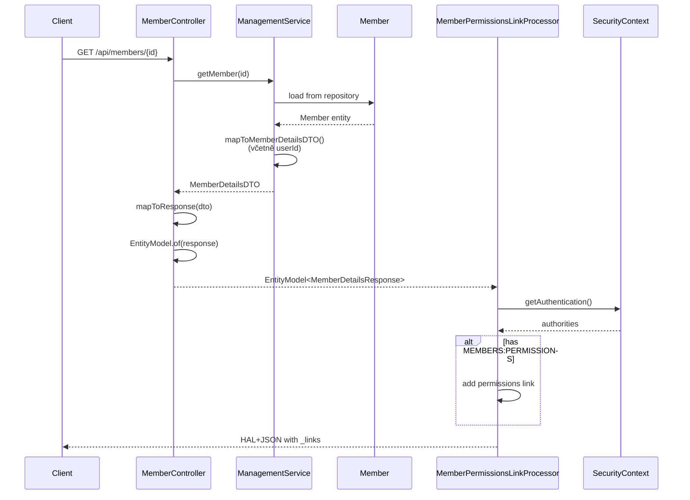

## Context

**Current State:**
- Member detail API (`GET /api/members/{id}`) vrací `MemberDetailsResponse` bez userId
- Permission management API existuje na `GET/PUT /api/users/{userId}/permissions`
- Frontend musí znát URL strukturu pro přístup k permissions (porušení HATEOAS)
- Member a User jsou oddělené agregáty (1:1 relace), Member má UserId jako identity
- PermissionController je již public (viditelný z members modulu)

**Constraints:**
- HATEOAS mandatory - všechny response musí obsahovat navigační linky
- Spring Modulith dependency direction: members → users (OK), ale ne naopak
- RepresentationModelProcessor precedent existuje (`MembersRootPostprocessor`)
- Member ↔ User je 1:1, každý Member má vždy User

**Stakeholders:**
- Frontend team: potřebuje discoverable permission management link
- Backend developers: minimální change surface, čisté oddělení agregátů

## Goals / Non-Goals

**Goals:**
- Přidat HATEOAS link na permissions endpoint do Member detail response
- Link je conditional - zobrazí se pouze pokud má user `MEMBERS:PERMISSIONS` authority
- Zachovat clean architecture a agregátové hranice
- Type-safe linkTo() místo hardcoded URLs

**Non-Goals:**
- Embedding permission data do Member response (zbytečný overhead)
- Změna Permission API contract
- Změna Member domain modelu (userId je jen v DTO/presentation layer)

## Decisions

### Decision 1: userId v DTO layer (nikoli v domain)

**Rozhodnutí:** Přidat `userId: UUID` do `MemberDetailsDTO` a `MemberDetailsResponse`, ale NEPŘIDÁVAT do Member entity.

**Alternativy:**
1. **Přidat userId do Member entity** ❌
   - Porušuje DDD: Member identity je UserId, ne separátní field
   - Member.getId() už vrací UserId

2. **Query userId dynamicky v processoru** ❌
   - Extra database query při každém GET request
   - Performance overhead

3. **Přidat do DTO** ✅ (zvoleno)
   - Presentation layer concern, ne domain
   - Zero overhead - data už máme při mapování
   - Clean: Member.getId().uuid() → DTO.userId

**Rationale:** userId je potřeba jen pro HATEOAS link generation (presentation concern). Domain model zůstává čistý.

### Decision 2: RepresentationModelProcessor pattern

**Rozhodnutí:** Použít Spring HATEOAS `RepresentationModelProcessor` pro přidání linku místo inline logic v controlleru.

**Alternativy:**
1. **Link přímo v MemberController.getMember()** ❌
   - Controller ví o Permission API
   - Těžší testování
   - Porušuje single responsibility

2. **RepresentationModelProcessor** ✅ (zvoleno)
   - Separation of concerns
   - Precedent: `MembersRootPostprocessor`
   - Testovatelné izolovaně
   - Spring automatically applies processor

**Rationale:** Processor pattern je Spring HATEOAS best practice pro cross-cutting link enrichment.

### Decision 3: Package placement - members.management

**Rozhodnutí:** `MemberPermissionsLinkProcessor` v package `com.klabis.members.management`

**Alternativy:**
1. **common.hateoas** ❌
   - Porušuje Spring Modulith: common nesmí záviset na members/users

2. **users.integration** ❌
   - Reverse dependency: users → members (zakázáno)

3. **members.management** ✅ (zvoleno)
   - Legální závislost: members → users
   - Blízko MemberController
   - PermissionController je již public

**Rationale:** Jediná možnost respektující Spring Modulith dependency direction.

### Decision 4: Conditional link podle authority

**Rozhodnutí:** Link se zobrazí pouze pokud SecurityContext obsahuje `MEMBERS:PERMISSIONS` authority.

```java
private boolean hasMembersPermissionsAuthority() {
    Authentication auth = SecurityContextHolder.getContext().getAuthentication();
    if (auth == null || !auth.isAuthenticated()) {
        return false;
    }
    return auth.getAuthorities().stream()
        .map(GrantedAuthority::getAuthority)
        .anyMatch(authority -> authority.equals("MEMBERS:PERMISSIONS"));
}
```

**Rationale:**
- HATEOAS principle: linky reprezentují dostupné akce
- Pokud user nemůže upravovat permissions, link by neměl být přítomen
- Frontend může použít přítomnost linku pro zobrazení UI prvků

## Risks / Trade-offs

### Risk 1: Cross-module coupling (members → users)

**Risk:** Members modul závisí na PermissionController z Users modulu.

**Mitigation:**
- Závislost je již přítomna (members závisí na users pro UserId)
- PermissionController je public REST API (stabilní interface)
- Pouze import pro linkTo() - není runtime coupling
- Spring Modulith dovoluje members → users direction

### Risk 2: API contract change

**Risk:** Přidání `userId` do response je API změna.

**Mitigation:**
- **Non-breaking change** - additive field
- Existující klienti ignorují unknown fields (HAL+JSON standard)
- Frontend očekává tento field (po dohodě)
- Versioning není potřeba

### Risk 3: Security check v processoru

**Risk:** Processor provádí security check mimo controller security layer.

**Mitigation:**
- Pouze pro zobrazení linku, ne pro autorizaci akce
- Samotný Permission endpoint má vlastní security (`@HasAuthority`)
- Worst case: link se zobrazí, ale endpoint vrátí 403 (defense in depth)

### Trade-off: userId v každé Member response

**Trade-off:** Přidáváme field, který většina klientů nepoužije.

**Accepted because:**
- UUID je malý (16 bytes)
- JSON overhead minimální (~40 bytes)
- Benefit: HATEOAS compliance > minimální overhead
- Může být užitečný i pro jiné cross-aggregate odkazy v budoucnu

## Data Flow Diagram



## Implementation Order

1. **Extend DTOs** (TDD: update existing tests first)
   - Add `userId` to `MemberDetailsDTO` record
   - Add `userId` to `MemberDetailsResponse` record

2. **Update ManagementService**
   - Modify `mapToMemberDetailsDTO()` to include `member.getId().uuid()`

3. **Update MemberController**
   - Update `mapToResponse()` to pass userId from DTO to response

4. **Create RepresentationModelProcessor** (TDD: write test first)
   - `MemberPermissionsLinkProcessor`
   - Conditional link logic
   - Security check helper

5. **Integration test**
   - Test with/without MEMBERS:PERMISSIONS authority
   - Verify link presence/absence

## Open Questions

None - design is straightforward with clear precedents.
