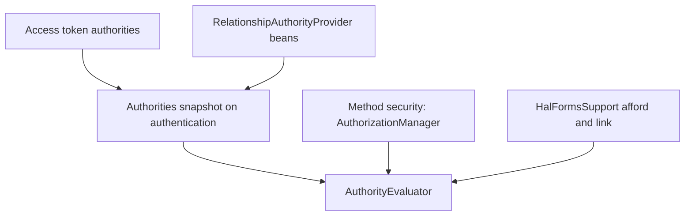
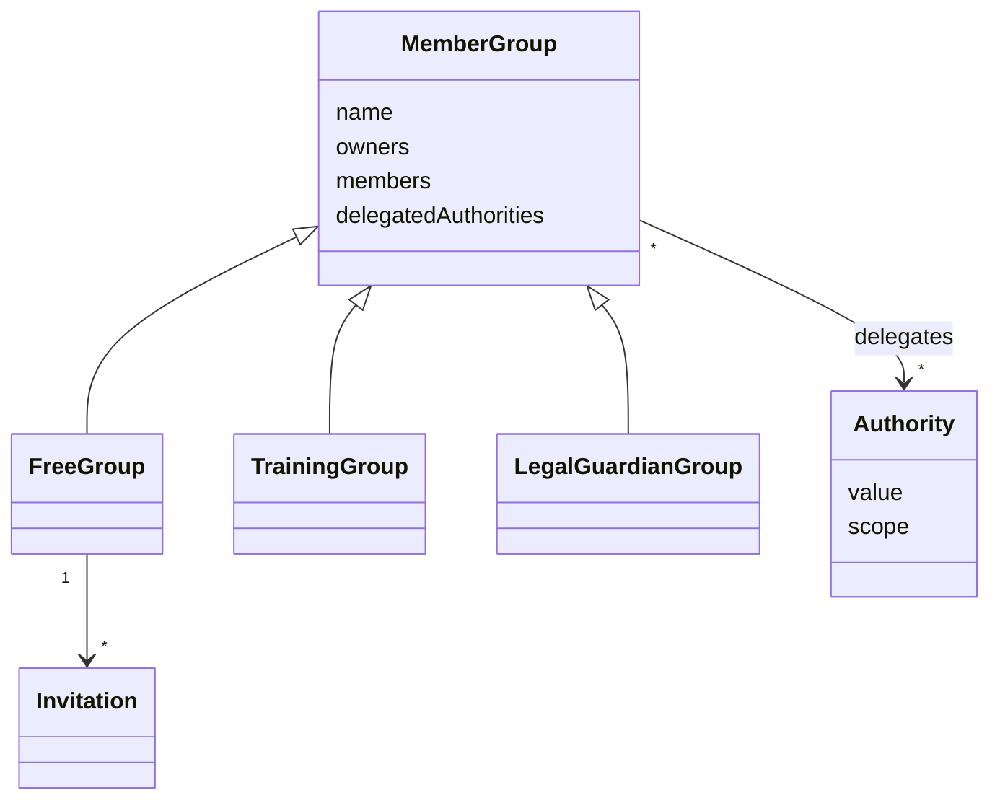

## Context

Method security today is `@HasAuthority(Authority)` enforced by the custom advisor `HasAuthorityMethodInterceptor`, plus `@OwnerVisible` / `@OwnerId` for the "target is me" case. `@PreAuthorize` is evaluated only on response/request record components (field security). `HalFormsSupport.isMethodAuthorized` re-implements a subset of the interceptor's logic (only `@HasAuthority` and `@OwnerVisible`) to decide whether an affordance is emitted, so the two can disagree.

Controllers implement generated `*Api` interfaces; security annotations come from the hand-written OpenAPI spec (`x-klabis-authority`, `x-klabis-owner-visible`), so annotation lookup crosses the interface boundary (`MethodSecurityAnnotations`).

`Authority.Scope` has `GLOBAL` and `CONTEXT_SPECIFIC`; `AuthorizationPolicy.checkGlobalAuthorityNotGrantedViaGroup` is a placeholder for future group delegation and treats every non-global authority as delegable. That is too broad (`MEMBERS_MANAGE` is `CONTEXT_SPECIFIC`), so a new scope is introduced.

All three group aggregates (free, training, legal guardian) extend `MemberGroup` and share the `groups.user_groups` / `user_group_owners` / `user_group_members` tables via a type discriminator.

## Goals / Non-Goals

**Goals:**
- Declare relationship-aware authorization on controller methods with an annotation.
- One evaluator decides both the call and the visibility of affordances / links.
- Groups delegate authorities to their owners over their members.
- Proof of concept: `MEMBER:EDIT_DETAILS` on the member update endpoint.

**Non-Goals:**
- Editing the delegated set of an existing group (immutable for now).
- Delegation of `GLOBAL` authorities.
- Event-scoped relations (`eventId` target types); the model must allow them, but no use case is implemented.
- Replacing `@OwnerVisible` outside the members module (events, finance, membershipfees, groups, calendar keep it; their migration is a follow-up).
- Frontend permission editor; the frontend only displays the set in invitations and chooses it at free group creation.

## Decisions

### D1: `@HasAuthority` is a repeatable meta-annotation over `@PreAuthorize`

`@HasAuthority(value, target)` is meta-annotated with `@PreAuthorize` using Spring Security's annotation template placeholders, so it participates in the standard method-security chain (`@EnableMethodSecurity` is already active). `target` is an optional SpEL string (e.g. `"#id"`) resolved against method arguments.

Repeated `@HasAuthority` (`@HasAuthority.List`) combine with OR. `@PreAuthorize` is not `@Repeatable`, so the container cannot be expressed as a single template expression; a dedicated `AuthorizationManager` handles `@HasAuthority` / `@HasAuthority.List` (replacing `HasAuthorityMethodInterceptor`), while plain `@PreAuthorize` keeps the standard manager.

Alternatives: keep the custom advisor and only add `target` (smaller change, but perpetuates the second evaluation path); rely on hand-written `@PreAuthorize` SpEL for OR (generator and spec would have to carry SpEL).

`target` as SpEL depends on parameter names matching between the generated `*Api` method and its implementation. Names are read from the annotated interface method; the build keeps `-parameters`.

### D2: Authorities carry targets; the snapshot is built once per request

The acting user's authorities are held as *targeted authorities*: an authority plus the set of targets it applies to. The wildcard target `"*"` means "over everything".

| Source | Resulting targeted authority |
|---|---|
| Global authority from the access token (e.g. `MEMBERS:MANAGE`) | authority with target `*` |
| Authority delegated by groups the user owns (e.g. `MEMBER:EDIT_DETAILS` over members A, B, C) | authority with targets `A|B|C` (notation only; held as a set of ids) |

The snapshot is created when the request's authentication is built (the `KlabisJwtAuthenticationToken`, which `CurrentUserData` is a view of), memoized, and never changes during the request. Every check in the request, whether method security or HAL affordances and links, therefore sees identical authorities, and rendering a list performs no per-row queries. `CurrentUserData.hasAuthority(a)` keeps meaning "held with target `*`"; a new `hasAuthority(a, target)` accepts either `*` or the target.

`AuthorityEvaluator.isGranted(authentication, authority, target)` reads only this snapshot: granted when the authority is held with `*`, or (target given) with a target set containing it. Targets from the same authority held through several sources are unioned.

`HalFormsSupport` builds the SpEL evaluation context from the dummy invocation's method and arguments (the same arguments it gets from `methodOn(...)`), then calls the same evaluator for every `@HasAuthority`, OR-ing them. Its static per-`Method` cache stores only parsed annotation metadata, never results. Plain `@PreAuthorize` on controller methods is evaluated by HAL through the standard `PreAuthorizeAuthorizationManager`, so affordance and call stay in agreement for both.

`@OwnerVisible` keeps working as an additional OR alternative for modules that have not migrated; the evaluator is called first, ownership second. Members-module operations and fields migrate off it (D5).

Alternatives: query providers on every check (simple, but one query per affordance when rendering lists, and checks within a request could see different data); cache in `HalResponseContext` (HAL-only, method security would not share it).

### D3: Relationship providers are pluggable; groups provide the first one

`common.security` defines the SPI `RelationshipAuthorityProvider`: given the acting user, it returns the targeted authorities that user holds through relationships. Any module may register a provider bean. The snapshot is the union of all providers' results (targets of the same authority are merged; a provider returning `*` makes the authority global). With no provider registered, there are no relationships and only token authorities apply.

`common.groups` implements one provider for all three group types, using one query over the unified tables: groups where the user is in `user_group_owners`, joined to `user_group_authorities` and `user_group_members`, grouped by authority. It therefore covers all three group types without per-module code.

Alternative: each module's repository queried separately by the security core — rejected, the core would depend on the modules.

### D4: Delegated authorities live on the group, immutable

`MemberGroup` gains `delegatedAuthorities` (a set of `Authority`), set in the constructor and without mutators. Invariants: every entry has the new `Scope.MEMBER`, meaning an authority evaluated over a member target and safe to delegate through groups (initially only `MEMBER_EDIT_DETAILS`). `AuthorizationPolicy` allows group delegation only for this scope.

- Free group: chosen in the create request; shown in the invitation response; not editable afterwards. Existing groups have an empty set.
- Training group: predefined empty set.
- Legal guardian group: predefined set `{MEMBER_EDIT_DETAILS}`. Existing legal guardian groups are migrated to it (schema is edited in V001 per project rules; data bootstrap sets it for example data).

Because the set is fixed at creation there is no escalation path: nobody can grant themselves rights later, and invitees see the delegation before accepting (consent). Training and legal guardian members are assigned without invitation; their sets are predefined by the system, not by a user.

### D5: `MEMBER:EDIT_DETAILS` replaces owner access in the members module

New `Authority.MEMBER_EDIT_DETAILS("MEMBER:EDIT_DETAILS", MEMBER)`. It is a distinct authority from `MEMBERS_MANAGE` (a delegated edit right must not open admin-only fields or future management endpoints).

**Operations.** `updateMember` (and the other members-module operations that carry `x-klabis-owner-visible` today) are declared with `@HasAuthority(MEMBERS_MANAGE)` and `@HasAuthority(value = MEMBER_EDIT_DETAILS, target = "#id")` (OR). The spec extension `x-klabis-authority` accepts a list of entries `{authority, target}`; the generator templates emit repeated annotations.

**Fields.** Member fields that are readable/editable by the member themselves (`x-klabis-owner-visible` in `members.yaml`) become `x-klabis-authority: [MEMBERS_MANAGE, MEMBER_EDIT_DETAILS]`; for fields the target is implicitly the `@OwnerId` component of the same record (already present on the members records). Admin-only fields (names, date of birth, gender, birth number…) keep `MEMBERS_MANAGE` alone, so they are evaluated against `*` only. Rule: the right to see a field is the right to change it. A delegated holder therefore sees the member's details and gets a pre-filled form, but never the admin-only fields.

**Self relationship.** A provider in the members module grants every authenticated user `MEMBER_EDIT_DETAILS` over themselves (their user id, which equals the member id). This replaces `@OwnerVisible` in the members module; the mechanism stays for other modules.

**Minor self-edit.** `OwnProfileEditRule` stays as an extra condition on `updateMember` and the "Upravit" affordance: editing is refused when the target is the acting user, the member is a minor, and the user lacks global `MEMBERS_MANAGE`. A minor still sees their own data (self-grant); a guardian editing a minor is never blocked by it.

### D6: `MEMBER:EDIT_DETAILS` is not assignable as a global permission

Global permission assignment (`MEMBERS:PERMISSIONS` dialog) lists only `GLOBAL`-scope authorities plus those already assignable; `MEMBER_EDIT_DETAILS` is `MEMBER` and arises only from group delegation or the self relationship, so the dialog does not offer it. Resolving authorities in the JWT is unchanged: the token carries only global authorities.

## Domain model

| Element | Change |
|---|---|
| `MemberGroup.delegatedAuthorities` | added; immutable set of `MEMBER` authorities, validated on construction |
| `FreeGroup` creation | accepts the set; the set is shown on invitations |
| `TrainingGroup`, `LegalGuardianGroup` | constructed with predefined sets |
| Authorities snapshot on the authentication | added; authority → targets (`*` or a set of ids); `CurrentUserData` exposes it |
| `Authority.MEMBER_EDIT_DETAILS` | added, `MEMBER`; new `Authority.Scope.MEMBER` |
| `groups.user_group_authorities(user_group_id, authority)` | new table in V001, FK to `user_groups` with cascade delete |

## API changes

No new endpoints. Changes to existing contracts (`docs/openapi/spec/groups.yaml`, `members.yaml`; bundle and frontend types regenerated):

| Operation | Change |
|---|---|
| `PATCH /api/members/{id}` (`updateMember`) | security: `MEMBERS_MANAGE` or `MEMBER_EDIT_DETAILS` over `{id}` (plus owner-visible as before). HAL: `member` detail `_templates.updateMember` appears for any of these callers |
| `POST /api/groups` (`createGroup`) | request body gains optional `delegatedAuthorities` (array of authority codes; only delegable values accepted, else 422); HAL-FORMS property with options listing the delegable authorities |
| `GET /api/groups/{id}` (`getGroup`) | response gains `delegatedAuthorities` |
| `GET /api/invitations/pending` | each `PendingInvitationResponse` gains `delegatedAuthorities` |
| `GET /api/training-groups/{id}`, legal guardian group detail | response gains `delegatedAuthorities` (read-only) |

Links and affordance names are unchanged; the difference is who sees them. A guardian viewing a minor sees `_templates.updateMember` on the minor's member detail and the member's row in group views; a user without the relation does not.

## Risks / Trade-offs

- [SpEL `target` depends on parameter names across the `*Api` interface and controller] → startup/test check that every `@HasAuthority(target=…)` resolves; WebMvc tests for the PoC endpoint (403 and 200 paths).
- [HAL and method security drifting again] → both call `AuthorityEvaluator`; a shared test asserts the same user/target matrix against the call and the affordance.
- [Snapshot is stale within one request, and costs one provider query on first use] → acceptable; request scoped, memoized lazily so requests that never check authorities do not pay.
- [Large target sets for a user who owns many big groups] → sets of UUIDs, bounded by group sizes; revisit if lists grow beyond thousands.
- [Free group creator delegates rights over invitees] → consent via invitation display; immutable set; only `MEMBER` authorities delegable.
- [Replacing `HasAuthorityMethodInterceptor` touches every secured endpoint] → keep behaviour-preserving tests first (existing 403/200 slice tests), swap manager, run the full suite once.
- [Generator template change for repeated annotations] → covered by the zero-diff baseline check on untouched operations.

## Migration Plan

Schema is edited in V001 (project rule, H2 resets). New table gets the predefined sets for existing legal guardian groups through the bootstrap/example-data path. No data migration for free groups (empty set). Rollback: revert the change; no persistent data depends on it.

## Open Questions

None. Free group creation offers every `MEMBER` authority (today only `MEMBER:EDIT_DETAILS`); training groups delegate nothing.

## Glossary

- **Target**: the object (member, event, …) an authority is evaluated against.
- **Delegated authority**: an authority a group grants to its owners over the group's members.
- **Relationship-based authorization (ReBAC)**: deciding access from the relation between the acting user and the target (here: owner of a group containing the target).
- **Global authority**: an authority held by the user directly, valid for any target; equivalent to a targeted authority with target `*`.
- **Wildcard target (`*`)**: the target that means "every target".
- **Targeted authority**: an authority together with the targets it applies to.
- **Authorities snapshot**: the targeted authorities of the acting user, fixed for the duration of a request.
- **Relationship provider**: a module-supplied source of targeted authorities derived from relationships (groups are the first).
