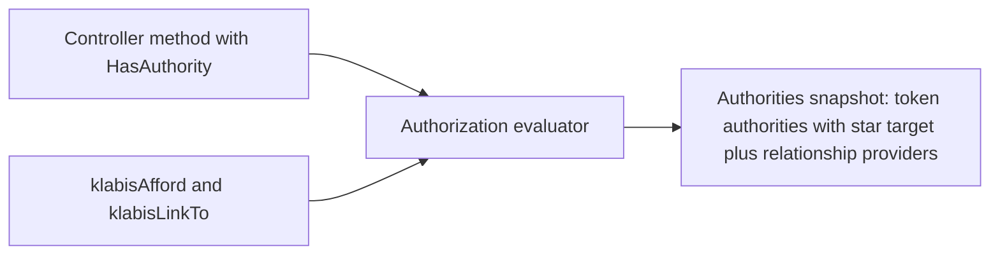

## Why

Legal guardians must be able to maintain their minor children's data, and the same need will recur for other features (trainers over trainees, event organisers over entrants). Today every permission is a global authority (`MEMBERS:MANAGE`) or a hard-wired "owner of this record" check (`@OwnerVisible`), so "this user may do X to that member because of a group relation" has to be hand-coded per use case (e.g. `GuardianListAccess`, `OwnProfileEditRule`). A relationship-based authorization (ReBAC) model lets groups delegate authorities to their owners over the group's members, and keeps the REST layer, HAL affordances and links consistent with it.

## What Changes

- `@HasAuthority` gains an optional `target` (SpEL, e.g. `"#id"`) naming the object the authority is evaluated against, and becomes repeatable (multiple annotations combine with OR). It remains the type-safe way to declare method security on controller / generated `*Api` methods.
- A single shared authorization evaluator decides "does the current user hold authority A, globally or over target T". It is used both by method security and by the HAL support (`klabisAfford`, `klabisLinkTo`), so an affordance or link is emitted only when the current user could call the method successfully. **BREAKING (internal)**: the evaluation logic duplicated in `HasAuthorityMethodInterceptor` and `HalFormsSupport.isMethodAuthorized` is replaced by the shared evaluator.
- Groups (all three types, shared persistence) can carry an immutable set of delegated member-scoped authorities. Owners of such a group hold those authorities over every member of the group.
  - Free groups: the set is chosen only when the group is created, cannot be edited afterwards, and is shown to invitees in the invitation.
  - Training groups and legal guardian groups: a fixed, predefined set; not changeable through the UI.
- The acting user's authorities become *targeted authorities* (authority plus the targets it applies to; target `*` means everything). Token authorities are held with `*`; authorities obtained through relationships carry explicit targets. The set is built once per request, so all checks see the same authorities and rendering lists issues no per-row queries.
- Relationships are pluggable: `common.security` defines a `RelationshipAuthorityProvider` SPI whose results are unioned (none registered means no relationships); `common.groups` provides the implementation for groups.
- In the members module, `@OwnerVisible` is replaced by `MEMBER:EDIT_DETAILS`: every user is granted it over themselves (a self relationship), fields and operations list `MEMBERS_MANAGE` OR `MEMBER:EDIT_DETAILS`. Other modules keep `@OwnerVisible` until migrated.
- Proof of concept: new authority `MEMBER:EDIT_DETAILS`. The member-details update endpoint is callable with `MEMBERS:MANAGE`, or with `MEMBER:EDIT_DETAILS` over that member. The minor self-edit restriction (`OwnProfileEditRule`) applies only when the target is the acting user.

## Capabilities

### New Capabilities
- `relationship-authorization`: how authorities can be evaluated against a target object, how groups delegate authorities to their owners, and how the API (endpoints, affordances, links) reflects it.

### Modified Capabilities
- `user-groups`: groups carry an immutable set of delegated authorities; free group creation chooses it, invitations display it; training groups have a predefined set.
- `legal-guardians`: legal guardian groups have a predefined set of delegated authorities, so guardians can edit their minors' details.
- `members`: Member Update is allowed with `MEMBER:EDIT_DETAILS` over the member; minor self-edit restriction applies only to the member's own profile.
- `users`: `MEMBER:EDIT_DETAILS` added to the known authorities (member-scoped; not assignable as a global permission).

## Impact

- Backend `common.security` (`HasAuthority`, `HasAuthorityMethodInterceptor`, new evaluator, `MethodSecurityAnnotations`), `common.ui.HalFormsSupport`, `KlabisJwtAuthenticationToken` / `CurrentUserData`, `common.users.Authority`.
- Groups: `GroupMemento` / `GroupJdbcRepository` (V001 DDL), the three group aggregates, invitation API and DTOs, group creation request and its HAL-FORMS template.
- Members: `MemberController.updateMember`, `OwnProfileEditRule`, `docs/openapi/spec/members.yaml` and group specs (`x-klabis-authority` extended to repeated entries with a target; code generator templates).
- Frontend: invitation view shows delegated authorities; free group create form selects them.
- `backend-patterns` skill and `docs/design-decisions.md` (new ADR) updated.
