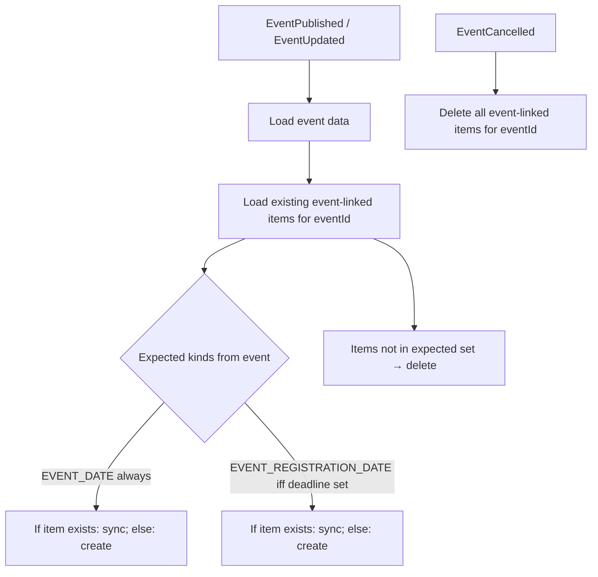

## Context

Change #1 restructured the calendar domain into a two-level polymorphic hierarchy:

```
CalendarItem (abstract)
  ├── ManualCalendarItem
  └── EventCalendarItem   (concrete, holds eventId, read-only)
```

Persistence uses single-table inheritance with a `CalendarItemKind` discriminator (`MANUAL`, `EVENT_DATE`). Application synchronization lives in `CalendarEventSyncService` with three independent handle methods (published / updated / cancelled), each operating on at most one event-linked calendar item per event.

This change adds a second kind of event-linked item: a **registration-deadline item**. Its lifecycle is tied to the same event as the event-date item, but its existence is *conditional* on the event's `registrationDeadline` field — it may come and go between event revisions as the deadline is set, cleared, or moved.

**Current state:**

- `EventCalendarItem` has one factory (`createForEvent`) and one synchronization method (`synchronizeFromEvent`). It knows its `eventId` but not which aspect of the event drives its fields.
- `CalendarEventSyncService.handleEventUpdated` skips (with a warning) when the calendar item for the event does not exist — a silent-failure mode for the event-date item.
- `EventData` (the DTO used by the sync service) does not carry the event's registration deadline.

**Constraints:**

- All existing `calendar-items` spec scenarios continue to hold.
- REST API, DTO, frontend unchanged.
- Stay within Klabis backend patterns: clean architecture, package-private constructors, static factories, memento round-trip in the adapter, `@ApplicationModuleListener` + Spring Modulith outbox for cross-module events.
- `CalendarItemKind` stays persistence-adjacent but may be read by the domain (see Decision 3).

## Goals / Non-Goals

**Goals:**

- Represent both event-linked kinds with the same `EventCalendarItem` concrete class, distinguished by a `kind` field.
- Drive the calendar state from the event state uniformly: at each event change, compute the expected set of event-linked items and reconcile the persisted set to match.
- Keep everything transactional inside the single existing `EventsEventListener`.
- Preserve the user-observable behavior of the event-date item (creation on publish, update on event edit, deletion on cancel) bit-for-bit. The observable additions are entirely around the new deadline item.
- Eliminate the silent-skip failure mode (`handleEventUpdated` when the item is missing) — replace with self-healing reconcile.

**Non-Goals:**

- Introducing a `RegistrationDeadlineCalendarItem` subtype. Rejected in favor of one class with a kind discriminator (see Decision 1).
- Exposing `kind` in `CalendarItemDto` or anywhere in the REST API.
- Differentiating the two kinds visually on the frontend.
- Adding a new listener, a new application service, or a new aggregate.
- Adding a new Flyway migration (the `kind` column already exists; we only add an allowed value).
- Changing how cancellation is detected or propagated.

## Decisions

### Decision 1: One concrete class `EventCalendarItem` carries both kinds

Both kinds share the same structure (id, name, description, startDate/endDate — always single-day, eventId, audit metadata, read-only). They differ in:

- which field of the source event drives the date (`eventDate` vs `registrationDeadline`)
- how the label is composed (`event.name()` vs `"Přihlášky - " + event.name()`)
- whether the item is expected to exist (always vs. only when `event.registrationDeadline() != null`)

None of these differences call for a separate type. Factory methods and sync methods can diverge per kind without duplicating fields or runtime guards. The `kind` field is promoted from persistence-only to a domain field on `EventCalendarItem`.

**Rationale:**

- The only thing a second subtype would add is type-level "which kind am I" dispatch, which is cleanly handled by an immutable `kind` field on a single class. Splitting into subtypes duplicates fields, constructors, mementos, and persistence mapping without a semantic payoff.
- This does not re-introduce primitive obsession: the distinction that matters (manual vs. event-linked) is already expressed as a type (`ManualCalendarItem` vs. `EventCalendarItem`). The `kind` further classifies event-linked items, but *only* for picking which event field to read — a narrow concern, not a behavioral branching point scattered through the codebase.

**Alternatives considered:**

- **Two subtypes under a common abstract parent** (`EventDateCalendarItem`, `RegistrationDeadlineCalendarItem` under a new `EventLinkedCalendarItem`). Rejected: structure is identical, the subtype distinction leaks into factories, persistence mapping, and tests without reducing complexity anywhere.
- **Derive kind from data** (e.g., a flag like "dateEqualsDeadline"). Rejected: fragile, implicit, and wrong when deadline equals event date.

### Decision 2: Unified reconcile in `CalendarEventSyncService`

The three handle methods collapse into one behavior: **reconcile the calendar state with the event state**. On publish and update, the service computes the expected kinds for that event and drives create / update / delete accordingly. On cancel, every event-linked item for that event is deleted.



**Reconcile algorithm** (pseudocode for clarity):

```
reconcile(eventId):
    event = eventDataProvider.getEventData(eventId)
    existing = findEventCalendarItems(eventId).collect(groupingBy(kind))

    expected = {EVENT_DATE}
    if event.registrationDeadline != null:
        expected.add(EVENT_REGISTRATION_DATE)

    for kind in expected:
        item = existing.remove(kind)
        if item: item.synchronizeFromEvent(event); save(item)
        else:    save(EventCalendarItem.createFor(kind, event))

    for leftover in existing.values():
        delete(leftover)
```

**Rationale:**

- Every interesting deadline-item scenario (null → value = create; value → null = delete; value → different value = update; event renamed = deadline label updates) falls out of this single algorithm without a switch per scenario.
- The event-date item gets the same treatment for free, which closes the silent-skip hole from change #1.
- Publish and update converge to one code path: on publish, `existing` is empty and all expected items are created; on update, some may exist and some may not.
- Cancel stays separate because it is semantically different — it does not consult the event's current state; it simply removes everything linked to the event.

**Alternatives considered:**

- **Keep three handlers, add deadline-specific logic inline in each.** Rejected: creates three places where the null/value/cleared deadline must be handled consistently. Every future change (a third kind, a rename) would multiply.
- **Separate `RegistrationDeadlineSyncService` + listener.** Rejected (user decision in grilling): two independent transactions per event change leave room for partially-synced state; a single listener + single service is simpler and atomic.

### Decision 3: `CalendarItemKind` is promoted to a domain-readable value

`CalendarItemKind` currently lives in `com.klabis.calendar.infrastructure.jdbc`. We lift its accessibility so that `EventCalendarItem` can own a `kind` field of that type. The enum's *shape* (the values and their names) remains an implementation detail of the calendar module; it is never exposed in the REST API or crossed the module boundary.

**Rationale:**

- The enum's purpose is to classify event-linked items. That classification is meaningful to the domain (drives factory selection and label/date choice), not just to persistence.
- Leaving it in `infrastructure.jdbc` and having the domain re-declare an equivalent enum would be pure duplication.
- Package-visibility within the `com.klabis.calendar` module is sufficient; the enum does not need to be `public` to the outside world.

**Implementation:** Move `CalendarItemKind.java` from `com.klabis.calendar.infrastructure.jdbc` to `com.klabis.calendar` (package root), make it package-private (no visibility change). The domain and the persistence adapter can both read it.

**Alternatives considered:**

- **Duplicate enum in `com.klabis.calendar.domain`** — a "domain kind" and a "persistence kind" with a manual mapping. Rejected: zero benefit, ongoing maintenance hazard.
- **Use a `boolean deadline` flag on `EventCalendarItem`** instead of an enum. Rejected: doesn't scale if a third kind ever arrives, and an enum with two values is no more complex than a boolean.

### Decision 4: Factory and sync methods per kind, single service entry point

`EventCalendarItem` exposes two factories:

- `createForEventDate(...)` — renamed from today's `createForEvent` so the kind is explicit at the call site (both factories now read as "create for X"). Same parameters as today, and sets `kind = EVENT_DATE`.
- `createForRegistrationDeadline(String eventName, EventId eventId, LocalDate deadlineDate)` — sets `kind = EVENT_REGISTRATION_DATE`, `name = "Přihlášky - " + eventName`, `description = null` (unconditionally, not a parameter), `startDate = endDate = deadlineDate`.

Synchronization is expressed via **a single domain method that operates on both kinds** by reading back `kind` on `this`. The parameter is `EventData` — the same read-model the application service already fetches from `EventDataProvider`. No wrapper command record is introduced; the old `SynchronizeFromEvent` record is deleted.

```java
public void synchronizeFromEvent(EventData event) {
    // recompute name, startDate, endDate from (event, this.kind)
    // EVENT_DATE        → name = event.name(), description = buildEventDescription(...),
    //                     startDate = endDate = event.eventDate()
    // EVENT_REGISTRATION_DATE → name = "Přihlášky - " + event.name(), description = null,
    //                     startDate = endDate = event.registrationDeadline()
}
```

**Rationale:**

- The data-change path (event renamed, deadline moved) wants to carry the whole event and let the item project what it needs. A single method keeps the service loop uniform (no "which sync method do I call?" branching).
- Factories stay explicit per kind because the creation inputs are structurally different (the caller knows which one they want, and the parameter lists are not interchangeable).

**Alternatives considered:**

- **Two sync methods, one per kind**, with the service choosing. Rejected: forces the service to know the kind of each item and dispatch — exactly the primitive-obsession pattern the refactor avoided.
- **Per-kind command records** (`SynchronizeEventDate`, `SynchronizeDeadline`). Rejected: both would carry the same fields (everything about the event) and differ only in which the item reads.

### Decision 5: Label format `"Přihlášky - {name}"` with Czech diacritics

Matches the project's Czech UI language (same rationale as elsewhere in Klabis). The separator is ` - ` (space-hyphen-space), matching the convention used in `buildEventDescription`.

**Rationale:**

- Consistency with user-facing text elsewhere in the app.
- The description field is `null`, so the label is the only text a member sees on the calendar cell; it must be unambiguous.

**Alternatives considered:**

- `"Uzávěrka přihlášek - {name}"` — more precise but longer; the column is narrow.
- No prefix, just the event name — ambiguous: the same name would appear twice for events where deadline ≠ event date.

### Decision 6: `EventData.registrationDeadline` added to the transport

`EventData` is the read model that the calendar module uses to read event state. It currently lacks `registrationDeadline`. We add it.

**Rationale:**

- The calendar module cannot see the event aggregate directly (modularity); it consults `EventDataProvider`, which returns `EventData`. Without `registrationDeadline` in the DTO, the sync service cannot drive the reconcile decision.
- The `Event` aggregate already holds `registrationDeadline` (see `Event.java`); `EventDataProviderImpl` simply does not populate it yet.

## Risks / Trade-offs

- **Risk:** Unified reconcile on event update now writes items that previously would have been skipped (the "self-healing" for missing event-date items). → Mitigation: the reconcile produces exactly the same set of items that a hypothetical "publish again" would produce, and the event is already in ACTIVE state when updates arrive. No observable regression expected. Integration tests in `CalendarEventSyncIntegrationTest` cover the republish behavior.

- **Risk:** A calendar item whose kind is `EVENT_REGISTRATION_DATE` but whose eventId points to an event that never had a deadline — an impossible state by construction, but the persistence layer permits it. → Mitigation: the reconcile is authoritative. The first reconcile after a bug that produced such a row deletes it (because the expected set does not contain that kind). No data-repair code needed.

- **Risk:** Ordering of the two items on the calendar when they fall on the same day. The repository sort is `startDate, asc`, which ties them. → Mitigation: deterministic tiebreak by `kind` or `name` can be added without spec impact; unit test documents the current ordering for future reference. Not user-visible unless both coincide, which is rare.

- **Risk:** Promoting `CalendarItemKind` to the package root widens its visibility slightly. → Mitigation: keep it package-private. Nothing outside `com.klabis.calendar` can see it.

- **Trade-off:** The reconcile algorithm reads the event data on every event update, including edits that don't affect the calendar (e.g., changing the event coordinator). → Accepted: the read is cheap (one DTO fetch), the write skips unchanged state (Spring Data JDBC will `UPDATE` any saved item, which is acceptable at current scale — 10+ concurrent users, single event per listener invocation). Optimizing the no-op write is premature.

- **Trade-off:** `synchronizeFromEvent(EventData)` reads `this.kind` and branches. This is intra-class branching on a field, not scattered runtime `instanceof` checks, and is the simplest expression of "same class, two project-me-from-event strategies". Accepted.

## Migration Plan

The `kind` column already exists in `calendar_items` with `NOT NULL DEFAULT 'EVENT_DATE'`. Adding the enum value `EVENT_REGISTRATION_DATE` requires no schema change (the column is a `VARCHAR`). Existing rows are unaffected. H2 in-memory resets on every restart — no production data to migrate.

Implementation order (single commit or short commit chain):

1. Add `registrationDeadline` to `EventData` and populate it in `EventDataProviderImpl`.
2. Move `CalendarItemKind` to `com.klabis.calendar` (package root), add `EVENT_REGISTRATION_DATE`.
3. Add `kind` field to `EventCalendarItem`; extend factories and reconstruct; add `createForRegistrationDeadline` factory.
4. Rewrite `CalendarEventSyncService` around the unified reconcile algorithm. Keep `handleEventCancelled` path as "delete all for event".
5. Update `CalendarMemento` round-trip to persist the new kind.
6. Adjust tests (service, integration, controller-level where needed) and the `calendar-items` spec delta.
7. Run the full backend test suite.

**Rollback:** pure in-repo change; revert the commit(s). No data to roll back.

## Open Questions

None. Design is settled through the grilling session. Any ambiguity during implementation should be resolved by staying close to Klabis conventions and the change-#1 patterns.
