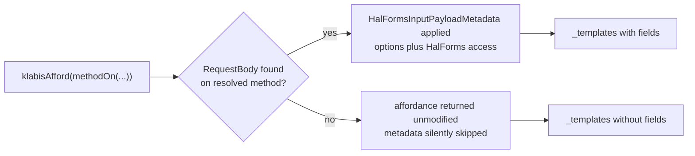

# Route HAL affordances at generated `*Api` interfaces

## Why

Since the spec-first migration, every controller implements a generated `*Api` interface that already
carries `@RequestBody`, `@HasAuthority` and `@OwnerId`. Affordances, however, still point at the
concrete controller class — and Java does not inherit parameter annotations from an interface. Each
override therefore has to re-declare `@RequestBody` by hand, and when it does not, HAL-FORMS metadata
is silently dropped from that affordance: no error, no failing test, just a template missing its
fields.

Two overrides are missing it today (`PermissionController.updatePermissions`,
`MemberAccountController.deposit`). Both are harmless only by coincidence — neither request body
carries a `@HalForms` annotation. The defect recurs every time someone writes a new override, so it
is worth removing the possibility rather than fixing the two instances.

## What Changes

- Change the ~196 `methodOn(XController.class)` call sites in `backend/src/main/java` to
  `methodOn(XApi.class)`, plus 24 in tests.
- Remove `@RequestBody` / `@Parameter`-style annotations from controller overrides where they exist
  only to satisfy the affordance lookup; the interface becomes the single declaration site.
- Add a guard test asserting that affordances resolve their input payload metadata, so a future
  override cannot silently regress.
- Update the `backend-patterns` skill: state the rule in its "HATEOAS Rules (NON-NEGOTIABLE)" section
  and correct the eight `methodOn(XController.class)` occurrences in its examples. Without this the
  skill keeps teaching the pattern this change removes, and the next generated controller reintroduces
  it.

Nothing in the emitted hypermedia changes: affordance names derive from the method name (identical on
interface and implementation), URLs come from `@RequestMapping` (present on the interface), and the
`if` conditions that decide whether an affordance is added stay in the controllers untouched.

Today the branch depends on whether an override remembered the annotation. Routing at the interface
makes the `no` branch unreachable.

## No Behavior Change Justification

**Specs reviewed:**

- `openspec/specs/non-functional-requirements/spec.md` — defines which affordances appear under which
  conditions (`registerForEvent`, `unregisterFromEvent`, `suspend`, DRAFT event links). Unaffected:
  the conditions live in controller code that this change does not touch, and the affordance names
  are derived from method names that are identical on both interface and implementation.
- `openspec/specs/events/spec.md` — requires row-level HAL-Forms affordances in the events list,
  rendered only when authorized. Unaffected: authorization is evaluated by
  `HalFormsSupport.isMethodAuthorized`, and `@HasAuthority` / `@OwnerId` are present on the generated
  interfaces (the bundler emits them from `x-klabis-authority` / `x-klabis-owner-visible`).
- `openspec/specs/application-navigation/spec.md` — uses "affordance" for UI navigation, not
  HAL-FORMS. Unaffected.

**Why no spec update is needed:**

This is an internal change to which Java type the link builder resolves against. The wire format is
unchanged — same links, same affordance names, same `_templates`, same authorization outcomes. If
anything, the currently-missing `@RequestBody` cases gain the field metadata the specs already assume
is there; that is a defect being removed, not a behavior being altered.

## Impact

- **Code:** all 20 REST controllers and their HAL postprocessors under
  `backend/src/main/java/com/klabis/*/infrastructure/restapi/`. All 20 already implement a generated
  interface, and all 97 distinct methods referenced through `methodOn(...)` have an interface
  counterpart — verified, so no endpoint is left needing to point at the class.
  `getAccommodationListAsCsv` has no interface counterpart but is not an affordance target.
- **Tests:** 24 `methodOn(...)` call sites, mostly link-assertion unit tests.
- **Documentation:** `.claude/skills/backend-patterns/SKILL.md` (the rule plus eight example
  occurrences) and `references/aggregate-checklist.md`, which tells implementers to add affordances
  without saying against which type. An ADR in `docs/design-decisions.md` records the reasoning.
- **Developer workflow:** overrides stop needing `@RequestBody`; the interface becomes the one place
  an endpoint's contract is declared.
- **Risk:** `HalFormsSupport.METHOD_AUTH_CACHE` is keyed on `Method` alone; its javadoc notes this is
  sound only while every caller derives `targetClass` from the method itself. That invariant holds
  after the change, but it deserves an explicit test rather than an assumption.
