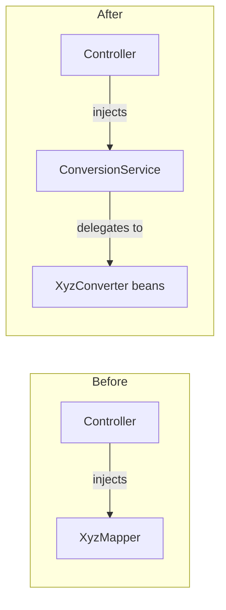

## Why

The `MonetaryAmount` mapping was recently turned into a `Converter<MonetaryAmount, MonetaryAmount>` Spring bean, consumed only via `ConversionService`, to fix a `@WebMvcTest` slice failure (a global `@RestControllerAdvice` depended on a mapper that wasn't available in narrow slice contexts). The rest of the codebase's MapStruct mappers still use the older pattern — controllers inject the concrete `XyzMapper` interface directly and call its methods.

Having two different access patterns for mapper-based conversions (direct mapper injection vs. `ConversionService`) invites inconsistency: it is easy to pick the "wrong" one in new code, and every future controller has to relearn which pattern applies where. Aligning all mappers on the `ConversionService` pattern removes that decision point entirely.

## What Changes

- `AuthorityMapper`: keep `toDto(Authority)`/`toDomain(AuthorityDto)` as `Converter<Authority, AuthorityDto>` / `Converter<AuthorityDto, Authority>` beans (config `MapstructSpringMapperConfig`). Drop `toDtoSet`/`toDomainSet` — `GenericConversionService` reuses element-level converters for `Set`/`List` via `TypeDescriptor.collection(...)`, so no separate collection converter is needed. `PermissionController` switches from injecting `AuthorityMapper` to injecting `ConversionService` and calls `convert(..., TypeDescriptor.collection(...), TypeDescriptor.collection(...))`.
- `BulkResultMapper`: `toDto(BulkSyncResult)` and `toDto(BulkImportResult)` become two distinct `Converter<X,Y>` interfaces (distinct class names needed since both source methods are called `toDto`). Nested mappings (`EventSyncEntry`, `SyncStatus`, `ImportStatus`) stay as internal MapStruct `@Mapping`-driven helpers — they are never called from outside the mapper, so they don't need their own `Converter`. `OrisEventController` switches both call sites to `ConversionService.convert(result, TargetDto.class)`.
- `MemberMapper`: four externally-called methods become `Converter<X,Y>` beans — `toSummaryResponse`, `toDetailsResponse`, `deactivationReasonToDomain`, and `toRegisterNewMemberCommand`. The last one currently takes two arguments (`request`, `registeredBy`); introduce a new wrapper record `RegisterMemberRequestWithParameters(RegisterMemberRequest request, UserId registeredBy)` so the method becomes single-argument and fits the `Converter<S,T>` contract. Internal-only helpers (`guardianToResponse`, `createPersonalInformation`) stay as `default` methods inside `MemberMapper`, unexposed as converters. `MemberController` and `RegistrationController` switch from injecting `MemberMapper` to injecting `ConversionService`.
- During implementation, evaluate whether `mapstruct-spring-extensions` can auto-generate the reverse direction of a fully-generated (non-`default`) mapping (e.g. `AuthorityMapper`'s `toDto`/`toDomain` pair) instead of hand-writing both `Converter` interfaces — use it where applicable to reduce boilerplate.
- No `@ConverterScan`/`@ComponentScan` needed anywhere: Spring Boot's `WebMvcTypeExcludeFilter` includes `Converter`/`GenericConverter` in `KNOWN_INCLUDES`, so any `Converter` bean under `com.klabis` is picked up by `@WebMvcTest` automatically (already confirmed for `MonetaryAmountConverter`).

## No Behavior Change Justification

**Specs reviewed:**
- `openspec/specs/members/spec.md` — unaffected; `MemberMapper` conversions keep identical field mappings, only the invocation mechanism changes (direct call vs. `ConversionService.convert`).
- `openspec/specs/events/spec.md` — unaffected; `BulkResultMapper` output DTOs are unchanged.
- No spec exists for `common/users` (permissions); `AuthorityMapper` output is unchanged.

**Why no spec update is needed:**
This is a pure internal wiring change. Every converted type pair produces byte-for-byte identical output to today's mapper calls — MapStruct still generates the same field-mapping logic, just wrapped in a `Converter<S,T>` interface instead of a plain mapper method, and resolved through `ConversionService` instead of direct injection. No request/response DTO shape changes, no new/removed API fields, no change in HTTP status codes or `_links`.

## Impact

- **Affected files**: `AuthorityMapper.java`, `BulkResultMapper.java`, `MemberMapper.java`, plus their 4 controller consumers (`PermissionController`, `OrisEventController`, `MemberController`, `RegistrationController`), plus corresponding `@WebMvcTest` slice tests that currently `@Import`/mock the concrete mapper type.
- **New file**: `RegisterMemberRequestWithParameters` wrapper record in `members.infrastructure.restapi`.
- **Build**: no new dependencies; reuses existing `mapstruct-spring-extensions` + `MapstructSpringMapperConfig` already introduced for `MonetaryAmountConverter`.
- **Developer workflow**: establishes a single, consistent pattern for exposing mapper conversions to consumers — future mappers should follow the same `Converter<S,T>` + `ConversionService` approach from the start.
