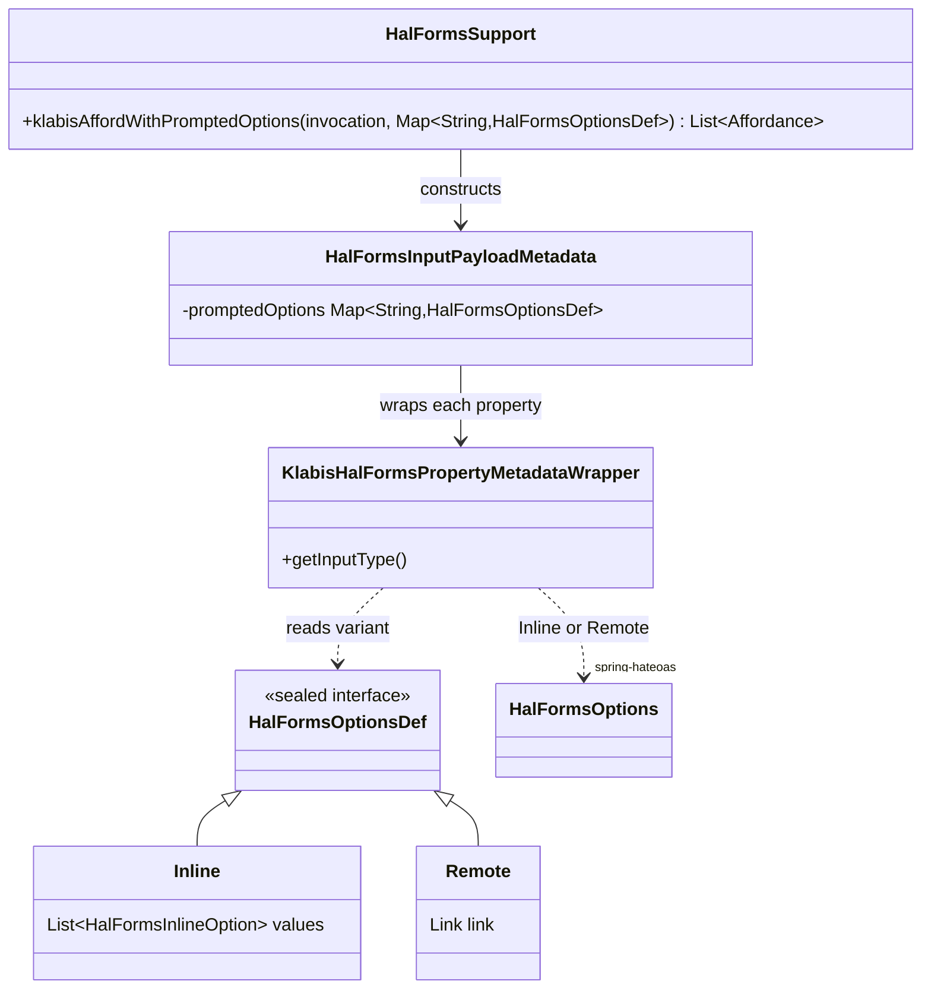

## Context

This change bundles four independent findings from an application review session. Three touch HAL-FORMS affordance/link wiring in existing controllers (`DisciplineController`, `EventController`, `MemberController`); one is a pure OpenAPI spec authority annotation change (`MemberDetailsResponse.active`). None introduce a new aggregate, domain concept, or persistence change — the design here is about API shape and an internal HAL-FORMS extension point, not domain modeling.

The common thread across items 3 and 4 (sync status visibility) is an existing, working pattern (`SyncApi.getSyncState`, `SyncStatusIndicator`/`SyncStatusOverlay` on the frontend) that is applied consistently to both `EventSummaryPostprocessor` and `MemberSummaryPostprocessor`, mirroring what `EventDetailsPostprocessor`/`MemberDetailsPostprocessor` already do. Item 1's link-options mechanism is new plumbing in the shared `common.ui` HAL-FORMS support, reused by two unrelated call sites (discipline selection, member selection) to avoid inline option lists that must be embedded (and duplicated) into every affordance response.

## Goals / Non-Goals

**Goals:**
- Close the two authorization gaps (discipline menu/endpoint authority, member `active` field visibility) with minimal, targeted spec/annotation changes.
- Make ORIS synchronisation status reachable from list views (events, members), matching the detail-page behavior that already exists.
- Introduce one reusable backend mechanism for link-based HAL-FORMS options, replacing two independent ad-hoc patterns (inline discipline options, frontend-hardcoded member options link) with a single server-driven approach.
- Remove the now-redundant `syncEventFromOris` endpoint and its supporting code once the generic sync engine covers the same user-facing action.

**Non-Goals:**
- No change to the synchronisation engine itself (`com.klabis.sync`) — this only changes which controllers expose links into it.
- No change to `HalFormsMemberId`/`useHalFormOptions` on the frontend — link-based options are already fully supported there; only the backend side and the `KlabisFieldsFactory` hardcoded fallback change.
- No new domain aggregate, no new persisted state, no new authority beyond swapping which existing authority (`EVENTS_READ` → `EVENTS_MANAGE`, adding `MEMBERS_MANAGE`) gates an existing field/link.

## Decisions

### D1 — Discipline catalog authority: raise to `EVENTS_MANAGE`

The discipline catalog is a manager-only tool (assigning disciplines to event types); it is not useful reference data for a plain club member. `x-klabis-authority` on `listDisciplines` moves from `EVENTS_READ` to `EVENTS_MANAGE`. This is a single spec-line change; `DisciplinesRootPostprocessor`'s `klabisLinkTo` gating requires no code change — it already respects whatever authority the target operation declares.

**Alternative considered**: add authority gating directly in `DisciplinesRootPostprocessor`, independent of the endpoint's own authority. Rejected — it would let a user open the menu link but get `403` calling the underlying endpoint, which is exactly the inconsistency this change fixes for `active` (see D2's rationale by analogy). Keeping a single authority source of truth (the endpoint) is simpler (KISS) and consistent with how every other menu link in `RootController`/module postprocessors already works.

### D2 — Member `active` field authority: align with `MemberSummaryResponse`

`MemberDetailsResponse.active` gets `x-klabis-authority: MEMBERS_MANAGE`, matching the already-correct `MemberSummaryResponse.active`. No new pattern — this is applying an existing, working annotation to a schema that was missed when it was added elsewhere.

### D3 — Link-based HAL-FORMS options: single method, per-field option kind

**Problem**: `klabisAffordWithPromptedOptions` (existing) only supports `HalFormsOptions.inline(...)` — the full option list is computed server-side per request and embedded into the affordance. This doesn't scale for member selection (hundreds of members) and forces the frontend (`KlabisFieldsFactory.memberIdFieldRenderer`) to hardcode a fallback link (`/members/options`) instead of the backend declaring it.

A second, parallel method (`klabisAffordWithLinkOptions`, taking `Map<String, Link>`) was considered but rejected: an affordance with two fields — one needing an inline list, the other a remote link — would force the caller to build and pass two separate maps to two separate calls, awkwardly composed together. The two kinds of options are a per-field choice, not a per-affordance one.

**Decision**: keep a single method, and introduce a small sealed DTO that represents either kind of option definition as the map's value type:

```java
sealed interface HalFormsOptionsDef {
    record Inline(List<HalFormsInlineOption> values) implements HalFormsOptionsDef {}
    record Remote(Link link) implements HalFormsOptionsDef {}
}
```

`klabisAffordWithPromptedOptions(Object invocation, Map<String, HalFormsOptionsDef> promptedOptions)` replaces the current `Map<String, List<HalFormsInlineOption>>` signature. A caller needing both kinds for the same affordance passes one map mixing `HalFormsOptionsDef.Inline(...)` and `HalFormsOptionsDef.Remote(...)` values per field. `HalFormsInputPayloadMetadata`/`KlabisHalFormsPropertyMetadataWrapper` switch on the DTO's variant and construct `HalFormsOptions.inline(...)` or `HalFormsOptions.remote(link)` (both already provided by `spring-hateoas` — no new library) accordingly.



No new domain types — `HalFormsOptionsDef` is infrastructure inside `com.klabis.common.ui`, alongside the existing `HalFormsInlineOption`. Table of what changes:

| Element | Change |
|---|---|
| `HalFormsOptionsDef` (new) | Sealed interface with `Inline`/`Remote` records, in `com.klabis.common.ui` |
| `HalFormsSupport.klabisAffordWithPromptedOptions` | Signature changes from `Map<String, List<HalFormsInlineOption>>` to `Map<String, HalFormsOptionsDef>` |
| `HalFormsInputPayloadMetadata` / `KlabisHalFormsPropertyMetadataWrapper` | Switch on `HalFormsOptionsDef` variant instead of assuming inline; emit `HalFormsOptions.remote(link)` for `Remote` |
| Every existing caller of `klabisAffordWithPromptedOptions` (e.g. `categoryId` in `EventController`) | Wrap existing inline lists as `new HalFormsOptionsDef.Inline(options)` — mechanical migration, no behavior change |
| `EventTypeController` (`disciplineIds`) | Passes `new HalFormsOptionsDef.Remote(linkTo(...listDisciplines...))` instead of an inline list |
| Every controller using `HalFormsMemberId`-style member fields | Passes `new HalFormsOptionsDef.Remote(linkTo(...listMemberOptions...))` for that field |
| `KlabisFieldsFactory.tsx` (`memberIdFieldRenderer`) | Drops the hardcoded `{link: {href: "/members/options"}}` fallback; trusts `conf.prop.options` from the backend (link or inline) exactly as it already does for the inline branch |

**Alternative considered**: two separate methods (`klabisAffordWithPromptedOptions` for inline, `klabisAffordWithLinkOptions` for remote). Rejected per above — breaks down as soon as one affordance needs both kinds across different fields, and doubles the API surface for what is fundamentally one concept (property options) with two representations.

**Alternative considered**: make link options fully computed (backend enumerates and embeds full option list, just via a different JSON shape). Rejected — defeats the purpose (avoiding large embedded lists) and does not address the discovery problem (frontend/backend independently deciding on `/members/options`).

### D4 — Sync status in list views: mirror the existing detail-page wiring exactly

`EventSummaryPostprocessor` and `MemberSummaryPostprocessor` gain the same `if (isEnrolled(id)) { klabisLinkTo(...SyncApi.getSyncState...).ifPresent(link -> dtoModel.add(link.withRel("sync"))); }` block that `EventDetailsPostprocessor`/`MemberDetailsPostprocessor` already have. No new HAL rel, no new endpoint, no new authority — `sync` already means the same thing everywhere it appears.

Frontend: `EventsPage.tsx` already renders `SyncStatusIndicator` when `_links.sync` is present (mode `icon`) — it starts working the moment the backend link exists. `MembersPage.tsx` and `MemberDetailPage.tsx` need the component added, following the same `mode="icon"` (list) / `mode="icon+date"` (detail) split already used for events.

### D5 — Remove `syncEventFromOris` in favor of the generic sync engine

`OrisEventImportService.syncEventFromOris` is a thin wrapper: look up the sync record, refuse if `CONFLICT`/`FAILED` (via `EventSyncNeedsResolutionException`), otherwise call `synchronizationPort.synchronizeNow(record.getId(), null)`. This is functionally identical to `SyncApi.synchronizeNow` (`SYNC_MANAGE` authority) with its own `409 NeedsDecision` response for the same `CONFLICT`/`FAILED` guard.

Once the events list row exposes the `sync` status indicator (D4) with its `synchronizeNow` affordance (from `SyncStatusOverlay`, already wired), the per-row "Synchronizovat" button backed by `syncEventFromOris` becomes a duplicate entry point for the same action. Remove:
- `docs/openapi/spec/events.yaml`: `POST /api/events/{id}/sync-from-oris` operation and its `x-hal-templates` entry.
- `OrisEventController.syncEventFromOris` handler.
- `OrisEventImportPort.syncEventFromOris` / `OrisEventImportService.syncEventFromOris`.
- `EventAffordanceSupport.addManagementAffordances` — drop the `syncEventFromOris` affordance branches (DRAFT/ACTIVE), since the row now surfaces the same capability through the `sync` link (D4) instead of a direct affordance.
- `EventSyncNeedsResolutionException`, if nothing else references it after the above.
- Associated tests (`OrisEventImportServiceTest`, parts of `EventControllerTest`, `OrisEventControllerTest`).

**Verification before deletion**: confirm `409 NeedsDecision` from `SyncApi.synchronizeNow` (shared `sync.yaml` response) produces an equivalent manager-facing outcome (blocked with an explanation, no silent overwrite) to today's `EventSyncNeedsResolutionException` — this is a TDD/testing task, not a design decision, since the sync engine's contract already documents this behavior (`data-synchronization` spec: "Conflicting Changes Are Reported, Never Merged", "Failed Synchronisation Is Retried, Then Stops And Waits").

**Alternative considered**: keep `syncEventFromOris` as a thin façade for backward compatibility. Rejected — no client (frontend or otherwise) uses it outside the affordance this change removes; keeping a duplicate entry point to the same underlying action only invites the two to drift apart again.

## API Changes

### `docs/openapi/spec/events.yaml`

| Operation | Change |
|---|---|
| `listDisciplines` *(in events.yaml, discipline catalog)* | `x-klabis-authority`: `EVENTS_READ` → `EVENTS_MANAGE` |
| `createEventType` / `updateEventType` | `disciplineIds` HAL-FORMS property: `options.inline` (list of `HalFormsInlineOption`) → `options.link` pointing at `GET /api/disciplines` |
| `syncEventFromOris` (`POST /api/events/{id}/sync-from-oris`) | **Removed** — operation and its `x-hal-templates` entry deleted |
| `listEvents` response (`x-hal-links`) | Row-level `sync` link added for ORIS-enrolled events, mirroring `getEvent`'s existing `sync` link |

### `docs/openapi/spec/members.yaml`

| Schema/Operation | Change |
|---|---|
| `MemberDetailsResponse.active` | Adds `x-klabis-authority: MEMBERS_MANAGE` |
| `listMembers` response (`x-hal-links`) | Row-level `sync` link added for ORIS-enrolled members, mirroring `getMember`'s existing `sync` link |
| Any HAL-FORMS property using `HalFormsMemberId` (e.g. member-picker fields) | `options.inline`/frontend-hardcoded link → backend-declared `options.link` on `GET /api/members/options` |

No new endpoints, no new request/response schemas, no new HAL rels beyond reusing the existing `sync` rel name in a new location.

## Risks / Trade-offs

- **[Risk]** Raising `listDisciplines` authority to `EVENTS_MANAGE` could break a currently-working (if unintended) integration relying on `EVENTS_READ` access. → **Mitigation**: confirmed in review that no other backend/frontend code path calls this endpoint outside `EVENTS_MANAGE`-gated affordances; a targeted regression test locks in the new authority.
- **[Risk]** Removing `syncEventFromOris` is an API-breaking change for any external client not covered by this review. → **Mitigation**: project has no production environment yet (per `backend/CLAUDE.md`); internal-only API, no external consumers to break.
- **[Risk]** Changing `klabisAffordWithPromptedOptions`'s signature (`List<HalFormsInlineOption>` → `HalFormsOptionsDef`) touches shared `common.ui` HAL-FORMS infrastructure and every existing caller. → **Mitigation**: mechanical migration (wrap existing lists in `HalFormsOptionsDef.Inline`), no behavior change for existing inline callers; verified with unit tests on `HalFormsSupport` and a full build before touching any controller call site.
- **[Trade-off]** Bundling four unrelated findings into one change increases review surface area but matches how they were discovered (one review session) and avoids four near-empty single-line proposals. Tasks are still organized as independent, separately-committable vertical slices (per `CLAUDE.md` refactoring guidance).

## Glossary

- **Link-based HAL-FORMS option**: a HAL-FORMS property whose `options` object contains a `link` (fetched separately by the client) rather than an inline enumerated value list — `HalFormsOptions.remote(Link)` in Spring HATEOAS terms.
- **Sync status indicator**: the frontend badge/icon (`SyncStatusIndicator`) that surfaces an entity's ORIS synchronisation state and, on click, opens `SyncStatusOverlay` with the `synchronizeNow`/`acknowledgeSyncConflict`/`resolveSyncConflict`/`resetSyncRecord` actions.
- **Enrolled** (event/member): has an active `SyncRecord` in the `sync` module (`SyncEntityType.EVENT`/`MEMBERS`), i.e. was imported from and is kept in step with ORIS.
