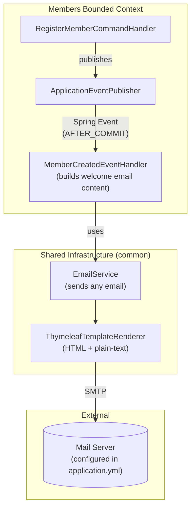
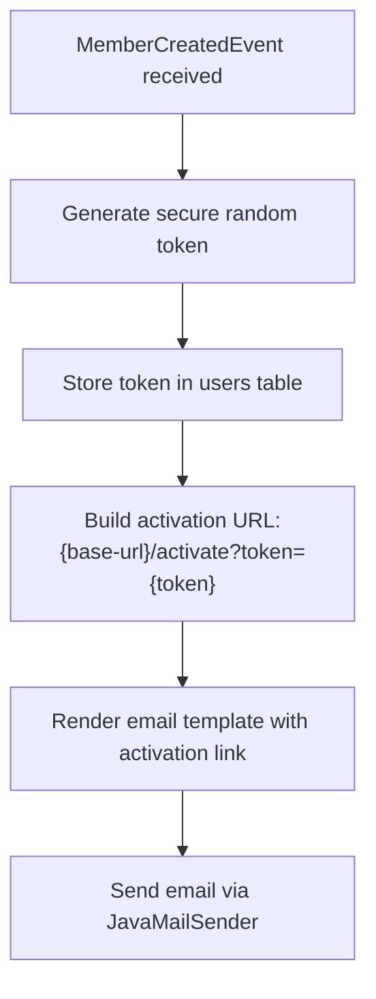

# Design: Email Service for Member Registration

## Overview

This document describes the architecture for adding email capabilities to handle welcome emails with account activation
links when new members register.

## Architecture

### Package Structure

Email is **shared infrastructure**, not a bounded context. It provides common functionality that bounded contexts (like
members) can use.

```
com.klabis
├── common
│   └── email                              # Shared email infrastructure
│       ├── EmailService.java              # Email sending interface
│       ├── EmailMessage.java              # Email DTO (to, subject, body)
│       └── infrastructure
│           ├── JavaMailEmailService.java  # Spring Mail implementation
│           └── ThymeleafTemplateRenderer.java
│
└── members
    ├── domain
    │   └── MemberCreatedEvent.java        # Domain event (exists)
    └── application
        └── MemberCreatedEventHandler.java # Handles event, uses EmailService
```

**Key principle:** The event handler lives in `members` bounded context because it knows about member-specific logic (
what email to send, what data to include). It uses the shared `EmailService` for the actual sending.

### Component Diagram



### Responsibility Split

| Component                 | Package               | Responsibility                                                  |
|---------------------------|-----------------------|-----------------------------------------------------------------|
| EmailService              | `common.email`        | Generic email sending (no domain knowledge)                     |
| TemplateRenderer          | `common.email`        | Render Thymeleaf templates to HTML/text                         |
| MemberCreatedEventHandler | `members.application` | Listen to member events, build welcome email, call EmailService |
| ActivationToken logic     | `users.domain`        | Token generation, validation, storage                           |

## Event Handling Strategy

### Current Approach: @TransactionalEventListener

```java
@Component
public class MemberCreatedEventHandler {

    @Async
    @TransactionalEventListener(phase = TransactionPhase.AFTER_COMMIT)
    public void onMemberCreated(MemberCreatedEvent event) {
        // Generate activation token
        // Send welcome email
        // Log outcome (success/failure)
    }
}
```

**Benefits:**

- Email sent only after successful member creation
- Async execution doesn't block registration response
- Simple to implement with existing Spring infrastructure

**Limitations (documented for future):**

- No guaranteed delivery if app crashes after commit
- No retry mechanism built-in
- Future: Implement Spring Modulith outbox pattern (see OUTBOX_PATTERN.md)

### Activation Token Flow



## Email Templates

### Template Structure

```
src/main/resources/templates/email/
├── welcome.html          # HTML version
└── welcome.txt           # Plain-text version
```

### Template Variables

| Variable             | Description              | Example                  |
|----------------------|--------------------------|--------------------------|
| `firstName`          | Member's first name      | "Jan"                    |
| `lastName`           | Member's last name       | "Novák"                  |
| `registrationNumber` | Club registration number | "ZBM2501"                |
| `activationUrl`      | Full activation link     | "https://..."            |
| `clubName`           | Club name from config    | "Klub orientačního běhu" |

### Multipart Email

Emails are sent as multipart (HTML + plain-text) to ensure:

- Rich formatting for modern email clients
- Fallback for text-only clients
- Better deliverability (spam filters prefer multipart)

## Database Changes

### Activation Token Storage

Add columns to existing `users` table:

```sql
-- V003__add_activation_tokens.sql
ALTER TABLE users
ADD COLUMN activation_token VARCHAR(255),
ADD COLUMN activation_token_expires_at TIMESTAMP,
ADD COLUMN activated_at TIMESTAMP;

CREATE INDEX idx_users_activation_token ON users(activation_token);
```

### Token Properties

- **Format:** UUID v4 (cryptographically secure)
- **Expiration:** 72 hours from creation
- **Single-use:** Cleared after activation

## Configuration

### Application Properties

```yaml
klabis:
  email:
    enabled: true
    from: "noreply@klabis.cz"
    activation:
      token-validity-hours: 72
      base-url: "${KLABIS_BASE_URL:http://localhost:8080}"
  club:
    name: "Klub orientačního běhu"
```

### Existing SMTP Configuration (already in application.yml)

```yaml
spring:
  mail:
    host: ${SMTP_HOST:localhost}
    port: ${SMTP_PORT:587}
    username: ${SMTP_USERNAME:}
    password: ${SMTP_PASSWORD:}
    properties:
      mail.smtp.auth: true
      mail.smtp.starttls.enable: true
```

## Error Handling

### Failure Scenarios

| Scenario                 | Handling                                               |
|--------------------------|--------------------------------------------------------|
| SMTP unavailable         | Log error, do not retry (member registration succeeds) |
| Invalid email address    | Log warning, skip sending                              |
| Template rendering error | Log error, send plain-text fallback                    |
| Token generation failure | Log error, do not send email                           |

### Logging

```java
// Success (INFO level, no PII)
log.info("Welcome email sent for member registration {}", registrationNumber);

// Failure (ERROR level, no PII)
log.error("Failed to send welcome email for registration {}: {}",
          registrationNumber, exception.getMessage());
```

## Testing Strategy

### Unit Tests

- EmailService: Mock JavaMailSender
- TemplateRenderer: Verify template output
- ActivationToken: Generation and validation

### Test Scenarios

1. Welcome email sent after member creation
2. Activation link works and activates account
3. Expired token rejected
4. Already-used token rejected
5. Email contains both HTML and plain-text parts
6. Guardian email used when member has no email (minors)

## Dependencies

### New Dependencies

```xml
<!-- Thymeleaf for email templates -->
<dependency>
    <groupId>org.springframework.boot</groupId>
    <artifactId>spring-boot-starter-thymeleaf</artifactId>
</dependency>

```

### Existing Dependencies (already present)

- `spring-boot-starter-mail` - JavaMailSender

## Security Considerations

1. **Token Security:**
    - Use `SecureRandom` for token generation
    - Tokens expire after 72 hours
    - Single-use (cleared after activation)
    - Constant-time comparison to prevent timing attacks

2. **PII Handling:**
    - Do not log email addresses or names
    - Log only registration numbers for traceability

3. **Email Security:**
    - Use TLS for SMTP connection
    - Configure SPF/DKIM (operations concern, not code)

## Future Enhancements (Out of Scope)

- Password reset emails
- Event notification emails
- Spring Modulith outbox pattern for guaranteed delivery
- Email delivery tracking
- Rate limiting
- Bulk email sending
