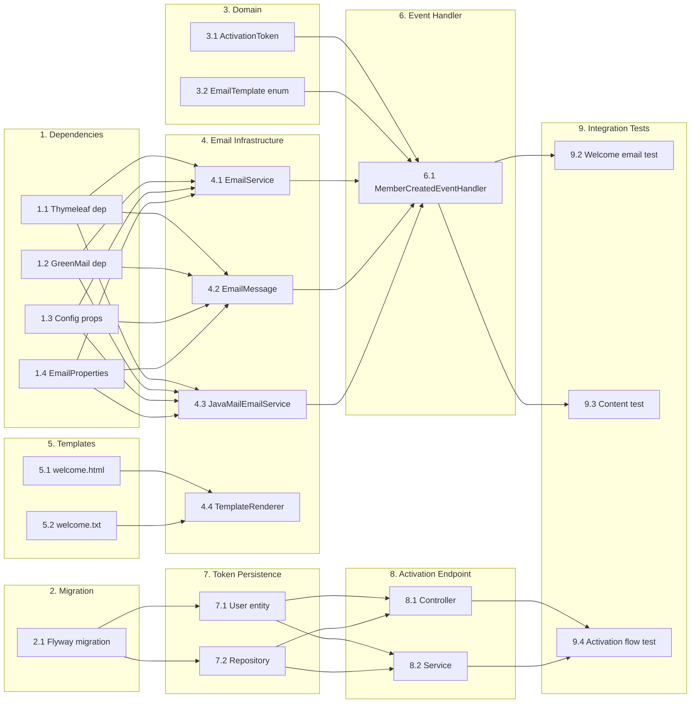

# Implementation Tasks

## Progress Summary

**Status:** Complete (32/32 tasks completed)

**Completed:**

- ✅ Section 1: Dependencies & Configuration (4/4 tasks)
- ✅ Section 2: Database Migration (1/1 task)
- ✅ Section 3: Domain Layer (3/3 tasks)
- ✅ Section 4: Shared Email Infrastructure (5/5 tasks)
- ✅ Section 5: Email Templates (2/2 tasks)
- ✅ Section 6: Event Handler (3/3 tasks)
- ✅ Section 7: Activation Token Persistence (3/3 tasks)
- ✅ Section 8: Activation Endpoint (3/3 tasks)
- ✅ Section 9: Integration Tests (5/5 tasks)
- ✅ Section 10: Documentation (3/3 tasks)

---

## 1. Dependencies & Configuration

- [x] 1.1 Add Thymeleaf dependency to pom.xml
- [x] 1.2 Add GreenMail test dependency to pom.xml
- [x] 1.3 Add email configuration properties to application.yml (klabis.email.*)
- [x] 1.4 Create EmailProperties configuration class with @ConfigurationProperties

## 2. Database Migration

- [x] 2.1 Create Flyway migration V003__add_activation_tokens.sql
    - Add activation_token column to users table
    - Add activation_token_expires_at column
    - Add activated_at column
    - Create index on activation_token

## 3. Domain Layer

- [x] 3.1 Create ActivationToken value object
    - Secure random generation
    - Expiration check
    - Single-use validation
- [x] 3.2 Create EmailTemplate enum (WELCOME)
- [x] 3.3 Write unit tests for ActivationToken

## 4. Shared Email Infrastructure (com.klabis.common.email)

- [x] 4.1 Create EmailService interface
    - send(EmailMessage message)
    - Generic email sending, no domain knowledge
- [x] 4.2 Create EmailMessage DTO
    - to, subject, htmlBody, textBody
- [x] 4.3 Create JavaMailEmailService implementation
    - Use JavaMailSender
    - Send multipart email (HTML + plain-text)
    - Handle SMTP failures gracefully
- [x] 4.4 Create ThymeleafTemplateRenderer
    - Render HTML template
    - Render plain-text template
- [x] 4.5 Write unit tests for JavaMailEmailService (mock JavaMailSender)

## 5. Email Templates

- [x] 5.1 Create welcome.html Thymeleaf template
    - Include firstName, lastName, registrationNumber
    - Include activation URL
    - Include club name
    - Professional styling
- [x] 5.2 Create welcome.txt plain-text template
    - Same variables as HTML
    - Clean text formatting

## 6. Event Handler (com.klabis.members.application)

- [x] 6.1 Create MemberCreatedEventHandler
    - @TransactionalEventListener(phase = AFTER_COMMIT)
    - @Async for non-blocking execution
    - Generate activation token
    - Build welcome email content (member-specific logic)
    - Call shared EmailService
    - Log outcomes (no PII)
- [x] 6.2 Write unit tests for event handler
- [x] 6.3 Configure @EnableAsync in application

## 7. Activation Token Persistence

- [x] 7.1 Update User entity with activation token fields
    - activation_token
    - activation_token_expires_at
    - activated_at
- [x] 7.2 Create ActivationTokenRepository or extend UserRepository
- [x] 7.3 Write repository tests

## 8. Activation Endpoint

- [x] 8.1 Create AccountActivationController
    - GET /api/activate?token={token}
    - Validate token
    - Activate account
    - Return appropriate response
- [x] 8.2 Implement activation logic in UserService or dedicated service
- [x] 8.3 Write API tests for activation endpoint
    - Success scenario
    - Expired token
    - Invalid token
    - Already activated

## 9. Integration Tests

- [x] 9.1 Set up GreenMail test infrastructure
    - @RegisterExtension for JUnit 5
    - Test SMTP configuration
- [x] 9.2 Write integration test: welcome email sent on member creation
- [x] 9.3 Write integration test: email contains correct content
- [x] 9.4 Write integration test: activation flow end-to-end
- [x] 9.5 Write integration test: SMTP failure handling

## 10. Documentation

- [x] 10.1 Update README with email configuration instructions
- [x] 10.2 Add activation endpoint to OpenAPI documentation
- [x] 10.3 Document email template customization

---

## Task Dependencies

## Estimated Effort

| Section                         | Tasks | Complexity |
|---------------------------------|-------|------------|
| 1. Dependencies & Configuration | 4     | Low        |
| 2. Database Migration           | 1     | Low        |
| 3. Domain Layer                 | 3     | Low        |
| 4. Shared Email Infrastructure  | 5     | Medium     |
| 5. Email Templates              | 2     | Low        |
| 6. Event Handler                | 3     | Medium     |
| 7. Activation Token Persistence | 3     | Low        |
| 8. Activation Endpoint          | 3     | Medium     |
| 9. Integration Tests            | 5     | Medium     |
| 10. Documentation               | 3     | Low        |

**Total: 32 tasks**
