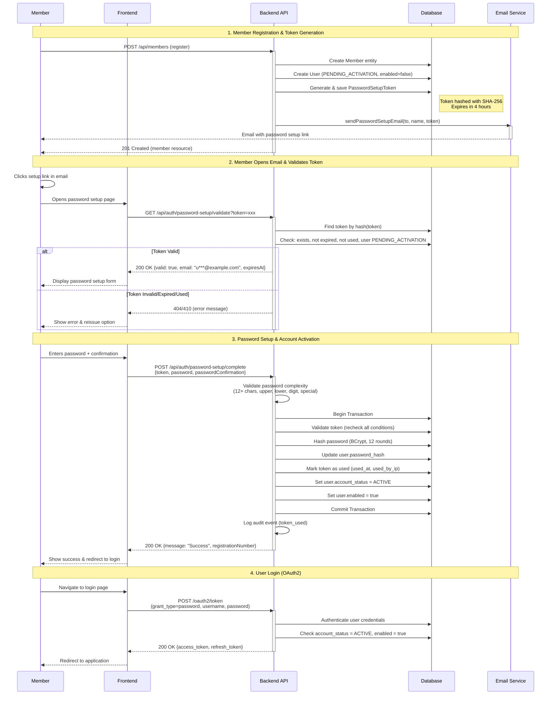

# Technical Design: Password Setup Flow

**Status: 🔄 PENDING IMPLEMENTATION - Replace Current Solution**

This design document describes the password setup flow that will replace the interim email-based activation solution.

See "Current Implementation (Interim Solution)" in `proposal.md` for details about the existing implementation that will
be replaced.

---

## Context

An interim email-based activation flow exists but has critical issues: temporary passwords are generated but never sent
to users, resulting in activated accounts that cannot be used. This design introduces a secure, token-based password
setup flow that allows new members to set their own passwords via email links, replacing the incomplete interim
solution.

### Constraints

- Must comply with GDPR (secure token handling, audit trail)
- Must use existing Spring Mail infrastructure (no new email services)
- Must integrate with existing OAuth2 authorization server
- Must follow Clean Architecture and DDD patterns
- Database is PostgreSQL (production) / H2 (dev/test)

### Stakeholders

- New members registering for club membership
- Club administrators managing member registrations
- Frontend developers consuming the REST API
- Security auditors requiring audit trails

## Goals / Non-Goals

### Goals

- Provide secure, time-limited password setup tokens (4-hour expiration)
- Enable self-service password setup via email link
- Prevent token abuse through rate limiting (per registration number)
- Support token reissuance for expired tokens
- Maintain complete audit trail for security events
- Seamless integration with existing member registration flow

### Non-Goals

- IP-based rate limiting (out of scope, can be added later if needed)
- Redis/external cache for token storage (use PostgreSQL for simplicity)
- Transactional email service (use SMTP, can migrate later)
- Frontend implementation (backend API only)
- Migration of existing users (application not yet deployed)
- Password reset for active users (separate feature, not in this change)

## Decisions

### Decision 1: Token Storage in PostgreSQL

**Choice:** Store tokens in PostgreSQL database table (`password_setup_tokens`)

**Rationale:**

- Database already available in architecture
- ACID compliance for token usage tracking (critical for single-use enforcement)
- Simple scheduled cleanup via daily cron job
- Expected low token volume (< 1000 active tokens at any time)
- Excellent query performance with proper indexes
- No new infrastructure required

**Alternatives Considered:**

- Redis: Rejected due to additional infrastructure complexity and no compelling performance need
- In-memory: Rejected due to loss of tokens on application restart
- File system: Rejected due to lack of transactional guarantees

### Decision 2: SHA-256 Token Hashing

**Choice:** Hash tokens using SHA-256 before database storage

**Rationale:**

- Prevents token disclosure if database is compromised
- SHA-256 is sufficient for token hashing (tokens are random UUIDs, not passwords)
- Fast computation (no significant performance impact)
- Spring Framework provides built-in support

**Alternatives Considered:**

- BCrypt: Rejected as overkill for random token hashing (designed for password hashing)
- No hashing: Rejected due to security risk

### Decision 3: Rate Limiting Per Registration Number

**Choice:** Rate limit token requests per registration number (not per IP)

**Rationale:**

- Fair to legitimate users sharing an IP (university, office, family)
- Prevents abuse of individual accounts
- Registration numbers are unique and controlled
- Simpler to implement (in-memory cache sufficient)

**Alternatives Considered:**

- IP-based: Rejected due to unfairness to shared IPs and implementation complexity
- Combined (IP + registration): Rejected as over-engineering for initial version

### Decision 4: SMTP Email Service

**Choice:** Use Spring Mail with SMTP configuration

**Rationale:**

- SMTP configuration already exists in application.yml
- No additional cost or external service accounts
- Sufficient for development and initial production
- Simple Thymeleaf templates for email content
- Can migrate to SendGrid/Mailgun later if needed

**Alternatives Considered:**

- SendGrid/Mailgun: Rejected due to additional cost and external dependency for MVP
- AWS SES: Rejected due to cloud provider lock-in

### Decision 5: Clean Architecture Package Structure

**Choice:** Extend existing `com.klabis.users` package with new aggregate root for password setup tokens

**Package Structure:**

```
com.klabis.users/
├── domain/
│   ├── User (aggregate root - existing)
│   ├── UserRepository (existing)
│   ├── PasswordSetupToken (aggregate root - NEW)
│   ├── PasswordSetupTokenRepository (interface - NEW)
│   ├── TokenHash (value object - NEW)
│   ├── Role (existing)
│   └── AccountStatus (existing)
├── application/
│   └── PasswordSetupService (NEW - uses existing EmailService)
├── infrastructure/
│   ├── persistence/
│   │   ├── UserEntity (existing)
│   │   ├── UserJpaRepository (existing)
│   │   ├── UserRepositoryImpl (existing)
│   │   ├── PasswordSetupTokenEntity (JPA - NEW)
│   │   ├── PasswordSetupTokenJpaRepository (NEW)
│   │   ├── PasswordSetupTokenRepositoryImpl (NEW)
│   │   └── PasswordSetupTokenMapper (NEW)
│   └── security/
│       └── KlabisUserDetailsService (existing)
├── presentation/
│   └── PasswordSetupController (REST API - NEW)
└── (existing presentation layer files)

com.klabis.common.email/ (existing shared infrastructure)
├── EmailService (interface - EXISTING, used by PasswordSetupService)
├── EmailMessage (DTO - EXISTING)
└── infrastructure/
    └── JavaMailEmailService (implementation - EXISTING)

com.klabis.common.audit/ (existing shared infrastructure)
├── @Auditable (annotation - EXISTING, used for audit logging)
├── AuditEventType (enum - MODIFY to add password setup events)
├── AuditLogAspect (AOP - EXISTING)
└── (audit logging automatically handled via annotations)
```

**Rationale:**

- Password setup tokens are tightly coupled to User accounts - they exist solely to activate users
- Token lifecycle is bound to user lifecycle (tokens reference users, deleted when user deleted)
- No independent "activation" business subdomain exists
- Keeps related aggregates within same bounded context (Users)
- Avoids over-engineering with unnecessary package proliferation
- Follows DDD principle: bounded contexts align with business subdomains, not technical concerns
- PasswordSetupToken is a separate aggregate (not part of User aggregate) but within same bounded context
- Maintains clear aggregate boundaries while keeping cohesive domain together

## Data Model

### New Table: password_setup_tokens

```sql
CREATE TABLE password_setup_tokens (
    id UUID PRIMARY KEY,
    user_id UUID NOT NULL REFERENCES users(id),
    token_hash VARCHAR(64) NOT NULL,  -- SHA-256 hash
    created_at TIMESTAMP NOT NULL DEFAULT CURRENT_TIMESTAMP,
    expires_at TIMESTAMP NOT NULL,
    used_at TIMESTAMP,
    used_by_ip VARCHAR(45),
    UNIQUE(user_id, created_at)
);

CREATE INDEX idx_tokens_user_id ON password_setup_tokens(user_id);
CREATE INDEX idx_tokens_token_hash ON password_setup_tokens(token_hash);
CREATE INDEX idx_tokens_expires_at ON password_setup_tokens(expires_at);
CREATE INDEX idx_tokens_created_at ON password_setup_tokens(created_at);
```

### User Domain Changes

Add factory method to `User` domain entity:

```java
/**
 * Create user with pending activation (for new member registration).
 * User will set password via setup token.
 */
public static User createPendingActivation(
    RegistrationNumber registrationNumber,
    Set<Role> roles
) {
    return new User(
        UUID.randomUUID(),
        registrationNumber,
        generateRandomPasswordHash(), // Temporary, unusable password
        roles,
        AccountStatus.PENDING_ACTIVATION,
        true, true, true, false // enabled = false until activated
    );
}

/**
 * Activate user account with new password.
 */
public User activateWithPassword(String passwordHash) {
    return new User(
        this.id,
        this.registrationNumber,
        passwordHash,
        this.roles,
        AccountStatus.ACTIVE,
        true, true, true, true
    );
}
```

## API Flow

### Sequence Diagram: Password Setup Flow



### REST API Endpoints

#### 1. Validate Token (GET /api/auth/password-setup/validate)

- **Purpose:** Check if token is valid before showing password form
- **Authentication:** None (public endpoint)
- **Rate Limiting:** No (validation only, no side effects)

#### 2. Complete Password Setup (POST /api/auth/password-setup/complete)

- **Purpose:** Set password and activate account
- **Authentication:** None (token is the credential)
- **Rate Limiting:** No (token is single-use)

#### 3. Request New Token (POST /api/auth/password-setup/request)

- **Purpose:** Request new setup token if previous expired
- **Authentication:** None (uses registration number)
- **Rate Limiting:** YES (3 requests/hour, 10 min min delay per registration number)

## Security Considerations

### Token Generation

- Use `java.util.UUID.randomUUID()` for cryptographically random tokens
- Tokens are unique (UUID v4 collision probability: negligible)
- Tokens never stored in plain text (SHA-256 hashed)

### Token Validation

- Constant-time comparison for token hashes (prevent timing attacks)
- Check expiration, usage status, and account status
- Return generic errors (don't leak token existence information)

### Rate Limiting Implementation

- Use Spring Cache with Caffeine (in-memory)
- Key: `registration-number`
- Bucket size: 3 requests
- Refill rate: 3 per hour
- Min delay enforcement: 10 minutes between requests
- Return `429 Too Many Requests` with `Retry-After` header

### Password Complexity

- Minimum 12 characters (stronger than typical 8-char minimum)
- Must contain: uppercase, lowercase, digit, special character
- Cannot contain: registration number, first name, last name
- BCrypt hashing with 12 rounds (existing implementation)

### Audit Logging

**Use Existing @Auditable Infrastructure**

The system already has comprehensive audit logging infrastructure via `@Auditable` annotation and `AuditLogAspect` AOP.
This infrastructure will be used for all password setup token events.

**Existing Infrastructure Capabilities:**

- Automatic logging via `@Auditable` annotation on methods
- Captures: event type, current user, IP address, timestamp, success/failure status
- SPeL expression support for dynamic descriptions
- Structured logging to application logs
- Graceful failure handling (logs but doesn't throw exceptions)

**Required Event Types** (to be added to `AuditEventType` enum):

- `PASSWORD_SETUP_TOKEN_CREATED` - Token generated for user
- `PASSWORD_SETUP_TOKEN_USED` - Token used successfully to set password
- `PASSWORD_SETUP_TOKEN_REQUESTED` - User requested new token
- `PASSWORD_SETUP_VALIDATION_FAILED` - Token validation failed
- `PASSWORD_SETUP_TOKEN_CLEANUP` - Scheduled cleanup deleted expired tokens

**Usage Example:**

```java
@Auditable(
    event = AuditEventType.PASSWORD_SETUP_TOKEN_CREATED,
    description = "Password setup token generated for user {#user.registrationNumber}"
)
public PasswordSetupToken generateToken(User user) {
    // Token generation logic
}
```

**Audit Events Logged:**

1. Token creation: event_type, timestamp, user_id, registration_number
2. Token usage: event_type, timestamp, user_id, token_id, ip_address
3. Validation failures: event_type, timestamp, reason, ip_address, attempted_token_hash
4. Token requests: event_type, timestamp, user_id, ip_address, success_status
5. Token cleanup: event_type, timestamp, count_deleted

## Risks / Trade-offs

### Risk 1: Email Delivery Failures

**Mitigation:**

- Log all email attempts with status
- Provide token reissuance endpoint for users
- Monitor email sending errors in production

### Risk 2: Token Table Growth

**Mitigation:**

- Scheduled job to delete expired tokens (daily cleanup)
- Tokens expire after 4 hours (short lifetime)
- Indexes on created_at and expires_at for efficient cleanup

### Risk 3: Rate Limiting Bypass

**Mitigation:**

- Rate limiting per registration number (not IP)
- Min delay enforcement (10 minutes between requests)
- Can add IP-based rate limiting later if needed

### Trade-off: Database vs Redis for Tokens

**Chosen:** Database
**Cost:** Slightly higher latency for token operations (~5-10ms)
**Benefit:** No new infrastructure, ACID guarantees, simpler operations

### Trade-off: SMTP vs Transactional Email Service

**Chosen:** SMTP
**Cost:** Less reliable delivery, no analytics, no templates
**Benefit:** No external dependency, no cost, faster to implement

## Migration Plan

### Phase 1: Database Migration

1. Create migration `V003__add_password_setup_tokens.sql`
2. Apply to development database
3. Verify indexes created correctly

### Phase 2: Domain and Infrastructure

1. Implement `PasswordSetupToken` domain entity
2. Implement repository (JPA + mapper)
3. Add factory methods to `User` domain

### Phase 3: Application Services

1. Implement `PasswordSetupService` (uses existing `EmailService`)
2. Create Thymeleaf email template for password setup
3. Update `RegisterMemberCommandHandler`

### Phase 4: REST API

1. Implement `PasswordSetupController`
2. Add request/response DTOs
3. Add validation and error handling

### Phase 5: Security and Infrastructure

1. Implement rate limiting (Spring Cache + Caffeine)
2. Add scheduled job for token cleanup
3. Configure email templates

### Phase 6: Testing

1. Unit tests for domain logic
2. Integration tests for repository
3. API tests for controllers
4. Rate limiting tests

### Rollback Plan

- If issues found in production, revert to previous version
- New tokens table can remain (no data loss risk)
- Old registration flow will generate temporary passwords (existing behavior)
- No breaking changes to existing APIs

## Open Questions

**Q1: Should we support email customization per club?**

- Current decision: Single email template for all clubs
- Can add club-specific templates in future if needed

**Q2: Should we notify admins when tokens expire unused?**

- Current decision: No automatic notifications
- Admins can monitor via logs or future admin dashboard

**Q3: Should we add CAPTCHA to token request endpoint?**

- Current decision: No CAPTCHA for MVP
- Rate limiting per registration number is sufficient
- Can add if abuse is detected in production

---

## Migration Strategy (Replacing Interim Solution)

### Current State

The codebase contains an interim email-based activation flow with these components:

- `ActivationToken` value object stored in `users` table
- `AccountActivationService` for activation logic
- `AccountActivationController` with GET `/api/activate?token={token}`
- `RegisterMemberCommandHandler` generates activation tokens

### Migration Approach

**Strategy: Direct Replacement (DEV Environment Only)**

Since the application is still in development with no production deployment, we can directly replace the interim
solution without complex migration steps.

### Implementation Steps

**Step 1: Implement Password Setup Flow**

1. Create migration `V004__add_password_setup_tokens.sql` (new table)
2. Implement `PasswordSetupToken` aggregate root
3. Implement `PasswordSetupService` with all required methods
4. Implement `PasswordSetupController` with new endpoints
5. Add supporting services (validator, rate limiting, cleanup job)
6. Write comprehensive tests

**Step 2: Update Registration Flow**

1. Modify `RegisterMemberCommandHandler` to use password setup tokens
2. Update `User` domain with new factory methods
3. Update email service for password setup emails
4. Update integration tests

**Step 3: Remove Old Activation Flow**

1. Delete `ActivationToken.java`
2. Delete `AccountActivationService.java`
3. Delete `AccountActivationController.java`
4. Remove activation token fields from `User` domain
5. Update related tests
6. Remove old activation endpoint from security config

**Step 4: Clean Up Database**

1. Create migration `V005__remove_activation_tokens.sql`:
   ```sql
   -- Drop unused columns from users table
   ALTER TABLE users DROP COLUMN IF EXISTS activation_token;
   ALTER TABLE users DROP COLUMN IF EXISTS activation_token_expires_at;
   ALTER TABLE users DROP COLUMN IF EXISTS activated_at;
   DROP INDEX IF EXISTS idx_users_activation_token;
   ```

### Testing Strategy

1. **Unit Tests**: Test all new components in isolation
2. **Integration Tests**: Test complete registration → email → password setup → login flow
3. **Database Tests**: Verify migrations work correctly on H2 and PostgreSQL
4. **API Tests**: Test all password setup endpoints with MockMvc

### Rollback Plan

Since this is DEV only, rollback is simple:

- Use git to revert changes if needed
- Drop `password_setup_tokens` table if created
- No production data to worry about

### Success Criteria

✅ All new members can set passwords via email link
✅ Old activation flow completely removed
✅ All tests passing
✅ Documentation updated
