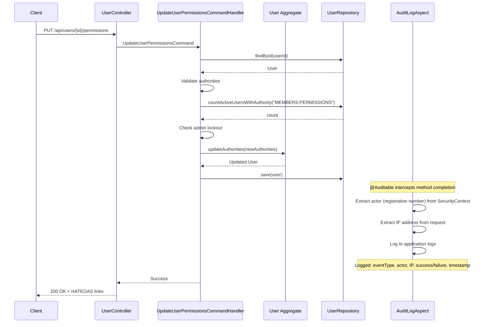
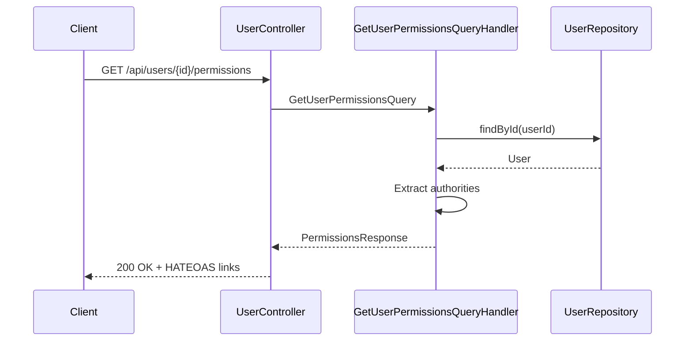

# Design: Manage Member Permissions

**Change ID:** `manage-member-permissions`
**Author:** AI Assistant
**Created:** 2026-01-14

## Architecture Overview

This change introduces granular permission management capabilities to the Klabis system, allowing authorized users to
view and modify individual authorities (permissions) for members without changing their roles. The implementation
follows Clean Architecture and DDD principles, with clear separation of concerns across layers.

Two endpoints are provided:

- **GET /api/users/{id}/permissions** - Retrieve current authorities for a user
- **PUT /api/users/{id}/permissions** - Update authorities for a user

```
┌─────────────────────────────────────────────────────────┐
│            Presentation Layer (Users Module)            │
│  GET /api/users/{id}/permissions                        │
│  PUT /api/users/{id}/permissions                        │
│  - UserController                                       │
│  - PermissionsResponse                                  │
│  - UpdatePermissionsRequest/Response                    │
│  - HATEOAS links with affordances                       │
└────────────────────┬────────────────────────────────────┘
                     │
┌────────────────────▼────────────────────────────────────┐
│         Application Layer (Users Module)                │
│  - GetUserPermissionsQuery                              │
│  - GetUserPermissionsQueryHandler                       │
│  - UpdateUserPermissionsCommand                         │
│  - UpdateUserPermissionsCommandHandler                  │
│  - Validation and business rule enforcement             │
│  - @Auditable annotation for automatic audit logging    │
└────────────────────┬────────────────────────────────────┘
                     │
┌────────────────────▼────────────────────────────────────┐
│              Domain Layer (Users Module)                │
│  - User.updateAuthorities(Set<String>)                  │
│  - Admin lockout prevention business rule               │
│  - Authority validation                                 │
└────────────────────┬────────────────────────────────────┘
                     │
┌────────────────────▼────────────────────────────────────┐
│        Infrastructure Layer (Users Module)              │
│  - UserRepository.countActiveUsersWithAuthority()       │
│  - UserEntity with customAuthorities (JSON)             │
│  - Database persistence                                 │
└─────────────────────────────────────────────────────────┘
```

## Key Design Decisions

### 1. Custom Authorities Only

**Decision:** Use only custom authorities; remove role-based authority derivation completely.

**Rationale:**

- Simplifies authorization model: one source of truth for authorities
- Eliminates confusion between role-based and custom authorities
- More explicit: each user has clearly defined authorities
- Easier to audit: all authorities visible in database
- Roles become simple labels without built-in authority mappings
- Cleaner domain model: no conditional logic for authority resolution

**Implementation:**

```java
// User.java
private final Set<String> authorities; // required, not nullable

public Collection<GrantedAuthority> getAuthorities() {
    return authorities.stream()
        .map(SimpleGrantedAuthority::new)
        .collect(Collectors.toSet());
}
```

**Bootstrap Strategy:**

- Application uses in-memory database (H2) - no data migration needed
- Bootstrap admin user created with explicit authorities from the start
- Role field remains for organizational purposes but doesn't grant authorities
- Schema includes authorities column from initial creation

### 2. API Design: Separate Users API

**Decision:** Add permission management under `/api/users/{id}/permissions` as a separate Users context.

**Rationale:**

- Clear separation of concerns: User accounts (authentication, authorization) vs Member profiles (club data)
- Permission management is inherently a user account concern, not a member profile concern
- Aligns with DDD bounded contexts: Users context handles authentication/authorization
- Enables future user management features without polluting Members API
- Better semantic clarity: permissions belong to user accounts, not member profiles
- Multiple members could theoretically share a user account (future extensibility)

**Alternative Considered:** Extend Members API with `/api/members/{id}/permissions`

- **Rejected because:** Mixes concerns (member profile data vs user account security)
- Creates tight coupling between Members and Users bounded contexts
- Less flexible for future features (e.g., service accounts without member profiles)

### 3. Authorization Level: MEMBERS:PERMISSIONS

**Decision:** Require `MEMBERS:PERMISSIONS` authority to manage permissions (dedicated authority for permission
management).

**Rationale:**

- More granular control: Separates permission management from member updates
- Principle of least privilege: Users can update members without managing permissions
- Clear intent: Explicit authority for this sensitive operation
- Delegation flexibility: Can grant permission management independently
- Better security: Permission changes require specific authority

**Comparison:**

- `MEMBERS:UPDATE`: General member data updates (name, email, etc.)
- `MEMBERS:PERMISSIONS`: Specific to changing user authorities (security-sensitive)

**Risk Mitigation:**

- Permission management lockout prevention: Cannot remove MEMBERS:PERMISSIONS from last user who has it
- Audit logging: All changes tracked with actor
- Validation: Only predefined authorities can be assigned
- No role changes: Roles remain immutable via API

### 4. Permission Management Lockout Prevention

**Decision:** Enforce business rule that at least one user with `MEMBERS:PERMISSIONS` authority must exist at all times.

**Rationale:**

- Prevents catastrophic misconfiguration (no one can manage permissions)
- Protects system availability and manageability
- Aligns with user requirement for safety guardrails
- Authority-based check (not role-based) - consistent with authorities-only model
- Simple to implement and understand

**Implementation:**

- Check count of active users with `MEMBERS:PERMISSIONS` authority before removing it
- Only enforce when removing `MEMBERS:PERMISSIONS` from a user
- Return 409 Conflict if user is the last one with this authority
- Clear error message guides user to grant authority to another user first

### 5. Audit Logging with @Auditable

**Decision:** Use existing `@Auditable` annotation pattern for automatic audit logging via AOP.

**Rationale:**

- Reuses existing audit infrastructure (AuditLogAspect, AuditEventType)
- Simpler implementation: no event handler or async processing needed
- Automatic interception via Spring AOP
- Consistent with existing audit patterns (USER_ROLES_CHANGED, USER_PASSWORD_CHANGED)
- Audit log entry created in same transaction as permission update
- No separate event handler required

**Implementation:**

```java
// Add new event type to AuditEventType enum
public enum AuditEventType {
    // ... existing events
    USER_PERMISSIONS_CHANGED,  // NEW
}

// Annotate command handler method
@Auditable(
    event = AuditEventType.USER_PERMISSIONS_CHANGED,
    description = "User {#command.userId} permissions updated via API"
)
public User handle(UpdateUserPermissionsCommand command) {
    // Update permissions - audit automatically logged by AuditLogAspect
}
```

**Audit Log Entry:**

- Event type: `USER_PERMISSIONS_CHANGED`
- Actor: Extracted from SecurityContext (authenticated user's registration number)
- Target: User ID from command
- IP address: Extracted from HTTP request by AuditLogAspect
- Timestamp: Automatically recorded
- Old values: Previous authorities list (automatically captured by aspect)
- New values: Updated authorities list (automatically captured by aspect)

### 6. Authority Storage: JSON Column

**Decision:** Store authorities as JSON array in TEXT column in users table (required, not nullable).

**Rationale:**

- Simple schema: single required column
- PostgreSQL and H2 both support JSON data
- Easy to query and index
- No need for separate authorities join table (authorities are simple strings)
- Aligns with PostgreSQL best practices for small arrays
- Every user MUST have at least one authority

**Alternative Considered:** Separate `user_authorities` table with join

- **Rejected because:**
    - Over-engineering for current needs (small authority sets)
    - Adds complexity without significant benefit
    - Harder to maintain transactional consistency
    - No performance benefit at current scale (<1000 users)

**Schema (no migration needed - in-memory DB):**

```sql
-- authorities column included in initial schema
ALTER TABLE users ADD COLUMN authorities TEXT NOT NULL
  CONSTRAINT check_authorities_not_empty CHECK (authorities != '[]');

COMMENT ON COLUMN users.authorities IS
  'JSON array of authorities granted to this user (required)';
```

### 7. Validation Strategy

**Decision:** Multi-layer validation (presentation, application, domain).

**Layers:**

1. **Presentation:** Basic format validation (`@NotEmpty`, `@Size`)
2. **Application:** Business validation (member exists, admin lockout, valid authorities)
3. **Domain:** Invariant enforcement (User.updateAuthorities validates and publishes event)

**Rationale:**

- Defense in depth
- Clear error messages at appropriate level
- Follows Clean Architecture dependency rule
- Each layer validates its own concerns

### 8. HATEOAS Affordances

**Decision:** Add conditional `permissions` link with affordances to indicate PUT method is supported for updating
permissions.

**Implementation:**

```java
// Only include link if user has MEMBERS:PERMISSIONS
if (hasAuthority("MEMBERS:PERMISSIONS")) {
    Link permissionsLink = linkTo(methodOn(UserController.class)
        .getPermissions(userId))
        .withRel("permissions")
        .andAffordance(afford(methodOn(UserController.class)
            .updatePermissions(userId, null)));

    response.add(permissionsLink);
}
```

**Response Structure (GET /api/users/{id}/permissions):**

```json
{
  "userId": "123e4567-e89b-12d3-a456-426614174000",
  "authorities": ["MEMBERS:CREATE", "MEMBERS:READ", "MEMBERS:UPDATE"],
  "_links": {
    "self": {
      "href": "/api/users/123e4567-e89b-12d3-a456-426614174000/permissions",
      "type": "application/hal+json"
    },
    "permissions": {
      "href": "/api/users/123e4567-e89b-12d3-a456-426614174000/permissions",
      "templated": false
    }
  },
  "_templates": {
    "update-permissions": {
      "method": "PUT",
      "target": "/api/users/123e4567-e89b-12d3-a456-426614174000/permissions",
      "properties": [
        {
          "name": "authorities",
          "required": true,
          "type": "array"
        }
      ]
    }
  }
}
```

**Response Structure (PUT /api/users/{id}/permissions):**

```json
{
  "userId": "123e4567-e89b-12d3-a456-426614174000",
  "authorities": ["MEMBERS:CREATE", "MEMBERS:READ", "MEMBERS:DELETE", "MEMBERS:PERMISSIONS"],
  "_links": {
    "self": {
      "href": "/api/users/123e4567-e89b-12d3-a456-426614174000/permissions",
      "type": "application/hal+json"
    },
    "permissions": {
      "href": "/api/users/123e4567-e89b-12d3-a456-426614174000/permissions",
      "templated": false
    }
  },
  "_templates": {
    "update-permissions": {
      "method": "PUT",
      "target": "/api/users/123e4567-e89b-12d3-a456-426614174000/permissions",
      "properties": [
        {
          "name": "authorities",
          "required": true,
          "type": "array"
        }
      ]
    }
  }
}
```

**Note:** PUT response format is identical to GET response (userId + authorities + _links + _templates)

**Rationale:**

- Discoverability: Clients can detect permission viewing AND updating capabilities via affordances
- Security: Don't expose management operations to unauthorized users
- Follows HATEOAS principle: available actions visible in response with HTTP methods
- Affordances provide metadata about what HTTP methods are supported (GET for retrieve, PUT for update)
- Guides frontend implementation (show/hide permissions UI based on affordances)
- GET /api/users/{id}/permissions returns ONLY user's authorities (not full user details)
- Dedicated authority makes permission links more secure and explicit
- RFC 7807 Problem Details format for errors ensures consistent error handling

## Module Interaction

### Update Permissions Flow



### Get Permissions Flow



## Data Model Changes

### Users Table

```sql
CREATE TABLE users (
    id UUID PRIMARY KEY,
    username VARCHAR(255) NOT NULL UNIQUE,
    password_hash VARCHAR(255) NOT NULL,
    roles VARCHAR(255)[] NOT NULL,  -- existing (kept for organizational purposes only)
    account_status VARCHAR(50) NOT NULL,
    account_non_expired BOOLEAN NOT NULL,
    account_non_locked BOOLEAN NOT NULL,
    credentials_non_expired BOOLEAN NOT NULL,
    enabled BOOLEAN NOT NULL,
    authorities TEXT NOT NULL,  -- NEW: JSON array ["MEMBERS:CREATE", ...] (REQUIRED)
    created_at TIMESTAMP NOT NULL,
    created_by VARCHAR(255) NOT NULL,
    modified_at TIMESTAMP,
    modified_by VARCHAR(255),
    CONSTRAINT check_authorities_not_empty CHECK (authorities != '[]' AND authorities IS NOT NULL)
);

-- Index for admin count query (still useful for organizational/reporting purposes)
CREATE INDEX idx_users_roles_status ON users (roles, account_status);

-- Index for authority searches (if needed)
CREATE INDEX idx_users_authorities ON users USING GIN (authorities);
```

### Audit Events Table (existing, no changes needed)

```sql
-- Existing table, will store USER_PERMISSIONS_CHANGED events
CREATE TABLE audit_events (
    id UUID PRIMARY KEY,
    event_type VARCHAR(50) NOT NULL,
    entity_type VARCHAR(100),
    entity_id VARCHAR(255),
    actor VARCHAR(255) NOT NULL,
    old_value TEXT,
    new_value TEXT,
    timestamp TIMESTAMP NOT NULL
);
```

## Error Handling Strategy

| Error Condition             | HTTP Status | Error Type   | Message                                                         |
|-----------------------------|-------------|--------------|-----------------------------------------------------------------|
| Missing MEMBERS:PERMISSIONS | 403         | Forbidden    | "Access denied: MEMBERS:PERMISSIONS authority required"         |
| User not found              | 404         | NotFound     | "User with ID {id} not found"                                   |
| Invalid authority           | 400         | BadRequest   | "Invalid authority: {auth}. Valid authorities: [list]"          |
| Empty authorities           | 400         | BadRequest   | "At least one authority required"                               |
| Last admin removal          | 409         | Conflict     | "Cannot update permissions: this is the last active admin user" |
| Unauthenticated             | 401         | Unauthorized | "Authentication required"                                       |

All errors follow RFC 7807 Problem Details format:

```json
{
  "type": "https://klabis.com/problems/cannot-remove-last-admin",
  "title": "Admin Lockout Prevention",
  "status": 409,
  "detail": "Cannot update permissions: this is the last active admin user. Create another admin user first."
}
```

## Security Considerations

1. **Authorization:**
    - GET endpoint: `@PreAuthorize("hasAuthority('MEMBERS:PERMISSIONS')")` - read access to permissions
    - PUT endpoint: `@PreAuthorize("hasAuthority('MEMBERS:PERMISSIONS')")` - write access to permissions
2. **Input Validation:** Whitelist of valid authorities, reject unknown strings
3. **Admin Protection:** Business rule prevents last admin removal
4. **Audit Trail:** Complete logging with actor (registration number), timestamp, before/after values (PUT only)
5. **Immutable Events:** Domain events are immutable records
6. **No Role Escalation:** API only manages authorities, not roles
7. **Transactional Consistency:** Authority update and event publishing in same transaction
8. **Read-Only Safety:** GET endpoint does not modify state, no audit trail needed

## Performance Considerations

1. **GET Permissions Query:**
    - Simple user lookup by ID (primary key)
    - Direct field access to authorities
    - No join operations needed
    - Expected <5ms response time

2. **Authority Count Query:**
    - Query to count users with MEMBERS:PERMISSIONS authority
    - Only executed when removing MEMBERS:PERMISSIONS from a user
    - In-memory H2: Can iterate through users (fast for <1000 users)
    - Expected <10ms for typical user counts

3. **Authority Storage:**
    - JSON column efficient for small arrays (<10 items)
    - No join table overhead
    - In-memory DB provides fast access

4. **Event Processing:**
    - Async via Spring Modulith (non-blocking)
    - Audit logging doesn't slow down API response
    - Transactional outbox ensures reliability

5. **HATEOAS Link Generation:**
    - Conditional link inclusion adds negligible overhead
    - Authority check uses SecurityContext (cached)

## Testing Strategy

1. **Unit Tests:**
    - User.updateAuthorities() logic
    - Authority validation
    - Event creation
    - Exception conditions
    - PermissionsResponse DTO mapping

2. **Integration Tests:**
    - Repository countActiveUsersWithAuthority()
    - Command handler with database
    - Query handler with database
    - Event handler with audit log
    - Transaction boundaries

3. **E2E Tests:**
    - Full permission get flow (view only)
    - Full permission update flow
    - Admin lockout prevention
    - Audit trail verification
    - HATEOAS link presence/absence
    - 404 error handling for non-existent user

4. **Security Tests:**
    - Authorization requirements (both endpoints)
    - Unauthorized access blocked
    - Invalid authorities rejected

## Bootstrap Path (In-Memory DB)

1. **Phase 1:** Update initial schema (Flyway V001 or V002) to include authorities column
2. **Phase 2:** Update UserEntity with authorities field
3. **Phase 3:** Update bootstrap data loader:
    - Create admin user with explicit
      authorities: ["MEMBERS:CREATE", "MEMBERS:READ", "MEMBERS:UPDATE", "MEMBERS:DELETE", "MEMBERS:PERMISSIONS"]
    - All new users created via API require authorities
4. **Phase 4:** Roles field kept for organizational purposes only
5. **No data migration needed:** In-memory DB recreated on each startup

## Future Extensibility

This design enables future enhancements:

- Permission templates (sets of authorities)
- Permission groups (logical grouping of authorities)
- Time-based permissions (temporary authority grants)
- Permission delegation (user A grants authority to user B)
- Notification on permission changes (email, UI alert)

All enabled by event-driven architecture and clean separation of concerns.

## Open Questions

None at this time. All user requirements clarified via Q&A.
