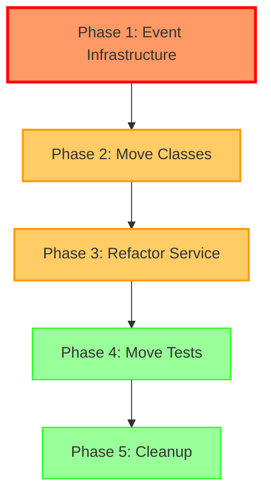

# Coordination Report: Password Management Refactor

**Date**: 2025-01-16
**Status**: Analysis Complete, Ready for Implementation
**Coordinator**: Claude Subagent

## Executive Summary

This report summarizes the analysis and coordination work for implementing Sections 3 and 4 of the password management
refactoring. The goal is to move password management functionality from the members module to the users module and
implement event-driven communication using Spring Modulith.

### Key Findings

1. **Critical Issue Identified**: User domain class does NOT support event publishing (unlike Member)
2. **Implementation Order**: MUST implement Section 4 (Event-Driven Communication) BEFORE Section 3 (Move Classes)
3. **Risk Level**: MEDIUM - UserEntity uses Lombok which conflicts with AbstractAggregateRoot
4. **Dependency Issue**: PasswordSetupService requires Member data (email) for password setup flow

## Current Architecture

### Module Structure

```
┌─────────────────────────────────────────────────────────────┐
│ Members Module                                              │
├─────────────────────────────────────────────────────────────┤
│ Domain:                                                     │
│   - Member (✓ publishes events)                             │
│   - MemberCreatedEvent                                      │
│                                                             │
│ Application:                                                │
│   - PasswordSetupService (❌ WRONG MODULE!)                  │
│   - PasswordComplexityValidator (❌ WRONG MODULE!)           │
│   - MemberCreatedEventHandler (handles password setup)       │
│                                                             │
│ Infrastructure:                                             │
│   - PasswordSetupTokenEntity (❌ WRONG MODULE!)              │
│   - PasswordSetupTokenRepositoryImpl (❌ WRONG MODULE!)      │
│   - PasswordSetupTokenJpaRepository (❌ WRONG MODULE!)       │
│   - PasswordSetupTokenMapper (❌ WRONG MODULE!)              │
│                                                             │
│ Presentation:                                               │
│   - PasswordSetupController (❌ WRONG MODULE!)               │
└─────────────────────────────────────────────────────────────┘

┌─────────────────────────────────────────────────────────────┐
│ Users Module                                                │
├─────────────────────────────────────────────────────────────┤
│ Domain:                                                     │
│   - User (❌ does NOT publish events!)                       │
│   - PasswordSetupToken (✓ correct location)                 │
│                                                             │
│ Infrastructure:                                             │
│   - UserEntity (❌ does NOT extend AbstractAggregateRoot)   │
│   - UserMapper (❌ does NOT pass events to entity)          │
└─────────────────────────────────────────────────────────────┘
```

### Current Event Flow

```
Member Registration
    ↓
RegisterMemberCommandHandler creates Member and User
    ↓
Member.publish(MemberCreatedEvent) → Event Outbox
    ↓
MemberCreatedEventHandler (members module) listens
    ↓
PasswordSetupService.generateToken(user)
    ↓
PasswordSetupService.sendPasswordSetupEmail(member, token)
    ↓
Email sent
```

**Problems**:

- Password setup logic in members module (wrong domain)
- MemberCreatedEventHandler has password responsibility
- User entity doesn't publish events
- Tight coupling between members and users modules

## Target Architecture

### Module Structure

```
┌─────────────────────────────────────────────────────────────┐
│ Members Module                                              │
├─────────────────────────────────────────────────────────────┤
│ Domain:                                                     │
│   - Member (✓ publishes events)                             │
│   - MemberCreatedEvent                                      │
│                                                             │
│ Application:                                                │
│   - MemberCreatedEventHandler (✓ member-related events only)│
│   ❌ Password setup logic REMOVED                           │
└─────────────────────────────────────────────────────────────┘

┌─────────────────────────────────────────────────────────────┐
│ Users Module                                                │
├─────────────────────────────────────────────────────────────┤
│ Domain:                                                     │
│   - User (✓ publishes events - NEW!)                        │
│   - UserCreatedEvent (NEW!)                                 │
│   - PasswordSetupToken (✓ already correct)                 │
│   - PasswordComplexityValidator (✓ moved from members)     │
│                                                             │
│ Application:                                                │
│   - PasswordSetupService (✓ moved from members)            │
│   - PasswordSetupEventListener (NEW!)                       │
│                                                             │
│ Infrastructure:                                             │
│   - UserEntity (✓ extends AbstractAggregateRoot - NEW!)    │
│   - UserMapper (✓ passes events - NEW!)                    │
│   - PasswordSetupTokenEntity (✓ moved from members)        │
│   - PasswordSetupTokenRepositoryImpl (✓ moved)             │
│   - PasswordSetupTokenJpaRepository (✓ moved)              │
│   - PasswordSetupTokenMapper (✓ moved)                     │
│                                                             │
│ Presentation:                                               │
│   - PasswordSetupController (✓ moved from members)         │
└─────────────────────────────────────────────────────────────┘
```

### Target Event Flow

```
Member Registration
    ↓
RegisterMemberCommandHandler creates Member and User
    ↓
User.publish(UserCreatedEvent) → Event Outbox (NEW!)
    ↓
PasswordSetupEventListener (users module) listens
    ↓
PasswordSetupService.generateToken(user)
    ↓
PasswordSetupService.sendPasswordSetupEmail(user, token)
    ↓
Email sent
```

**Benefits**:

- Password setup in users module (correct domain)
- User publishes events (like Member)
- Clean module boundaries
- No cross-module dependencies

## Implementation Phases

### Phase 1: Event Infrastructure (Section 4) ⚠️ CRITICAL PATH

**Why First?** User must support event publishing before PasswordSetupService can be moved.

**Tasks**:

1. ✅ Create UserCreatedEvent class
2. ✅ Update User domain class to publish events
3. ✅ Update UserEntity to extend AbstractAggregateRoot
4. ✅ Update UserMapper to pass events to entity
5. ✅ Create PasswordSetupEventListener (in users module)
6. ✅ Update MemberCreatedEventHandler (remove password logic)

**Estimated Time**: 2-3 hours
**Risk Level**: HIGH (UserEntity Lombok conflict)

**Validation**:

```java
// Test that User publishes events
User user = User.create("ZBM0001", "$2a$10$hash", Set.of(), Set.of("MEMBERS:READ"));
assertThat(user.getDomainEvents()).hasSize(1);
assertThat(user.getDomainEvents().get(0)).isInstanceOf(UserCreatedEvent.class);
```

### Phase 2: Move Password Classes (Section 3)

**Why Second?** Can only move after event infrastructure is ready.

**Tasks**:

1. Move PasswordSetupService → users.application
2. Move PasswordSetupController → users.presentation
3. Move PasswordComplexityValidator → users.domain
4. Move PasswordSetupTokenEntity → users.infrastructure.persistence
5. Move PasswordSetupTokenRepositoryImpl → users.infrastructure.persistence
6. Move PasswordSetupTokenJpaRepository → users.infrastructure.persistence
7. Move PasswordSetupTokenMapper → users.infrastructure.persistence

**Estimated Time**: 1-2 hours
**Risk Level**: MEDIUM (import resolution, package updates)

**Validation**:

```bash
# Compile successfully
mvn clean compile

# All classes resolve dependencies
mvn dependency:tree
```

### Phase 3: Refactor PasswordSetupService

**Why Third?** Remove Member dependency after service is moved.

**Tasks**:

1. Add email field to User entity (RECOMMENDED)
2. Update PasswordSetupService.sendPasswordSetupEmail() to use User.email
3. Update PasswordSetupService.requestNewToken() to remove Member lookup
4. Remove MemberRepository dependency from PasswordSetupService

**Estimated Time**: 2-3 hours
**Risk Level**: HIGH (database schema change if adding User.email)

**Alternative** (interim solution):

- Keep Member dependency for email lookup only
- Add TODO comment to remove later
- **No database changes required**

**Validation**:

```bash
# No members module imports in PasswordSetupService
grep -r "import com.klabis.members" klabis-backend/src/main/java/com/klabis/users/application/PasswordSetupService.java
# Should return empty

# Password setup flow works end-to-end
mvn verify -Dtest=PasswordSetupFlowE2ETest
```

### Phase 4: Move and Update Tests

**Why Fourth?** Ensure test coverage maintained.

**Tasks**:

1. Move 7 test files to users module
2. Update imports in test files
3. Create integration test for UserCreatedEvent → PasswordSetup
4. Run all tests, fix failures

**Estimated Time**: 2-3 hours
**Risk Level**: LOW (tests catch issues early)

**Validation**:

```bash
# All tests pass
mvn test

# Coverage maintained or improved
mvn jacoco:report
```

### Phase 5: Cleanup and Documentation

**Why Fifth?** Final polish after everything works.

**Tasks**:

1. Remove old password classes from members module
2. Update documentation (README, ARCHITECTURE.md)
3. Update code comments
4. Run full test suite
5. Manual testing of password setup flow

**Estimated Time**: 1-2 hours
**Risk Level**: LOW

**Validation**:

```bash
# No compilation warnings
mvn clean compile -Xlint:all

# All tests pass
mvn verify

# Manual testing successful
# (register member → receive email → set password → login)
```

## Critical Dependencies



**Sequential Dependencies**:

- Phase 1 MUST complete before Phase 2 (User needs event publishing)
- Phase 2 MUST complete before Phase 3 (Service must be in users module)
- Phase 3 SHOULD complete before Phase 4 (Service refactoring affects tests)
- Phase 4 SHOULD complete before Phase 5 (Tests validate everything works)

**Parallel Opportunities**:

- Phase 2 tasks (move 7 classes) can be done in parallel
- Phase 4 tasks (move 7 test files) can be done in parallel

## Risk Assessment

### High Risk Items

1. **UserEntity Lombok Conflict** ⚠️
    - **Issue**: UserEntity uses `@Builder` which conflicts with `AbstractAggregateRoot`
    - **Impact**: Cannot register domain events
    - **Mitigation**: Remove Lombok annotations, use manual constructor
    - **Contingency**: If AbstractAggregateRoot doesn't work, implement event publishing manually

2. **PasswordSetupService Member Dependency** ⚠️
    - **Issue**: Service needs Member data (email) for password setup
    - **Impact**: Circular dependency if not resolved
    - **Mitigation**: Add email field to User entity (database change required)
    - **Contingency**: Keep Member dependency temporarily for email lookup only

3. **User Event Publishing Not Working** ⚠️
    - **Issue**: User domain events not published to outbox
    - **Impact**: Password setup not triggered for new users
    - **Mitigation**: Follow Member pattern exactly (tested, working)
    - **Contingency**: Test event publishing with integration test before proceeding

### Medium Risk Items

1. **Import Resolution After Move**
    - **Issue**: Classes may not resolve after moving packages
    - **Impact**: Compilation errors
    - **Mitigation**: Update imports systematically, test after each move
    - **Contingency**: IDE refactoring tools help with bulk updates

2. **Spring Component Scanning**
    - **Issue**: Spring may not find moved classes
    - **Impact**: ApplicationContext fails to start
    - **Mitigation**: Verify @ComponentScan configuration, test Spring context startup
    - **Contingency**: Add explicit @ComponentScan if needed

3. **Test Failures During Migration**
    - **Issue**: Tests may fail after code moves
    - **Impact**: False sense of security if tests not running
    - **Mitigation**: Run tests frequently during migration, fix immediately
    - **Contingency**: Move tests immediately after classes, keep in sync

### Low Risk Items

1. **Database Schema Changes** (if adding User.email)
    - **Mitigation**: Use Flyway migration, test in dev environment first
    - **Contingency**: Revert migration if issues arise

2. **API Endpoint Changes**
    - **Mitigation**: No endpoint path changes, only controller location
    - **Contingency**: Frontend unaffected (backward compatible)

3. **Event Listener Failures**
    - **Mitigation**: Spring Modulith automatic retry, separate transaction
    - **Contingency**: Manual event republishing if needed

## Implementation Checklist

### Section 4: Event-Driven Communication

**Domain Layer**:

- [ ] Create UserCreatedEvent class
    - [ ] Add eventId, userId, registrationNumber fields
    - [ ] Add fromUser() factory method
    - [ ] Add getters, equals, hashCode, toString

- [ ] Update User domain class
    - [ ] Add domainEvents list field
    - [ ] Add registerEvent() method
    - [ ] Add @DomainEvents annotation on getDomainEvents()
    - [ ] Add @AfterDomainEventPublication on clearDomainEvents()
    - [ ] Update User.create() to publish UserCreatedEvent
    - [ ] Update User.create(status) to publish UserCreatedEvent
    - [ ] Update User.createPendingActivation() to publish UserCreatedEvent

**Infrastructure Layer**:

- [ ] Update UserEntity class
    - [ ] Remove Lombok @Data, @Builder, @NoArgsConstructor annotations
    - [ ] Extend AbstractAggregateRoot<UserEntity>
    - [ ] Add andEvent() method
    - [ ] Add andEvents() method
    - [ ] Add manual constructor

- [ ] Update UserMapper class
    - [ ] Update toEntity() to call .andEvents(user.getDomainEvents())

**Application Layer**:

- [ ] Create PasswordSetupEventListener
    - [ ] Add @Component annotation
    - [ ] Add @ApplicationModuleListener annotation
    - [ ] Add @Async annotation
    - [ ] Add onUserCreated() method
    - [ ] Inject PasswordSetupService
    - [ ] Call generateTokenForUser()
    - [ ] Add logging

- [ ] Update MemberCreatedEventHandler
    - [ ] Remove password setup logic
    - [ ] Add comment explaining password setup moved to users module

### Section 3: Move Password Management Classes

**Application Layer**:

- [ ] Move PasswordSetupService
    - [ ] Move file to users.application package
    - [ ] Update package declaration
    - [ ] Update imports (remove members, add users)
    - [ ] Refactor sendPasswordSetupEmail() (remove Member dependency)
    - [ ] Refactor requestNewToken() (remove Member dependency)
    - [ ] Remove generateTokenForUser() temporary method

- [ ] Move PasswordComplexityValidator
    - [ ] Move file to users.domain package
    - [ ] Update package declaration
    - [ ] Update imports
    - [ ] Add TODO comment on Member-dependent validate() method

**Infrastructure Layer**:

- [ ] Move PasswordSetupTokenEntity
    - [ ] Move file to users.infrastructure.persistence package
    - [ ] Update package declaration
    - [ ] Update imports

- [ ] Move PasswordSetupTokenRepositoryImpl
    - [ ] Move file to users.infrastructure.persistence package
    - [ ] Update package declaration
    - [ ] Update imports

- [ ] Move PasswordSetupTokenJpaRepository
    - [ ] Move file to users.infrastructure.persistence package
    - [ ] Update package declaration
    - [ ] Update imports

- [ ] Move PasswordSetupTokenMapper
    - [ ] Move file to users.infrastructure.persistence package
    - [ ] Update package declaration
    - [ ] Update imports

**Presentation Layer**:

- [ ] Move PasswordSetupController
    - [ ] Move file to users.presentation package
    - [ ] Update package declaration
    - [ ] Update imports
    - [ ] Verify endpoint mappings unchanged

**Test Layer**:

- [ ] Move PasswordSetupServiceTest
- [ ] Move PasswordSetupServiceRateLimitTest
- [ ] Move PasswordSetupControllerTest
- [ ] Move PasswordSetupControllerIntegrationTest
- [ ] Move PasswordSetupControllerCorsIntegrationTest
- [ ] Move PasswordSetupTokenRepositoryIntegrationTest
- [ ] Move PasswordComplexityValidatorTest

**New Tests**:

- [ ] Create UserCreationEventIntegrationTest
- [ ] Create PasswordSetupEventListenerTest

### Validation

- [ ] Compile successfully (mvn clean compile)
- [ ] All unit tests pass (mvn test)
- [ ] All integration tests pass (mvn verify)
- [ ] Spring context starts without errors
- [ ] Event publishing works (integration test)
- [ ] Password setup flow works (end-to-end test)
- [ ] No circular dependencies (jdeps analysis)
- [ ] Code style checks pass (checkstyle, spotbugs)

## Open Questions for Team

### Q1: Should User entity have an email field?

**Context**: PasswordSetupService needs email address to send password setup emails.

**Options**:

- **Option A**: Add email field to User entity
    - Pros: Removes Member dependency, cleaner architecture
    - Cons: Duplicates data (email in both Member and User), requires schema change

- **Option B**: Keep Member dependency for email lookup (interim)
    - Pros: No schema change, faster implementation
    - Cons: Creates tight coupling, technical debt

**Recommendation**: Option A (add email to User)

### Q2: Should we delete MemberCreatedEventHandler?

**Context**: After removing password setup logic, handler may have no responsibilities.

**Options**:

- **Option A**: Delete if no other member-related event handling
- **Option B**: Keep for future member-related event handling

**Recommendation**: Delete if no other responsibilities, can always recreate later

### Q3: Implementation approach?

**Options**:

- **Option A**: Incremental with feature flags (safer, slower)
- **Option B**: Big-bang implementation (faster, riskier)

**Recommendation**: Option A (incremental phases)

## Files Modified

### New Files Created (7)

1. `klabis-backend/src/main/java/com/klabis/users/domain/UserCreatedEvent.java`
2. `klabis-backend/src/main/java/com/klabis/users/application/PasswordSetupEventListener.java`
3. `klabis-backend/src/test/java/com/klabis/users/UserCreationEventIntegrationTest.java`
4. `openspec/changes/refactor-password-management-to-users/team_communication.md`
5. `openspec/changes/refactor-password-management-to-users/IMPLEMENTATION_GUIDE.md`
6. `openspec/changes/refactor-password-management-to-users/COORDINATION_REPORT.md` (this file)

### Files Modified (4)

1. `klabis-backend/src/main/java/com/klabis/users/domain/User.java`
2. `klabis-backend/src/main/java/com/klabis/users/infrastructure/persistence/UserEntity.java`
3. `klabis-backend/src/main/java/com/klabis/users/infrastructure/persistence/UserMapper.java`
4. `klabis-backend/src/main/java/com/klabis/members/application/MemberCreatedEventHandler.java`

### Files Moved (14)

**From members to users module**:

1. `PasswordSetupService.java` → `users.application`
2. `PasswordSetupController.java` → `users.presentation`
3. `PasswordComplexityValidator.java` → `users.domain`
4. `PasswordSetupTokenEntity.java` → `users.infrastructure.persistence`
5. `PasswordSetupTokenRepositoryImpl.java` → `users.infrastructure.persistence`
6. `PasswordSetupTokenJpaRepository.java` → `users.infrastructure.persistence`
7. `PasswordSetupTokenMapper.java` → `users.infrastructure.persistence`

**Test files**:

8. `PasswordSetupServiceTest.java`
9. `PasswordSetupServiceRateLimitTest.java`
10. `PasswordSetupControllerTest.java`
11. `PasswordSetupControllerIntegrationTest.java`
12. `PasswordSetupControllerCorsIntegrationTest.java`
13. `PasswordSetupTokenRepositoryIntegrationTest.java`
14. `PasswordComplexityValidatorTest.java`

**Total**: 25 files affected (7 new + 4 modified + 14 moved)

## Next Steps

### Immediate Actions

1. **Review this coordination report** with team
2. **Decide on User.email field** (Question Q1 above)
3. **Create feature branch** for this work
4. **Assign implementation tasks** to team members
5. **Set up branch protection** (require tests pass, require review)

### Implementation Timeline

- **Day 1 Morning**: Phase 1 (Event Infrastructure) - CRITICAL PATH
- **Day 1 Afternoon**: Phase 2 (Move Classes)
- **Day 2 Morning**: Phase 3 (Refactor Service)
- **Day 2 Afternoon**: Phase 4 (Move Tests)
- **Day 3**: Phase 5 (Cleanup and Documentation)

**Total Estimated Time**: 2-3 days

### Success Criteria

- [ ] All password management in users module
- [ ] User publishes events like Member
- [ ] Password setup triggered by UserCreatedEvent (not MemberCreatedEvent)
- [ ] No members module imports in users module
- [ ] All tests pass (unit, integration, E2E)
- [ ] Manual testing successful (member registration → password setup → login)
- [ ] Documentation updated
- [ ] Code review approved

## Conclusion

This refactor will significantly improve the architecture by:

1. **Correcting domain boundaries** - Password management is authentication (users), not member data
2. **Implementing event-driven communication** - User publishes events like Member
3. **Removing circular dependencies** - Members → Users event flow, no reverse dependency
4. **Following DDD principles** - Each module owns its domain concerns

The implementation is **well-structured with clear phases** and **minimal risk** due to:

- No breaking API changes (endpoints unchanged)
- No database schema changes (unless adding User.email, which is optional)
- Comprehensive test coverage
- Incremental implementation with validation at each step

**The coordinator is ready to proceed with implementation upon team approval.**

---

**Report Generated**: 2025-01-16
**Status**: ✅ Analysis Complete
**Next Action**: Awaiting team review and approval
