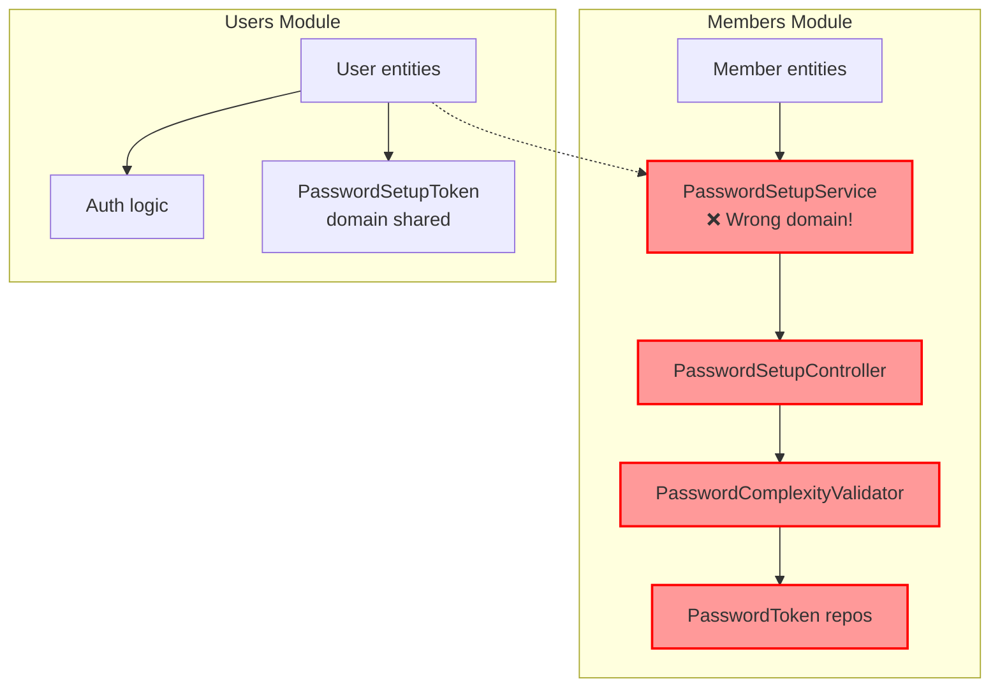
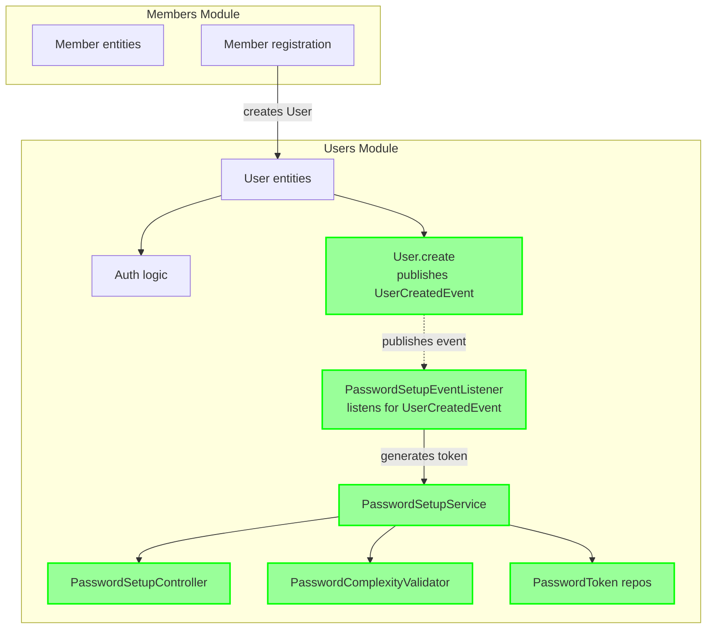
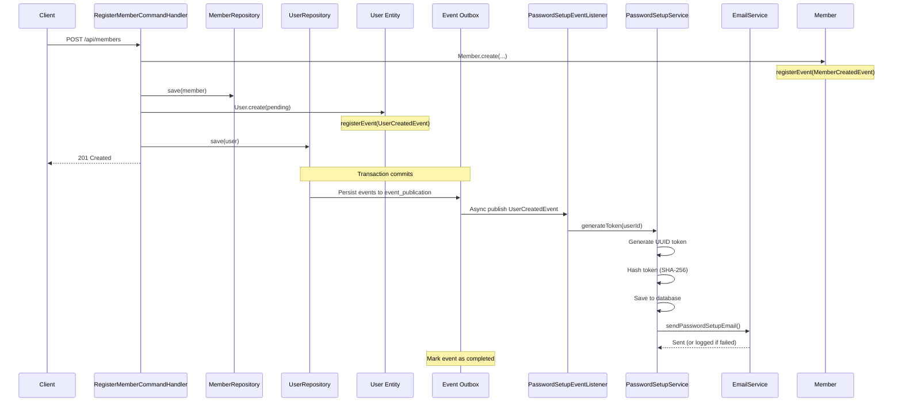

# Design: Relocate Password Management to Users Module

## Context

The Klabis backend follows Clean Architecture and Domain-Driven Design principles with clear module boundaries. The
system is organized into bounded contexts:

- **Members module**: Manages club member data, registration, and membership information
- **Users module**: Manages user accounts, authentication, and authorization

Currently, password management functionality is split between these modules, with the core implementation in the members
module. This was done to break a circular dependency (users → members → users), but it creates architectural confusion.

## Goals / Non-Goals

### Goals

- Move all password management functionality to the users module where it belongs
- Maintain clean module boundaries using event-driven communication
- No breaking changes to public APIs
- No database schema changes
- Maintain or improve test coverage
- Eliminate architectural confusion around password management ownership

### Non-Goals

- Changing the password setup flow or business logic
- Modifying API endpoint paths
- Changing database schema
- Adding new password features
- Modifying the user activation specification requirements

## Decisions

### 1. Module Placement Decision

**Decision**: Move all password management classes to users module.

**Rationale**:

- Password management is fundamentally about authentication, which is the users domain
- Users are accounts (authentication), Members are people (business domain)
- Aligns with Single Responsibility Principle and DDD bounded contexts
- Removes architectural workaround (circular dependency avoidance)

**Alternatives Considered**:

- **Option A**: Keep in members module - Rejected because it violates domain boundaries
- **Option B**: Create separate authentication module - Rejected as over-engineering (users module already exists for
  auth)
- **Option C**: Move to users module (chosen) - Best fit for domain boundaries and current architecture

### 2. Cross-Module Communication Strategy

**Decision**: Use Spring's event-driven architecture with ApplicationEventPublisher.

**Rationale**:

- User creation publishes `UserCreatedEvent` from users module
- Password setup service listens for event within same module
- Works for any user creation context (member registration, admin creation, import scripts, etc.)
- Maintains loose coupling between modules
- Prevents circular dependencies
- Follows existing event-driven architecture patterns in the codebase

**Event Flow**:

```
Member registration creates Member and User
    ↓
User.create() publishes UserCreatedEvent
    ↓
PasswordSetupEventListener (users) - triggers password setup token generation
    ↓
PasswordSetupService (users) - generates token and sends email
```

**Benefits of UserCreatedEvent over MemberCreatedEvent**:

- More flexible - any user creation triggers password setup
- Future-proof - works for admin-created users, batch imports, API-created users
- Better domain alignment - password setup is user concern, not member concern
- No cross-module event handling needed (both publisher and listener in users module)

### 3. API Endpoint Strategy

**Decision**: Keep REST endpoints at `/api/auth/password-setup/*` but move controller to users module.

**Rationale**:

- No breaking changes for frontend clients
- Maintains backward compatibility
- URL path already reflects authentication domain (`/api/auth/`)
- Controller location is internal implementation detail

### 4. Database Schema Strategy

**Decision**: No changes to database schema.

**Rationale**:

- `password_setup_tokens` table already references `users` table (not `members`)
- Current schema is correct for the new module placement
- No migration required reduces risk

### 5. Test Migration Strategy

**Decision**: Move all password-related tests to users module and update imports.

**Rationale**:

- Tests should follow implementation
- Maintains test coverage
- Clear test organization by module

## Architecture Diagrams

### Current State (Problematic)



### Future State (After Refactor)



### Event Flow Sequence Diagram



## Migration Plan

### Phase 1: Preparation

1. Review all password-related code in members module
2. Identify all dependencies and imports
3. Document current test coverage
4. Create proposal and get approval

### Phase 2: Implementation Steps (see tasks.md)

1. Create new package structure in users module
2. Move password management classes to users module
3. Create event listener in users module
4. Update event handler in members module
5. Update all imports and references
6. Move tests to users module
7. Update test imports and references
8. Verify Spring configuration

### Phase 3: Validation

1. Run all unit tests
2. Run all integration tests
3. Run API tests with password setup flow
4. Verify event-driven communication works
5. Check for circular dependencies
6. Manual testing of password setup flow

### Phase 4: Cleanup

1. Remove old classes from members module
2. Update any documentation
3. Update code comments referencing old locations

### Rollback Plan

If issues arise:

1. Revert code changes (git revert)
2. Database remains unchanged (no migration needed)
3. Frontend unaffected (API endpoints unchanged)
4. Quick rollback as no schema changes

## Risks / Trade-offs

### Risks

1. **Breaking existing functionality**
    - **Mitigation**: Comprehensive test suite, run tests after each step
    - **Probability**: Medium
    - **Impact**: High

2. **Introducing circular dependencies**
    - **Mitigation**: Strict event-driven communication, dependency analysis tools
    - **Probability**: Low
    - **Impact**: High

3. **Spring configuration issues**
    - **Mitigation**: Verify component scanning, test Spring context startup
    - **Probability**: Low
    - **Impact**: Medium

4. **Test failures during migration**
    - **Mitigation**: Update tests immediately after moving code, run tests frequently
    - **Probability**: Medium
    - **Impact**: Low (tests catch issues early)

### Trade-offs

1. **Event-driven complexity vs. clean architecture**
    - **Decision**: Accept event-driven complexity for cleaner module boundaries
    - **Rationale**: Long-term maintainability more important than slight complexity increase

2. **Migration effort vs. architectural improvement**
    - **Decision**: Invest effort now for better architecture
    - **Rationale**: Reduces technical debt, aligns with DDD principles

3. **Testing overhead vs. confidence**
    - **Decision**: Comprehensive testing during migration
    - **Rationale**: Ensures no regressions, validates event-driven approach

## Open Questions

1. **Should we update package names to reflect the move?**
    - **Recommendation**: Yes, update package declarations to new module location

2. **Should we keep any password-related code in members module?**
    - **Recommendation**: No, move all password management to users for clear boundaries

3. **Do we need to update Spring Security configuration?**
    - **Recommendation**: Review but likely no changes needed (endpoints unchanged)

4. **Should we add integration tests for event-driven communication?**
    - **Recommendation**: Yes, add tests to verify UserCreatedEvent triggers password setup

## Implementation Notes

### Spring Event Configuration

```java
// Users module - User domain class (similar to Member pattern)
public class User {

    private final List<Object> domainEvents = new ArrayList<>();

    public static User create(UUID userId, String registrationNumber, ...) {
        User user = new User();
        user.id = userId;
        user.registrationNumber = registrationNumber;
        // ... set other fields ...

        // Register domain event
        user.registerEvent(new UserCreatedEvent(userId, registrationNumber));

        return user;
    }

    protected void registerEvent(Object event) {
        this.domainEvents.add(event);
    }

    /**
     * Annotated with @DomainEvents to enable Spring Modulith automatic event publishing.
     * Spring Data will automatically collect and publish these events via the outbox pattern.
     */
    @DomainEvents
    public List<Object> getDomainEvents() {
        return Collections.unmodifiableList(domainEvents);
    }

    /**
     * Clear all domain events after publishing.
     * Annotated with @AfterDomainEventPublication.
     */
    @AfterDomainEventPublication
    public void clearDomainEvents() {
        this.domainEvents.clear();
    }
}

// Users module - UserEntity JPA entity
@Entity
public class UserEntity extends AbstractAggregateRoot<UserEntity> {

    @Id
    private UUID id;

    private String registrationNumber;
    // ... other fields ...

    protected UserEntity andEvent(Object event) {
        registerEvent(event);
        return this;
    }

    protected UserEntity andEvents(Collection<Object> events) {
        events.forEach(this::andEvent);
        return this;
    }
}

// Users module - UserMapper passes events to entity
@Component
public class UserMapper {

    public UserEntity toEntity(User user) {
        return new UserEntity(
            user.getId(),
            user.getRegistrationNumber(),
            // ... other fields ...
        ).andEvents(user.getDomainEvents());
    }

    public User toDomain(UserEntity entity) {
        return User.reconstruct(
            entity.getId(),
            entity.getRegistrationNumber(),
            // ... other fields ...
        );
    }
}

// Users module - event listener
@Component
public class PasswordSetupEventListener {

    private static final Logger log = LoggerFactory.getLogger(PasswordSetupEventListener.class);

    private final PasswordSetupService passwordSetupService;

    public PasswordSetupEventListener(PasswordSetupService passwordSetupService) {
        this.passwordSetupService = passwordSetupService;
    }

    @ApplicationModuleListener
    @Async
    public void onUserCreated(UserCreatedEvent event) {
        log.info("Processing UserCreatedEvent (userId: {}) for registration number: {}",
                event.getUserId(), event.getRegistrationNumber());

        passwordSetupService.generateToken(event.getUserId());
    }
}

// Members module - creates user during member registration
@Service
public class RegisterMemberCommandHandler {

    private final MemberRepository memberRepository;
    private final UserRepository userRepository;

    public UUID handle(RegisterMemberCommand command) {
        // ... create member ...
        Member member = Member.create(...);
        memberRepository.save(member);

        // Create user - this will publish UserCreatedEvent automatically
        User user = User.create(member.getId(), member.getRegistrationNumber().getValue(), ...);
        userRepository.save(user);

        // UserCreatedEvent will be published after transaction commit
        // PasswordSetupEventListener will send password setup email asynchronously

        return member.getId();
    }
}
```

**Key Implementation Details:**

- `User` domain class maintains `domainEvents` list (similar to `Member`)
- `@DomainEvents` and `@AfterDomainEventPublication` annotations enable automatic event publishing
- `UserEntity` extends `AbstractAggregateRoot<UserEntity>` for JPA entity
- `UserMapper.toEntity()` uses `.andEvents(user.getDomainEvents())` to pass events to entity
- Spring Data automatically publishes registered events after transaction commit
- `@ApplicationModuleListener` (Spring Modulith annotation) enables event listening
- Events are persisted to `event_publication` table (transactional outbox pattern)
- Automatic retry for failed event listeners

### Dependency Rules

- Members module → Users module: Can create User entities (which trigger UserCreatedEvent)
- Users module → Members module: No dependencies (password setup doesn't need member data)
- Shared: Domain events (UserCreatedEvent) in users domain
- Both modules: Independent, password setup triggered by User creation event

### Testing Strategy

1. Unit tests for PasswordSetupService in users module
2. Integration tests for event-driven communication (UserCreatedEvent → password setup)
3. API tests for password setup endpoints
4. Verify no circular dependencies with jdeps or similar tools
5. Test password setup triggered by different user creation contexts:
    - Member registration
    - Admin user creation
    - Future: Batch import
    - Future: API-created users
