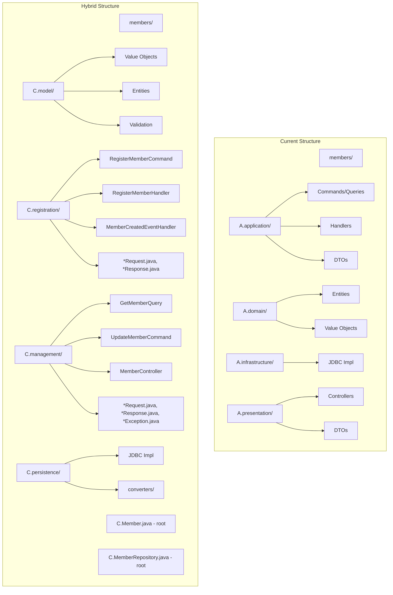

# Design: Hybrid Package Structure

## Context

The Klabis backend uses Spring Modulith for modular monolith architecture. Each module (members, users, etc.) represents
a bounded context with its own domain model, application services, and persistence layer. Following the KISS
simplification refactoring (Phase 1), the CQRS pattern has been removed and command/query handlers have been
consolidated into simple services. Currently, modules are still organized by technical layers (application, domain,
presentation, infrastructure), which creates friction with Spring Modulith's goal of clear module boundaries and
visibility.

### Current Structure (Members Module - After KISS Simplification)

```
com.klabis.members/
├── application/
│   ├── MemberService.java              # Consolidated service (was handlers)
│   ├── MemberCreatedEventHandler.java
│   ├── dto/
│   │   ├── AddressRequest.java
│   │   ├── AddressResponse.java
│   │   ├── MemberDetailsDTO.java
│   │   └── ...                          # Mixed DTOs
├── domain/
│   ├── Member.java
│   ├── MemberRepository.java
│   ├── MemberCreatedEvent.java
│   ├── PersonalInformation.java
│   ├── Address.java
│   ├── PersonName.java
│   ├── EmailAddress.java
│   ├── PhoneNumber.java
│   └── ...
├── infrastructure/
│   └── jdbcrepository/
│       ├── MemberJdbcRepository.java
│       └── MemberRepositoryJdbcImpl.java
└── presentation/
    ├── MemberController.java
    ├── RegisterMemberRequest.java
    ├── UpdateMemberRequest.java
    ├── MemberRegistrationResponse.java
    └── ...                              # More DTOs
```

### Problems (After KISS Simplification)

1. **Feature code still scattered**: "Member registration" code spans 3 packages (application, domain, presentation)
2. **Domain model hidden**: Value objects like `Address`, `PersonName` are buried in `domain/`
3. **Unclear visibility**: `@NamedInterface` on `domain/` doesn't meaningfully expose domain concepts
4. **DTO confusion**: DTOs still split between `application/dto/` and `presentation/` - no clear ownership (resolved by
   moving DTOs directly to feature packages without subpackages)
5. **Service organization**: Single `MemberService` contains all methods (register, get, list, update) - not grouped by
   feature
6. **Navigation overhead**: Understanding "member registration" still requires opening multiple folders

## Goals / Non-Goals

### Goals

- Organize code by business features while maintaining clear domain model
- Expose domain concepts through `model/` package with `@NamedInterface`
- Group feature-related code (commands, queries, handlers, controller) together
- Maintain Spring Modulith module boundaries and visibility
- Keep persistence implementation internal (not exposed to other modules)
- Place key types (Aggregate, Repository) at module root for easy access

### Non-Goals

- Changing domain model behavior
- Changing REST API endpoints
- Changing database schema
- Changing business logic
- Affecting runtime behavior (purely structural refactoring)

## Decisions

### Decision 1: Hybrid Structure with Dedicated model/ Package

**Choice**: Centralize all domain model (entities, value objects, enums) in `model/` package, place aggregate roots and
repositories at module root, organize features by use-case, and split services by feature.

**Rationale**:

- `model/` clearly exposes domain concepts that other modules may need
- Aggregate root at module root (`Member.java`) is most important type - should be easily discoverable
- Repository interface at root is commonly imported - should be accessible
- Features (registration, management) group related use-case code
- **Feature-specific services** (RegistrationService, ManagementService) ensure each feature is self-contained
- Avoids duplication of domain concepts across features
- Clear feature boundaries with independent services

**Rationale**:

- `model/` clearly exposes domain concepts that other modules may need
- Aggregate root at module root (`Member.java`) is most important type - should be easily discoverable
- Repository interface at root is commonly imported - should be accessible
- Features (registration, management) group related use-case code
- Avoids duplication of domain concepts across features

**Alternatives Considered**:

1. **Pure Feature-Based**: Domain objects duplicated in each feature package
    - ❌ Violates DRY principle
    - ❌ Unclear which `Address` or `PersonName` to use
    - ❌ Hard to maintain consistency

2. **Traditional Layered**: Keep current application/domain/presentation structure
    - ❌ Feature code scattered across layers
    - ❌ Poor discoverability
    - ❌ Doesn't align with Spring Modulith's modular philosophy

3. **Package-per-Class**: Flatten everything to root
    - ❌ No organization at all
    - ❌ 50+ classes at root level
    - ❌ Can't use `@NamedInterface` meaningfully

### Decision 2: Feature Package Naming by Use-Case

**Choice**: Name feature packages after business capabilities (e.g., `registration/`, `management/`, `authentication/`).

**Rationale**:

- Features map to business use-cases
- Easy to locate code by capability
- Clear `@NamedInterface` exposure: `registration` exposes registration-related APIs

**Examples**:

- `members.registration/` - Member registration use-case
- `members.management/` - Member management (view, update) use-case
- `users.authentication/` - User authentication and password setup
- `users.permissions/` - Permission management

### Decision 3: Persistence Remains Internal

**Choice**: Place all persistence implementation in `persistence/` package without `@NamedInterface` annotation.

**Rationale**:

- Persistence is infrastructure detail - other modules shouldn't depend on it
- Spring Modulith allows internal packages (no `@NamedInterface`)
- Other modules access domain through `model/` and features, not persistence
- Enables changing persistence implementation without affecting other modules

### Decision 4: DTOs and Exceptions Co-located with Features

**Choice**: Place DTOs and exceptions directly in feature packages, not in subpackages.

**Rationale**:

- Simpler structure - less nesting
- Clear which DTOs/exceptions belong to which feature
- Feature packages remain focused and cohesive
- Easy to find request/response objects for a specific endpoint
- Naming conventions (*Request, *Response, *Exception) make types easily distinguishable

### Decision 5: Key Types at Module Root

**Choice**: Place aggregate root, repository interface, and domain events at module root level.

**Rationale**:

- These are the most commonly imported types
- Reduces import verbosity
- Quick access to primary domain objects
- Aligns with "aggregate root is the entry point" DDD principle

**Examples**:

```java
// At com.klabis.members/
Member.java                    // Aggregate root
MemberRepository.java          // Repository interface
MemberCreatedEvent.java        // Domain event
MemberNotFoundException.java   // Domain exception

// In model/ package
PersonalInformation.java       // Value objects
Address.java
PersonName.java
EmailAddress.java
PhoneNumber.java
```

## Package Structure Design

### Members Module (After Migration)

```
com.klabis.members/
├── Member.java                          # Aggregate root
├── MemberRepository.java                # Repository interface
├── MemberNotFoundException.java         # Domain exception
├── MemberCreatedEvent.java              # Domain event
├── package-info.java                    # @ApplicationModule
│
├── model/                               # Shared domain model
│   ├── PersonalInformation.java
│   ├── Address.java
│   ├── PersonName.java
│   ├── EmailAddress.java
│   ├── PhoneNumber.java
│   ├── IdentityCard.java
│   ├── TrainerLicense.java
│   ├── MedicalCourse.java
│   ├── GuardianInformation.java
│   ├── RegistrationNumber.java
│   ├── RegistrationNumberGenerator.java
│   ├── Nationality.java
│   ├── Gender.java
│   ├── DocumentType.java
│   ├── DrivingLicenseGroup.java
│   ├── ExpiringDocument.java
│   ├── AuditMetadata.java
│   └── package-info.java               # @NamedInterface("domain-model")
│
├── registration/                        # Registration feature
│   ├── RegistrationService.java        # Service with registerMember()
│   ├── MemberCreatedEventHandler.java
│   ├── RegisterMemberRequest.java
│   ├── MemberRegistrationResponse.java
│   └── package-info.java               # @NamedInterface("registration")
│
├── management/                          # Management feature
│   ├── ManagementService.java          # Service with getMember(), updateMember(), listMembers()
│   ├── MemberController.java            # REST controller
│   ├── AddressRequest.java
│   ├── AddressResponse.java
│   ├── UpdateMemberRequest.java
│   ├── MemberDetailsDTO.java
│   ├── MemberSummaryDTO.java
│   ├── MemberDetailsResponse.java
│   ├── GuardianDTO.java
│   ├── IdentityCardDto.java
│   ├── MedicalCourseDto.java
│   ├── TrainerLicenseDto.java
│   ├── SelfEditNotAllowedException.java
│   ├── AdminFieldAccessException.java
│   └── package-info.java               # @NamedInterface("management")
│
└── persistence/                         # Infrastructure (internal)
    ├── jdbc/
    │   ├── MemberJdbcRepository.java
    │   ├── MemberRepositoryJdbcImpl.java
    │   ├── MemberMemento.java
    │   ├── converters/
    │   └── package-info.java           # No @NamedInterface
    └── package-info.java               # No @NamedInterface
```

### Users Module (After Migration)

```
com.klabis.users/
├── User.java                            # Aggregate root
├── UserRepository.java                  # Repository interface
├── UserId.java                          # Value object (frequently used)
├── UserCreatedEvent.java                # Domain event
├── package-info.java                    # @ApplicationModule
│
├── model/                               # Domain model
│   ├── AccountStatus.java
│   ├── Authority.java
│   ├── ActivationToken.java
│   ├── TokenHash.java
│   ├── UserAuditMetadata.java
│   ├── AuthorityValidator.java
│   └── package-info.java               # @NamedInterface("domain-model")
│
├── authentication/                      # Authentication feature
│   ├── PermissionService.java          # Service with getUserPermissions(), updateUserPermissions()
│   ├── PasswordSetupService.java
│   ├── PasswordSetupEventListener.java
│   ├── PasswordSetupToken.java         # Entity (authentication-specific)
│   ├── PasswordSetupTokenRepository.java
│   ├── TokenCleanupJob.java
│   ├── RateLimiterConfiguration.java
│   ├── PasswordSetupController.java
│   ├── PermissionsResponse.java
│   ├── CannotRemoveLastPermissionManagerException.java
│   └── package-info.java               # @NamedInterface("authentication")
│
├── persistence/                         # Infrastructure (internal)
│   ├── jdbc/
│   │   ├── UserJdbcRepository.java
│   │   ├── UserRepositoryImpl.java
│   │   ├── converters/
│   │   └── package-info.java
│   └── jobs/
│       └── package-info.java
│
└── shared/                              # Shared utilities
    └── [shared utilities]
```

## Spring Modulith Integration

### Named Interface Strategy

```java
// Module root
@ApplicationModule
package com.klabis.members;

// Domain model - exposed to other modules
@NamedInterface(name = "domain-model")
package com.klabis.members.model;

// Registration feature - exposes registration APIs
@NamedInterface(name = "registration")
package com.klabis.members.registration;

// Management feature - exposes management APIs
@NamedInterface(name = "management")
package com.klabis.members.management;

// Persistence - internal (no @NamedInterface)
package com.klabis.members.persistence;
```

### Inter-Module Communication Example

**Users module depends on Members domain model**:

```java
package com.klabis.users.authentication;

import com.klabis.members.Member;                      // From module root
import com.klabis.members.MemberRepository;            // From module root
import com.klabis.members.model.PersonalInformation;   // From model/
import com.klabis.members.registration.RegisterMemberCommand;  // From feature

class UserRegistrationHandler {
    // Clean imports - clear what comes from where
}
```

## Migration Plan

### Phase 1: Members Module

1. Create new package structure
2. Move domain model to `model/`
3. Move registration code to `registration/`
4. Move management code to `management/`
5. Move persistence to `persistence/`
6. Update all imports
7. Update tests
8. Verify with test suite

### Phase 2: Users Module

1. Repeat Phase 1 steps for users module

### Phase 3: Validation

1. Run full test suite
2. Verify Spring Modulith tests pass
3. Verify inter-module communication works
4. Integration testing

### Rollback Strategy

- Each phase is a separate commit
- Simple `git revert` if issues arise
- Feature branch until migration complete

## Risks / Trade-offs

### Risks

1. **Merge conflicts**: Large file movement may cause conflicts if other work in progress
    - **Mitigation**: Coordinate with team, complete migration quickly
2. **Import fatigue**: Many imports to update
    - **Mitigation**: Use IDE refactoring tools, automate where possible
3. **Test breakage**: Test packages also reorganized
    - **Mitigation**: Mirror source structure, update test imports
4. **Learning curve**: Team needs to learn new structure
    - **Mitigation**: Documentation, examples, pair programming

### Trade-offs

1. **Longer imports**: `model.PersonalInformation` vs `domain.PersonalInformation`
    - **Benefit**: Clearer intent - "this is from the domain model"
2. **More packages**: More subdirectories to navigate
    - **Benefit**: Better organization, easier to find related code
3. **Key types at root**: Slightly unconventional
    - **Benefit**: Most important types easily accessible

## Open Questions

None - design is complete and ready for implementation.


