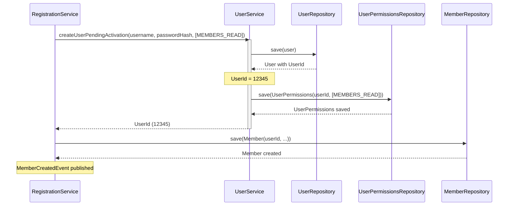

# Design: Refactor Members-Users Dependency

## Context

### Current State

The members module directly depends on repository interfaces from the users module:

- `RegistrationService` depends on `UserRepository` and `UserPermissionsRepository`
- `MemberCreatedEventHandler` depends on `UserRepository`

This creates tight coupling and leaks persistence abstractions across module boundaries.

**Current Architecture:**

```
members → users.UserRepository (persistence abstraction)
members → users.UserPermissionsRepository (persistence abstraction)
```

### Constraints

- **No API Changes:** This is an internal refactoring - all external APIs remain unchanged
- **No Behavior Changes:** Existing functionality must work exactly as before
- **TDD Required:** All tests must pass after refactoring
- **Transaction Integrity:** User and UserPermissions creation must remain atomic
- **Spring Modulith:** Module boundaries must be respected, no circular dependencies

### Stakeholders

- **Members Module:** Needs to create users and find users by username
- **Users Module:** Owns user lifecycle, authentication, and authorization
- **Tests:** Unit tests in members module mock user dependencies

## Goals / Non-Goals

**Goals:**

- Hide repository interfaces in users module's `persistence` package
- Expose business operations via `UserService` interface at module root
- Members module depends on business service, not persistence abstractions
- Simplify members module by abstracting multi-step user creation
- Maintain transactional integrity of user + permissions creation
- Keep all existing tests passing with minimal changes

**Non-Goals:**

- Changing external APIs or business behavior
- Modifying database schema
- Introducing new features or capabilities
- Changing the event-driven architecture (events still used for password setup)

## Decisions

### 1. UserService Interface at Module Root

**Decision:** Create `UserService` interface in `com.klabis.users` (module root) with two methods.

**Rationale:**

- Module root is for types exposed to other modules (aggregates, services, events)
- Service interface exposes **business operations**, not persistence details
- Follows Dependency Inversion Principle - depend on abstractions of behavior
- Consistent with Spring Modulith best practices

**Alternatives Considered:**

- ❌ **Keep repositories at root:** Violates Clean Architecture - persistence leaks across modules
- ❌ **Use domain events only:** Would require event saga for user creation - adds unnecessary complexity
- ❌ **Create facade pattern:** Additional layer without benefit - service interface is sufficient

**Interface Definition:**

```java
package com.klabis.users;

import com.klabis.users.model.Authority;
import com.klabis.users.model.UserId;
import java.util.Optional;
import java.util.Set;

/**
 * Service for user management operations.
 * <p>
 * Exposes business operations for creating and finding users.
 * This interface is at module root for inter-module communication.
 */
public interface UserService {

    /**
     * Creates a new user with pending activation status and grants authorities.
     * <p>
     * Creates both User and UserPermissions in a single transaction.
     * The user is created with PENDING_ACTIVATION status and must complete
     * password setup to become ACTIVE.
     *
     * @param username the username (registration number)
     * @param passwordHash the BCrypt-hashed password
     * @param authorities the set of authorities to grant
     * @return the ID of the created user
     * @throws IllegalArgumentException if username or passwordHash is invalid
     */
    UserId createUserPendingActivation(
        String username,
        String passwordHash,
        Set<Authority> authorities
    );

    /**
     * Finds a user by username.
     *
     * @param username the username to search for
     * @return optional containing the user if found
     */
    Optional<User> findUserByUsername(String username);
}
```

### 2. UserServiceImpl in application Package

**Decision:** Create `UserServiceImpl` in `com.klabis.users.application` implementing `UserService`.

**Rationale:**

- `application` package is for application services that coordinate use cases
- Implementation is hidden from other modules (package-private or not exposed)
- Service encapsulates the multi-step process: create user → create permissions
- Uses repository interfaces internally (implementation detail)

**Transaction Strategy:**

```java
@Service
@Transactional  // Ensures User and UserPermissions creation is atomic
public class UserServiceImpl implements UserService {

    private final UserRepository userRepository;
    private final UserPermissionsRepository userPermissionsRepository;

    @Override
    public UserId createUserPendingActivation(
        String username,
        String passwordHash,
        Set<Authority> authorities
    ) {
        // Create user
        User user = User.createPendingActivation(username, passwordHash);
        User savedUser = userRepository.save(user);
        UserId userId = savedUser.getId();

        // Create permissions
        UserPermissions permissions = UserPermissions.create(userId, authorities);
        userPermissionsRepository.save(permissions);

        return userId;
    }
}
```

**Why `@Transactional` at class level:**

- Both user and permissions creation must succeed or fail together
- If permission creation fails, user creation is rolled back
- Simplifies `RegistrationService` - no longer needs to coordinate transaction

### 3. Move Repositories to persistence Package

**Decision:** Move repository interfaces from module root to `com.klabis.users.persistence`.

**Current Locations:**

- `com.klabis.users.UserRepository` → `com.klabis.users.persistence.UserRepository`
- `com.klabis.users.authorization.UserPermissionsRepository` → `com.klabis.users.persistence.UserPermissionsRepository`

**Rationale:**

- Repository interfaces are persistence abstractions - belong in `persistence` package
- Hidden from other modules - not exposed at module root
- Only `UserServiceImpl` (internal) depends on them
- Aligns with package structure principles: infrastructure separated and not exposed

**Migration Steps:**

1. Move interfaces to new package
2. Update implementations (`UserRepositoryJdbcImpl`, `UserPermissionsRepositoryJdbcImpl`) to implement new package
3. Update `UserServiceImpl` to import from new package
4. Update tests within users module to use new package

### 4. Spring Dependency Injection Configuration

**Decision:** No explicit `@Configuration` class needed - Spring auto-configuration handles it.

**Rationale:**

- `@Service` on `UserServiceImpl` makes it a Spring bean
- `@Repository` on implementations makes them Spring beans
- Constructor injection in `RegistrationService` will automatically wire `UserServiceImpl`
- No additional configuration needed

**Wiring in RegistrationService:**

```java
@Service
public class RegistrationService {

    private final UserService userService;  // Injected: UserServiceImpl

    public RegistrationService(
        MemberRepository memberRepository,
        UserService userService,  // Was: UserRepository + UserPermissionsRepository
        PasswordEncoder passwordEncoder,
        @Value("${klabis.club.code}") String clubCode
    ) {
        this.userService = userService;
        // ...
    }
}
```

### 5. Testing Strategy

**Decision:** Update unit tests to mock `UserService` instead of repositories.

**Rationale:**

- Simplifies tests - mock one dependency instead of two
- Tests focus on business logic, not user creation details
- `UserService` becomes the contract between modules

**Mock Setup:**

```java
@Mock
private UserService userService;  // Was: UserRepository + UserPermissionsRepository

@BeforeEach
void setUp() {
    // Mock user creation with single call
    when(userService.createUserPendingActivation(
        anyString(), anyString(), anySet()
    )).thenReturn(defaultSharedId);
}
```

**Integration Tests:**

- `@ApplicationModuleTest` tests will use real `UserServiceImpl`
- No changes needed - Spring injects the implementation automatically

## Component Design

### Package Structure After Refactoring

```
com.klabis.users/
├── UserService.java                    [NEW] - Business service interface
├── User.java                           - Aggregate root
├── UserId.java                         - Value object
├── UserCreatedEvent.java               - Domain event
├── application/
│   └── UserServiceImpl.java            [NEW] - Service implementation
├── persistence/
│   ├── UserRepository.java             [MOVED] - Repository interface
│   ├── UserPermissionsRepository.java  [MOVED] - Repository interface
│   └── jdbc/
│       ├── UserJdbcRepository.java     - Spring Data JDBC
│       ├── UserRepositoryJdbcImpl.java - Implementation
│       ├── UserPermissionsJdbcRepository.java  - Spring Data JDBC
│       └── UserPermissionsRepositoryJdbcImpl.java  - Implementation
├── authentication/
│   └── ... (unchanged)
└── authorization/
    ├── UserPermissions.java            - Aggregate root
    └── ... (unchanged, repository moved)
```

### Architecture Diagram

```mermaid
graph TB
    subgraph "Members Module"
        direction TB
        RS[RegistrationService]
        EH[MemberCreatedEventHandler]
    end

    subgraph "Users Module - Public API"
        direction TB
        US[UserService<br/>interface]
        User[User<br/>Aggregate]
        UE[UserCreatedEvent<br/>Domain Event]
    end

    subgraph "Users Module - Internal"
        direction TB
        USImpl[UserServiceImpl<br/>@Transactional]
        UR[(UserRepository)]
        UPR[(UserPermissionsRepository)]
    end

    subgraph "Infrastructure"
        direction TB
        JDBC1[UserJdbcRepository]
        JDBC2[UserPermissionsJdbcRepository]
    end

    RS -->|depends on| US
    EH -->|depends on| US
    US -.->|exposed| User
    US -.->|publishes| UE

    USImpl ==>|implements| US
    USImpl -->|uses| UR
    USImpl -->|uses| UPR

    UR -->|implemented by| JDBC1
    UPR -->|implemented by| JDBC2

    style US stroke:#0f0,stroke-width:3px
    style USImpl stroke:#00f,stroke-width:2px
    style UR stroke:#999,stroke-dasharray: 5 5
    style UPR stroke:#999,stroke-dasharray: 5 5
```

### Interaction Sequence: Member Registration



## Risks / Trade-offs

### Risk 1: Transaction Boundary Between Modules

**Risk:** Moving user creation into `UserServiceImpl` creates a transaction boundary that spans module calls.

**Mitigation:**

- ✅ `@Transactional` on `UserServiceImpl` ensures atomic user + permissions creation
- ✅ `RegistrationService` still controls the outer transaction for Member creation
- ✅ If Member creation fails, the transaction rolls back both Member and User
- ✅ Spring's transaction propagation handles this correctly (default: REQUIRED)

**Test Strategy:**

- Verify rollback behavior in integration tests
- Test scenario: Member creation fails after User creation → both rolled back

### Risk 2: Breaking Existing Tests

**Risk:** Unit tests in members module mock repositories - will break with `UserService`.

**Mitigation:**

- ✅ Update test imports and mock setup systematically
- ✅ Change is mechanical - replace two repository mocks with one service mock
- ✅ No behavior change - tests should pass after updating mocks
- ✅ Run all tests before committing

**Estimated Effort:** 30 minutes to update all affected tests

### Risk 3: Package Move Causes Import Errors

**Risk:** Moving repository interfaces will break imports across the codebase.

**Mitigation:**

- ✅ IDE will auto-fix imports in most cases
- ✅ Only users module imports these interfaces
- ✅ Members module no longer imports them (uses `UserService` instead)
- ✅ Compile errors are immediate and easy to fix

### Trade-off: Additional Service Layer

**Trade-off:** Adding `UserService` introduces another layer of indirection.

**Justification:**

- ✅ **Proper Separation:** Members module depends on business operations, not persistence
- ✅ **Simpler Coordination:** User + permissions creation encapsulated in one place
- ✅ **Easier Testing:** Mock one service instead of coordinating two repositories
- ✅ **Better Encapsulation:** Repository implementations hidden in persistence package

**Cost:** One additional class (`UserServiceImpl`) - minimal complexity for significant architectural benefit.

### Trade-off: Larger Transaction Scope

**Trade-off:** `UserServiceImpl.createUserPendingActivation()` creates a transaction that was previously split between
two repository calls in `RegistrationService`.

**Justification:**

- ✅ **Atomicity:** User and Permissions must be created together - transaction ensures this
- ✅ **Simpler Client:** `RegistrationService` no longer needs to coordinate multi-step user creation
- ✅ **Consistent Rollback:** If permissions fail, user creation is rolled back automatically

**No Performance Impact:** Transaction scope is the same (User + Permissions creation), just encapsulated differently.

## Migration Plan

### Phase 1: Prepare Users Module (No Breaking Changes)

1. **Create `UserService` interface** at module root
2. **Create `UserServiceImpl`** in application package
3. **Implement methods** delegating to repositories
4. **Write unit tests** for `UserServiceImpl`
5. **Verify integration tests** pass

**Checkpoint:** Commit with all new code, no breaking changes

### Phase 2: Move Repositories (Breaking Change in Users Module)

1. **Move `UserRepository`** to `persistence` package
2. **Move `UserPermissionsRepository`** to `persistence` package
3. **Update implementations** (`UserRepositoryJdbcImpl`, `UserPermissionsRepositoryJdbcImpl`)
4. **Update `UserServiceImpl`** to import from new package
5. **Fix imports** in users module tests
6. **Verify all users module tests pass**

**Checkpoint:** Commit with repositories moved

### Phase 3: Refactor Members Module

1. **Update `RegistrationService`**:
    - Remove `UserRepository` and `UserPermissionsRepository` dependencies
    - Add `UserService` dependency
    - Replace `userRepository.save()` + `userPermissionsRepository.save()` with
      `userService.createUserPendingActivation()`
2. **Update `MemberCreatedEventHandler`**:
    - Remove `UserRepository` dependency
    - Add `UserService` dependency
    - Replace `userRepository.findByUsername()` with `userService.findUserByUsername()`
3. **Update unit tests** in members module:
    - Change from mocking two repositories to mocking one service
    - Update test setups and verifications
4. **Run all tests** - fix any remaining issues

**Checkpoint:** Commit with members module refactored

### Phase 4: Verification

1. **Run full test suite:** `mvn clean test`
2. **Run integration tests:** `mvn verify`
3. **Manual testing:** Test member registration flow via API
4. **Check Spring Modulith:** Verify no circular dependencies

**Final:** Mark change complete, archive if using OpenSpec

### Rollback Strategy

If issues arise:

1. **Revert commits** in reverse order: Phase 3 → Phase 2 → Phase 1
2. **Or use git revert** to create revert commits
3. **Restore database** if schema changes were made (not applicable here)

**Risk:** Low - refactoring is well-contained and tested at each phase.

## Open Questions

None - all design decisions are clear and documented.

## Implementation Notes

### Transaction Boundary

**Critical Understanding:** The transaction boundary remains the same, just encapsulated differently:

**Before:**

```java
@Transactional
public UUID registerMember(request) {
    // Transaction starts here
    User user = userRepository.save(user);  // Same transaction
    userPermissionsRepository.save(permissions);  // Same transaction
    Member member = memberRepository.save(member);  // Same transaction
    return userId;
    // Transaction ends here
}
```

**After:**

```java
@Transactional
public UUID registerMember(request) {
    // Transaction starts here
    UserId userId = userService.createUserPendingActivation(...);
    // ↑ Inside method: userRepository.save() + userPermissionsRepository.save()
    // Same transaction (REQUIRED propagation)
    Member member = memberRepository.save(member);  // Same transaction
    return userId;
    // Transaction ends here
}
```

**Key Point:** Spring's default `REQUIRED` propagation means `UserServiceImpl` joins the existing transaction from
`RegistrationService`. No nested transactions, no unexpected behavior.

### Error Handling

**Current Behavior:** If Member creation fails after User creation, the transaction rolls back both.

**After Refactoring:** Same behavior - transaction is still controlled by `RegistrationService`, `UserServiceImpl` just
participates in it.

**No Changes Needed:** Error handling remains identical.
