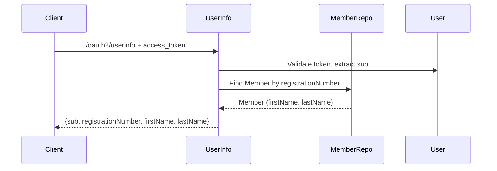
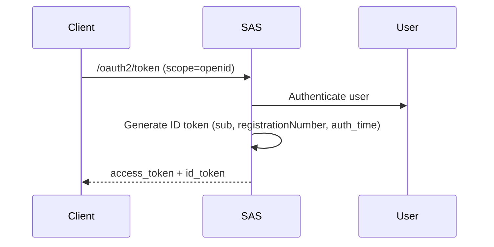
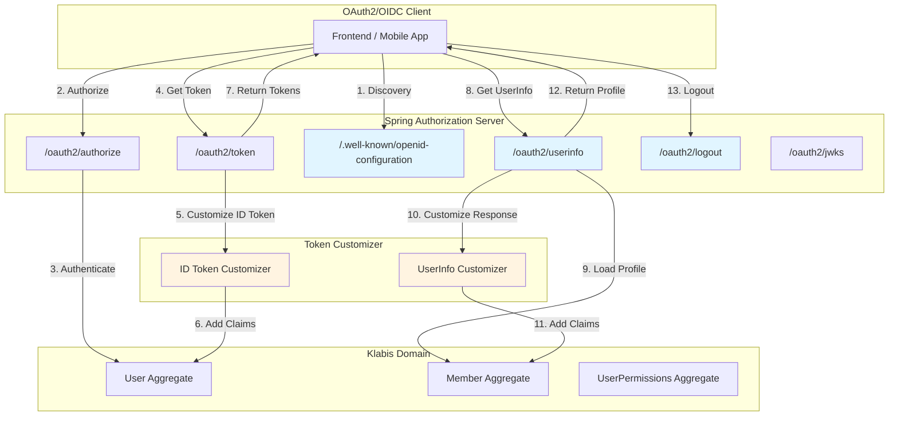
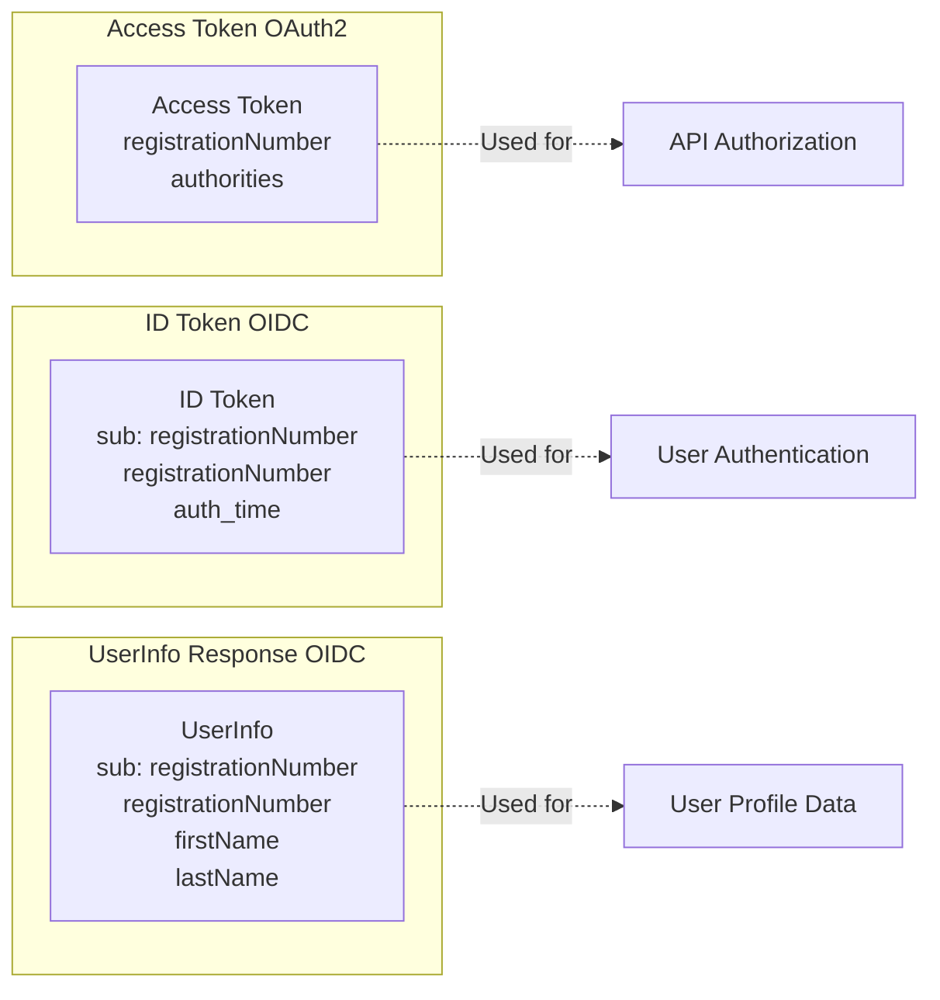

# Design: Enable OpenID Connect Authentication

## Context

Klabis currently implements OAuth2 authorization server using Spring Authorization Server (SAS) for token-based
authentication and authorization. The system issues JWT access tokens and refresh tokens, with custom claims including
`registrationNumber` and `authorities`.

**Current State:**

- OAuth2 Authorization Server with authorization code, client credentials, and refresh token flows
- JWT access tokens (15 min TTL) with custom claims
- JDBC-backed storage for clients, authorizations, and consents
- Database schema includes `oidc_id_token_*` columns but ID tokens are not generated
- No OpenID Connect discovery, UserInfo, or logout endpoints

**Constraints:**

- Spring Authorization Server provides built-in OIDC support (no custom endpoint implementations needed)
- Must maintain backward compatibility with existing OAuth2 clients
- Database schema already supports OIDC tokens (no migrations required)
- Must follow KISS principle - configuration-only changes preferred
- Frontend is separate consuming API via HAL+FORMS

**Stakeholders:**

- Frontend developers: Need OIDC for standard authentication flows
- Security: Need proper separation of authentication (ID tokens) and authorization (access tokens)
- Future: Federation with external identity providers requires OIDC foundation

## Goals / Non-Goals

**Goals:**

- Enable OpenID Connect Core 1.0 compliance via configuration (no code duplication)
- Provide ID tokens with user identity claims (registrationNumber, firstName, lastName)
- Enable OIDC discovery endpoint for client configuration
- Provide UserInfo endpoint for user profile data
- Support RP-initiated logout for single sign-out
- Maintain 100% backward compatibility with existing OAuth2 clients

**Non-Goals:**

- Custom OIDC endpoint implementations (use Spring's built-in endpoints)
- Frontend session management (handled by SPA)
- External identity provider federation (future requirement)
- Advanced OIDC features (session management, front-channel logout)
- Modifying existing access token structure or claims

## Decisions

### Decision 1: Enable OIDC via Spring Authorization Server Configuration

**Choice:** Enable OIDC features through `OAuth2AuthorizationServerConfigurer.oidc(Customizer.withDefaults())` on the
authorization server security filter chain

**Rationale:**

- Spring Authorization Server includes complete OIDC support out of the box
- Built-in endpoints: discovery (`/.well-known/openid-configuration`), UserInfo, logout
- No custom controller code required
- Automatically handles ID token generation and signing
- Reduces maintenance burden and ensures OIDC spec compliance

**Alternatives Considered:**

- **Custom OIDC endpoints** - Rejected due to code duplication and maintenance overhead
- **Separate OIDC library** - Rejected because SAS already provides OIDC functionality

**Implementation:**

```java
@Bean
@Order(1)
public SecurityFilterChain authorizationServerSecurityFilterChain(HttpSecurity http) throws Exception {
    OAuth2AuthorizationServerConfiguration.applyDefaultSecurity(http);
    http.getConfigurer(OAuth2AuthorizationServerConfigurer.class)
            .oidc(Customizer.withDefaults());  // Enable OIDC features
    // ...
    return http.build();
}
```

### Decision 2: Extend JWT Customizer for ID Token Claims

**Choice:** Modify existing `jwtCustomizer()` bean to add ID token-specific claims when token type is `id_token`

**Rationale:**

- Single customization point for both access tokens and ID tokens
- Leverages existing JWT infrastructure (RS256 signing, key management)
- Clean separation: access tokens contain authorities, ID tokens contain identity claims
- No additional dependencies or configuration needed

**Token Claim Structure:**

- **Access Token**: `registrationNumber`, `authorities` (authorization)
- **ID Token**: `sub`, `registrationNumber`, `auth_time` (authentication - minimal claims)
- **UserInfo**: `sub`, `registrationNumber`, `firstName`, `lastName` (profile data)

**Implementation:**

```java
@Bean
public OAuth2TokenCustomizer<JwtEncodingContext> jwtCustomizer() {
    return context -> {
        if (context.getTokenType().getValue().equals("access_token")) {
            // Existing access token claims (authorities, registrationNumber)
            // ...
        } else if (context.getTokenType().getValue().equals("id_token")) {
            // Standard OIDC claims (minimal - no profile data)
            context.getClaims().claim("sub", context.getPrincipal().getName());
            context.getClaims().claim("auth_time", Instant.now().getEpochSecond());
            context.getClaims().claim("registrationNumber", context.getPrincipal().getName());
            // firstName and lastName available via UserInfo endpoint only
        }
    };
}
```

**Alternatives Considered:**

- **Separate ID token customizer** - Rejected due to code duplication
- **Claims in access token only** - Rejected because it violates separation of concerns (authentication vs
  authorization)

### Decision 3: Load User Profile Claims from Member Entity for UserInfo

**Choice:** Query `Member` entity by `registrationNumber` to retrieve `firstName` and `lastName` for UserInfo endpoint
only (not ID tokens)

**Rationale:**

- Members already have first/last name fields
- User and Member are linked via `registrationNumber`
- Single source of truth for user profile data
- Consistent with existing domain model

**Data Flow for UserInfo:**



**ID Token Generation (no Member lookup):**



**Alternatives Considered:**

- **Store first/last name in User entity** - Rejected because User is for identity only (credentials), Member for
  profile data
- **Duplicate name fields** - Rejected due to normalization violations and data inconsistency risks

### Decision 4: UserInfo Endpoint Configuration

**Choice:** Enable Spring Authorization Server's built-in UserInfo endpoint via customizer that loads Member entity

**Rationale:**

- Spring provides `OidcUserInfoCustomizer` for customizing UserInfo response
- UserInfo endpoint can query Member entity for firstName/lastName
- No custom controller implementation needed
- Separates identity (ID token) from profile data (UserInfo endpoint)

**Implementation:**

- Implement `OidcUserInfoCustomizer<OAuth2TokenCustomizerContext>` to load Member by registrationNumber
- Endpoint automatically available at `/oauth2/userinfo` when OIDC is enabled
- Returns claims: `sub`, `registrationNumber`, `firstName`, `lastName`

**Alternatives Considered:**

- **Custom UserInfoController** - Rejected because SAS provides this out of the box
- **Use access token claims** - Rejected because UserInfo should return identity only, not authorities

### Decision 5: Logout Endpoint Configuration

**Choice:** Enable RP-initiated logout via Spring Authorization Server built-in endpoint

**Rationale:**

- Spring Authorization Server provides `/oauth2/logout` endpoint when OIDC is enabled
- Validates `post_logout_redirect_uri` against registered client URIs
- Supports `state` parameter for CSRF protection
- Terminates sessions and invalidates tokens automatically

**Configuration:**

- Add logout configuration to authorization server security filter chain
- Register `post_logout_redirect_uris` in OAuth2 client metadata
- Session cleanup handled by Spring Security

**Alternatives Considered:**

- **Custom logout controller** - Rejected due to security risks and duplication
- **Token revocation only** - Rejected because RP-initiated logout requires redirect handling

### Decision 6: Add `openid` Scope to Default Client

**Choice:** Update `BootstrapDataLoader` to include `openid` in default OAuth2 client scopes

**Rationale:**

- Enables OIDC out of the box without manual database changes
- Backward compatible - existing clients without `openid` scope work as before
- Aligns with OIDC specification (scope is opt-in via client request)

**Implementation:**

```java
// In BootstrapDataLoader.java
String scopes = "openid members.create members.read members.update members.delete";
```

**Alternatives Considered:**

- **Database migration** - Rejected because bootstrap data is more flexible for development
- **No default openid scope** - Rejected because it prevents OIDC usage without manual DB changes

## Architecture

### Component Diagram



### Token Types and Claims



## Risks / Trade-offs

### Risk 1: UserInfo Endpoint Requires Member Entity Lookup

**Risk**: UserInfo endpoint requires querying Member entity for firstName/lastName, adding database roundtrip

**Mitigation**:

- Member lookup is by registrationNumber (indexed, fast query)
- Profile data is small (first/last name only)
- UserInfo endpoint called infrequently (not on every API request)
- Can be cached in future if performance issues arise

**Trade-off**: Accept minor latency on UserInfo endpoint for proper separation of concerns (ID token for authentication,
UserInfo for profile data)

### Risk 2: UserInfo Endpoint Exposes Personal Data

**Risk**: UserInfo endpoint returns firstName/lastName which are GDPR-protected personal data

**Mitigation**:

- UserInfo endpoint requires valid access token with `openid` scope (authenticated)
- Access token validation ensures only authorized clients can access profile data
- Data is already exposed via members API (this is not new exposure)
- Audit logging tracks UserInfo access (can be added later)

**Trade-off**: Standard OIDC behavior requires profile data in UserInfo endpoint, but access is controlled

### Risk 3: Logout Session State Complexity

**Risk**: RP-initiated logout may not properly clean up all sessions in distributed deployments

**Mitigation**:

- Current deployment is single-instance (no distributed session issues yet)
- Logout invalidates refresh tokens in database (stateless, works across instances)
- Access tokens are short-lived (15 min) and cannot be revoked (by design)
- Frontend can discard tokens on logout

**Trade-off**: Cannot immediately revoke active access tokens (this is OAuth2 design, not specific to OIDC)

### Risk 4: Backward Compatibility

**Risk**: Enabling OIDC might break existing OAuth2 clients

**Mitigation**:

- ID tokens only generated when `openid` scope is requested
- Access token structure unchanged (existing clients work as-is)
- New endpoints are additions, not modifications
- Tested with existing frontend (will continue to work)

**Trade-off**: None - OIDC is purely additive with opt-in scope

## Migration Plan

### Phase 1: Enable OIDC Core Features

1. **Update AuthorizationServerSettings**
    - Add `.oidcEnabled(true)` to builder
    - No database changes required

2. **Extend JWT Customizer for ID Tokens**
    - Add `id_token` token type handling
    - Add standard OIDC claims (sub, auth_time, registrationNumber)
    - No Member entity lookup (firstName/lastName in UserInfo only)

3. **Implement UserInfo Customizer**
    - Create `OidcUserInfoCustomizer` bean
    - Load Member entity by registrationNumber
    - Return profile claims (registrationNumber, firstName, lastName)

4. **Update BootstrapDataLoader**
    - Add `openid` to default client scopes
    - No migration script needed (bootstrap data reloads on startup)

5. **Testing**
    - Verify discovery endpoint returns metadata
    - Test ID token generation with `openid` scope (no firstName/lastName)
    - Test UserInfo endpoint returns firstName/lastName
    - Confirm existing OAuth2 flows still work (without `openid`)

### Phase 2: Logout (Future)

1. **Configure Logout Endpoint**
2. **Test end-to-end OIDC logout flow**

### Rollback Strategy

- **Configuration rollback**: Remove `.oidc(Customizer.withDefaults())` from authorization server security filter chain
- **Code rollback**: Revert JWT customizer changes and `BootstrapDataLoader` scope changes
- **No database rollback needed**: Schema already supports OIDC tokens, columns remain empty if unused
- **Zero-downtime**: Backward compatible, no breaking changes

### Deployment Steps

1. Deploy with OIDC configuration enabled
2. Monitor logs for ID token generation errors
3. Test with staging frontend using OIDC flows
4. Gradually migrate production clients to use `openid` scope
5. Existing clients continue working without changes

## Open Questions

**Q1: Should UserInfo endpoint support claims filtering (e.g., only return firstName)?**

*Status*: Out of scope for initial implementation. Spring Authorization Server returns all claims by default. Can be
optimized later if needed by implementing custom `OidcUserInfoMapper`.

**Q2: Should we support `profile` and `email` scopes as per OIDC spec?**

*Status*: Not needed currently. Klabis has custom scopes (members.create, members.read). Standard OIDC scopes (
`profile`, `email`) can be added later if standard OIDC clients need to integrate.

**Q3: How do we handle users without linked Member entities?**

*Status*: Admin user has no Member entity. ID token and UserInfo will return `registrationNumber` only (
firstName/lastName will be null or omitted). This is acceptable for admin accounts.

**Q4: Should we add audit logging for ID token generation and UserInfo access?**

*Status*: Not required for initial implementation. Can be added later by customizing token customizer to emit audit
events. Priority: Low.

**Q5: What happens to ID tokens if Member data is updated after token issuance?**

*Status*: ID tokens are immutable (cannot be updated once issued). Updated profile data will be reflected in new tokens
issued after update. This is standard OIDC behavior (tokens are short-lived snapshots).
