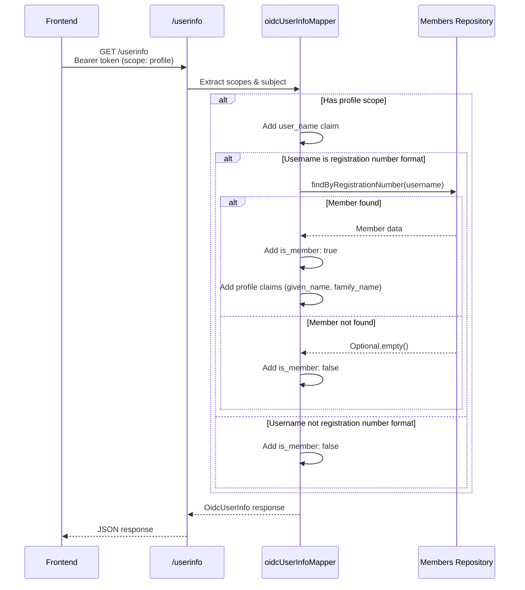

## Context

Aktuální stav OIDC implementace:
- Spring Authorization Server poskytuje `/userinfo` endpoint s OIDC standard claims
- Customizace claims probíhá pomocí `oidcUserInfoMapper()` funkce
- Member agregát a User agregát jsou oddělené (DDD bounded contexts)
- Vztah: Member.id = UserId (shared ID pattern)
- Username může být:
  - Registration number formát (XXXYYDD) → potenciální člen
  - Libovolný string (např. "admin") → správce

Současná logika:
1. Kontrola scope `profile` nebo `email`
2. Validace formátu username (`RegistrationNumber.isRegistrationNumber()`)
3. Dotaz do Members repository (`findByRegistrationNumber()`)
4. Pokud Member nalezen → přidání profile/email claims
5. Pokud nenalezen → pouze `sub` claim

**Problém:** Frontend nemá jednoznačnou informaci, zda uživatel je člen nebo správce.

## Goals / Non-Goals

**Goals:**
- Přidat explicitní `is_member: boolean` claim do userinfo response
- Přejmenovat `registrationNumber` claim na `user_name` (konzistentní s DB sloupcem)
- Udržet scope-based access control (claims pouze s `profile` scope)
- Zajistit OIDC standard compliance

**Non-Goals:**
- Neměnit logiku autentizace (zůstává stejná)
- Nepřidávat cache pro member lookup (jednoduchý SELECT dotaz je dostatečný)
- Neměnit vztah User ↔ Member agregátů (zůstává shared ID pattern)
- Nepřidávat `is_member` do ID tokenu (pouze userinfo response)

## Decisions

### 1. is_member claim jako boolean (ne member_id)

**Rozhodnutí:** Claim `is_member: boolean` místo `member_id: UUID | null`

**Zdůvodnění:**
- Frontend potřebuje pouze rozlišení ano/ne (pro zobrazení odkazu)
- Boolean je explicitnější než null check
- Menší velikost response (boolean vs UUID string)

**Alternativy:**
- ❌ `member_id: UUID | null` - zbytečně složité pro frontend, větší payload
- ❌ `profile_type: "member" | "admin"` - extensibilní, ale string comparison na frontendu

### 2. Claim scope: pouze profile

**Rozhodnutí:** Claims `user_name` a `is_member` vráceny pouze s scope `profile`

**Zdůvodnění:**
- OIDC standard: profil uživatele patří do `profile` scope
- Konzistence: ostatní profile claims (`given_name`, `family_name`) už scope vyžadují
- Frontend stejně musí požadovat `profile` scope pro jméno a příjmení

**Alternativy:**
- ❌ Vždy vracet s `openid` scope - porušení OIDC semantiky scope separation

### 3. Detekce členství: Members.findByRegistrationNumber()

**Rozhodnutí:** Použít existující metodu `Members.findByRegistrationNumber()`

**Zdůvodnění:**
- Již existující infrastructure (repository, query)
- Jednoduchý SELECT dotaz (indexovaný sloupec `registration_number`)
- Respektuje DDD bounded context separaci (User modul neví o Member tabulce)

**Alternativy:**
- ❌ Přidat `memberId` do User agregátu - porušení DDD separace, duplicitní data
- ❌ Cache member existence - předčasná optimalizace, složitost invalidace

### 4. Claim rename: registrationNumber → user_name

**Rozhodnutí:** Přejmenovat claim ve všech tokenech (ID token, access token, userinfo)

**Zdůvodnění:**
- Konzistence s nedávnou DB změnou (`users.user_name` sloupec)
- `user_name` je sémanticky správnější (může být libovolný string, ne jen registration number)
- Breaking change stejně nutný → lepší udělat kompletně

**Alternativy:**
- ❌ Zachovat `registrationNumber` - nekonzistentní s DB schématem
- ❌ Mít oba claims - zbytečná duplicita, matoucí

## Risks / Trade-offs

### [Risk] Frontend breaking change
**Dopad:** Existující frontend aplikace přestanou fungovat (parsování `registrationNumber`)

**Mitigation:**
- ✅ Koordinace s frontend týmem před nasazením
- ✅ Aktualizace dokumentace s migration guide
- ✅ Jasný commit message s BREAKING change marker

### [Risk] Extra DB dotaz při každém /userinfo volání
**Dopad:** SELECT dotaz do Members tabulky při každém userinfo request

**Trade-off:**
- ✅ Dotaz je jednoduchý (indexed column lookup)
- ✅ Userinfo endpoint se volá typicky 1× při login (ne při každém API call)
- ✅ Žádná cache invalidace complexity

**Budoucí optimalizace (pokud nutná):**
- In-memory cache s TTL (pokud userinfo latence bude problém)
- Member ID v User agregátu (pokud bude nutná denormalizace)

### [Risk] OIDC standard compliance
**Dopad:** Custom claim `is_member` není OIDC standard claim

**Mitigation:**
- ✅ Custom claims jsou povolené OIDC standardem
- ✅ Claim patří do `profile` scope (správná kategorie)
- ✅ Jasná dokumentace v OpenAPI spec

## Implementation Flow



## Migration Plan

**Backend deployment:**
1. Deploy změny s BREAKING change warningem
2. Verifikovat testy (všech 1055 testů musí projít)
3. Manuální smoke test:
   - Login jako admin → ověřit `is_member: false`
   - Login jako member → ověřit `is_member: true` + profile claims

**Frontend koordinace:**
1. Notifikovat frontend tým o breaking change
2. Poskytnout migration example:
   ```diff
   - const regNumber = userInfo.registrationNumber;
   + const userName = userInfo.user_name;

   + const isMember = userInfo.is_member;
   + if (isMember) {
   +   // Show link to member detail
   + }
   ```

**Rollback strategie:**
- Git revert commitu (jednoduchá změna v 1 souboru)
- Redeploy předchozí verze
- Frontend kompatibilní s oběma verzemi (feature flag)

## Open Questions

**Žádné** - implementace je přímočará, všechny rozhodnutí jasná.
