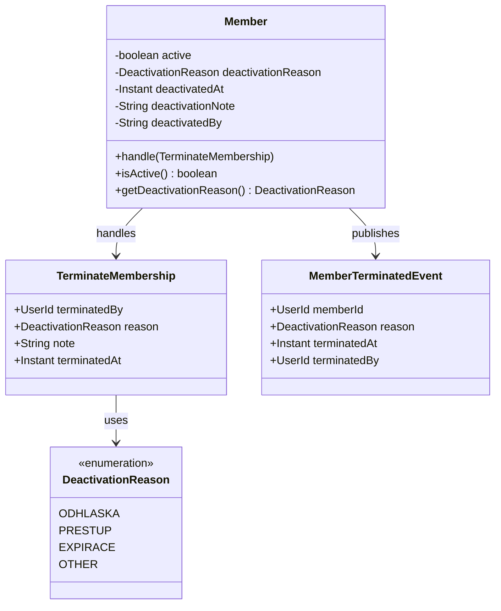
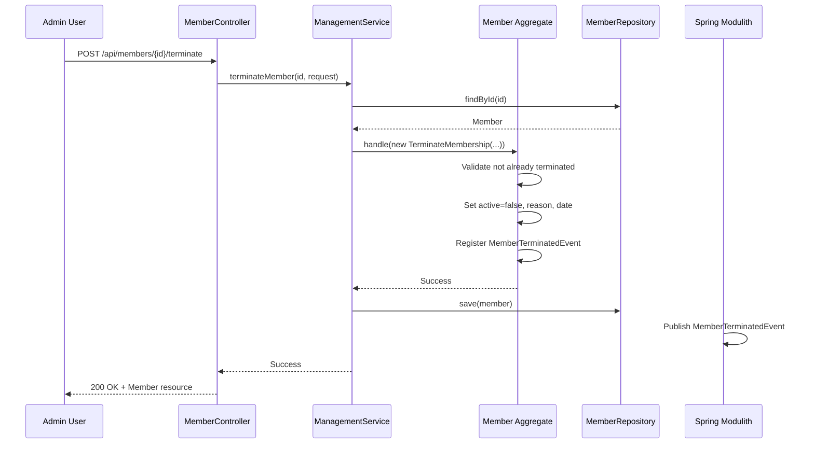

## Context

Klabis aktuálně podporuje životní cyklus člena od registrace až po aktivní členství. Member aggregate má `active` boolean field, ale chybí detailní evidence o ukončení členství.

**Current state:**
- `Member.active` boolean (true/false)
- Žádná evidence kdy a proč bylo členství ukončeno
- Žádný domain event pro integraci
- Žádný API endpoint pro terminaci

**Constraints:**
- Spring Data JDBC vyžaduje explicitní persistenci všech fieldů
- HATEOAS compliance povinná pro všechny endpointy
- Domain events pro asynchronní integraci (Spring Modulith)

## Goals / Non-Goals

**Goals:**
- Evidence ukončení členství s důvodem a časovým údajem
- Domain command pro terminaci s validací
- REST API endpoint pro provedení terminace
- Domain event pro future integrace (Finance, ORIS, CUS, Groups)
- Audit stopa pro reporting a compliance

**Non-Goals:**
- Kontrola finančního stavu před terminací (issue #266)
- ORIS synchronizace při terminaci (issue #267)
- CUS export filtering (issue #268)
- Validace vedoucích skupin (issue #269)
- Frontend UI changes (samostatný modul)

## Decisions

### 1. Membership Status Model

**Decision:** Použít existující `active` boolean + přidat metadata (deactivationReason, deactivatedAt)

**Rationale:**
- Minimal change to existing schema
- Backwards compatible with existing queries
- Boolean `active` sufficient for current filtering needs

**Alternatives considered:**
- `MembershipStatus` enum (ACTIVE, INACTIVE, TERMINATED, TRANSFERRED) - **Rejected**: Over-engineering for current needs, enum states would require migration of all existing members

### 2. Deactivation Reason Enumeration

**Decision:** Vytvořit `DeactivationReason` enum (ODHLASKA, PRESTUP, OTHER)

**Rationale:**
- Type safety v domain layer
- Konzistentní hodnoty pro reporting
- Snadné rozšíření v budoucnu

```java
public enum DeactivationReason {
    ODHLASKA,      // Člen podal odhlášku
    PRESTUP,       // Přestup do jiného oddílu
    OTHER          // Jiný důvod + volitelná poznámka
}
```

### 3. Domain Command Pattern

**Decision:** Vytvořit `TerminateMembership` command record

**Rationale:**
- Konzistentní s existujícími commandy v Member aggregate
- Explicitní parametry (reason, note, terminatedBy)
- Type安全的 domain API
- Terminación probíhá okamžitě (nepodporuje budoucí datum)

```java
public record TerminateMembership(
    UserId terminatedBy,        // Kdo provedl terminaci
    DeactivationReason reason,  // Důvod ukončení
    String note                 // Volitelná poznámka
) {}
```

### 4. API Endpoint Design

**Decision:** `POST /api/members/{id}/terminate`

**Rationale:**
- Resource-oriented URL design
- POST pro state-changing operation (neměly by být idempotentní)
- Explicitní "terminate" action v URL (clear intent)

**Request body:**
```json
{
  "reason": "ODHLASKA",
  "note": "Člen se stěhuje mimo Prahu"
}
```

**Response:** `200 OK` s aktualizovaným Member resource (včetně `_links`)

### 5. Domain Event Publishing

**Decision:** Vytvořit `MemberTerminatedEvent` publikovaný při úspěšné terminaci

**Rationale:**
- Asynchronous integrace s future moduly (Finance, ORIS, CUS, Groups)
- Spring Modulith automaticky publikuje @DomainEvents
- Event-driven architecture podporuje modularitu

```java
public record MemberTerminatedEvent(
    UserId memberId,
    DeactivationReason reason,
    Instant terminatedAt,
    UserId terminatedBy
) {}
```

### 6. Persistence Strategy

**Decision:** Přidat sloupce do existující `members` tabulky

**New columns:**
```sql
ALTER TABLE members ADD COLUMN deactivation_reason VARCHAR(20);
ALTER TABLE members ADD COLUMN deactivated_at TIMESTAMP;
ALTER TABLE members ADD COLUMN deactivation_note VARCHAR(500);
ALTER TABLE members ADD COLUMN deactivated_by VARCHAR(100);
```

**Rationale:**
- Single table per aggregate (Spring Data JDBC pattern)
- No join required for termination info
- Audit trail built-in

## Data Model

### Member Aggregate Changes



## API Flow



## Risks / Trade-offs

### Risk: Race condition - concurrent termination attempts
**Mitigation:** Optimistic locking via `version` field (already exists in Member aggregate)
- Second attempt fails with `OptimisticLockingFailureException`
- Service layer catches and returns `409 Conflict`

### Risk: Terminating already inactive member
**Mitigation:** Domain validation throws `BusinessRuleViolationException`
- Returns `400 Bad Request` with clear error message

### Trade-off: No financial status check in MVP
**Impact:** Admin must manually verify payments before termination
- **Acceptable:** Finance modul ještě neexistuje, MVP prioritizuje core functionality
- **Future:** Issue #266 přidá validační check

### Trade-off: Hard delete vs soft delete
**Decision:** Soft delete (active=false)
- **Pros:** Audit trail, možnost reaktivace, reporting
- **Cons:** Data growth, must filter `active=true` ve všech querych
- **Mitigation:** Database index na `is_active` column

## Migration Plan

### Phase 1: Database Migration
1. Add migration script V001__add_member_termination_fields.sql
2. Execute in dev environment (H2 resets on restart)
3. Test with existing active members (new fields are NULL)

### Phase 2: Code Implementation
1. Add `DeactivationReason` enum
2. Update `Member` aggregate (fields, constructor, command handler)
3. Add `TerminateMembership` command
4. Add `MemberTerminatedEvent`
5. Update `MemberJdbcRepository` persist logic
6. Add controller endpoint
7. Add DTOs (`TerminateMembershipRequest`)

### Phase 3: Testing
1. Unit tests for domain logic
2. Integration tests for repository
3. Controller tests for API contract
4. E2E test for full workflow

### Rollback Strategy
- Revert code changes (git)
- Database migration remains (non-breaking, new columns nullable)
- No data loss (termination info only added)

## Open Questions

1. **Q:** Should termination be reversible (reactivate)?
   **A:** Out of scope for MVP - reactivation would require separate workflow and approval process

2. **Q:** Should system send notification email to member on termination?
   **A:** Out of scope - Notification module not yet implemented

3. **Q:** Should termination automatically revoke User account access?
   **A:** No - User account vs Membership are separate concerns. User may need access for historical data
