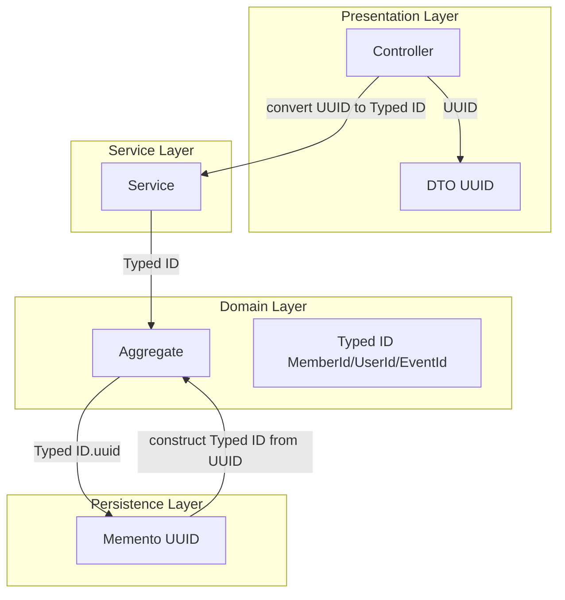

# Domain Identity Types Cleanup - Design

## Context

Currently, the codebase has inconsistent identifier usage:
- `Member.getId()` returns `UserId` (conceptual mismatch - member should use MemberId)
- Services accept `UUID` parameters instead of typed identifiers
- Domain events use raw `UUID` instead of typed IDs
- Event services use `UUID eventId` despite `EventId` value object existing

This creates type safety issues where wrong ID types can be passed to methods (e.g., passing UserId where EventId is expected), with errors only surfacing at runtime.

**Constraints:**
- External API contracts must remain unchanged (DTOs continue using `UUID`)
- Persistence layer unchanged (mementos continue using `UUID`)
- Frontend unaffected (HAL+FORMS responses unchanged)
- Must maintain 1:1 Member-User identifier relationship (same underlying UUID value)

## Goals / Non-Goals

**Goals:**
- Establish clear type boundaries: Member→MemberId, User→UserId, Event→EventId
- Enable compile-time type safety for identifier usage
- Make code self-documenting through typed identifiers
- Prevent accidental passing of wrong ID types between aggregates

**Non-Goals:**
- Changing external API contracts (DTOs keep `UUID`)
- Changing database schema (mementos keep `UUID`)
- Breaking Member-User 1:1 identifier relationship
- Performance optimization (this is a type safety refactoring)

## Decisions

### Decision 1: Change Member.getId() Return Type from UserId to MemberId

**Choice:** `Member.getId()` returns `MemberId` instead of `UserId`

**Rationale:**
- Member aggregates should use MemberId as their primary identifier
- Current design (returning UserId) creates conceptual confusion
- Member and User remain linked 1:1 via same underlying UUID value

**Alternatives considered:**
- **Keep UserId**: Maintains status quo but doesn't solve the conceptual mismatch
- **Return both getIdAsMemberId() / getIdAsUserId()**: Adds unnecessary complexity

**Impact:**
- All callers of `Member.getId()` need updating
- `MemberRepository` will use `MemberId` for lookups
- Conversion to `UserId` requires explicit code: `new UserId(memberId.uuid())`

### Decision 2: Keep MemberId.toUserId() Convenience Method

**Choice:** Keep `MemberId.toUserId()` method for MemberId→UserId conversion

**Rationale:**
- Member and User have 1:1 relationship with same underlying UUID value
- Conversion is semantically valid and commonly needed
- Convenience method reduces boilerplate in legitimate use cases
- Type safety still maintained - conversion is explicit method call, not implicit cast

**Usage:**
```java
MemberId memberId = member.getId();
UserId userId = memberId.toUserId();  // Explicit, documented conversion
```

**Impact:**
- No changes needed to existing code using this method
- New code can use convenience method when MemberId→UserId conversion is semantically correct

### Decision 3: Service Methods Accept Typed IDs Instead of UUID

**Choice:** Service interfaces use `MemberId`, `UserId`, `EventId` instead of `UUID` parameters

**Rationale:**
- Compile-time type safety prevents passing wrong ID types
- Self-documenting method signatures

**Alternatives considered:**
- **Keep UUID parameters**: Maintains flexibility but loses type safety

**Impact:**
- Service interface signatures change
- Controllers must convert `UUID` path variables to typed IDs before calling services

### Decision 4: Controllers Handle UUID ↔ Typed ID Conversion

**Choice:** Controllers convert `UUID` to/from typed IDs at layer boundaries

**Rationale:**
- Keeps external API contracts unchanged (DTOs use `UUID`)
- Isolates type safety to domain and service layers
- Single place for conversion logic

**Alternatives considered:**
- **Change DTOs to use typed IDs**: Would break external API contracts

**Implementation:**
```java
// Controller
@GetMapping("/api/members/{id}")
public ResponseEntity<MemberDetailsResponse> getMember(@PathVariable UUID id) {
    MemberId memberId = new MemberId(id);  // Convert at boundary
    Member member = memberService.getMember(memberId);
    return ResponseEntity.ok(memberMapper.toResponse(member));
}
```

### Decision 5: Domain Events Use Typed IDs

**Choice:** `UserCreatedEvent`, `MemberCreatedEvent`, `MemberTerminatedEvent` use typed IDs

**Rationale:**
- Event consumers receive type-safe identifiers
- No manual UUID→TypeId conversion required by event handlers

**Impact:**
- Event field types change from `UUID` to `UserId`/`MemberId`
- Event constructors/factories updated
- Event consumers may need updates

### Decision 6: Memento Classes Keep UUID (Persistence Layer Unchanged)

**Choice:** No changes to memento classes or database schema

**Rationale:**
- Mementos are persistence concerns separate from domain model
- JDBC repositories handle conversion at persistence boundaries
- Zero database migration risk

**Implementation:**
```java
// Memento (persistence)
@Table("members")
class MemberMemento {
    @Id
    @Column("id")
    private UUID id;  // Remains UUID
}

// Repository converts
Member toDomain(MemberMemento memento) {
    return Member.reconstruct(
        new MemberId(memento.id),  // Convert here
        // ...
    );
}
```

### Decision 7: Exception Constructors Accept Typed IDs

**Choice:** `EventNotFoundException`, `DuplicateRegistrationException`, `RegistrationNotFoundException` accept typed IDs

**Rationale:**
- Consistent with service layer type safety
- Exception messages clearly identify entity types via ID types

**Impact:**
- Exception constructor signatures change
- Throw sites updated to pass typed IDs

### Decision 8: Typed ID Value Objects Are Public (Module Root Package)

**Choice:** All typed ID value objects (`MemberId`, `UserId`, `EventId`) must be in module root package with public visibility

**Rationale:**
- Spring Modulith module boundaries require public types in module root for cross-module access
- Other modules need to reference these types (e.g., events module needs MemberId)
- Consistent with hybrid package structure convention

**Package Structure:**
```
com.klabis.members/
  ├── MemberId.java          (public, in module root)
  ├── Member.java
  └── management/
      └── ManagementService.java

com.klabis.common.users/
  ├── UserId.java            (public, in module root)
  └── User.java

com.klabis.events/
  ├── EventId.java           (public, in module root)
  └── Event.java
```

**Alternatives considered:**
- **Package-private IDs**: Would break cross-module references
- **IDs in subpackages**: Breaks Spring Modulith convention, harder to discover

**Impact:**
- Ensure all ID types are in correct package location
- Verify visibility modifiers are `public`

## Architecture



## Risks / Trade-offs

### Risk 1: Large-Scale Test Updates Required

**Risk:** All unit/integration/E2E tests using Member/User/Event IDs need updating

**Mitigation:**
- Update test helpers (TestDataBuilder, JwtParams) to use typed IDs
- Create utility methods for common test scenarios
- Run full test suite after each module update

### Risk 2: Breaking Changes in Service Interfaces

**Risk:** Service interface changes may affect internal callers (controllers, other services)

**Mitigation:**
- Controllers are only internal service callers
- Controllers updated as part of this change
- No external service consumers (internal API only)

### Risk 3: Member-User Conversion Complexity

**Risk:** Explicit MemberId↔UserId conversion may be verbose

**Mitigation:**
- `MemberId.toUserId()` convenience method available for common 1:1 conversion case
- Explicit conversion makes intent clear: `memberId.toUserId()`
- Limited conversion points (registration, authentication)

### Trade-off: Type Safety vs Convenience

**Trade-off:** Gaining compile-time type safety at cost of explicit conversions

**Decision:** Type safety is more valuable than convenience for a domain API with complex aggregate relationships

## Migration Plan

### Phase 1: Foundation (Bottom-Up)
1. Update `MemberId` value object (verify `toUserId()` exists and is public)
2. Ensure `MemberId`, `UserId`, `EventId` are in module root packages with public visibility
3. Update `Member` aggregate (getId() returns `MemberId`)
4. Update `MemberRepository` to use `MemberId`
5. Update memento conversion logic

### Phase 2: Members Module
1. Update `ManagementService` interface and implementation
2. Update `RegistrationService` interface and implementation
3. Update member controllers (UUID→MemberId conversion)
4. Update member-related exceptions
5. Update member tests

### Phase 3: Users Module
1. Update `UserCreatedEvent` to use `UserId`
2. Update event publishers and handlers
3. Update user tests

### Phase 4: Events Module
1. Update `EventRegistrationService` to use `EventId` and `MemberId`
2. Update `EventManagementService` to use `EventId`
3. Update event controllers (UUID→EventId conversion)
4. Update event exceptions
5. Update event tests

### Phase 5: Calendar Module
1. Update calendar memento repository methods
2. Update calendar services
3. Update calendar tests

### Rollback Strategy
- Each phase is a separate commit
- Revert individual commits if issues arise
- No database migrations → clean rollback possible

## Open Questions

None - design is straightforward refactoring with clear technical decisions.
