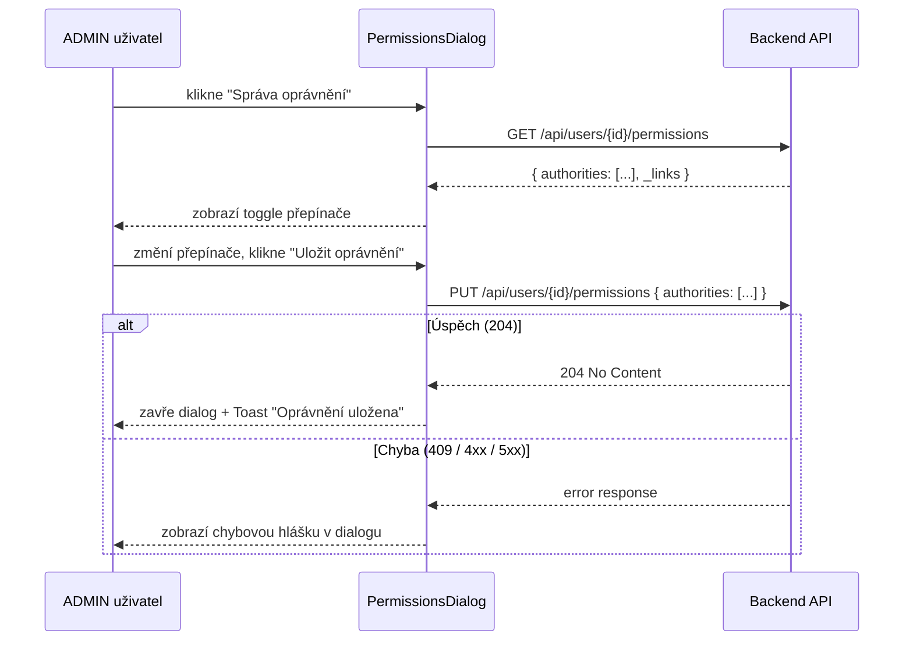

## Context

Frontend aplikace Klabis zobrazuje na stránce detailu člena tlačítko "Správa oprávnění" pouze ADMIN uživatelům (přítomnost tlačítka je řízena HATEOAS `permissions` linkem v member response). Tlačítko aktuálně funguje jako navigační link na URL. Backend API (`GET/PUT /api/users/{id}/permissions`) je hotové a vrací HATEOAS links včetně affordance pro PUT operaci.

Cílem je nahradit navigaci modálním dialogem, který zůstane v kontextu stránky detailu člena.

## Goals / Non-Goals

**Goals:**
- Otevřít modální dialog místo navigace při kliknutí na "Správa oprávnění"
- Zobrazit oprávnění jako toggle přepínače s českými popisky
- Načíst aktuální stav přes GET na URL z HATEOAS `permissions` linku
- Odeslat změny přes PUT na URL z HATEOAS affordance
- Zobrazit success Toast po uložení, chybu uvnitř dialogu při neúspěchu

**Non-Goals:**
- Žádné změny na backendu ani v API
- Přidávání nových oprávnění
- Unit/integration testy (volitelné)

## Decisions

### Modální dialog místo navigace na novou stránku

**Rozhodnutí:** Použít modální dialog (`Modal` komponenta) místo nové route/stránky.

**Důvod:** Správa oprávnění je kontextová akce k detailu člena — uživatel by měl zůstat na stránce. Pencil mockup tuto variantu potvrzuje. Nová route by navíc vyžadovala přidání routovacích pravidel a duplikovala by kontext člena.

**Alternativa:** Nová stránka `/members/{id}/permissions` — zamítnuto (zbytečná komplexita, přerušení kontextu).

### Přímé API volání přes `useAuthorizedQuery` / `useAuthorizedMutation`

**Rozhodnutí:** Dialog bude volat API přímo přes existující hooks (`useAuthorizedQuery`, `useAuthorizedMutation`), nikoliv přes HAL Forms systém.

**Důvod:** Backend pro permissions endpoint neimplementuje HAL+FORMS templates (`_templates`), pouze affordances v `_links`. Přímé volání je jednodušší a přímočařejší.

**Alternativa:** HalFormButton + HalFormDisplay — nevhodné, protože HAL Forms vyžadují `_templates` s definicí polí, která zde nejsou.

### URL z HATEOAS linku, nikdy hardcoded

**Rozhodnutí:** URL pro GET a PUT se vždy čte z HATEOAS `permissions` linku v member response.

**Důvod:** HATEOAS princip — frontend nesmí hardcodovat URL. Link je přítomen v member response pouze pokud má přihlášený uživatel `MEMBERS:PERMISSIONS` oprávnění.

## Risks / Trade-offs

**[Risk] Dialog se otevře bez dat (loading state)** → Zobrazit spinner dokud GET neskončí; tlačítko "Uložit" bude disabled během načítání.

**[Risk] Uživatel vidí seznam oprávnění bez kontextu (co dělají)** → Každé oprávnění bude mít český název a popis (viz Pencil mockup). Statický mapping v komponentě.

**[Risk] Admin lockout (409 Conflict)** → Zobrazit srozumitelnou chybovou hlášku uvnitř dialogu; dialog zůstane otevřený.

