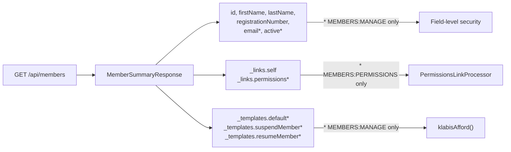

## Context

Seznam členů (GET /api/members) vrací minimální summary: id, firstName, lastName, registrationNumber. Každý item má pouze `_links.self`. Admin musí prokliknout na detail každého člena, aby viděl stav, email nebo mohl provést akce (suspend, permissions). Pencil design definuje rozšířený pohled s dalšími sloupci a akčními ikonami.

Existující vzory v kódu:
- Detail endpoint (`getMember`) již přidává affordances (suspendMember, resumeMember, updateMember) podmíněně podle stavu člena a autority
- `MemberPermissionsLinkProcessor` přidává `_links.permissions` na detail response pro uživatele s MEMBERS:PERMISSIONS
- Field-level security (Jackson `BeanSerializerModifier`) umožňuje skrytí polí podle autority uživatele
- Frontend používá `HalEmbeddedTable` s `TableCell` komponentami

## Goals / Non-Goals

**Goals:**
- Rozšířit member summary API response o email, active status a HATEOAS affordances
- Umožnit adminu provádět akce přímo ze seznamu členů (editace, oprávnění, suspend/resume)
- Dodržet HATEOAS princip — frontend zobrazuje akce jen na základě přítomných templates/links

**Non-Goals:**
- Sloupce Příspěvek a Zůstatek (data nejsou dostupná)
- Vyhledávání a filtrování v seznamu členů
- Nové API endpointy — využijí se existující (suspend, resume, permissions)

## Decisions

### 1. Field-level security pro email a active v summary

Email a active status se přidají do `MemberSummaryResponse` s `@HasAuthority(MEMBERS_MANAGE)` na record komponentách. Pro uživatele bez MEMBERS:MANAGE budou pole null (stávající `NullDeniedHandler` pattern).

**Alternativa**: Dva různé summary DTOs (jeden pro admina, jeden pro běžného uživatele). Zamítnuto — zbytečná komplexita, field-level security tento pattern již řeší.

### 2. Affordances na summary items — stejný pattern jako detail

`listMembers()` v controlleru přidá affordances na self link každého summary itemu stejným způsobem jako `getMember()` — podmíněně podle `member.isActive()` a `currentUser.hasAuthority(MEMBERS_MANAGE)`. Používá se `klabisAfford()` helper.

**Alternativa**: RepresentationModelProcessor pro summary items. Zamítnuto — controller má přímý přístup k `Member` entitě (zná `isActive()`), processor by musel zjišťovat stav jinak.

### 3. MemberPermissionsLinkProcessor rozšíření

Stávající processor zpracovává pouze `EntityModel<MemberDetailsResponse>`. Přidá se druhý processor (nebo generalizace) pro `EntityModel<MemberSummaryResponse>`, který přidá `_links.permissions` pro aktivní členy, pokud uživatel má MEMBERS:PERMISSIONS.

### 4. Frontend — akční ikony jako samostatná komponenta

Ikony v sloupci Akce se implementují jako inline elementy přímo v `MembersPage`. Každá ikona:
- Zobrazí se podmíněně podle přítomnosti příslušné HAL template/link
- Zastaví event propagaci (`stopPropagation`) při kliknutí
- Pencil: naviguje na editační stránku (React Router `navigate`)
- Shield: otevře `PermissionsDialog` (existující komponenta)
- User-x / User-check: použijí `HalFormButton` pro HAL Forms overlay

## Risks / Trade-offs

- **[Performance]** Přidání affordances na každý summary item zvyšuje velikost response a dobu zpracování (affordance resolution per item). → Mitigace: Stránkování omezuje počet items (max ~50), dopad bude minimální.
- **[Email GDPR]** Email v summary seznamu je citlivý údaj. → Mitigace: Field-level security zajistí, že email vidí jen MEMBERS:MANAGE uživatelé. Standardní uživatel uvidí null.
- **[Coupling]** `MemberPermissionsLinkProcessor` závisí na `MemberSummaryResponse` i `MemberDetailsResponse`. → Mitigace: Oba typy sdílejí `id()` a `active()` — generalizace přes interface nebo dva jednoduché processory.
