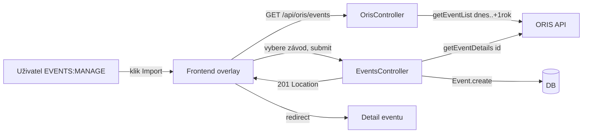

## Why

Ruční zadávání závodů do Klabis je zdlouhavé a náchylné k chybám — data jako název, datum a místo konání jsou dostupná v ORIS. Import umožní správcům vytvoření eventu z ORIS dat na jeden klik, čímž se eliminuje duplicitní práce.

## What Changes

- Nový endpoint `GET /api/oris/events` v `oris` modulu — vrací seznam budoucích závodů (dnes až +1 rok) dostupných k importu
- Nový endpoint `POST /api/events/import` v `events` modulu — vytvoří event v DRAFT stavu z ORIS dat
- `Event` agregát dostane interní nullable pole `orisId` (integer, unique) — slouží k detekci duplicitního importu a evidenci zdroje dat
- Import affordance v seznamu eventů — přítomna jen pokud je ORIS integrace aktivní

## Capabilities

### Modified Capabilities

- `events`: Import eventu z ORIS — nový endpoint, nové pole `orisId` na agregátu, 409 při duplicitním importu
- `oris` (nová veřejná API): Endpoint pro seznam budoucích ORIS závodů

## Impact

- `Event` agregát: nové interní pole `orisId` (nullable integer, unique DB constraint)
- DB migrace: přidání sloupce `oris_id` do tabulky `event`
- `events` modul volá `OrisApiClient` (cross-module dependency `events→oris`) — ORIS musí být aktivní (profil `oris`)
- Import affordance podmíněna přítomností ORIS integrace
- Po úspěšném importu frontend přesměruje na detail vytvořeného eventu (HTTP 201 + Location header)

