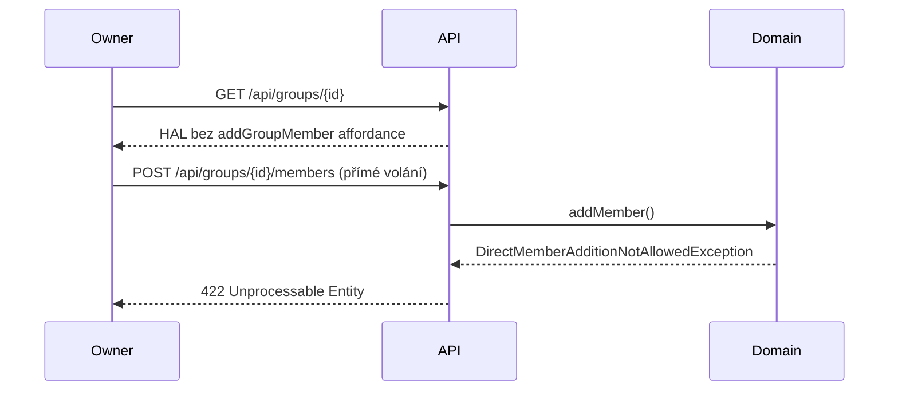

## Context

Volné skupiny (FreeGroup) implementují rozhraní `WithInvitations`, které definuje pozvánkový tok pro přidávání členů. Přesto existuje samostatný endpoint `POST /api/groups/{id}/members` umožňující přímé přidání člena bez pozvánky. Tento endpoint je dostupný všem ownerům skupiny a backend ani doménová vrstva ho pro `WithInvitations` skupiny nijak neomezují.

Frontend zobrazuje oba buttony vedle sebe ("Pozvat člena" + "Přidat člena"), přičemž jejich viditelnost je řízena dostupností HAL affordances v odpovědi serveru.

## Goals / Non-Goals

**Goals:**
- Zakázat přímé přidání člena pro skupiny implementující `WithInvitations`
- Odstranit `addGroupMember` affordance z HAL odpovědí pro `WithInvitations` skupiny
- Přidat doménovou ochranu jako pojistku při přímém API volání

**Non-Goals:**
- Migrace stávajících členství (H2 in-memory, žádná produkční data)
- Admin bypass — žádná výjimka pro elevated permissions
- Změny frontendu — button zmizí automaticky díky absenci HAL affordance

## Decisions

### Rozhodnutí 1: Kontrola na úrovni rozhraní, ne typu

Omezení se váže na `WithInvitations` rozhraní, ne konkrétně na `FreeGroup`. Jakákoliv budoucí skupina implementující `WithInvitations` získá stejné omezení automaticky.

_Alternativa: podmínka `instanceof FreeGroup` — zamítnuto, váže logiku na konkrétní typ místo kontraktu._

### Rozhodnutí 2: Dvouvrstvá ochrana

1. **HATEOAS vrstva**: `addGroupMember` affordance se nepřidá do HAL odpovědi pro `WithInvitations` skupiny — klient nedostane odkaz na nedovolenou akci
2. **Doménová vrstva**: `UserGroup.addMember()` vyhodí výjimku `DirectMemberAdditionNotAllowedException` pokud je skupina `WithInvitations`

_Alternativa: pouze HATEOAS — nedostatečné, přímé API volání by prošlo bez chyby._

### Rozhodnutí 3: Nová výjimka v doméně

Nová výjimka `DirectMemberAdditionNotAllowedException` (doménová) jasně vyjadřuje záměr a umožňuje přesné chybové hlášení na API vrstvě (HTTP 422 Unprocessable Entity).

## Risks / Trade-offs

- [Stávající testy volají `addMember()` přímo] → Testy pro `WithInvitations` skupiny bude třeba upravit nebo odstranit
- [Breaking change API pro přímé klienty] → Akceptovatelné — aplikace je v development fázi, žádní externí klienti
