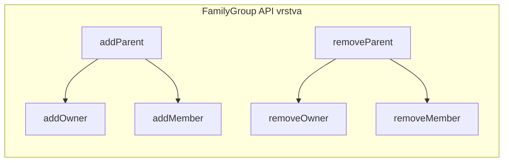

## Context

FamilyGroup aktuálně používá generický `UserGroup.owners` koncept. Při vytváření se přihlášený uživatel automaticky stává ownerem. V kontextu family group je přirozený termín "rodič" (parent) a tvůrce (admin) typicky rodičem není.

Aktuální stav:
- `FamilyGroup.CreateFamilyGroup(name, owner, initialMembers)` — single owner = authenticated user
- REST: `/api/family-groups/{id}/owners` pro správu vlastníků
- Response obsahuje `owners` pole
- `UserGroup` abstract class drží `Set<MemberId> owners` — sdíleno s TrainingGroup a FreeGroup

## Goals / Non-Goals

**Goals:**
- Přejmenovat "owner" na "parent" v kontextu FamilyGroup (API, response, frontend)
- Vyžadovat explicitní zadání rodičů při vytváření (min 1), tvůrce se nestává rodičem
- Parent = owner + member (přidání/odebrání rodiče automaticky spravuje obě role)

**Non-Goals:**
- Změna `UserGroup.owners` abstrakce — zůstává beze změny
- DB migrace — `user_group_owners` tabulka se nemění
- Změna cross-module API (`LastOwnershipChecker`, `FamilyGroupProvider`)
- Změna chování pro TrainingGroup nebo FreeGroup

## Decisions

### 1. Parent jako sémantická vrstva nad owner + member

FamilyGroup přidá metody `addParent`/`removeParent`, které interně delegují na `addOwner` + member management. `UserGroup.owners` zůstává beze změny.

**Alternativa:** Zavést samostatný `parents` set v FamilyGroup odděleně od `owners`. Zamítnuto — zbytečná duplikace, parent je vždy owner.

### 2. CreateFamilyGroup command přijímá Set parentů

Nový tvar: `CreateFamilyGroup(name, parents: Set<MemberId>, initialMembers: Set<MemberId>)` kde `parents` je povinný s min 1 prvkem. Parents se automaticky přidají i jako members.

**Alternativa:** Nechat single `owner` a přidat parents jako separátní koncept. Zamítnuto — parent a owner jsou totéž v kontextu family group.

### 3. REST API přejmenování jen na úrovni FamilyGroupController

- `POST /api/family-groups` — request: `{ name, parentIds, memberIds }`
- `POST /api/family-groups/{id}/parents` — přidání rodiče (místo `/owners`)
- `DELETE /api/family-groups/{id}/parents/{memberId}` — odebrání rodiče
- Response: `parents` pole místo `owners`

Ostatní group typy (TrainingGroup, FreeGroup) si ponechají `/owners` terminologii.

### 4. Odebrání parenta = úplný odchod ze skupiny

Když je parent odebrán, odchází i jako member. Důvod: parent je primární role v family group, degradace na běžného člena nedává v rodinném kontextu smysl.

Zachován last-parent check (min 1 parent musí existovat) — deleguje na existující `UserGroup.isLastOwner()`.

### 5. Správa family group výhradně přes MEMBERS:MANAGE

Aktuálně může owner skupiny přidávat/odebírat další ownery. Pro family group se toto mění — veškerá správa (parents i members) vyžaduje `MEMBERS:MANAGE` oprávnění. Parent sám nemá žádné management akce.

- `addOwnerToGroup` → `addParentToFamilyGroup` (vyžaduje MEMBERS:MANAGE, ne owner check)
- `removeOwnerFromGroup` → `removeParentFromFamilyGroup` (vyžaduje MEMBERS:MANAGE, ne owner check)
- Obecné owner metody pro ostatní typy skupin zůstávají s owner-based autorizací
- Frontend: HAL affordance pro add/remove parent se zobrazí jen uživatelům s MEMBERS:MANAGE

### 6. Frontend — minimální změny

- `FamilyGroupDetailPage`: sekce "parents" místo "owners", HAL template názvy
- `FamilyGroupsPage`: create modal s `parentIds` polem místo automatického owner assignment
- Labels: "Rodiče" místo "Vlastníci" pro family group kontext

## Risks / Trade-offs

**Dualita owner/parent terminologie** — Interně je parent = owner, ale navenek se pro FamilyGroup používá "parent". Může být matoucí při debugování. → Mitigace: komentář v FamilyGroup doméně vysvětlující mapování.

**Exclusive membership validace pro parents** — Parents musí projít stejnou exclusive membership validací jako members. Aktuální `validateNoExistingFamilyGroup` se aplikuje na owner, to zůstává. → Nízké riziko, stávající validace pokrývá.
