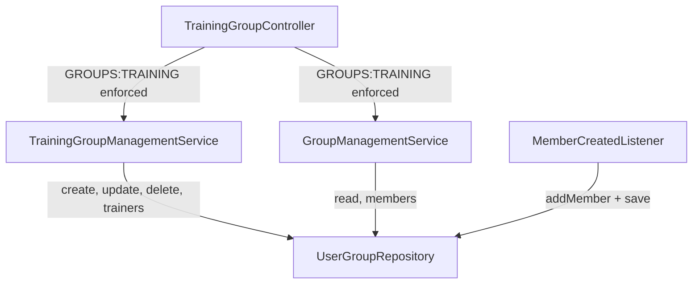
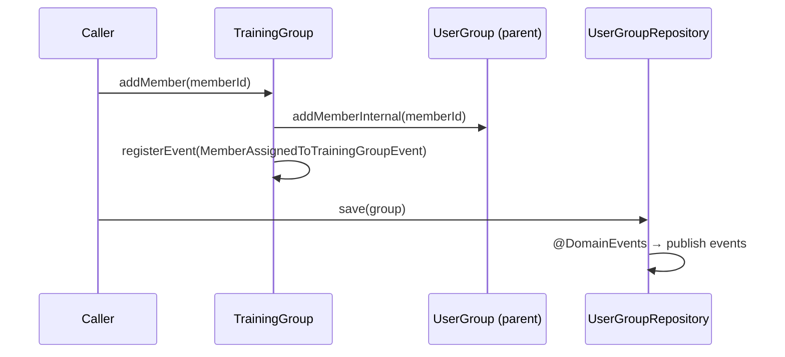

## Context

TrainingGroup extends UserGroup which uses the generic "owner" concept. For training groups, the domain language is "trainer" (trenér). Currently:

- Group creation auto-assigns the creating user as owner — but the creator (admin with `GROUPS:TRAINING`) is not necessarily a trainer
- Name and age range are edited via two separate endpoints
- `MemberAssignedToTrainingGroupEvent` is published from `MemberCreatedListener` (infrastructure), not from the aggregate
- `UserGroupMemento` lacks `@DomainEvents` delegation, so aggregate-registered events are never published
- Authorization uses owner-based checks (`requireOwner`) mixed with permission checks (`requireTrainingAuthority`) — for training groups, all operations should use `GROUPS:TRAINING` permission only

## Goals / Non-Goals

**Goals:**

- Use "trainers" terminology in TrainingGroup API while keeping internal "owners" in UserGroup unchanged
- Require explicit trainer assignment at group creation (not auto-assign creator)
- Merge edit operations into a single PATCH endpoint with `PatchField` semantics
- Move domain event creation into the TrainingGroup aggregate
- Replace owner-based authorization with `GROUPS:TRAINING` permission for all TrainingGroup operations

**Non-Goals:**

- Changing FreeGroup or FamilyGroup authorization model
- Adding trainer-specific permissions (future work)
- Validating that trainer MemberIds reference existing members

## Decisions

### D1: Trainers as API-layer alias for owners

TrainingGroup internally stores trainers as `owners` in UserGroup. The mapping happens at two boundaries:

- **API layer**: TrainingGroupController exposes `/trainers` URLs and `trainers` JSON fields instead of `/owners` and `owners`
- **Domain layer**: TrainingGroup provides `getTrainers()` which delegates to `getOwners()`, and trainer-specific methods (`addTrainer`, `removeTrainer`, `replaceTrainers`) that delegate to owner operations

**Why over renaming the field in UserGroup**: Other group types (FreeGroup, FamilyGroup) use "owner" semantics correctly. Renaming the base class field would create a misleading abstraction.

### D2: Separate TrainingGroupManagementService

Create `TrainingGroupManagementService` for training group-specific operations (create, update, delete, trainer management). This service uses `GROUPS:TRAINING` permission checks instead of owner-based checks.

Shared read operations (`getTrainingGroup`, `listTrainingGroups`) and member operations (`addMemberToGroup`, `removeMemberFromGroup`) that are still used by other callers (e.g., `MemberCreatedListener`) remain in `GroupManagementService` but with the owner-based authorization check removed for TrainingGroup — the controller enforces `GROUPS:TRAINING` permission before calling the service.



**Why over conditional logic in GroupManagementService**: Keeps authorization model clean — TrainingGroup operations don't need if/else on group type. GroupManagementService stays focused on shared operations.

### D3: Merged PATCH endpoint with PatchField

Single `PATCH /api/training-groups/{id}` endpoint replaces both rename and age range update. Request uses `PatchField` for all optional fields:

```
UpdateTrainingGroupRequest:
  - name: PatchField<String>
  - minAge: PatchField<Integer>
  - maxAge: PatchField<Integer>
  - trainers: PatchField<List<UUID>>
```

**Age range handling**: `minAge` and `maxAge` are validated together — if either is provided, both must be provided (partial age range update is not meaningful). This is validated in the service layer.

**Trainers handling**: When provided, replaces the entire trainer list. Minimum 1 trainer is validated in the domain (via `replaceTrainers` method on TrainingGroup).

**Atomicity**: All changes apply in a single transaction. If any validation fails (age range overlap, empty trainers list), the entire request is rejected.

### D4: Domain event in TrainingGroup.addMember() override

TrainingGroup overrides `addMember()` to call `registerEvent(MemberAssignedToTrainingGroupEvent)` after adding the member:



**Prerequisites**:
- `UserGroupMemento` must add `@DomainEvents` delegation (same pattern as `MemberMemento`, `EventMemento`)
- `UserGroupMemento.from()` must carry over the aggregate reference so events can be delegated
- `MemberCreatedListener` removes manual event publishing — events are now published automatically on save

### D5: Create command takes single trainer (MemberId)

`CreateTrainingGroup` command changes from `(name, owner, ageRange)` to `(name, trainer, ageRange)`. The parameter name changes for clarity but the internal storage remains as `owners`.

The `CreateTrainingGroupRequest` DTO adds a `trainerId` (UUID) field. The controller no longer passes `currentUser.memberId()` as the owner.

## Risks / Trade-offs

**[Risk] Multiple events on bulk auto-assign** → When creating a training group, auto-assign may add many members, each triggering a `MemberAssignedToTrainingGroupEvent`. Currently no consumers exist for this event, so no immediate impact. If consumers are added later, they should handle batch scenarios gracefully.

**[Risk] Age range partial update ambiguity** → Sending only `minAge` without `maxAge` could be confusing. Mitigated by validating that both must be provided together, returning a clear error.

**[Risk] Breaking API changes** → All TrainingGroup endpoints change (URLs, request/response shapes). Frontend must be updated simultaneously. Mitigated by the fact that this is a development-phase application with no external consumers.

**[Trade-off] Trainer ≠ owner in domain language but = owner in code** → May cause confusion for future developers. Mitigated by clear naming in TrainingGroup methods (`getTrainers`, `addTrainer`) and keeping the delegation explicit.
