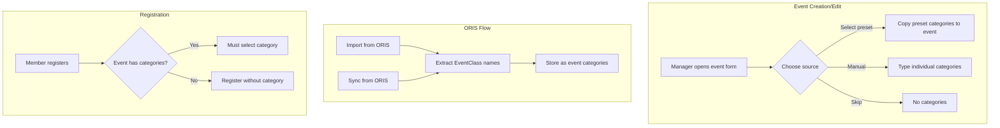

## Context

Events in Klabis currently store basic metadata (name, date, location, organizer, etc.) but lack information about which race categories are available. In orienteering, categories (e.g., M21, W35, D10) define age/gender groups that participants compete in. This information is essential for event communication and will be required for category-based registration in a future phase.

ORIS (the Czech orienteering information system) provides category data as "EventClass" entries for each event. The current ORIS import only pulls basic event metadata and ignores class/category information.

## Goals / Non-Goals

**Goals:**
- Store categories as a simple list of names on each event
- Allow manual category editing by event managers
- Import categories from ORIS during event import
- Provide manual "Sync from ORIS" action to re-fetch event data
- Provide reusable category presets that managers can apply to events
- Display categories on event detail page
- Require category selection during event registration

**Non-Goals:**
- Rich category model (distance, climbing, controls, fee) — only names for now
- Automatic/scheduled ORIS synchronization — only manual sync triggered by user
- Smart merge during ORIS sync — ORIS data overwrites local data completely
- Conflict resolution UI for sync — deferred to future phase ("suggestion" mode)
- Ordered categories — treated as unordered set for now

## Decisions

### Categories stored as `List<String>` on Event aggregate

Categories are simple string names (e.g., "M21", "W35"). No separate Category entity or value object.

**Why:** Categories at this stage are purely informational labels. There's no business logic attached to individual categories (no age validation, no fee calculation). A flat list of strings is the simplest model that satisfies all Phase 1 requirements.

**Alternative considered:** Dedicated Category value object with name + metadata. Rejected because no metadata is needed yet. Can be introduced later if requirements change.

### Persistence as comma-separated VARCHAR column

Categories stored as comma-separated string in a single `categories VARCHAR(2000)` column on the events table.

**Why:** Spring Data JDBC `@MappedCollection` requires a separate table with key/ID columns — excessive infrastructure for a flat list of short strings. A single column with string conversion in the Memento layer is simpler and sufficient for the expected data volume (typically 10-30 categories per event).

**Alternative considered:** Separate `event_categories` join table. Rejected because it adds persistence complexity without benefit — categories don't have identity, aren't queried independently, and aren't referenced by other entities.

### ORIS categories extracted from EventClass.name

When importing/syncing from ORIS, categories are extracted from the `EventDetails.classes` map by taking each `EventClass.name` value.

**Why:** The `name` field contains the human-readable category identifier (e.g., "M21", "H55") which matches what users expect to see. The `id` field is an ORIS internal identifier that may not be meaningful.

### Sync from ORIS overwrites all event data

The sync action re-fetches the complete event from ORIS and overwrites all local fields including categories. No merge or conflict resolution.

**Why:** User explicitly decided "ORIS wins" for the initial version. This is the simplest approach and matches the mental model of "refresh from source". Conflict resolution ("suggestion" mode) is planned for a future phase.

### Category presets as a simple entity

Category presets are a lightweight entity with a name and a list of category strings. Managed via a dedicated page accessible to EVENTS:MANAGE users. When applied to an event, the preset's categories are **copied** — there is no ongoing link between preset and event.

**Why:** Presets are a convenience feature for quickly populating event categories. A copy-on-apply model means changing a preset doesn't unexpectedly affect existing events.

### Registration requires category selection

When registering for an event, the member MUST select one of the event's declared categories. The selected category is stored on the EventRegistration. If an event has no categories defined, registration proceeds without category selection (backward compatibility).

**Why:** Category selection is the primary business driver for this feature. Validating against the event's category list ensures data consistency.

## Risks / Trade-offs

**[Risk] Comma-separated storage limits querying** → Acceptable trade-off. Categories are not independently queried. If future requirements need "find events with category X", migrate to a join table then.

**[Risk] ORIS sync overwrites manual edits without warning** → Mitigated by requiring explicit user action (button click). Future phase adds "suggestion" mode with diff review.

**[Risk] ORIS sync removes a category that has registrations** → Logged as WARN. Future phase adds notification to registration manager. Registration data preserved (stores category name as string, not a reference).

**[Risk] Category name inconsistency (e.g., "M21" vs "m21" vs "M 21")** → Accepted for Phase 1. Presets help standardize. Future phase could add normalization.
