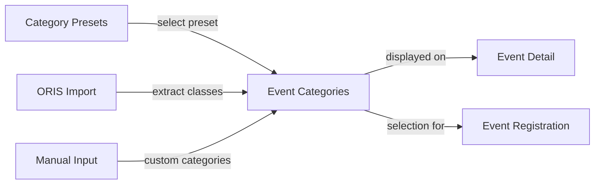

## Why

Orienteering events need to declare which race categories (age/gender classes like M21, W35, D10) are available. Without this information, members cannot know which categories are open for registration, and event managers cannot communicate the event structure. This is also a prerequisite for allowing members to select a category when registering for an event.

## What Changes

- Event aggregate gains a `categories` field (`List<String>`) storing names of available race categories
- EVENTS:MANAGE users can define categories when creating or editing an event
- Categories are imported from ORIS when importing an event (extracted from ORIS EventClass data)
- New "Sync from ORIS" action allows EVENTS:MANAGE users to re-fetch event data from ORIS, overwriting local data including categories
- Categories are displayed on the event detail page
- Event registration requires selecting a category from the event's available categories
- A global "category preset" management allows EVENTS:MANAGE users to define reusable sets of categories (e.g., "Standard OB", "Sprint") that can be applied to events

## Capabilities

### New Capabilities
- `event-categories`: Event category management — storing, editing, displaying, and importing categories on events. Includes ORIS sync for re-fetching event data.
- `category-presets`: Global category preset management — CRUD for reusable named sets of categories that can be applied to events.

### Modified Capabilities
- `events`: Event aggregate extended with `categories` field. Create/update commands accept categories. ORIS import extracts categories. New sync-from-ORIS action.
- `event-registrations`: Registration now requires selecting a category from the event's available categories.

## Impact

- **Backend domain:** Event aggregate, commands, domain events, persistence (new DB column)
- **Backend API:** Event DTOs, EventController (new sync endpoint + affordance), EventRegistrationController (category in registration)
- **ORIS integration:** Category extraction from EventDetails.classes, new sync method
- **Frontend:** Event detail page (categories display), event form (categories editing), registration form (category selection), new category presets management page
- **Database:** New column on events table, new table for category presets, modified event_registrations table
