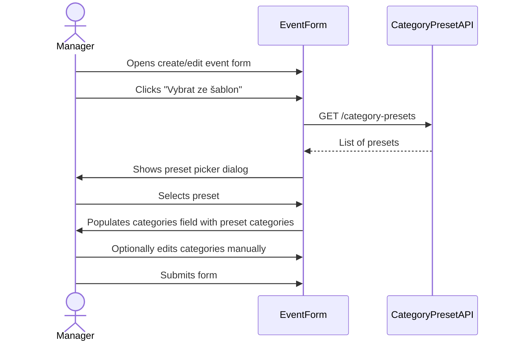

## Context

Akce ve stavu DRAFT zobrazují sekci přihlášek a odkaz na seznam přihlášek na stránce detailu. Přihlašování je ale definováno pouze pro ACTIVE akce — sekce přihlášek v DRAFT stavu proto není smysluplná a matou uživatele.

Formulář pro vytvoření a editaci akce umožňuje zadání kategorií pouze ručně (textový vstup). Existuje modul Category Presets, který obsahuje předdefinované šablony kategorií, ale formulář akce tyto šablony nenabízí. Správce musí kategorie opisovat ručně, což je nepohodlné a náchylné k chybám.

## Goals / Non-Goals

**Goals:**
- Detail akce ve stavu DRAFT nezobrazuje sekci přihlášek ani odkaz na přihlášky
- Formulář vytvoření/editace akce umožňuje vybrat kategorie z existujících Category Presets jako alternativu k ručnímu zadání

**Non-Goals:**
- Změna pravidel pro přihlašování samotné
- Automatická aplikace presetů bez potvrzení uživatelem
- Správa Category Presets (vytváření, editace presetů) — to je samostatná funkce

## Decisions

### Skrytí přihlášek u DRAFT akcí — HAL link podmíněný stavem

Frontend zobrazuje sekci přihlášek a odkaz na přihlášky podmíněně na základě přítomnosti HAL linku z backend API. Nejčistší řešení: backend nevyrací HAL link na přihlášky pro akce ve stavu DRAFT.

Rozhodnutí: podmínit HAL link `event-registrations` (příp. `self` na registrace) stavem akce — link je vrácen pouze pro ACTIVE, FINISHED akce. Frontend pak sekci přihlášek automaticky skryje, protože link chybí.

Alternativa — skrytí pouze na frontendu: zamítnuto, protože backend by pak stále umožňoval přístup k přihláškám pro DRAFT akce přímým API voláním. HAL-link driven přístup je konzistentní s architekturou projektu.

### Výběr kategorií z Category Presets — inline akce ve formuláři

Do formuláře akce (vytvoření/editace) přidat tlačítko "Vybrat ze šablon", které otevře výběr existujících Category Presets. Po výběru presetu se jeho kategorie vloží do pole kategorií (přepíší aktuální hodnotu). Uživatel může pole dále upravit ručně.

Rozhodnutí: preset slouží jako zkratka pro vyplnění pole kategorií, nikoli jako pevná vazba — akce tak zůstává nezávislá na presetu po aplikaci.

## Risks / Trade-offs

- [Risk] Skrytí HAL linku pro DRAFT může způsobit regrese, pokud existuje jiný kód spoléhající na přítomnost linku i pro DRAFT → Mitigation: přidat testy pro DRAFT stav do backend API testů
- [Risk] Category Presets mohou být prázdné (žádné šablony neexistují) → Mitigation: tlačítko "Vybrat ze šablon" zobrazit pouze pokud existují nějaké presety (podmíněno HAL linkem na presety)
