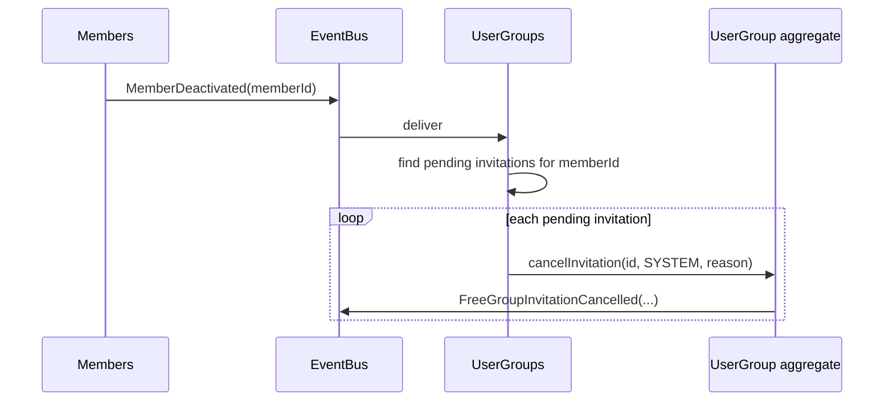

## Context

Free groups are invitation-based groups in the `user-groups` capability. Today the `Free Group Invitation System` supports: invite, accept, reject, re-invite after rejection, with a "no duplicate pending" guard. A pending invitation can only disappear today by being accepted, rejected, or by deleting the entire free group.

GitHub issue #241 asks for an explicit "cancel pending invitation" action, available to group owners, with optional reason and notifications for invitee + other owners. See `proposal.md` for the full motivation and the resolved open questions.

Existing domain shape (from the `user-groups` spec and members-module code):
- `UserGroup` aggregate (free-group flavor) owns the `FreeGroupInvitation` collection.
- Invitation has a `status` enum with values `PENDING`, `ACCEPTED`, `REJECTED`.
- Ownership operations (`addOwner`, `removeOwner`) exist; "only owner can invite" check is enforced on the aggregate.
- Member deactivation/suspension emits a domain event in the members module (used today for "last owner deactivation" warning).

This change extends the invitation lifecycle with a `CANCELLED` state and adds two triggers for that transition: explicit cancel by a current owner, and automatic cancel when the invitee is deactivated/suspended.

## Goals / Non-Goals

**Goals:**

- A current group owner can cancel any `PENDING` invitation they own, optionally providing a free-form reason.
- Cancelled invitations are retained as audit records (`CANCELLED` status, cancelled_at, cancelled_by, reason).
- Re-invitation of a cancelled invitee is allowed — same semantics as re-invite after reject.
- Pending invitations owned by a member who gets deactivated/suspended are auto-cancelled as a side effect of the deactivation event.
- A domain event `FreeGroupInvitationCancelled` is emitted, carrying enough context for a future notification pipeline (invitee, group, actor, reason, recipient-owner-ids).

**Non-Goals:**

- Actual notification delivery. The domain event is emitted; wiring it to the notification-service is deferred to a follow-up GH issue (notification-service capability does not yet exist).
- Bulk cancellation UI. Single invitation cancel only.
- Search on the invited-members list. The list stays as-is.
- Cancellation of `ACCEPTED` or `REJECTED` invitations. Attempting this is an error.
- Author-only cancellation rule. The original inviter has no privilege beyond their current ownership.

## Decisions

### D1. Invitation status gains `CANCELLED`; soft transition (not hard delete)

Current invitation persistence retains `ACCEPTED` and `REJECTED` rows for history. `CANCELLED` follows the same pattern: the row stays, `status` moves to `CANCELLED`, audit columns are populated.

Alternative considered: hard-delete the row. Rejected because it loses the audit trail and makes "was this invitee ever invited?" queries unanswerable.

**Data impact:** enum gets one new value (code-side + DB migration if the column is an enum/text check); three new columns on the invitation row (`cancelled_at`, `cancelled_by`, `cancellation_reason`). All nullable — only populated on the cancellation path.

### D2. Authorization: "current owner" at the moment of the cancel call

The proposal's Q1 was resolved as: any current owner may cancel, regardless of who originally sent the invitation. The original inviter gains no special right; if they were removed as owner, they can no longer cancel invitations they created.

Rationale: the spec already says "only owners invite". Ownership is the unit of authority over the invitation collection. Tracking "author has cancel right even after losing ownership" would require stable inviter identity and complicate authorization — not worth it for a negligible real-world case.

**Where enforced:** in the aggregate operation `UserGroup.cancelInvitation(invitationId, actor, reason)`. The aggregate verifies the actor is in the current `owners` set.

### D3. Only `PENDING` can be cancelled

`ACCEPTED`, `REJECTED`, or already-`CANCELLED` invitations reject the cancel call with a domain exception. The REST layer translates this to `409 Conflict` (state precondition violated).

### D4. Auto-cancel on invitee deactivation via domain event listener

Members module already emits a `MemberDeactivated` (or equivalent — actual name to be confirmed during implementation) domain event. The `user-groups` module adds an event listener that:

1. Finds all `PENDING` free-group invitations with `invitee = deactivatedMemberId`.
2. For each, calls the same `cancelInvitation` operation with `actor = SYSTEM` and a synthetic reason like "Member was deactivated".

This uses the same cancel path as manual cancel, so the `FreeGroupInvitationCancelled` event is still emitted (downstream notification listeners see a uniform signal). Actor is modeled as `SYSTEM` — no notification is sent to the deactivated invitee (they no longer have an active user).

Alternative considered: direct DB-level cascade. Rejected — bypasses domain invariants and skips the event emission.

### D5. Domain event payload

`FreeGroupInvitationCancelled` carries:

- `groupId`
- `invitationId`
- `inviteeMemberId`
- `actor` (MemberId or `SYSTEM`)
- `reason` (optional)
- `recipientOwnerIds` — computed at emit time as "all current owners except the actor" (empty if actor is SYSTEM and all owners should be notified — see alt below)
- `cancelledAt`

The recipient list is baked into the event at emit time rather than recomputed downstream. Rationale: ownership can change between emit and delivery; the authoritative "who should be told" is the owner set at cancel time.

For the SYSTEM-actor case (auto-cancel), `recipientOwnerIds` is "all current owners" — there is no human actor to exclude.

Alternative considered: event carries only ids, notification listener recomputes recipients. Rejected — couples the listener to aggregate state and makes the event harder to replay.

### D6. REST surface — `DELETE` on a subresource, optional reason in body

Endpoint: `DELETE /api/groups/{groupId}/invitations/{invitationId}` with an optional JSON body `{ "reason": "..." }`.

HAL+FORMS: each pending-invitation row in the `Free Group Detail View` representation gains an `affordance` for the cancel action, visible only to current owners. The affordance's form declares the optional `reason` field so the frontend renders the modal automatically.

Alternative considered: `POST /.../invitations/{id}/cancel`. Rejected — cancellation maps cleanly to DELETE semantics (the pending invitation resource is being removed from the "active" view), and the soft-delete status transition is an implementation detail. Using `DELETE` also lets the existing HATEOAS framework's "delete affordance" conventions apply.

### D7. Reason field: free-form text, length-bounded

`reason` is a free-form string (max 500 chars), nullable. No structured enum — the issue leaves it open, and `finance/cancellation_reason` precedents in this codebase use free text too.

### D8. Frontend: single-item modal, no bulk

The "Zrušit pozvánku" button sits on each pending-invitation row. Clicking opens a confirmation modal with an optional `reason` textarea. Confirm submits the DELETE; cancel closes the modal. No multi-select, no select-all.

## Risks / Trade-offs

- **Race: two owners cancel the same invitation simultaneously** → optimistic locking on the invitation row (aggregate version check). Second cancel sees the row already `CANCELLED` and returns the "only PENDING can be cancelled" error. Acceptable — second caller sees a clear state-mismatch response.

- **Risk: event-listener cancel fails for one of N invitations during member deactivation** → the listener processes invitations individually and logs failures. A failure on one invitation should not block deactivation of the member or cancel of the others. We accept eventual inconsistency in the (rare) listener-error path; operator can re-cancel manually.

- **Risk: domain event emitted but no downstream consumer yet** → by design. The event is the integration seam; the follow-up GH issue wires it to the notification-service once that capability is added. Until then, `FreeGroupInvitationCancelled` is published to an empty listener set, which is a no-op.

- **Trade-off: recipient list snapshotted at emit time** → if ownership changes between cancel and notification delivery, the notification may go to someone who is no longer an owner (or miss a newly-added owner). Accepted because the alternative (recompute at delivery time) couples listener to aggregate state.

- **Trade-off: `SYSTEM` as actor sentinel** → the MemberId type needs to accommodate or the actor field needs a discriminated union. Simplest path: actor is `Optional<MemberId>` where `empty` means SYSTEM. Implementation choice left to the backend task phase.

## Migration Plan

1. DB migration: add `cancelled_at`, `cancelled_by`, `cancellation_reason` columns to the invitation table (nullable). Extend the status column to accept `CANCELLED` (enum alter or check-constraint update depending on the chosen DB type).
2. Deploy aggregate + REST changes. No backfill needed — existing invitations stay in their current status.
3. Deploy listener for `MemberDeactivated` as part of the same release.
4. Frontend: add cancel affordance handling + modal. Safe to deploy in any order because the affordance is HAL-driven — the UI renders the button only when the backend sends the affordance.

Rollback: the REST endpoint and affordance can be disabled by feature flag or code-revert; cancelled invitations stay in the DB as audit rows and do not break older code (CANCELLED rows are excluded from "pending" queries). The new columns are nullable and harmless if the code reverts.

## Open Questions

None blocking. Resolved during the proposal refinement — see `proposal.md` § Open Questions.
