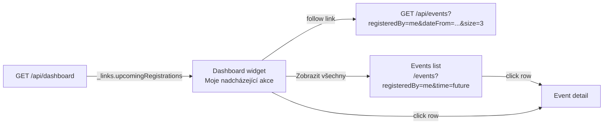

## Context

The filter-bar slice of issue #88 shipped as `gh-88-events-list-filters` (archived 2026-04-24). Members can now go to the events list, flip the "Moje přihlášky" toggle, and see only events they are registered to.

What remains is a discoverability gap: on first login a member lands on the home dashboard, not the events list. The `UserDashboard` (for non-admin users) already renders a "Moje nadcházející akce" section, but it is populated from `mockMyEvents` in `frontend/src/pages/dashboard/mockDashboardData.ts`. An admin lands on `AdminDashboard` which has an "Upcoming events" section also backed by mock data, but that widget reflects the *club's* upcoming events, not the admin's own registrations — and is out of scope for this change.

The events list endpoint already answers the *data* question. `GET /api/events?registeredBy=me&dateFrom=<today>&sort=eventDate,ASC&size=N` returns exactly the payload the widget needs. What is missing is a **contract surface** the frontend can use to discover whether this widget applies to the current user at all, without hard-coding rules like "show it if `user.memberId != null`" on the client.

The existing root endpoint `GET /api/` is already committed to one job: driving the main navigation menu (per `application-navigation` spec). Overloading it with dashboard-specific links would conflate two concerns — menu entries and dashboard widgets — on one resource. A dedicated `GET /api/dashboard` resource gives the dashboard its own hypermedia surface: today it carries one link, later it grows with more widgets, each one discovered and gated purely by its own link.

## Goals / Non-Goals

**Goals:**

- Introduce `GET /api/dashboard` as the hypermedia root for dashboard widgets. Currently exposes a single link `upcomingRegistrations` pointing at the pre-built events-list query for the current user.
- Drive widget visibility on the frontend from the presence of the link on `/api/dashboard`, not from client-side rules about member profiles or permissions.
- Replace `mockMyEvents` with live data fetched by following the `upcomingRegistrations` link.
- Keep the widget compact (3 items, nearest first) with a "Zobrazit všechny" link that routes to the events list with `Moje přihlášky` pre-applied.
- Handle the empty state gracefully (link present, zero events returned) with the existing `labels.dashboard.noUpcomingEvents` copy plus a discovery CTA.
- Amend `openspec/specs/events/spec.md` with a requirement covering the dashboard widget surface.

**Non-Goals:**

- A `dashboard` bounded context or a `dashboard` OpenSpec capability. `/api/dashboard` is a **UI-support resource** — a hypermedia index of widgets — not a business capability. Each widget's data still comes from its owning capability (`events`, later `calendar-items`, etc.).
- An aggregated endpoint that returns all widget payloads in one response. Each widget fetches its own data via its own link; the dashboard resource only advertises *which* widgets apply.
- Admin dashboard changes. `AdminDashboard` renders non-personal previews; out of scope.
- Proxy registrations (issue #54). `registeredBy=me` is forward-compatible; no extra work here.
- A dedicated `/moje-prihlasky` frontend page. The events list with the toggle is the authoritative surface; the widget is a shortcut.
- Stats cards, "Další závody" tiles, or any widget not named here.

## Decisions

### New resource `GET /api/dashboard` is a HAL index of widget links, not a data aggregator

The backend adds one new controller endpoint at `/api/dashboard` that returns a HAL resource whose `_links` describe the widgets applicable to the current user. The response body carries no widget payload — just links.

```json
{
  "_links": {
    "self": { "href": "/api/dashboard" },
    "upcomingRegistrations": {
      "href": "/api/events?registeredBy=me&dateFrom=2026-04-24&sort=eventDate,ASC&size=3"
    }
  }
}
```

Today there is exactly one widget link (`upcomingRegistrations`). As dashboard grows, new widget links are added via the same postprocessor pattern used for root navigation links (`MemberPermissionsLinkProcessor`, etc.) — each owning module contributes its own link when the current user qualifies.

**Alternatives considered:**

- Put the `upcomingRegistrations` link on `GET /api/` alongside navigation links. Rejected: `/api/` is the navigation menu contract per `application-navigation` spec, and its postprocessors are filtered by "is this a navigable destination?" — a dashboard widget is not a destination. Overloading `/api/` would force client code to distinguish menu links from widget links by name, which is brittle.
- Put the link inside the `events` capability response (e.g. on `/api/events` itself as `upcomingRegistrationsForMe`). Rejected: the dashboard widget is an orthogonal surface; a user viewing `/events` does not need a link back to "my upcoming registrations on the dashboard". Discovery is wrong direction.
- An aggregated `GET /api/dashboard` that returns all widget *payloads* embedded. Rejected: creates a god-endpoint that has to be changed every time any widget changes, forces per-widget DTOs into a shared schema, and loses HAL's incremental-fetch benefit. Keeping the dashboard as a pure link index and deferring data fetches to the widget-specific endpoints means widgets evolve independently.

**Consequence:** The dashboard resource is small, static in shape, and easy to extend. Frontend treats it like any other HAL resource: fetch once, render widgets conditionally on link presence.

### Widget visibility is driven by link presence, not by client-side rules

The frontend's `UserDashboard` fetches `/api/dashboard` on mount. For each widget it renders, the check is simply:

```ts
const upcomingRegistrationsHref = getLinkHref(dashboard, 'upcomingRegistrations');
if (upcomingRegistrationsHref) {
  // render "Moje nadcházející akce" widget, fetch from upcomingRegistrationsHref
}
```

Backend decides who gets the link. Initial rule: present the link to any authenticated user who has a member profile (i.e. the authenticated user's `memberIdUuid` claim is populated). Users without a member profile do not get the link; the widget disappears from their dashboard with no client-side branching.

**Alternatives considered:**

- Gate the widget in the client on `user.memberId != null`. Rejected: duplicates authorization logic on the client, drifts over time, and makes it harder to extend (e.g. hiding the widget for suspended accounts would require touching the client).
- Always emit the link and let the widget show an empty state. Rejected: a user with no member profile can never have registrations; showing an empty widget is noise. The backend owns the applicability decision cleanly.

### The `upcomingRegistrations` link points at `/api/events` with pre-baked query parameters

The link's `href` is the ready-to-fetch events-list URL with `registeredBy=me`, `dateFrom=<today>`, `sort=eventDate,ASC`, and `size=3` already set. The client does not construct this URL — it follows it verbatim.

```
/api/events?registeredBy=me&dateFrom=2026-04-24&sort=eventDate,ASC&size=3
```

`dateFrom=<today>` is computed server-side at link-build time. This is acceptable because the dashboard resource is a per-request response; the value reflects "today" from the server's perspective at fetch time, which is what the widget wants.

**Alternatives considered:**

- Omit `dateFrom` and let the frontend pass it. Rejected: forces the client to duplicate "today" logic, and `me` + unrestricted date range would also match past registrations, which is not what the widget shows. Pre-baking the query parameters makes the link a complete, self-contained query.
- Use a HAL-Forms template instead of a plain link, letting the client fill in `size`. Rejected: the widget has a fixed page size; no client flexibility is required; a plain link is lighter.

### Widget's "Zobrazit všechny" button routes to the events list with `Moje přihlášky` pre-applied

The button at the bottom of the widget navigates the SPA to `/events?registeredBy=me&time=future`. This keeps the widget honest: it is a shortcut into the existing filtered events list, not a parallel UI.



The "Zobrazit všechny" target is a frontend route, not an API link, because it navigates to a SPA page; the widget's data link is a separate concern.

### Fetch on mount, no background refresh

Use TanStack Query defaults (`refetchOnWindowFocus: false`, `retry: 1`) for both the `/api/dashboard` fetch and the `upcomingRegistrations` follow-up. The dashboard is not a monitoring screen. Registration-mutation query-invalidation logic (already in place for event registration flows) invalidates the widget query, so a member who registers elsewhere in the UI sees the widget refresh on next navigation to the dashboard.

### Empty state: link present, zero events returned

When `/api/dashboard` returns the link but `/api/events?registeredBy=me&...` returns an empty page, the widget renders `labels.dashboard.noUpcomingEvents` plus a secondary CTA linking to the unfiltered events list (wording: *"Prohlédnout nadcházející akce klubu"*). Converts a dead-end empty state into a discovery path.

### Widget item count: 3

Three rows fit the dashboard visual rhythm without dominating the page. A member typically has a handful of future registrations at any time; three is enough to answer "am I signed up for the next weekend?" at a glance. Overflow is handled by "Zobrazit všechny".

### Widget columns: event name, location, event date — nothing else

Match existing mock rendering. No category badge, no SI card number, no registration timestamp — those live on the event detail page's `View Own Registration`.

### Where the dashboard resource lives in the backend

`/api/dashboard` is a cross-cutting UI-support endpoint. Best home is the `common.ui` package next to `RootController` (both are thin HAL resources that aggregate links from postprocessors). The initial `upcomingRegistrations` link is contributed by the `events` module via a `DashboardLinkProcessor` sibling of the existing `MemberPermissionsLinkProcessor` pattern — keeping the "which module knows when a widget applies" decision where the data lives.

## Risks / Trade-offs

- **One more round-trip on dashboard load (`/api/dashboard` before the widget data).** → Acceptable: cache-friendly (small, stable response), and the alternative — embedding payloads — creates the god-endpoint problem described above. With HTTP/2 the incremental cost is minimal.
- **The widget's link URL contains a server-computed `dateFrom` that will drift if the client holds the dashboard response over midnight.** → Acceptable: dashboard responses are not long-lived (fresh on navigation). A user who literally leaves the app open across midnight and comes back sees yesterday's "today", refreshes, sees today's. Not a correctness issue, just mild staleness.
- **Widget visibility rule on backend (member-profile presence) is ad-hoc today.** → Acceptable for now: it mirrors the events-list toggle rule already documented. If we later grow dashboard to widgets with more complex gating (e.g. an admin-only widget), each widget's contributor owns its own visibility predicate — no shared rule to manage.
- **Mock data stays in `mockDashboardData.ts` for admin dashboard sections.** → Acceptable: admin widget scope is a separate follow-up. Only `mockMyEvents` is retired in this change.

## Migration Plan

1. **Backend:** add `DashboardController` in `common.ui` with `GET /api/dashboard` returning `EntityModel<DashboardModel>` with `self` link. Add `DashboardLinkProcessor` in the events module that contributes the `upcomingRegistrations` link when the authenticated user has a member profile. Unit + `@WebMvcTest` slice tests for both.
2. **Frontend:**
    - Add `useDashboard()` hook that fetches `/api/dashboard`.
    - Add `useMyUpcomingRegistrations(href)` that follows the `upcomingRegistrations` link when present.
    - Replace `mockMyEvents` consumption in `UserDashboard` with link-driven rendering (widget hidden when link absent, empty-state CTA when link present but zero events).
    - Wire "Zobrazit všechny" to `/events?registeredBy=me&time=future`.
    - Delete `mockMyEvents` from `mockDashboardData.ts`; keep admin mocks.
3. **Spec:** amend `openspec/specs/events/spec.md` with a new requirement covering the dashboard widget surface (per proposal Impact).

Forward-only. No Flyway migration. Rollback = revert the commits (remove controller + link processor + frontend wiring; mock data is already removed from the committed dashboard code path, so revert restores it).

## Open Questions

None. All decisions confirmed against the proposal recommendations and the delivered events-list slice.
